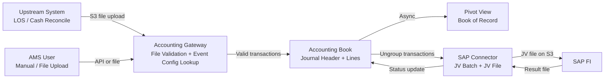

# Product: Bookkeeping

**Product Name**: Bookkeeping — Internal Accounting System
**Project Code**: 1020
**Status**: 📝 Draft
**Executive Owner**: CFO
**Product Owners**: Phasathon & Pojchara
**Portfolio**: Accounting → [PORTFOLIO](../PORTFOLIO.md)
**Last Updated**: 2026-03-04

---

## Problem Statement

NTB business units (AMS, LOS, Cash Reconcile) generate accounting transactions that must be recorded in SAP FI. Currently, this process is fragmented and manual — there is no centralised validation layer, no structured Chart of Accounts enforcement, and no automated JV file generation. This creates risks of incorrect GL mapping, duplicate entries, and compliance exposure on financial statements.

---

## Value Proposition

Bookkeeping is the single source of truth for all double-entry ledger records across NTB. It provides:

- **For Accounting Team:** A structured, validated journal store with a queryable Book of Record. Eliminates manual spreadsheet reconciliation.
- **For Finance / CFO:** Accurate, auditable financial data flowing directly to SAP FI with full reference trails.
- **For Upstream Systems (AMS, LOS, Cash Reconcile):** A standardised API and file upload gateway for submitting accounting events without needing to know GL account details.

---

## Product Boundary

**This product IS responsible for:**
- Receiving and validating accounting transaction requests (via API and file upload)
- Enforcing Chart of Accounts rules (FS Groups, GL accounts, Cost/Profit Centers, Sub-ledger types)
- Recording double-entry journal entries in the Accounting Book (raw journal store)
- Maintaining a pivot/summary view (Book of Record) for querying and reporting
- Grouping validated transactions into JV batches and generating JV upload files for SAP FI
- Processing SAP FI posting result files and updating transaction statuses
- Managing Accounting Event configuration (GL mapping rules per event code)
- Providing Cost & Profit Center master data (synced from upstream)

**This product IS NOT responsible for:**
- SAP FI itself — Bookkeeping only produces files for SAP; SAP FI owns its own processing
- Upstream business logic in AMS, LOS, or Cash Reconcile — those systems own their own transaction triggers
- Customer-facing financial reporting or statements — that belongs to SAP FI / Finance reporting tools
- Payroll, procurement, or ERP functions outside of accounting transaction recording
- Loan account lifecycle management — owned by Core Banking (Platform Portfolio)

**This product RECEIVES from:**
- AMS (Accounting Management System) → manual transaction entry or file upload → via API / file
- LOS (Loan Origination System) → automated accounting event files → via S3 file
- Cash Reconcile → automated accounting event files → via S3 file
- SAP FI → posting result files → via AMS manual upload

**This product SENDS to:**
- SAP FI → JV upload files (max 900 document groups per file) → via S3

---

## Capability Registry

| # | Capability | Owner | Description | Status |
|---|-----------|-------|-------------|--------|
| 1 | [COA Management](capabilities/coa-management/CAPABILITY.md) | Phasathon & Pojchara | Manage Chart of Accounts: FS Groups, GL accounts, Sub-ledger types, Cost & Profit Centers | 📝 Draft |
| 2 | [Accounting Gateway](capabilities/accounting-gateway/CAPABILITY.md) | Phasathon & Pojchara | Inbound transaction intake: API single entry, upstream file upload, manual AMS file upload, event config management | 📝 Draft |
| 3 | [Accounting Book](capabilities/accounting-book/CAPABILITY.md) | Phasathon & Pojchara | Raw journal store and Book of Record (pivot view): store, query, and cancel accounting transactions | 📝 Draft |
| 4 | [SAP Connector](capabilities/sap-connector/CAPABILITY.md) | Phasathon & Pojchara | Outbound SAP FI integration: JV batch grouping, JV file generation, result processing, JV cancellation | 📝 Draft |
| 5 | [Master Data](capabilities/master-data/CAPABILITY.md) | Phasathon & Pojchara | Organisational reference data: entities, accounting types, reference field definitions, unit/branch structures | 📝 Draft |

---

## Product Metrics & KPIs

| Metric | Target | Notes |
|--------|--------|-------|
| Transaction validation pass rate | > 99% | % of submitted transactions that pass Stage 1 + Stage 2 validation |
| SAP JV posting success rate | > 99.5% | % of JV batches posted to SAP FI without error |
| JV file generation latency | Same business day | Time from transaction creation to JV file on S3 |
| Pivot view staleness | < 5 minutes | Max lag between raw journal write and pivot view refresh |
| COA update SLA (dev team) | < 1 business day | Time from COA change request to deployment (Release 1 API-only constraint) |

---

## High-Level User Flow



---

## Release Plan

| Release | Scope | Status |
|---------|-------|--------|
| Release 1 | Core Foundation: COA management API, Accounting Gateway, Accounting Book, SAP Connector (F1–F19) | 📝 In Progress |
| Release 2 | Parallel Run & Reconciliation: run alongside current system for accuracy validation | ⏳ Planned |
| Release 3 | Full Cutover: decommission legacy accounting process | 🔲 TBC |

---

## Integration Map

```
Bookkeeping (Project 1020)

  RECEIVES:
  ← AMS            : POST /transactions (single), file upload (bulk manual) → Accounting Gateway
  ← LOS            : S3 file (event code + amount + refs, no GL) → Accounting Gateway
  ← Cash Reconcile : S3 file (event code + amount + refs, no GL) → Accounting Gateway
  ← SAP FI         : SAP result file (JV posting status) → SAP Connector via AMS upload

  SENDS:
  → SAP FI         : JV upload file (.csv / fixed format, max 900 doc groups) → via S3
```
