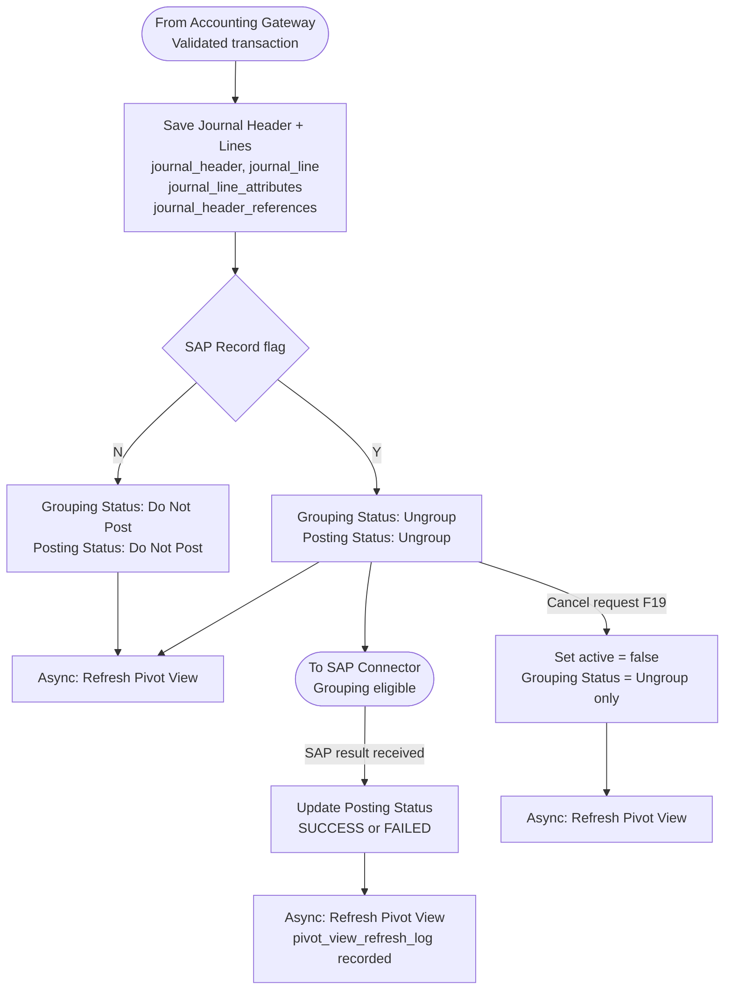

# Capability: Accounting Book

**Capability Name**: Accounting Book
**Parent Product**: Bookkeeping → [PRODUCT](../../PRODUCT.md)
**Product Owner**: Phasathon & Pojchara
**Status**: 📝 Draft
**Last Updated**: 2026-03-04

---

## Business Function

The Accounting Book is the core journal store of the Bookkeeping system. It holds every validated double-entry transaction record with full reference data. It also maintains an asynchronous summary view (the Book of Record / pivot view) for querying and financial reporting.

This capability is the persistent state layer — it receives from the Accounting Gateway and feeds the SAP Connector.

---

## Feature Inventory

| ID | Feature | Description | Priority | Status |
|----|---------|-------------|---------|--------|
| F12 | Transaction Journal Record (Raw) | Store validated double-entry journal entries with full reference data | P1 | 📝 Spec |
| F13 | Book of Record (Summary / Pivot View) | Async pivot view for querying and reporting — refreshed on new save and SAP result | P2 | 📝 Spec |
| F19 | Cancel Accounting Transaction | Mark a transaction as inactive before it is grouped into a JV batch | TBC | 📝 Spec |

---

## Business Rules

### Journal Record Rules (F12)
| Rule | Detail |
|------|--------|
| Double-entry | Every transaction has exactly one DR line and one CR line that must balance |
| Record structure | `journal_header` (1 per transaction) + `journal_line` (DR + CR) + `journal_line_attributes` + `journal_header_references` |
| Immutability | Raw journal records are never modified after posting — cancellation creates a new status flag, not a deletion |
| Reference data | Full reference trail: event code, posting date, doc date, amount, reference fields 1–6, remark |
| SAP Record flag | Stored on each transaction at the time of save (see Accounting Gateway) |

### Pivot View Rules (F13)
| Rule | Detail |
|------|--------|
| Consistency model | Eventually consistent — async refresh, not real-time |
| Refresh triggers | (1) New transaction saved to Accounting Book; (2) SAP result update received |
| Refresh log | Each refresh event is recorded in `pivot_view_refresh_log` |
| Purpose | Provides Book of Record for querying, reporting, and accounting team review |

### Cancellation Rules (F19)
| Rule | Detail |
|------|--------|
| Eligible transactions | Only transactions with Grouping Status = `Ungroup` can be cancelled |
| Ineligible transactions | Transactions with Grouping Status = `Grouped` or `Do Not Post` cannot be cancelled via this feature |
| Effect | Sets transaction active status flag to inactive. Does not delete the record. |
| Pivot view | Pivot view is refreshed async after cancellation |

---

## Transaction Status Model

### Grouping Status
| Status | Set By | Meaning |
|--------|--------|---------|
| `Ungroup` | Accounting Gateway on save | Eligible for JV batching |
| `Grouped` | SAP Connector on batch creation | Locked into a JV batch — cannot be cancelled |
| `Do Not Post` | Accounting Gateway (SAP Record flag = N) | Permanently excluded from JV batching |

### Inherited Posting Status (from SAP Connector)
| Status | Meaning |
|--------|---------|
| `Ungroup` | Not yet batched |
| `PENDING` | In a JV batch awaiting SAP result |
| `SUCCESS` | SAP FI confirmed posting |
| `FAILED` | SAP FI rejected — JV must be cancelled |
| `Do Not Post` | Excluded from SAP permanently |

---

## User Flow

---

## Non-Functional Requirements

| NFR | Requirement |
|-----|-------------|
| Durability | Journal records are append-only and never deleted |
| Auditability | Every transaction has a complete reference trail and status history |
| Pivot view lag | Max acceptable lag between raw write and pivot view refresh: < 5 minutes |
| Query performance | Pivot view must support accounting team queries without hitting raw journal tables |

---

## Open Questions & Constraints

| # | Question | Status |
|---|----------|--------|
| 1 | What is the retention period for journal records? | Open |
| 2 | Should F19 (Cancel Transaction) require an approval step or is it self-service? | Open |
| 3 | Is there a reconciliation report that compares raw journal vs. pivot view to detect refresh failures? | Open |
