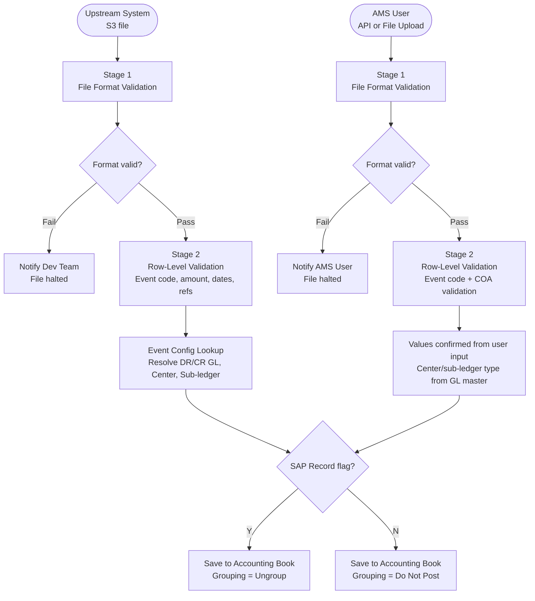

# Capability: Accounting Gateway

**Capability Name**: Accounting Gateway
**Parent Product**: Bookkeeping → [PRODUCT](../../PRODUCT.md)
**Product Owner**: Phasathon & Pojchara
**Status**: 📝 Draft
**Last Updated**: 2026-03-04

---

## Business Function

The Accounting Gateway is the inbound intake layer for all accounting transactions. It receives transaction requests from two source types — upstream automated systems (LOS, Cash Reconcile via S3) and accounting users via AMS (manual or file upload) — validates them through a 2-stage process, resolves GL accounts (via Event Config for upstream path, via user input for manual path), and writes valid transactions to the Accounting Book.

This capability also owns Accounting Event configuration — the template that maps event codes to DR/CR GL accounts and other attributes.

---

## Feature Inventory

| ID | Feature | Description | Priority | Status |
|----|---------|-------------|---------|--------|
| F5 | Accounting Event Template Config | Configure event code → GL mapping (DR/CR accounts, center, vendor/customer code) | P1 | 📝 Spec |
| F7 | Create Single Transaction (API) | POST endpoint — real-time single transaction submission | P1 | 📝 Spec |
| F8 | Create Transactions by File Upload (Upstream) | S3 file intake — event code + amount + refs only (no GL). GL resolved from Event Config. | P1 | 📝 Spec |
| F10 | Manual Create Transaction by File Upload (AMS) | AMS file upload — user supplies GL accounts directly. Validated against COA. | P1 | 📝 Spec |

---

## Business Rules

### Validation Rules — Stage 1 (File Format — All or Nothing)
| Rule | Detail |
|------|--------|
| Column names | Must exactly match required format |
| Required fields | Must not be NULL |
| Date format | Must be `YYYY-MM-DD` |
| Amount format | Must be numeric |
| Failure behaviour | Entire file is halted — no rows are processed |

### Validation Rules — Stage 2 (Row-Level — Valid Rows Continue)
| Rule | Upstream Path (F8) | Manual AMS Path (F10) |
|------|-------------------|----------------------|
| Event code exists | ✅ | ✅ |
| Amount > 0 | ✅ | ✅ |
| Date format valid | ✅ | ✅ |
| Required reference fields not null | ✅ | ✅ |
| DR Account Number exists in COA | ❌ (not in file) | ✅ |
| CR Account Number exists in COA | ❌ (not in file) | ✅ |
| DR Profit/Cost Center exists in COA | ❌ (from config) | ✅ |
| CR Profit/Cost Center exists in COA | ❌ (from config) | ✅ |
| DR Sub-ledger exists in COA | ❌ (from config) | ✅ |
| CR Sub-ledger exists in COA | ❌ (from config) | ✅ |
| Failure behaviour | Failed rows notified; valid rows continue | Same |

### Event Config Rules (Upstream Path Only)
| Rule | Detail |
|------|--------|
| GL Resolution | Event code → DR/CR GL accounts resolved from `accounting_config_event` |
| Center Resolution | Ref1 field or fixed config → Profit/Cost Center |
| Sub-ledger Resolution | Fixed Vendor/Customer code from event config |
| Date Logic | Determined per event rule |

### SAP Record Flag
| Value | Behaviour |
|-------|-----------|
| `Y` | Transaction saved with Grouping Status = `Ungroup`. Eligible for JV batching. |
| `N` | Transaction saved with Grouping Status = `Do Not Post`. Permanently excluded from JV. Used for migration entries or corrections already in SAP. |

---

## User Flow

---

## Non-Functional Requirements

| NFR | Requirement |
|-----|-------------|
| Idempotency | Duplicate file submissions must not create duplicate transactions |
| Partial success | Stage 2 failures must not block valid rows — notify failures, continue valid rows |
| Notification | Dev team notified on upstream file errors; AMS user notified on manual path errors |
| Throughput | Must handle bulk file uploads from LOS/Cash Reconcile during batch windows |

---

## Open Questions & Constraints

| # | Question | Status |
|---|----------|--------|
| 1 | What is the expected volume of upstream file transactions per day? | Open |
| 2 | Is idempotency enforced by transaction ID, file hash, or both? | Open |
| 3 | What is the notification mechanism for dev team (F8 failures)? Email? Monitoring alert? | Open |
| 4 | Can an event code be used in both upstream and manual paths? | Open |
