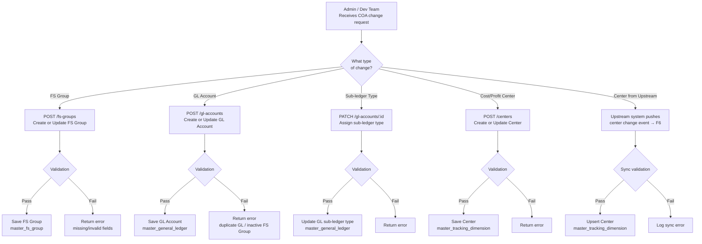

# Capability: COA Management

**Capability Name**: Chart of Accounts Management
**Parent Product**: Bookkeeping → [PRODUCT](../../PRODUCT.md)
**Product Owner**: Phasathon & Pojchara
**Status**: 📝 Draft
**Last Updated**: 2026-03-04

---

## Business Function

Manage the complete Chart of Accounts (COA) hierarchy for NTB. This capability owns all configuration of FS Groups, General Ledger accounts, Sub-ledger type assignments, and Cost & Profit Centers. It is the foundational master data layer that all other Bookkeeping capabilities depend on.

In Release 1, all COA management operations are performed via internal API only — no self-service UI for the accounting team. Changes must be requested through the dev team.

---

## Feature Inventory

| ID | Feature | Description | Priority | Status |
|----|---------|-------------|---------|--------|
| F1 | FS Group Create & Update | Create, update, and retire Financial Statement Groups (Assets, Liabilities, SE, PL, OCI) | P1 | 📝 Spec |
| F2 | General Ledger Create & Update | Create, update, and retire GL accounts with 10-digit numeric format | P1 | 📝 Spec |
| F3 | GL Sub-Ledger Type Assignment | Assign sub-ledger type (Customer / Vendor / None) to each GL account | P2 | 📝 Spec |
| F4 | Cost & Profit Center Create & Update | Create and manage cost/profit centers for transaction allocation | P1 | 📝 Spec |
| F6 | Real-Time Cost & Profit Center Sync | Receive and sync cost/profit center changes from upstream systems in real time | P1 | 📝 Spec |

---

## Business Rules

| Rule | Detail |
|------|--------|
| FS Group Code format | Letter prefix + numeric suffix (e.g., `A101`, `L104`, `PL219B`, `OCI101`). Prefix aligns with FS Group Type code. |
| FS Group Types | 6 types: A (Assets), L (Liabilities), SE (Shareholders' Equity), R (Revenue — no groups), E (Expense — no groups), PL (Profit & Loss, incl. OCI). OCI groups use `OCI` prefix but map to PL type_id 6. |
| Active groups in Release 1 | 114 groups across A (36), L (17), SE (7), PL (54 incl. OCI). R and E are defined but empty. |
| GL Account Number format | 10-digit numeric: `[type 1][major group 3][sub-group 2][item 4]` |
| GL uniqueness | GL account numbers must be unique. No duplicates allowed. |
| FS Group reference validation | A GL account can only reference an active FS Group. Inactive FS Groups cannot be assigned to new GLs. |
| Retirement rule | Inactive FS Groups and GL accounts cannot be referenced by new transactions. Existing transactions are unaffected. |
| Sub-ledger type | Set on the GL account at creation time. Indicates whether transactions on that GL require a counterparty code (Customer / Vendor). Counterparty code value is set in Accounting Event Config (F5), not here. |
| Center type | Each GL account carries a center type (Profit Center or Cost Center). Used for validation in Accounting Gateway Stage 2. |
| Cost & Profit Center sync | Centers are the master source for allocation. Real-time sync from upstream ensures Bookkeeping always has current center data. |

---

## User Flow

---

## Non-Functional Requirements

| NFR | Requirement |
|-----|-------------|
| Availability | COA data must be available at all times — it is a blocking dependency for transaction validation |
| Consistency | COA changes must be immediately visible to Accounting Gateway validation after save |
| Auditability | All create/update/retire operations must be logged with timestamp and actor |
| Release 1 constraint | No self-service UI — all COA changes via dev team API calls only |

---

## Open Questions & Constraints

| # | Question | Status |
|---|----------|--------|
| 1 | Who has permission to call the COA management API in Release 1? Dev team only or also PO? | Open |
| 2 | What is the SLA for COA update requests in Release 1? | Open |
| 3 | Should retiring a GL account that has existing transactions trigger a warning or block? | Open |
