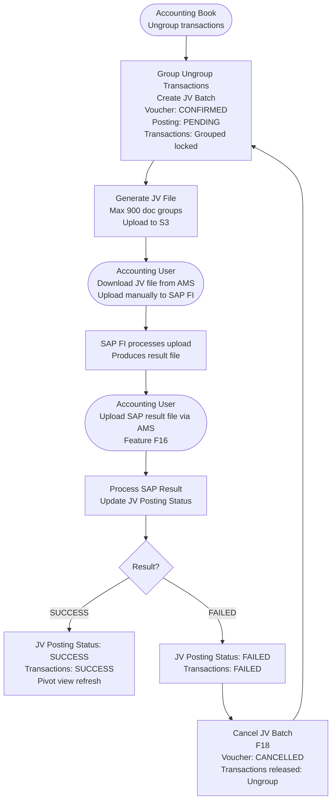

# Capability: SAP Connector

**Capability Name**: SAP Connector
**Parent Product**: Bookkeeping → [PRODUCT](../../PRODUCT.md)
**Product Owner**: Phasathon & Pojchara
**Status**: 📝 Draft
**Last Updated**: 2026-03-04

---

## Business Function

The SAP Connector is the outbound integration layer between Bookkeeping and SAP FI. It consolidates validated accounting transactions into JV (Journal Voucher) batches, generates JV upload files for SAP FI, and processes the SAP posting result files to update transaction statuses back in the Accounting Book.

This capability is the final step in the accounting transaction lifecycle — from recorded journal entry to posted SAP document.

---

## Feature Inventory

| ID | Feature | Description | Priority | Status |
|----|---------|-------------|---------|--------|
| F14 | Accounting Transaction Outbound | Consolidate `Ungroup` transactions into JV transactions | P1 | 📝 Spec |
| F15 | Journal Voucher Export (Auto Batch) | Auto-batch JV transactions → generate JV file → upload to S3 (max 900 doc groups/file) | P2 | 📝 Spec |
| F16 | Upload SAP Transfer Result | AMS user uploads SAP result file → system updates JV and transaction statuses | P2 | 📝 Spec |
| F17 | Manual Create JV File | Manual override to create a JV file outside the auto-batch cycle | TBC | 📝 Spec |
| F18 | Cancel JV Transaction | Cancel a FAILED JV batch — releases linked transactions back to `Ungroup` | TBC | 📝 Spec |

---

## Business Rules

### JV Batching Rules (F14, F15)
| Rule | Detail |
|------|--------|
| Eligible transactions | Only transactions with Grouping Status = `Ungroup` are consolidated |
| JV file size limit | Maximum 900 document groups per JV file |
| On batch creation | Voucher Status = `CONFIRMED`; Posting Status = `PENDING`; linked transactions → Grouping Status = `Grouped` (locked) |
| JV file delivery | File uploaded to S3; accounting user downloads from AMS and uploads to SAP FI manually |

### SAP Result Processing Rules (F16)
| Rule | Detail |
|------|--------|
| Result outcomes | `SUCCESS` or `FAILED` |
| On SUCCESS | JV Posting Status → `SUCCESS`; inherited posting status propagated to each linked transaction; pivot view refresh triggered |
| On FAILED | JV Posting Status → `FAILED`; inherited posting status propagated to each linked transaction |
| Pivot view | Async refresh triggered after every SAP result update |

### JV Cancellation Rules (F18)
| Rule | Detail |
|------|--------|
| Eligible JV batches | Only JV batches with Posting Status = `FAILED` can be cancelled |
| On cancellation | Voucher Status = `CONFIRMED` → `CANCELLED`; FAILED posting status retained as history |
| Linked transactions released | Grouping Status reset to `Ungroup` — eligible for re-grouping into a new JV batch |
| Re-batching | Released transactions follow the normal JV batching cycle (F14 → F15) |

---

## JV Transaction Status Model

### JV Voucher Status
| Status | Meaning |
|--------|---------|
| `CONFIRMED` | JV batch created and JV file generated |
| `CANCELLED` | JV batch cancelled after FAILED result — transactions released |

### JV Posting Status
| Status | Meaning |
|--------|---------|
| `PENDING` | JV file generated, awaiting SAP FI result |
| `SUCCESS` | SAP FI confirmed posting |
| `FAILED` | SAP FI rejected posting |

---

## User Flow

---

## Non-Functional Requirements

| NFR | Requirement |
|-----|-------------|
| JV file format | Must exactly match SAP FI upload format — any schema change requires SAP team coordination |
| File size enforcement | Hard limit of 900 document groups per file — excess must overflow to a second file |
| Result processing idempotency | Re-uploading the same SAP result file must not create duplicate status updates |
| Audit trail | Every JV batch creation, file generation, and status change must be logged |

---

## Open Questions & Constraints

| # | Question | Status |
|---|----------|--------|
| 1 | What is the exact JV file format/schema expected by SAP FI? (need SAP team input) | Open |
| 2 | Is the 900 document group limit a SAP FI constraint or a Bookkeeping business rule? | Open |
| 3 | What triggers auto-batch — scheduled job (cron) or manual trigger? What is the schedule? | Open |
| 4 | Can a single transaction belong to more than one JV batch? (should be no — confirm) | Open |
| 5 | Who is authorised to cancel a JV batch (F18)? Any accounting user or supervisor only? | Open |
