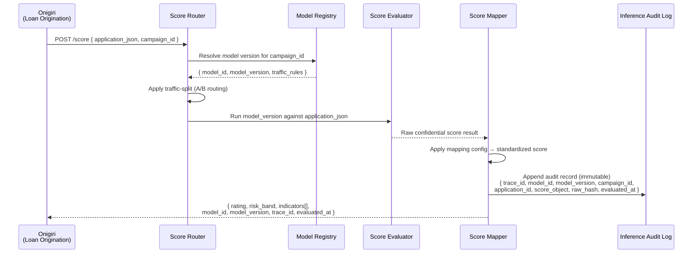
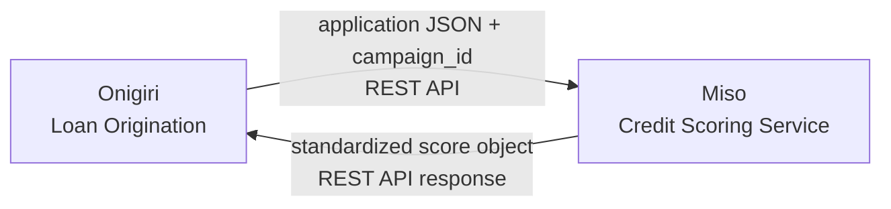

# Product: Credit Scoring Service

**Codename**: Miso (味噌)
**Portfolio**: Credit → [PORTFOLIO](../PORTFOLIO.md)
**Status**: 📝 Draft
**Executive Owner**: CPO / Chief Credit Officer
**Last Updated**: 2026-03-05

> *Miso (味噌) — A foundational fermented base that enriches everything it underlies. Like the paste, Miso transforms raw inputs into something nourishing and consistent — invisibly improving the quality of every product built on top of it.*

---

## Problem Statement

Loan origination requires credit scoring to assess borrower risk, but scoring models evolve independently of the origination system. A direct, hardcoded coupling between Onigiri and scoring models creates brittle deployment dependencies: model upgrades require coordinated releases, A/B testing between model versions is impossible, and raw model output — which carries confidential scoring signals — can leak directly into application records. Different loan campaigns may warrant different scoring strategies, but there is no mechanism to route applications to the correct model at runtime.

---

## Value Proposition

A standalone credit scoring service that abstracts model selection, traffic routing, inference execution, and output standardization — enabling any consumer (initially Onigiri) to receive a stable, non-confidential, standardized score object regardless of which model, which version, or which traffic allocation strategy was in effect at the time of evaluation.

**For whom**: Credit risk teams who manage and evolve scoring models; Product Managers who configure campaigns with scoring criteria; Engineering teams integrating scoring into origination workflows; Compliance and audit teams requiring a tamper-proof record of every scoring event.

---

## Product Boundary

**This product IS responsible for:**
- Maintaining the catalog of scoring models, model versions, and their active/retired lifecycle
- Mapping campaigns to designated model versions (campaign-to-model configuration)
- Traffic-splitting and A/B / canary routing decisions at inference time
- Model inference execution (Miso owns the compute layer — it runs the models)
- Transforming raw, confidential model output into a non-confidential, standardized score object
- Enforcing that raw model scores never leave this service boundary
- Publishing and versioning the standardized score object contract schema
- Maintaining an immutable, append-only audit trail of every inference event

**This product IS NOT responsible for:**
- Campaign definition, pricing, or eligibility rule management (owned by **Onigiri** — Loan Campaign Configuration)
- JMESPath rule execution on the application document (owned by **Onigiri** — Risk Assessment Engine)
- Loan application data storage or workflow state management (owned by **Onigiri**)
- NCB credit bureau queries — those are initiated by Onigiri's Smart Form on OTP consent
- Credit decision logic, approval authority routing (owned by **Onigiri** — Underwriting Workflow)
- Customer identity resolution (owned by **DaVinci**)

**This product RECEIVES from:**
- Onigiri → application JSON + campaign ID → via REST API (triggered at Risk Assessment state entry in Underwriting Workflow)

**This product SENDS to:**
- Onigiri → standardized score object `{ rating, risk_band, indicators[], model_id, model_version, trace_id, evaluated_at }` → via REST API response

---

## Capability Registry

| Capability | Owner | Status | Description |
|-----------|-------|--------|-------------|
| [Model Registry](capabilities/model-registry/CAPABILITY.md) | Engineering | Draft | Manages the catalog of scoring models, their versions, output schemas, active/retired lifecycle, and the campaign-to-model mapping configuration |
| [Score Router](capabilities/score-router/CAPABILITY.md) | Engineering | Draft | Routes an inbound scoring request to the correct model version using campaign-to-model config; supports traffic-splitting rules for A/B and canary testing across model versions without code changes |
| [Score Evaluator](capabilities/score-evaluator/CAPABILITY.md) | Engineering | Draft | Executes the designated model against the application JSON; owns model inference infrastructure; produces a raw, confidential score result for consumption by Score Mapper |
| [Score Mapper](capabilities/score-mapper/CAPABILITY.md) | Engineering / Risk | Draft | Accepts raw model output; applies configurable mapping rules to produce a non-confidential, standardized score object; enforces that raw scores never leave this service |
| [Score Contract](capabilities/score-contract/CAPABILITY.md) | Product / Engineering | Draft | Maintains and publishes the versioned standardized score object schema; ensures downstream consumers (Onigiri's campaign eligibility criteria and JMESPath rules) are pre-configured against stable field names |
| [Inference Audit Log](capabilities/inference-audit-log/CAPABILITY.md) | Engineering / Compliance | Draft | Provides an immutable, append-only audit trail of every scoring event — model version, application ID, campaign, timestamp, standardized output, and a deterministic hash of the raw output for tamper-evidence |

---

## Product-Level Flow

---

## Integration Map

---

## Product-Level Metrics and KPIs

| Metric | Description | Target |
|--------|-------------|--------|
| Scoring Latency (p99) | Time from POST /score to response (sync) | < 3 seconds |
| Model Routing Accuracy | % of requests routed to the correct model version per campaign config | 100% |
| Audit Log Completeness | % of scoring events with a corresponding immutable audit record | 100% |
| A/B Test Coverage | Number of active traffic-split experiments running concurrently | Supports ≥ 3 simultaneous |
| Raw Score Leakage Events | Instances where raw score appears outside Miso boundary | 0 |

---

## Key Design Decisions

| # | Decision | Context | Consequence | Reversibility |
|---|----------|---------|-------------|---------------|
| **D1** | Miso owns inference execution (not a routing proxy) | A pure routing layer would still require Onigiri to own or co-own an inference platform. Ownership of execution is required for confidentiality enforcement — raw scores must never leave Miso. | Miso is both router and inference engine. Adds infrastructure responsibility but provides a clean confidentiality boundary. | Medium — could extract inference to a dedicated ML platform in future if scale demands, but confidentiality enforcement and audit log would remain in Miso. |
| **D2** | Raw scores hashed, not stored, in audit log | Storing raw confidential scores in the audit log violates the confidentiality boundary. Storing nothing provides no tamper-evidence. | A SHA-256 (or equivalent) hash of the raw output is stored alongside the standardized score. Regulators can verify a score was not altered post-evaluation without accessing the raw value. | High — hash algorithm can be upgraded; audit records are append-only. |
| **D3** | Standardized score contract versioned and published ahead of model deployment | Onigiri's JMESPath rules and eligibility criteria must be pre-configured before a new model goes live. If the score schema changes without notice, downstream rules break silently. | Score Contract capability publishes a versioned schema. Model deployments that change the output schema require a new schema version and downstream configuration update before routing is activated. | High — schema versioning is a clean mechanism; version IDs appear in every score response so Onigiri can detect mismatches. |
| **D4** | Traffic splitting configured without code deployment | A/B testing between model versions requires frequent adjustments to traffic allocations. Code deployment for each allocation change is operationally expensive. | Score Router reads traffic-split rules from configuration at runtime. Splits can be adjusted by risk/product teams without engineering involvement. | High — configuration-driven; rules can be changed or removed at any time. |
