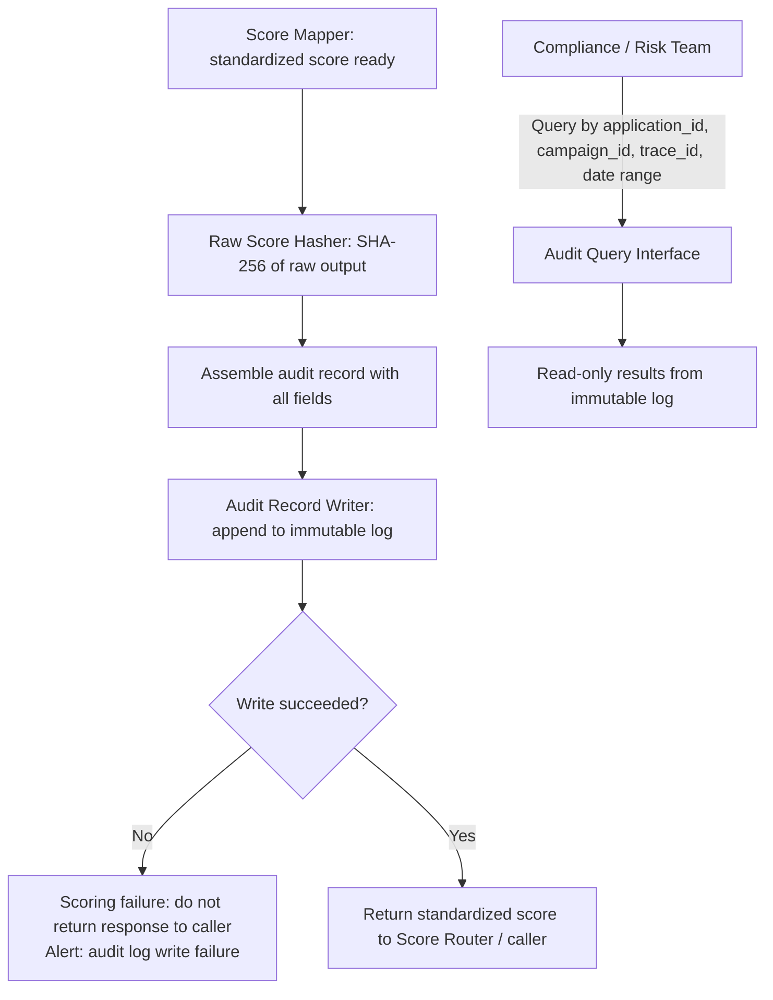

# Capability: Inference Audit Log

**Capability Name**: Inference Audit Log
**Parent Product**: Miso (Credit Scoring Service) → [PRODUCT](../../PRODUCT.md)
**Product Owner**: TBD — Engineering / Compliance
**Status**: 📝 Draft
**Last Updated**: 2026-03-05

---

## Business Function

Provide an immutable, append-only record of every credit scoring event executed by Miso. For every inference run, a single audit record is written capturing: which model version ran, which campaign and application triggered the request, when the inference occurred, what standardized score was produced, and a deterministic hash of the raw model output. Raw scores are never stored; the hash provides tamper-evidence that the standardized output was not altered after the fact. The audit log is queryable by compliance, risk, and regulatory teams — it is never modified or deleted.

---

## Feature Inventory

| Feature | Status | Description |
|---------|--------|-------------|
| Audit Record Writer | Concept | Append a structured audit record to the immutable log at the completion of every scoring event, synchronously before returning the response to the caller |
| Raw Score Hasher | Concept | Compute a deterministic hash (SHA-256) of the raw model output immediately after inference; the hash is stored in the audit record — the raw output is discarded |
| Audit Query Interface | Concept | Provide a read-only query interface for compliance and risk teams: look up by application ID, campaign ID, model version, date range, or trace ID |
| Audit Integrity Verifier | Concept | On demand (e.g., regulatory audit), re-compute a hash from a claimed raw output and verify it matches the stored hash — proving the standardized score was not altered post-evaluation |

---

## Business Rules

| Rule | Description |
|------|-------------|
| BR-AL-01 | An audit record MUST be written for every scoring event without exception; failure to write the audit record is treated as a scoring failure — the response is not returned to the caller |
| BR-AL-02 | Audit records are append-only; no update, delete, or overwrite operation is permitted on any audit record |
| BR-AL-03 | Raw model scores are never stored in the audit log; only the SHA-256 hash of the raw output is recorded |
| BR-AL-04 | Each audit record is uniquely identified by a `trace_id` (UUID) that is also returned to the caller in the score response — enabling end-to-end correlation |
| BR-AL-05 | Audit records must be retained for a minimum of 7 years (regulatory retention requirement) |
| BR-AL-06 | Audit records must be write-protected at the storage level; no application-level or administrative deletion is permitted without a documented regulatory exception |
| BR-AL-07 | The Audit Query Interface is read-only; it has no write access to the audit store |

---

## Audit Record Schema

| Field | Type | Description |
|-------|------|-------------|
| `trace_id` | UUID | Unique identifier for this scoring event; correlates to the score response |
| `application_id` | string | ID of the loan application being scored |
| `campaign_id` | string | Campaign that triggered the scoring request |
| `model_id` | string | Model identifier from Model Registry |
| `model_version` | string | Specific model version that ran |
| `contract_version` | string | Score contract version governing this evaluation |
| `evaluated_at` | ISO 8601 | Timestamp of inference execution (UTC) |
| `routing_type` | enum | `designated` \| `ab_test` \| `fallback` — how the model was selected |
| `experiment_id` | string \| null | A/B experiment ID if routing_type = `ab_test` |
| `score_object` | object | Full standardized score object returned to caller (non-confidential) |
| `raw_output_hash` | string | SHA-256 hash of raw model output; used for tamper-evidence verification |
| `actor_id` | string | Service identity of the caller (e.g., Onigiri service account) |

---

## Write and Query Flow

---

## Immutability Guarantees

The audit log's immutability is enforced at two levels:

1. **Application level**: The Audit Record Writer has append-only access to the log store; no update or delete operation is exposed in the application code path.
2. **Infrastructure level**: The underlying storage uses a write-once policy (e.g., S3 Object Lock in COMPLIANCE mode, or equivalent). Administrative access to modify or delete records requires a documented regulatory exception with dual approval.

---

## Non-Functional Requirements

| NFR | Requirement |
|-----|------------|
| Durability | Audit records must be stored in a minimum 2-region replicated store; RPO = 0 (no record loss) |
| Write latency | Audit record write must complete in < 200ms p99; it is in the synchronous response path |
| Query latency | Compliance queries by trace_id or application_id must return in < 2 seconds |
| Retention | Records retained for minimum 7 years; storage tier may transition to cold after 1 year |
| Immutability enforcement | Infrastructure-level write protection (e.g., S3 Object Lock, WORM storage) required — application-level immutability alone is insufficient |
| Availability | Audit write path must be available at 99.9% uptime; degradation in audit write blocks scoring responses |

---

## Open Questions

- What storage technology provides the required infrastructure-level immutability in the target cloud environment (e.g., AWS S3 Object Lock, Azure Immutable Blob, GCS Object Hold)?
- Should the Audit Integrity Verifier be an internal tool or exposed to external regulators via a secure portal?
- What is the regulatory retention requirement — 7 years is the assumed baseline; confirm with compliance team.
