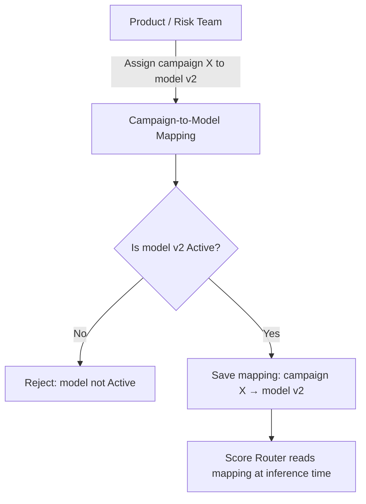

# Capability: Model Registry

**Capability Name**: Model Registry
**Parent Product**: Miso (Credit Scoring Service) → [PRODUCT](../../PRODUCT.md)
**Product Owner**: TBD
**Status**: 📝 Draft
**Last Updated**: 2026-03-05

---

## Business Function

Maintain the authoritative catalog of all scoring models available within Miso — including each model's versions, input/output schemas, active/retired lifecycle, and the mapping that assigns each campaign to a designated model version. The Model Registry is the source of truth that the Score Router consults at inference time; it is also the control point through which a risk or product team activates a new model version or redirects a campaign to a different model without code deployment.

---

## Feature Inventory

| Feature | Status | Description |
|---------|--------|-------------|
| Model Catalog Manager | Concept | CRUD operations for model entries: register a new model, add a version, retire a version, view active/retired history |
| Campaign-to-Model Mapping | Concept | Assign a campaign ID to a designated model version; update mapping without code deployment; view current and historical mappings |
| Model Schema Registry | Concept | Store and version the input/output schema for each model version; used by Score Contract to publish the standardized contract |
| Model Lifecycle Manager | Concept | Transition model versions through states (Registered → Active → Retired); enforce that at least one Active version exists per campaign before routing is enabled |

---

## Business Rules

| Rule | Description |
|------|-------------|
| BR-MR-01 | A campaign cannot be activated for scoring unless it has an assigned model version in Active state |
| BR-MR-02 | A model version cannot be retired if it is the sole Active version assigned to any campaign |
| BR-MR-03 | Campaign-to-model mappings are versioned; historical mappings are read-only after supersession |
| BR-MR-04 | Each model version has a declared input schema (JSON structure it expects) and output schema (raw score fields it produces); both are stored in the registry |
| BR-MR-05 | Model version IDs are immutable once registered; re-training produces a new version, not an overwrite |

---

## Model Lifecycle State Machine

```mermaid
stateDiagram-v2
    direction LR
    [*] --> Registered: Register new version
    Registered --> Active: Activate
    Active --> Retired: Retire
    Retired --> [*]

    note right of Active: Score Router can route to Active versions only
    note right of Retired: Retained for audit; no new routing
```

---

## Campaign-to-Model Mapping Flow

---

## Non-Functional Requirements

| NFR | Requirement |
|-----|------------|
| Availability | Read path (lookup at inference time) must be available at 99.9% uptime |
| Latency | Campaign-to-model lookup must return in < 50ms p99 |
| Consistency | Mapping updates must be reflected in routing within 1 minute of save |
| Auditability | All mapping changes (create, update, retire) are timestamped and attributed to an actor; changes are immutable history, not overwrites |

---

## Open Questions

- Should model version registration require a schema validation test before moving to Active state?
- Who has write access to campaign-to-model mappings — risk team only, or also product managers?
