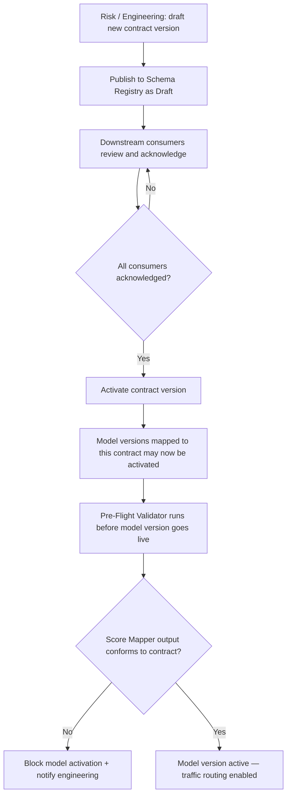

# Capability: Score Contract

**Capability Name**: Score Contract
**Parent Product**: Miso (Credit Scoring Service) → [PRODUCT](../../PRODUCT.md)
**Product Owner**: TBD — Product + Engineering
**Status**: 📝 Draft
**Last Updated**: 2026-03-05

---

## Business Function

Maintain and publish the versioned schema of the standardized score object that Miso returns to all consumers. The Score Contract is the pre-coordination mechanism: before any new model version is routed to production, its output schema must be registered, and downstream consumers (principally Onigiri's campaign eligibility criteria and JMESPath rule expressions) must be pre-configured against the stable field names in that schema. A model version may not receive live traffic until a corresponding, Onigiri-compatible contract version is in force.

---

## Feature Inventory

| Feature | Status | Description |
|---------|--------|-------------|
| Schema Registry | Concept | Store and version standardized score object schemas; each schema version is immutable once published |
| Contract Publisher | Concept | Publish a human-readable and machine-readable (JSON Schema / OpenAPI) spec of the current contract version for downstream teams to consume |
| Pre-Flight Validator | Concept | Before a model version is activated for routing, validate that the Score Mapper's mapping configuration for that version produces an output conforming to a published, active contract version |
| Contract Change Notifier | Concept | When a new contract version is published, emit a notification to registered consumers (Onigiri engineering team) with a migration guide and effective date |

---

## Business Rules

| Rule | Description |
|------|-------------|
| BR-SC-01 | A model version cannot receive live routing traffic unless its Score Mapper configuration has been validated against an active contract version |
| BR-SC-02 | Contract schema versions are immutable once published; breaking changes require a new version number |
| BR-SC-03 | Field names in the standardized score object must be stable across non-breaking contract versions; additions are allowed, removals are breaking changes |
| BR-SC-04 | The `risk_band` field must always be an integer 10–99 aligned to Onigiri's risk level scale, regardless of contract version |
| BR-SC-05 | The `rating` field must always be a discrete string category; its allowed values must be published as an enumeration in the contract |
| BR-SC-06 | Downstream consumers (Onigiri) must acknowledge receipt of a new contract version notification before the associated model version can be activated |

---

## Standardized Score Object Schema (v1)

```json
{
  "trace_id": "string (UUID) — unique identifier for this scoring event",
  "model_id": "string — model identifier from Model Registry",
  "model_version": "string — version of the model that ran",
  "contract_version": "string — version of this score contract",
  "evaluated_at": "ISO 8601 datetime",
  "rating": "string enum: A | B+ | B | C | D | F",
  "risk_band": "integer: 10 | 20 | 30 | 50 | 70 | 99",
  "indicators": ["string enum — closed list of flag names, e.g. high_dti, thin_file, derogatory"]
}
```

> **Note:** `risk_band` values align to Onigiri's approval authority scale (10 → CO/SCO/BM, 20 → AM, 30 → CA, 50 → CRO, 70 → auto-decline, 99 → policy violation). This alignment enables direct use in Onigiri's JMESPath rules without transformation.

---

## Contract Lifecycle Flow



---

## Non-Functional Requirements

| NFR | Requirement |
|-----|------------|
| Immutability | Published contract versions must be stored in a write-once, read-many store; no update or delete operations on a published version |
| Discoverability | Current and historical contract versions must be accessible via a self-service endpoint for downstream consumers |
| Breaking change lead time | Breaking contract version changes must be communicated with ≥ 2 weeks notice before activation |
| Pre-flight validation | Validation of a Score Mapper config against a contract version must complete in < 5 seconds |

---

## Open Questions

- Should the contract schema be published as JSON Schema, OpenAPI component, or a custom document format?
- What is the policy for deprecating an old contract version — is there a minimum supported version window?
