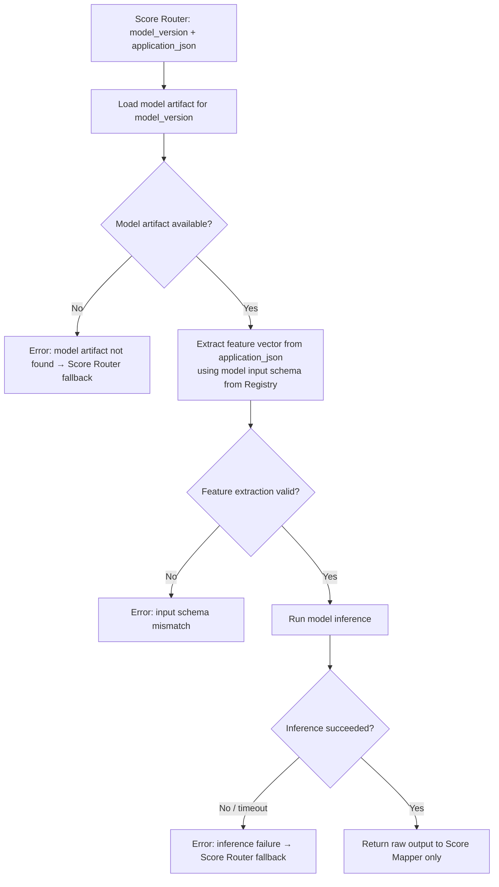

# Capability: Score Evaluator

**Capability Name**: Score Evaluator
**Parent Product**: Miso (Credit Scoring Service) → [PRODUCT](../../PRODUCT.md)
**Product Owner**: TBD
**Status**: 📝 Draft
**Last Updated**: 2026-03-05

---

## Business Function

Execute a designated scoring model against a loan application JSON document and produce a raw inference result. The Score Evaluator owns the model inference infrastructure — it loads the correct model version, prepares the input feature vector from the application document, runs the model, and returns a raw result to the Score Mapper. Raw output never leaves the Score Evaluator → Score Mapper boundary; it is never written to any external store or returned to the caller.

---

## Feature Inventory

| Feature | Status | Description |
|---------|--------|-------------|
| Model Loader | Concept | Load and cache a model version artifact for inference; manage model artifact storage and retrieval |
| Feature Extractor | Concept | Transform application JSON into the input feature vector expected by the designated model version, per the model's declared input schema in the Model Registry |
| Inference Runner | Concept | Execute the loaded model against the prepared feature vector; capture the raw output fields |
| Inference Error Handler | Concept | Catch model execution failures (timeout, malformed input, model error) and return structured error states to Score Router for fallback handling |

---

## Business Rules

| Rule | Description |
|------|-------------|
| BR-SE-01 | The Score Evaluator only accepts requests from the Score Router; it is not a public API |
| BR-SE-02 | Feature extraction must use the input schema registered for the model version in the Model Registry; using a mismatched schema is a fatal error |
| BR-SE-03 | Raw inference output must only be passed to Score Mapper; it must not be logged, stored, or included in any external API response |
| BR-SE-04 | Inference must complete within the latency SLA; if a timeout occurs, Score Evaluator returns a structured timeout error — it does not return a partial result |
| BR-SE-05 | A model version must be in Active state to be executed; requests for Retired versions return an error |

---

## Inference Execution Flow

---

## Non-Functional Requirements

| NFR | Requirement |
|-----|------------|
| Latency | Inference execution must complete in < 2.5 seconds p99 (contributing to the 3s product-level SLA) |
| Isolation | Each inference run is stateless; no cross-request state carried between scoring calls |
| Confidentiality | Raw output is transient and in-process only; never written to disk, log, or external store |
| Model artifact caching | Warm model artifacts must be cached in memory; cold start (first load) is acceptable at model activation but not at request time |

---

## Open Questions

- What model artifact format is supported at launch — scikit-learn pickle, ONNX, TensorFlow SavedModel, custom binary?
- Is GPU inference required, or is CPU sufficient for the initial model suite?
- What is the model warm-up strategy on service restart to avoid cold-start latency on the first request?
