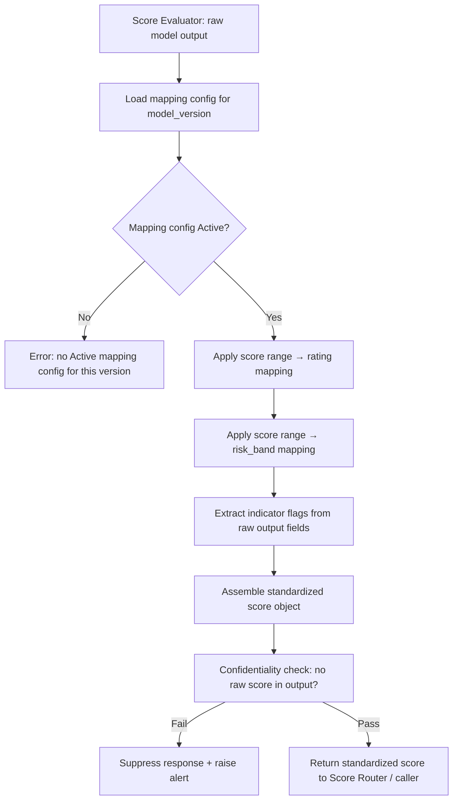

# Capability: Score Mapper

**Capability Name**: Score Mapper
**Parent Product**: Miso (Credit Scoring Service) → [PRODUCT](../../PRODUCT.md)
**Product Owner**: TBD — Risk Team + Engineering
**Status**: 📝 Draft
**Last Updated**: 2026-03-05

---

## Business Function

Accept raw, confidential model output from the Score Evaluator and transform it into a non-confidential, standardized score object that can be safely returned to external consumers (initially Onigiri). Mapping rules are configurable per model version, allowing risk teams to define the translation from raw numeric scores or probability outputs into meaningful rating categories and risk bands without code changes. The Score Mapper is the confidentiality enforcement boundary: nothing from the raw output that would identify the exact numerical score is included in the standardized output.

---

## Feature Inventory

| Feature | Status | Description |
|---------|--------|-------------|
| Mapping Rule Manager | Concept | Define and manage per-model-version mapping configurations: score range → rating, score range → risk band, indicator flag extraction |
| Score Standardizer | Concept | Apply the mapping configuration to transform raw output into the standardized schema `{ rating, risk_band, indicators[], model_id, model_version, trace_id, evaluated_at }` |
| Confidentiality Enforcer | Concept | Validate that the standardized output contains no raw score values or model internals before returning to the caller; block response if validation fails |
| Mapping Version Controller | Concept | Version mapping configurations so that changes to mapping rules are traceable; historical mappings are retained for audit consistency |

---

## Business Rules

| Rule | Description |
|------|-------------|
| BR-SM-01 | Raw score values (numeric outputs from the model) must not appear in the standardized score object |
| BR-SM-02 | Mapping rules are defined per model version; a model version must have an Active mapping configuration before scoring can proceed |
| BR-SM-03 | The `rating` field must be a discrete, human-readable category (e.g., A, B+, C, D) — not a probability or numeric score |
| BR-SM-04 | The `risk_band` field must be an integer in the range 10–99, aligned with Onigiri's risk level scale for JMESPath compatibility |
| BR-SM-05 | The `indicators[]` array contains human-readable flag names (e.g., `"high_dti"`, `"thin_file"`) — no numeric model weights |
| BR-SM-06 | If the Confidentiality Enforcer detects a raw score in the output, the entire response is suppressed and an alert is raised |
| BR-SM-07 | Mapping configuration changes require a new version; historical mapping versions are read-only |

---

## Score Standardization Flow

---

## Mapping Configuration Example

| Raw Score Range | Rating | risk_band | Indicators |
|----------------|--------|-----------|-----------|
| 750 – 850 | A | 10 | — |
| 650 – 749 | B+ | 20 | — |
| 550 – 649 | B | 30 | thin_file (if feature_count < 5) |
| 450 – 549 | C | 50 | high_dti, thin_file |
| 350 – 449 | D | 70 | high_dti |
| < 350 | F | 99 | high_dti, derogatory |

*This is an illustrative example only. Actual thresholds are defined by the risk team per model version.*

---

## Non-Functional Requirements

| NFR | Requirement |
|-----|------------|
| Latency | Mapping transformation must complete in < 50ms p99 |
| Confidentiality | Zero raw score leakage events permitted; confidentiality check is a hard gate, not a soft warning |
| Auditability | Every mapping rule change is versioned, timestamped, and attributed to an actor |
| Consistency | Mapping rules applied to a given inference event are frozen at the time of evaluation; retroactive re-mapping is not permitted |

---

## Open Questions

- Should `indicators[]` be a closed enumeration (pre-defined list) or an open string set (model can emit any indicator name)? Closed enumeration provides stronger contract stability for Onigiri's JMESPath rules.
- Who approves mapping configuration changes — risk team lead only, or does it require dual approval (risk + compliance)?
