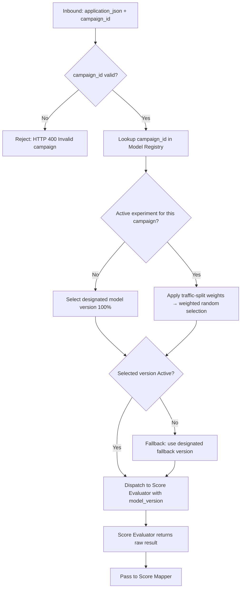

# Capability: Score Router

**Capability Name**: Score Router
**Parent Product**: Miso (Credit Scoring Service) → [PRODUCT](../../PRODUCT.md)
**Product Owner**: TBD
**Status**: 📝 Draft
**Last Updated**: 2026-03-05

---

## Business Function

Resolve which model version should evaluate a given loan application, based on the application's campaign ID and any active traffic-splitting configuration. The Score Router is the entry point for all inbound scoring requests — it reads the campaign-to-model mapping from the Model Registry, applies traffic-split rules (if any), selects a model version, and dispatches the request to the Score Evaluator. Traffic-splitting configuration can be updated without code deployment, enabling A/B and canary testing of new model versions without engineering involvement.

---

## Feature Inventory

| Feature | Status | Description |
|---------|--------|-------------|
| Campaign-Driven Model Resolver | Concept | On each inbound scoring request, resolve the designated model version by looking up the campaign ID in the Model Registry |
| Traffic Split Engine | Concept | Apply configurable traffic-split rules (e.g., 80% → Model v2, 20% → Model v3) to distribute requests across model versions; supports weighted random allocation |
| A/B Experiment Manager | Concept | Create, activate, pause, and conclude A/B experiments; records which experiment was active for each request so results can be attributed during analysis |
| Routing Fallback Handler | Concept | If the resolved model version is unavailable or returns an error, route to a designated fallback version; emit an alert and log the fallback event |

---

## Business Rules

| Rule | Description |
|------|-------------|
| BR-SR-01 | Every inbound scoring request must carry a valid campaign ID; requests without a campaign ID are rejected (HTTP 400) |
| BR-SR-02 | If no traffic-split experiment is active for a campaign, 100% of traffic routes to the campaign's designated model version |
| BR-SR-03 | Traffic-split weights across all variants in an experiment must sum to exactly 100% |
| BR-SR-04 | A model version must be in Active state (per Model Registry) to receive traffic; routing to a Retired version is not permitted |
| BR-SR-05 | The selected model version (including whether a fallback was used) is included in the response and recorded in the audit log |
| BR-SR-06 | Traffic-split configuration changes take effect within 1 minute of save, without service restart |

---

## Routing Decision Flow

---

## Non-Functional Requirements

| NFR | Requirement |
|-----|------------|
| Latency | Routing decision (registry lookup + traffic split) must complete in < 30ms p99 |
| Determinism | Given the same request and the same traffic-split config, routing outcomes must be reproducible from the trace log (for audit) |
| Configuration update | Traffic-split rule changes must propagate to routing within 60 seconds without service restart |
| Fault isolation | A failure in routing configuration must not prevent fall-through to the designated model version; router must degrade gracefully |

---

## Open Questions

- Should the traffic-split allocation be deterministic per application ID (sticky routing) or purely random per request? Sticky routing ensures the same application always evaluates against the same model version if re-scored.
- What is the alerting threshold for fallback routing events before the system raises a P1 incident?
