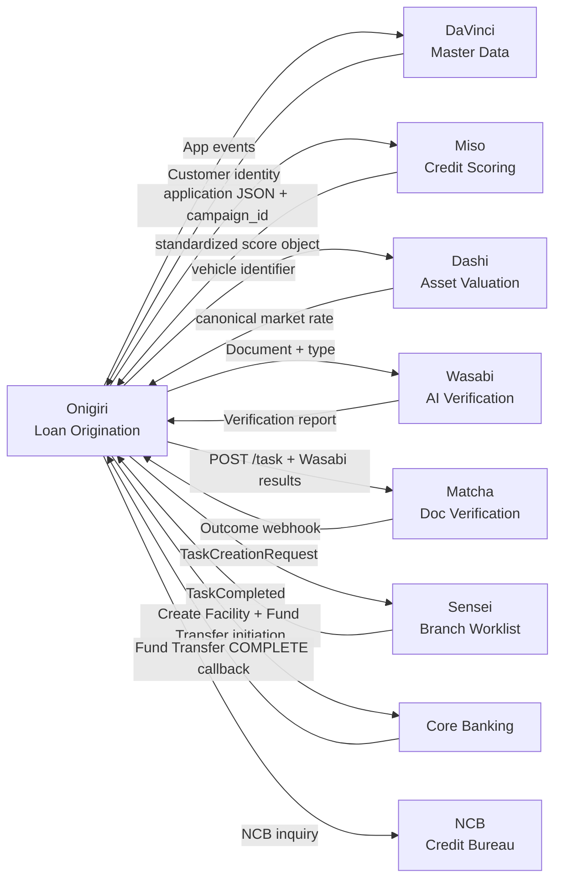

# Product: Loan Origination System

**Codename**: Onigiri (おにぎり)
**Portfolio**: Credit → [PORTFOLIO](../../PORTFOLIO.md)
**Status**: 📝 Draft
**Executive Owner**: CPO
**Last Updated**: 2026-03-09 (workflow update)

> *Onigiri (おにぎり) — A tightly packed, self-contained unit. Like the rice ball, Onigiri wraps the entire loan origination lifecycle into a single, cohesive product — from application intake through underwriting to disbursement. Everything the borrower needs, held together in one place.*

---

## Problem Statement

Loan origination across multiple product types (car title, land title, personal loans) requires different eligibility rules, form fields, risk strategies, document requirements, and workflow execution steps per campaign. A rigid, hardcoded system cannot keep pace with regular product launches, seasonal promotions, and regulatory changes. Risk policies must sometimes change weekly. Every code deployment adds latency and operational risk.

---

## Value Proposition

A single configurable platform that governs the full loan application lifecycle — from smart form intake through a fixed-topology underwriting state machine to core banking disbursement — without code changes for new campaigns or risk rule modifications.

**For whom**: Branch Credit Officers (COs) and underwriters who originate loans daily; Product Managers who launch campaigns; Risk Officers who manage assessment strategies.

---

## Product Boundary

**This product IS responsible for:**
- Loan application intake (Smart Form — Page → Section → Field composability)
- Underwriting workflow state machine (Draft → Risk Assessment → Approval → Create Facility → ... → Funded)
- Loan campaign configuration (pricing, eligibility, form template, risk strategy, execution steps)
- Risk assessment engine (JMESPath-based Strategy → Policy → Rule hierarchy)
- Integration gateway to Matcha, Wasabi, DaVinci, Sensei, Core Banking, NCB at defined boundaries

**This product IS NOT responsible for:**
- Document verification logic or QA workflow (owned by **Matcha**)
- AI document analysis and report assembly (owned by **Wasabi**)
- Customer master data and Golden Record (owned by **DaVinci**)
- Branch task tracking and worklist management (owned by **Sensei**)
- Credit scoring model selection, inference execution, or raw score handling (owned by **Miso**)
- Vehicle market rate management, source data ingestion, and canonical rate computation (owned by **Dashi** — Asset Valuation Service)
- Loan repayment scheduling, statements, or early settlement (future: **Loan Servicing** product)
- Delinquency management or collection workflows (future: **Collections** product)

**This product RECEIVES from:**
- DaVinci → customer identity + product summary on application creation → via REST API
- Miso → standardized score object `{ rating, risk_band, indicators[], model_version, trace_id }` → via REST API response
- Dashi → canonical vehicle market rate `{ vehicle_id, canonical_rate, rate_basis, adjustment_applied }` → via REST API response
- Wasabi → early-warning document verification report during Draft phase → via async callback
- Matcha → verification outcome (APPROVED/RETURNED/REFERRED) → via webhook callback
- Core Banking → fund transfer COMPLETE callback `{ status=COMPLETE, transferResult: Success|Reject, transferReferenceId }` → via webhook callback
- NCB → credit bureau inquiry result → via API (triggered by OTP consent in Smart Form)

**This product SENDS to:**
- Miso → application JSON + campaign ID on Risk Assessment state entry → via REST API
- Dashi → vehicle identifier (make + model + year + grade) during collateral valuation step → via REST API
- Matcha → document verification task (POST /task) after Create Facility state → via REST API
- Wasabi → document image URL + expected type + system data on upload → via async API
- Sensei → TaskCreationRequest event when branch action is needed → via event
- Core Banking → Create Facility command, Create Loan + Disbursement command → via API
- NCB → credit bureau inquiry request → via API
- DaVinci → ApplicationCreated, ApplicationApproved, CustomerProfileUpdated events → via event

---

## Capability Registry

| Capability | Owner | Status | Description |
|-----------|-------|--------|-------------|
| [Smart Form](capabilities/smart-form/CAPABILITY.md) | Engineering | Draft | Configurable Page → Section → Field form. JSON data in DocumentDB. Savable mid-session. Covers Borrower, Guarantor, Loan Setup, Summary, Document Upload stages. |
| [Underwriting Workflow](capabilities/underwriting-workflow/CAPABILITY.md) | Engineering | Draft | Fixed-topology 4-phase state machine (Origination → Underwriting → Decision → Terminal). 11 states. Configurable execution steps inside each state. Cash vs. non-cash path divergence. |
| [Loan Campaign Configuration](capabilities/loan-campaign-configuration/CAPABILITY.md) | Product | Draft | Single configuration umbrella per loan product: pricing, eligibility rules, application template, risk strategy, workflow execution steps. Zero code changes for new campaigns. |
| [Risk Assessment Engine](capabilities/risk-assessment-engine/CAPABILITY.md) | Engineering | Draft | JMESPath-based configurable rule engine. Strategy → Policy → Rule hierarchy. Produces max risk level, deviation flags, conditional document requirements. Full evaluation trace for audit. |
| [Disbursement Orchestration](capabilities/disbursement-orchestration/CAPABILITY.md) | Engineering | Draft | Owns post-document-verification states: receiver account pre-check (draft gate), Matcha callback routing from `pending_document_checking` (approved/returned/referred), loan officer confirm/reject from `waiting_for_confirmation`, system `waiting_create_facility`, Core Banking COMPLETE callback routing (Success / Reject). |
| [Cash Disbursement](capabilities/cash-disbursement/CAPABILITY.md) | Engineering | Draft | Owns the cash disbursement path after `Cash?=y` routing: conditional officer confirmation gate (`NeedConfCash` / `ConfirmationCash`), sequential Core Banking execution steps (Create Facility, Create Loan + Disbursement), and post-disbursement QA review before `Funded`. Cash-specific counterpart to Disbursement Orchestration. |

---

## Cross-Capability Integrity Rules

The following rules govern interactions between capabilities and are enforced at the product level.

### Application State High-Water Mark (HWM)

The application record maintains a `state_high_water_mark` field — the furthest workflow state ever entered by this application. HWM is monotonically increasing and never retreats, regardless of how many times the application returns to Draft.

This field coordinates field mutability between the **Underwriting Workflow** and **Smart Form** capabilities:

- **Underwriting Workflow** writes HWM on every state entry transition (before execution steps run)
- **Smart Form** reads HWM to determine which Lockpoint Groups are read-only when the form renders in Draft

**Lockpoint summary:**

| Event | HWM Reached | Fields Locked |
|-------|-------------|---------------|
| Approver clicks Approve | `Approval` | Loan amount, interest rate, product type, loan term |
| Create Facility state entered | `Create Facility` | **Disbursement channel**, bank account, payment details |
| Create Loan + Disbursement completes | `Create Loan + Disbursement` | All financial fields |

**Why disbursement channel is locked at Create Facility:** The Core Banking facility is created against a specific disbursement type. In the updated workflow, the cash/non-cash routing decision (Cash?) occurs before Create Facility — meaning by the time any Create Facility state is entered, the disbursement path is already committed. Allowing the channel to change post-facility would cause a path mismatch on re-entry — resulting in a second `Create Loan + Disbursement` execution against a new Core Banking record (double disbursement). The HWM lock is the primary prevention. Idempotency guards on the Create Facility and Create Loan + Disbursement execution steps are the defense-in-depth layer.

**Remediation when channel must genuinely change:** Cancel the application and submit a new one. This generates a clean audit trail and ensures a fresh facility is created with the correct disbursement type.

---

## Product-Level User Flow

```mermaid
stateDiagram-v2
    direction LR

    state "Phase: Origination" as orig {
        Draft
    }

    state "Phase: Underwriting" as uw {
        RiskAssessment: Risk Assessment
        Approval: pending_approval\n(Approval + Risk Level)
    }

    state "Phase: Decision" as dec {
        Cash: Cash?
        NeedConfCash: Need Confirmation?
        ConfirmationCash: Confirmation
        CreateFacilityCash: Create Facility
        CreateLoanDisbCash: Create Loan + Disbursement
        QA_cash: QA

        QA_noncash: QA
        DocCheck: pending_document_checking
        WaitConfirm: waiting_for_confirmation
        WaitCreateFacility: waiting_create_facility\n[system]
        WaitFund: waiting_fund_transfer
        WaitLoan: waiting_create_loan_operation
    }

    state "Phase: Terminal" as term {
        Funded
        Rejected: rejected
        Withdrawn
        Expired
    }

    [*] --> Draft: Create application
    Draft --> RiskAssessment: Submit

    RiskAssessment --> Approval
    RiskAssessment --> Draft: Request additional documents

    Approval --> Cash: Approve
    Approval --> Rejected: Reject
    Approval --> Draft: Request document upload

    Cash --> NeedConfCash: y (cash)
    NeedConfCash --> ConfirmationCash: y
    NeedConfCash --> CreateFacilityCash: n
    ConfirmationCash --> CreateFacilityCash
    CreateFacilityCash --> CreateLoanDisbCash
    CreateLoanDisbCash --> QA_cash
    QA_cash --> Funded
    QA_cash --> Draft: Request document upload

    Cash --> QA_noncash: n (non-cash)
    QA_noncash --> DocCheck: Submit to Matcha
    QA_noncash --> Draft: Request document upload
    DocCheck --> WaitConfirm: Matcha approved\n(loan amount changed)
    DocCheck --> WaitCreateFacility: Matcha approved\n(loan amount unchanged — bypass)
    DocCheck --> Draft: Matcha returned\n(request document upload)
    DocCheck --> Approval: Matcha referred\n(re-refer to approver)
    WaitConfirm --> WaitCreateFacility: Loan officer confirms
    WaitConfirm --> Rejected: Loan officer rejects
    WaitCreateFacility --> WaitFund: Facility created\n[system auto]
    WaitFund --> WaitLoan: Core Banking Success
    WaitFund --> Rejected: Core Banking Reject
    WaitLoan --> Funded: Loan operation created

    Draft --> Withdrawn: Customer not interested
    Draft --> Expired: Application expired
```

---

## Integration Map

---

## Product-Level Metrics and KPIs

| Metric | Description | Target |
|--------|-------------|--------|
| Origination Cycle Time | Time from Draft creation to Funded state (p50) | < 5 business days |
| Underwriting Automation Rate | % of applications with no manual risk rule intervention post-approval | > 90% |
| Campaign Launch Time | Calendar days from product request to first live application (no-code) | < 2 business days |
| Document Error Rate at Intake | % of Matcha tasks that route to human QA due to type mismatch (Wasabi-catchable) | < 5% |
| Return Rate | % of applications returned from Approval or QA back to Draft | < 15% |

---

## Detailed Reference

For full capability specifications, business rules, and design decisions, see: [ATLAS.md](ATLAS.md)
