# Restructure Development Guide

**Product**: Onigiri — Loan Origination System
**Loan Type**: `restructure`
**Audience**: Developer team building the restructure loan type
**Last Updated**: 2026-03-12

> This guide maps what is already documented, what is partially specified, and what requires further clarification before development can begin. It does not replace the capability documents — use the links in each section to read the authoritative source.

---

## What Is Restructure

A restructure is a loan product for existing borrowers whose repayment capacity has decreased. The existing loan is closed and a new loan is created carrying the outstanding balance forward, with an extended tenor and adjusted installments. No new money is disbursed to the customer.

Restructure is a loan type (`application_type = restructure`) within the Onigiri application lifecycle. It uses the same workflow engine as other loan types but has distinct entry paths, form behaviour, campaign configuration, and a pre-approval stage that other loan types do not have.

---

## Two Entry Paths

| Path | Description |
|---|---|
| **Via Pre-Approval** | The Credit Officer (CO) completes a pre-approval in BOS — selecting an eligible campaign and plan — before creating a Draft application. The Draft Initializer creates the Draft with `pre_approval_id` and `pre_approval_snapshot` pre-populated. |
| **Direct (no pre-approval)** | The CO creates a Draft application directly without a prior pre-approval. Campaign and plan selection occurs inside the Smart Form Finance Page. |

Both paths produce the same application record structure and follow the same workflow from the Draft state onwards.

---

## What to Read — By Area

### 1. User Flow and State Machine

| Document | Covers |
|---|---|
| [underwriting-workflow/CAPABILITY.md](../../capabilities/underwriting-workflow/CAPABILITY.md) | Topology A — loan application workflow (Draft → funded/rejected/withdrawn/expired). EasyPass routes to local approver at `pending_approval`; Non-EasyPass routes through standard escalation. Both paths go through `pending_approval` — EasyPass does not bypass the underwriting approval step. |
| [pre-approval/CAPABILITY.md](../../capabilities/pre-approval/CAPABILITY.md) | Topology D — pre-approval workflow state machine (created → pending_approval → approved → converted/rejected/expired). User Flow — Restructure Pre-Approval Entry (how CO navigates from BOS Customer Detail through pre-approval to Draft). Change Detection at Draft submission. |

**EasyPass clarification:**
- In **pre-approval (Topology D)**: EasyPass bypasses the Approval Request — CO converts directly from `created` to Draft without submitting for approval.
- In **underwriting (Topology A)**: EasyPass applications still go through `pending_approval` — they route to the **local approver** (within CO authority level). Non-EasyPass routes through standard escalation to a higher authority.

---

#### Topology A — Loan Application Workflow

Applies to all loan types including restructure. The workflow begins at `draft` and ends at a terminal state (`funded`, `rejected`, `withdrawn`, or `expired`).

```mermaid
stateDiagram-v2
    direction LR

    state "Origination" as orig {
        Draft: draft
    }

    state "Underwriting" as uw {
        RiskAssessment: risk_assessment
        Approval: pending_approval\n(Approval + Risk Level)
    }

    state "Decision — Cash Path" as cash_path {
        Confirmation1: confirmation
        CreateLoanDisb1: create_loan_disbursement
        QA_top: qa
    }

    state "Decision — Non-Cash Path (Disbursement Orchestration)" as noncash_path {
        QA_bottom: qa
        DocCheck: pending_document_checking
        WaitConfirm: waiting_for_confirmation
        WaitCreateFacility: waiting_create_facility
        WaitFund: waiting_fund_transfer
        WaitLoan: waiting_create_loan_operation
    }

    state "Decision — Routing" as routing {
        CreateFacility: create_facility
        Cash: cash_routing
    }

    state "Terminal" as term {
        Funded: funded
        Rejected: rejected
        Withdrawn: withdrawn
        Expired: expired
    }

    [*] --> Draft
    Draft --> RiskAssessment: Submit
    RiskAssessment --> Approval
    RiskAssessment --> Draft: Request docs
    Approval --> CreateFacility: Approve
    Approval --> Rejected: Reject
    Approval --> Draft: Request docs
    CreateFacility --> Cash
    Cash --> Confirmation1: Cash
    Confirmation1 --> CreateLoanDisb1
    CreateLoanDisb1 --> QA_top
    QA_top --> Funded
    QA_top --> Draft: Request docs
    Cash --> QA_bottom: Non-cash
    QA_bottom --> DocCheck: Submit to Matcha
    QA_bottom --> Draft: Request docs
    DocCheck --> WaitConfirm: Matcha approved\n(amount changed)
    DocCheck --> WaitCreateFacility: Matcha approved\n(amount unchanged — bypass)
    DocCheck --> Draft: Matcha returned\nRequest document upload
    DocCheck --> Approval: Matcha referred\nRe-refer to approver
    WaitConfirm --> WaitCreateFacility: Officer confirms
    WaitConfirm --> Rejected: Officer rejects
    WaitCreateFacility --> WaitFund: Facility created\n[system auto]
    WaitFund --> WaitLoan: CB Success
    WaitFund --> Rejected: CB Reject
    WaitLoan --> Funded
    Draft --> Withdrawn
    Draft --> Expired
```

---

### 2. Pre-Approval Screen

| Document | Status | What It Covers |
|---|---|---|
| [pre-approval/CAPABILITY.md](../../capabilities/pre-approval/CAPABILITY.md) | ✅ Done | States, business rules, EasyPass bypass, tenor filter, expiry |
| [FEATURE_pre-approval-request-creation.md](../../capabilities/pre-approval/features/FEATURE_pre-approval-request-creation.md) | ✅ Done | Pre-conditions (DaVinci → Pre-Build → Plan Calculation), CO inputs, acceptance criteria |
| [FEATURE_draft-initializer.md](../../capabilities/pre-approval/features/FEATURE_draft-initializer.md) | ✅ Done | Draft creation from an approved pre-approval, snapshot structure |
| [FEATURE_approval-request.md](../../capabilities/pre-approval/features/FEATURE_approval-request.md) | ✅ Done | Non-EasyPass approval submission |
| [FEATURE_pre-approval-status-visibility.md](../../capabilities/pre-approval/features/FEATURE_pre-approval-status-visibility.md) | ✅ Done | Pre-approval status on Customer List and Customer Detail in BOS |
| [FEATURE_pre-approval-expiry-management.md](../../capabilities/pre-approval/features/FEATURE_pre-approval-expiry-management.md) | ✅ Done | Expiry logic for approved pre-approvals |

> **Open**: `pre_approval_snapshot` JSON structure is referenced across features but not formally defined as a schema.

---

### 3. Plan Calculation

Plan Calculation is an **existing LOS API** — it is not a new build. Onigiri calls it as the third step in the pre-approval pre-conditions sequence (after DaVinci fetch and Campaign Eligibility Pre-Build), and again inside the Smart Form Finance Page whenever the CO changes the selected campaign, plan option, or payment due date.

> **Open**: The integration contract — request parameters, response schema, and plan option structure (tenor, grace period, term of payment) — needs to be documented before development of the pre-approval screen and Finance Page can begin.

---

### 4. Smart Form (Application Form)

Capability reference: [smart-form/CAPABILITY.md](../../capabilities/smart-form/CAPABILITY.md)

| Feature | Restructure Status | Notes |
|---|---|---|
| Page/Section/Field Composer | ✅ No change required | Restructure uses the existing composer engine. Sections and fields are defined by the campaign's Application Template. |
| Auto-Prefill | ⚠️ Requires restructure implementation | Prefill source: DaVinci (customer profile) + Core Banking (loan record + collateral). The specific field list and per-field editability rules are not yet defined. |
| Save Draft (Mid-Session Persistence) | ✅ No change required | Behaviour is identical to `new_booking` — full JSON document persisted on every save and every state transition. |
| Stage Navigator | ✅ No change required | Stage sequence is determined by the restructure campaign's Application Template. No code change required. |
| NCB Consent + OTP Flow | ✅ No change required | Restructure applications require NCB consent and OTP flow — same as other loan types. No code change needed. |
| Document Upload Interface | ⚠️ Requires restructure document list | The upload engine is unchanged. The required document types for a restructure application have not yet been defined. |
| Approver Data Aggregation | ⚠️ Requires restructure data groups | The engine is `application_type`-driven and requires no code change. The data groups to display at the Approval state for restructure are not yet defined. |
| Finance Page | ❌ New feature — must be built | Supports campaign and plan selection, re-selection, Plan Calculation API integration, and tenor filter enforcement. Business rules are documented in smart-form/CAPABILITY.md. Screen-level specification is not yet written. |

**Document Requirements**

| Document | Status | What It Covers |
|---|---|---|
| [smart-form/CAPABILITY.md](../../capabilities/smart-form/CAPABILITY.md) | ⚠️ Partial | Document upload rules exist. The restructure-specific required document list is not yet defined. |

> **Note**: Disbursement Orchestration does **not** apply to restructure. Restructure closes the existing loan and opens a new loan carrying the outstanding balance forward — no new money is disbursed to the customer. The Disbursement Orchestration capability (fund transfer, Matcha verification at disbursement, Core Banking facility creation) is scoped to `new_booking` and `topup`. Wasabi early-warning scan on upload is triggered by the Smart Form Document Upload feature and applies to all loan types regardless.

> **Open**: Required document types for restructure and the split between pre-approval stage documents and Draft stage documents are not yet defined.

---

### 5. Campaign Eligibility Pre-Build

| Document | Status | What It Covers |
|---|---|---|
| [campaign-eligibility-pre-build/CAPABILITY.md](../../capabilities/campaign-eligibility-pre-build/CAPABILITY.md) | ✅ Done | Full pre-build engine: two-phase evaluation, outcome classification, Maximum Amount calculation, worklist flags |

> The Pre-Build engine is campaign-type-agnostic — it produces outcome and Maximum Amount for any campaign type, including restructure. No restructure-specific changes are required to the Pre-Build engine.

---

### 6. Campaign Configuration (Restructure Campaign Type)

| Document | Status | What It Covers |
|---|---|---|
| [loan-campaign-configuration/CAPABILITY.md](../../capabilities/loan-campaign-configuration/CAPABILITY.md) | ✅ Done | Campaign configuration dimensions documented. Restructure campaign type added: EasyPass designation, eligibility criteria shape (DPD range, contract age, outstanding balance), and Plan Calculation pricing parameters. |

---

### 7. Risk Strategy (Restructure)

| Document | Status | What It Covers |
|---|---|---|
| [risk-assessment-engine/CAPABILITY.md](../../capabilities/risk-assessment-engine/CAPABILITY.md) | ⚠️ Partial | Risk engine is fully documented. Restructure-specific strategy attributes and outcome threshold configuration are not yet specified. |

> **Open**: The attributes evaluated in a restructure risk strategy and the expected `risk_level` threshold mapping have not been defined.

---

### 8. Core Banking Integration (Loan Contract Modification)

| Document | Status | What It Covers |
|---|---|---|
| _(none)_ | ❌ Not documented | How Onigiri interacts with Core Banking to close the existing loan and create a new loan carrying the outstanding balance forward with an extended tenor and adjusted repayment schedule. |

> **Required before development of the post-approval stage**: Restructure closes the existing loan and opens a new loan — no new money is disbursed to the customer. The Core Banking API contract for loan closure and new loan creation (carrying outstanding balance, extended tenor, adjusted installments) is not defined anywhere.

---

## What Does Not Require New Development

The following are fully implemented for `new_booking` and require only configuration to support restructure. No code changes are needed:

- Risk Assessment Engine — rule evaluation engine
- Campaign Eligibility Pre-Build — eligibility scan engine
- Underwriting workflow state machine — Topology A
- DocumentDB JSON document storage
- Wasabi document scan trigger on upload
- Worklist flag display
