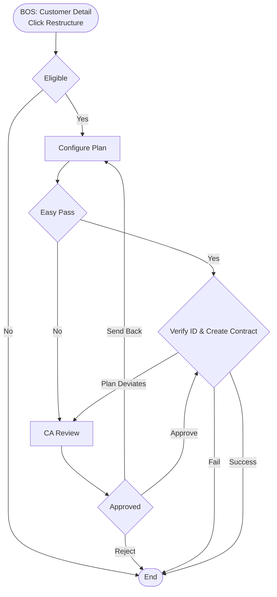

# Restructure

| **Capability**      | Restructure                                                                                                     |
|---------------------|-----------------------------------------------------------------------------------------------------------------|
| **Product**         | Onigiri (Car Leasing Platform)                                                                                  |
| **Portfolio**       | Credit                                                                                                          |
| **Product Owner**   | TBD                                                                                                             |
| **Status**          | Active                                                                                                          |

---

## Business Function

Enable Credit Officers to restructure car loan repayment plans for customers experiencing financial hardship through campaign-based strategies, risk-evaluated recommendations, and approval workflows.

This capability is part of the **LOS (Loan Origination System)** and is initiated from **BOS (Branch Origination System)** by Credit Officers working with customers at branch locations.

**Entry Navigation**: BOS → Customer List → Customer Detail → Click "Restructure" → LOS Restructure Module

**Key Objectives**:
- Provide flexible repayment options to customers in financial difficulty
- Enforce campaign compliance and installment reduction rules
- Route plan deviations through Credit Analyst approval workflows
- Ensure identity verification before contract execution
- Maintain complete audit trail of restructure activities

**Roles**:
- **Credit Officer (CO)**: Initiate restructure, propose plan, discuss with client, select campaign/plan, create contract
- **Credit Analyst (CA)**: Review plans when approval required; Approve / Reject / Send Back for Revision (CO↔CA loop)
- **Client**: Confirm plan and verify identity before contract generation

**Eligibility Rules** (Gating):
Restructure is allowed for all customers **except** those with:
- Bankruptcy
- Legal enforcement (บังคับคดี)
- Restricted blacklist
- Active litigation (โดนฟ้อง)

If not eligible → restructure not allowed (stop).

**Key Business Rules**:
1. **Installment Reduction Rule**: New monthly payment must be lower than the original contractual installment
2. **Campaign Compliance Rule**: Selected plan must be within approved campaign parameters
3. **Deviation Routing**: If plan deviates outside approved campaign parameters → route to CA approval
4. **Easy Pass**: If campaign is marked Easy Pass → skip CA and allow moving forward to contract creation (still must pass validation rules)
5. **Identity Verification**: Required before contract generation via chip-dip ID card verification OR manual ID input

---

## Feature Inventory

| **Feature ID** | **Feature Name** | **Description** |
|----------------|------------------|-----------------|
| **F01** | Restructure Initiation & Eligibility Gating | Entry point from BOS with automatic eligibility validation |
| **F02** | Loan Summary Display | Comprehensive view of current loan status and financial position |
| **F03** | Campaign Selection & Plan Configuration with Risk Engine | Integrated campaign selection, plan configuration, and risk-based validation with Easy Pass routing |
| **F04** | CA Approval Workflow | Route non-compliant plans to Credit Analyst for review with send-back loop |
| **F05** | Identity Verification & Contract Generation | Verify borrower identity and generate restructure contract with updated terms |

---

## Features

### F01: Restructure Initiation & Eligibility
Initiates the restructure workflow directly from the BOS customer detail view. Handoffs the customer context and automatically retrieving current loan data. Strict system-level gating validates customer eligibility before allowing access to the restructure module. Customers flagged with bankruptcy, active legal enforcement (บังคับคดี), strict blacklist restrictions, or ongoing litigation (โดนฟ้อง) are automatically blocked with a clear rejection reason.

### F02: Loan Summary
Provides a comprehensive read-only snapshot of the customer's current loan information. Displays critical data points including the total outstanding balance (broken down into principal, interest, and penalties), current installment amount, remaining tenure, Days Past Due (DPD), and historical payment behavior. Serves as the quantitative baseline to support CO decision-making.

### F03: Campaign Selection & Plan Configuration
Allows Credit Officers to browse and select eligible restructure campaigns (e.g., tenure extension, interest-only, or installment reduction). Integrates with the risk engine to dynamically evaluate customer risk profiles (DPD, balance, score) against active campaigns. Features an interactive calculator to configure specific repayment terms (new installment, updated tenure). Enforces strict business validations, including the Installment Reduction Rule (new installment must be lower than original) and campaign min/max bounds. Programs flagged as "Easy Pass" are highlighted for auto-approval.

### F04: Credit Analyst Approval
Manages the review pipeline by automatically routing non-compliant plans or non-Easy Pass configurations to the Credit Analyst (CA) queue. Provides CA with full context and CO justification. Supports a comprehensive decision workflow allowing the CA to **Approve** (enabling contract generation), **Reject** (terminating the flow), or **Send Back** for revision. Maintains a complete history trail of the CO↔CA negotiation loop.

### F05: Identity Verification & Contract Generation
Enforces mandatory borrower identity verification using a hardware chip-dip ID card reader as the primary method, with manual ID data entry as a fallback. Captures the verification timestamp before unlocking the contract generation phase. Validates that the configured plan matches the CA-approved plan parameters; if the selected plan has deviated, the system flags the discrepancies and routes it back to the Credit Analyst for secondary approval. Upon validation, automatically generates the official restructure agreement, appending the new repayment schedule, selected campaign reference, and the full approval audit trail.

---

## Business Flow (High-Level)

---

## Non-Functional Requirements (NFRs)

- **Latency:** Risk engine API evaluation must return campaign eligibility in < 3 seconds.
- **Availability:** Ensure 99.9% uptime during branch operating hours to support live CO-Client interactions.
- **Auditability:** 100% of CA approval decisions, CO bypasses (Easy Pass), and identity verification timestamps must be immutable and logged for compliance.
- **Consistency:** The updated "Restructured" loan state must be strongly consistent across the Core Banking System upon contract generation.

---

## Open Questions & Known Constraints

- **Hardware Dependency:** Does every branch have sufficient functional chip-dip ID card readers to support F05 without falling back to manual entry too often?
- **Legacy Contracts:** How do we handle active litigation (โดนฟ้อง) status if the legal state changes mid-restructure?
- **E-Signature:** Is physical signature strictly required for the generated restructuring contract, or can we utilize digital signatures in phase 2?

---

**Document Version**: 1.0
**Last Updated**: 2026-03-05
