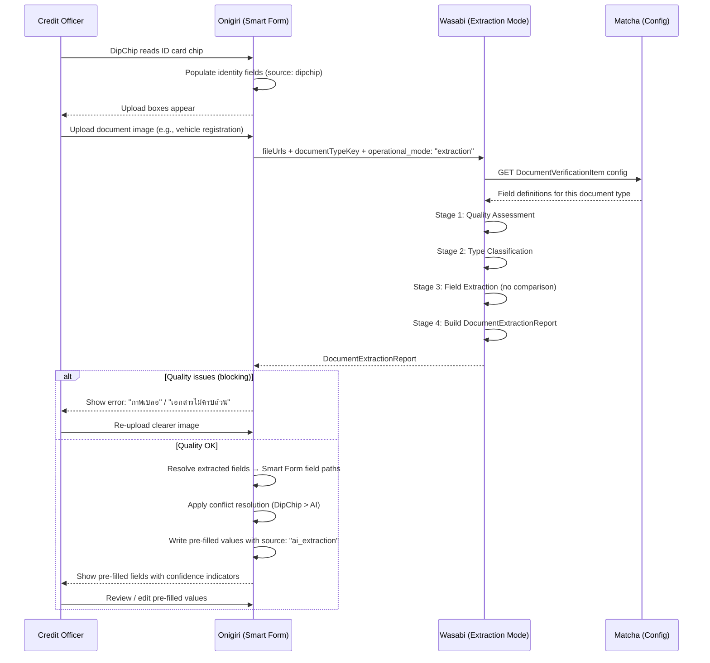
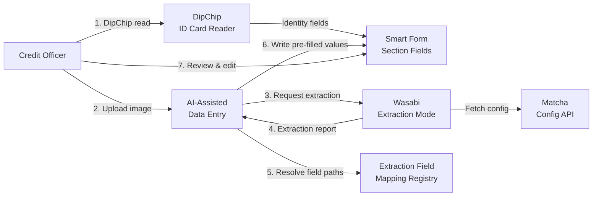

# Capability: AI-Assisted Data Entry

**Product**: Onigiri — [PRODUCT](../../PRODUCT.md)
**Portfolio**: Credit
**Product Owner**: TBD
**Status**: 📝 Draft — @FEATURE decomposition complete (7 features)
**Last Updated**: 2026-03-30

---

## Business Function

Orchestrate AI-powered document image processing to extract field values and pre-fill Smart Form fields during the data entry phase — reducing manual entry effort, data entry errors, and origination cycle time.

## Why It Exists (First Principles)

- **Document-first, not keyboard-first**: Credit Officers typically have physical documents in hand (ID card, registration book, land title) before they begin data entry. Extracting data from the document and pre-filling the form inverts the current manual-first workflow.
- **Error reduction**: Manual transcription of Thai names, ID numbers, addresses, and vehicle details is error-prone. AI extraction reduces human transcription errors.
- **Speed**: Pre-filling 10–30 fields from a single document image saves minutes per application.
- **Quality gate at entry**: Document quality issues (blur, missing signature, incomplete paper) are caught immediately at upload — before the CO invests time in manual entry.

## Why a Separate Capability (Not Smart Form or Product Type Config)

| Capability | Responsibility | Why This Doesn't Belong There |
|-----------|---------------|-------------------------------|
| **Smart Form** | Form structure, rendering, persistence, field definitions | Smart Form doesn't know about AI, document images, or extraction pipelines |
| **Product Type Configuration** | Template assembly — which sections, which documents | Product Type Config is design-time; this capability is runtime orchestration |
| **AI-Assisted Data Entry** | Runtime orchestration: trigger Wasabi extraction mode, handle quality errors, map extracted fields to Smart Form, manage source conflicts | Cross-cutting between document upload, Wasabi, and Smart Form field population |

---

## Feature Inventory

| Feature | Status | Description |
|---------|--------|-------------|
| [DipChip Integration Gate](features/FEATURE_dipchip-integration-gate.md) | Concept | Upload boxes hidden until DipChip ID card chip read succeeds. DipChip fields tagged with source attribution. |
| [Document Upload with AI Extraction](features/FEATURE_document-upload-ai-extraction.md) | Concept | On image upload → call Wasabi in extraction mode → show quality errors or pass results to pre-fill engine. |
| [Extraction Field Mapping Registry](features/FEATURE_extraction-field-mapping-registry.md) | Concept | Extend existing Data Extraction Templates with reverse mapping (check_name → Smart Form field_path) + extraction_enabled + confidence_threshold per field. |
| [Smart Form Pre-fill Engine](features/FEATURE_smart-form-prefill-engine.md) | Concept | Receive extracted fields → resolve target Smart Form fields via mapping → write values with source attribution + confidence. |
| [Pre-fill Conflict Resolution](features/FEATURE_prefill-conflict-resolution.md) | Concept | Source priority hierarchy: DipChip > manual override > manual entry > AI extraction > DaVinci pre-fill. |
| [Extraction Confidence Display](features/FEATURE_extraction-confidence-display.md) | Concept | Visual indicators on pre-filled fields: green (high confidence), yellow (low — please verify), gray (could not extract). |
| [Multi-Document Pre-fill Orchestration](features/FEATURE_multi-document-prefill.md) | Concept | Route extracted fields from different document types to correct Smart Form sections. |

---

## Business Rules

### User Flow

### DipChip → AI Extraction Sequence

| Step | Action | Result |
|------|--------|--------|
| 1 | CO arrives at Kay-in page | Form empty |
| 2 | DipChip reads ID card chip (mandatory) | Identity fields populated, tagged `source: "dipchip"` |
| 3 | Upload boxes appear | CO can now upload document images |
| 4 | CO uploads document image | Wasabi extraction mode triggered |
| 5 | Quality check | If blocking error → show error, request re-upload |
| 6 | Type classification | If mismatch → show warning |
| 7 | Field extraction | Extracted values returned with confidence |
| 8 | Pre-fill engine | Mapped values written to Smart Form (respecting source priority) |
| 9 | CO reviews | Can edit any pre-filled value |

### Source Priority Hierarchy

When multiple data sources provide values for the same Smart Form field, the highest-priority source wins:

| Priority | Source | Tag | Description |
|:--------:|--------|-----|-------------|
| 1 | DipChip | `dipchip` | Government chip data — authoritative for identity fields |
| 2 | Manual Override | `manual_override` | CO intentionally corrected a pre-filled value |
| 3 | Manual Entry | `manual_entry` | CO typed the value from scratch |
| 4 | AI Extraction | `ai_extraction` | Extracted from document image by Wasabi |
| 5 | DaVinci Pre-fill | `prefill_davinci` | Pre-filled from DaVinci master data (restructure apps) |

**Rule:** AI extraction NEVER overwrites a value from a higher-priority source.

### Document Error Classification

| Category | Error Code | Severity | User Message (TH) | User Action |
|----------|-----------|----------|-------------------|-------------|
| Quality | `BLUR` | Blocking | ภาพเบลอ ไม่ชัดเจน | Re-upload clearer image |
| Quality | `DARK_IMAGE` | Blocking | ภาพมืดเกินไป | Re-upload with better lighting |
| Quality | `TRUNCATED` | Blocking | เอกสารไม่ครบถ้วน ถูกตัดขอบ | Re-upload showing full document |
| Quality | `OBSTRUCTED` | Blocking | มีสิ่งกีดขวางบังเอกสาร | Re-upload without obstruction |
| Quality | `GLARE` | Blocking | แสงสะท้อนบนเอกสาร | Re-upload avoiding light reflection |
| Quality | `WATERMARK` | Warning | พบลายน้ำบนเอกสาร อาจมีผลต่อการอ่านข้อมูล | Proceed with caution or re-upload |
| Type | `TYPE_MISMATCH` | Blocking | เอกสารไม่ตรงกับประเภทที่ต้องการ | Upload correct document type |
| Type | `TYPE_UNCERTAIN` | Warning | ไม่สามารถระบุประเภทเอกสารได้อย่างแน่นอน | Verify correct document uploaded |
| Extraction | `PARTIAL_EXTRACTION` | Info | สามารถอ่านข้อมูลได้บางส่วน กรุณาตรวจสอบ | Review and complete missing fields |
| Extraction | `NO_EXTRACTION` | Warning | ไม่สามารถอ่านข้อมูลจากเอกสารได้ | Enter data manually |
| Processing | `PROCESSING_FAILED` | Warning | ระบบไม่สามารถประมวลผลเอกสารได้ | Retry or enter manually |

**Blocking** = must re-upload, no extraction results returned.
**Warning** = can proceed, partial results may be available.
**Info** = extraction partially succeeded, CO reviews and completes.

### Confidence Threshold Handling

| Confidence Range | Behavior | Visual Indicator |
|-----------------|----------|------------------|
| >= configured threshold (default 0.90) | Auto-fill the field | Green AI icon — "AI extracted" |
| >= 0.70 and < threshold | Auto-fill with warning | Yellow AI icon — "AI extracted (low confidence — please verify)" |
| < 0.70 | Leave field blank | Gray AI icon — "Could not extract reliably" |
| `not_extractable` | Leave field blank | No indicator |

Thresholds are **per-field** in the Extraction Field Mapping Registry. Example defaults:
- ID numbers, chassis/engine numbers: 0.95 (high accuracy required)
- Names: 0.90
- Addresses: 0.80 (Thai address parsing is inherently difficult)

---

## Extraction Field Mapping — Reusing Existing Templates

The existing `extraction_template` table (owned by Engineering, used for outbound data to Matcha) already contains `check_name ↔ field_path` mappings. These are **bidirectional by nature**:

- **Outbound** (existing): `field_path` → `check_name` → sent to Matcha for verification
- **Inbound** (new): `check_name` → `field_path` → written to Smart Form for pre-fill

**New fields per mapping entry:**

| Field | Type | Default | Description |
|-------|------|---------|-------------|
| `extraction_enabled` | boolean | `true` | Whether this field should be extracted in extraction mode |
| `target_section` | string | — | Which Smart Form section (e.g., `identity`, `collateral_car`) |
| `confidence_threshold` | number | `0.90` | Minimum confidence for auto-fill. Below: yellow warning. Below 0.70: leave blank. |
| `value_transform_inbound` | string? | `null` | Optional transformation when writing extracted value to Smart Form (e.g., date format conversion) |

**Example — Thai ID Card template extended:**

| check_name | field_path | extraction_enabled | target_section | confidence_threshold |
|-----------|-----------|:-:|----------------|:-:|
| `id_card_number` | `identity.id_national_id` | true | `identity` | 0.95 |
| `full_name_th` | `identity.id_first_name` + `identity.id_last_name` | true | `identity` | 0.90 |
| `date_of_birth` | `identity.id_date_of_birth` | true | `identity` | 0.90 |
| `address_text` | `address.addr_current_*` (parsed) | true | `address` | 0.80 |

**Example — Car Registration Book template:**

| check_name | field_path | extraction_enabled | target_section | confidence_threshold |
|-----------|-----------|:-:|----------------|:-:|
| `plate_number` | `collateral_car.car_plate_number` | true | `collateral_car` | 0.95 |
| `brand` | `collateral_car.car_brand` | true | `collateral_car` | 0.90 |
| `model` | `collateral_car.car_model` | true | `collateral_car` | 0.90 |
| `chassis_number` | `collateral_car.car_chassis_number` | true | `collateral_car` | 0.95 |
| `engine_number` | `collateral_car.car_engine_number` | true | `collateral_car` | 0.95 |
| `year` | `collateral_car.car_year` | true | `collateral_car` | 0.90 |
| `engine_cc` | `collateral_car.car_engine_cc` | true | `collateral_car` | 0.90 |

**Same check_name, different target sections**: The same `check_name` may map to different `field_path` values depending on the collateral variant (car vs bike vs tractor). This is handled by having separate templates per variant, which the PO already selects per evidence entry.

---

## Integration Map

---

## NFRs

| NFR | Requirement |
|-----|-------------|
| Extraction latency | Wasabi extraction must return within 10s (p95) per document — same as verification mode |
| Non-blocking UX | CO can continue manual entry while extraction processes; pre-fill writes when results arrive |
| All document types | Must work for any document type configured in the system (ID, registration, land title, income, etc.) |
| Thai script | Full Thai script support for extracted field values |
| Source attribution | Every pre-filled field must carry source tag and confidence metadata |
| Graceful degradation | If Wasabi is unavailable or extraction fails, CO can enter data manually — no blocking |

---

## Relationship to Existing Capabilities

| Capability | Relationship |
|-----------|-------------|
| **Smart Form** | AI-Assisted Data Entry writes to Smart Form fields. Smart Form owns field definitions, rendering, and persistence. |
| **Product Type Configuration** | Product Type Config determines which document types and extraction templates are active per product type. AI-Assisted Data Entry uses this at runtime. |
| **Wasabi (Extraction Mode)** | AI-Assisted Data Entry is the Onigiri-side consumer of Wasabi's new extraction mode. |
| **Underwriting Workflow** | No direct relationship. Extraction happens during Draft phase only. Field lockpoints (HWM) are respected — AI extraction cannot write to locked fields. |

---

## Open Questions

- Should extraction results be persisted in the application JSON for audit (which fields were AI-extracted, what were the original values)?
- Should there be a "batch upload" UX where CO can upload all documents at once and extraction runs in parallel?
- How should the system handle documents in languages other than Thai (e.g., foreign passport)?
