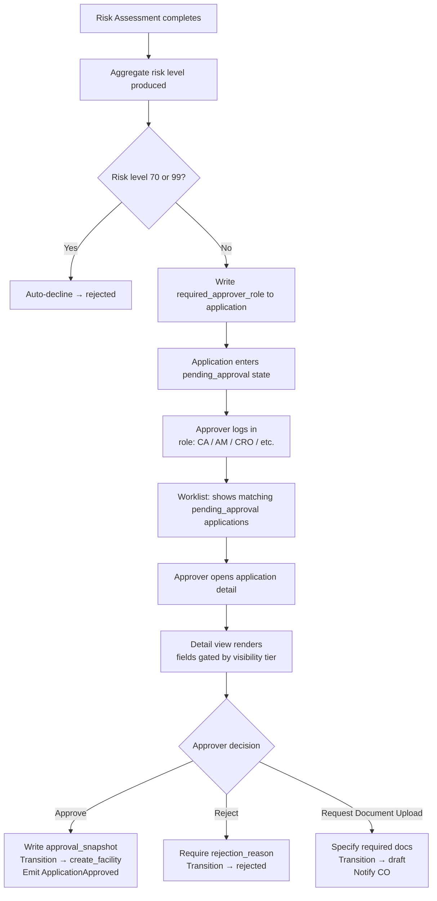

# Capability: Application Approval

**Product**: Onigiri — [PRODUCT](../../PRODUCT.md)
**Portfolio**: Credit
**Product Owner**: TBD (Credit PO / Risk Officer)
**Status**: 📝 Draft
**Last Updated**: 2026-05-25

---

## Business Function

Route loan applications that have passed Risk Assessment to the correct approver group based on risk level; render a worklist of applications distributed to the logged-in approver by the external **Worklist Distribution System**; enforce a secondary role-boundary check to ensure the approver's `group_role` matches the application's `required_approver_role`; present a role-gated application detail view for informed decision-making; and capture approve / reject / request-document decisions that drive the workflow forward.

## Why It Exists (First Principles)

- **Credit Risk Control**: Not all loans carry the same risk. Higher-risk applications require more senior credit authority to approve. The routing must be automatic, deterministic, and auditable — no manual queue assignment.
- **Role-Appropriate Information**: An approver's authority level determines what information they are trusted to see. Confidential financial calculations and bureau data must not be exposed to roles without the authority to act on them.
- **Decision Accountability**: Every approval, rejection, or document request must be traceable to a named actor with a recorded role, timestamp, and reason. Undocumented credit decisions are a regulatory exposure.
- **Worklist Ownership**: Sensei owns branch operational task management. The credit approval worklist is a credit-department function (CA, AM, CRO, etc.) — distinct audience, distinct lifecycle. It lives inside Onigiri alongside the `pending_approval` state it serves.

---

## Feature Inventory

| Feature | Status | Description |
|---------|--------|-------------|
| [Approval Routing Assignment](features/FEATURE_approval-routing-assignment.md) | Spec | On entry to `pending_approval`, read the aggregated risk level from RAE output and write `required_approver_role` to the application record. Strict role match — no upward delegation. |
| [Approver Worklist](features/FEATURE_approver-worklist.md) | Spec | List page (`/worklist`) rendering applications distributed to the logged-in approver by the external Worklist Distribution System. Onigiri applies a secondary role-boundary check: applications whose `required_approver_role` does not match the user's `group_role` are not rendered even if distributed. Sorted by days pending (oldest first). |
| [Application Detail View](features/FEATURE_application-detail-view.md) | Spec | Full application detail page accessible from the worklist. Renders Smart Form data, system-calculated fields, NCB result, risk assessment output, and audit trail. Field visibility is gated by approver role. |
| [Approval Decision](features/FEATURE_approval-decision.md) | Spec | Three actions available on the detail page: Approve (→ `create_facility`), Reject (→ `rejected`), Request Document Upload (→ `draft`). Requires reason text on Reject. Records actor ID, role, action, timestamp immutably. |

---

## Business Rules

### Risk Level → Required Approver Role

Sourced from [Risk Assessment Engine CAPABILITY.md](../risk-assessment-engine/CAPABILITY.md). Reproduced here for enforcement at state entry.

Risk level is a numeric range evaluated against `From RL` / `To RL` bounds (inclusive). The system routes using `group_role` — not individual position titles. Any user whose account carries a matching `group_role` may action the application. Position names are informational labels only; they are not used in routing logic.

| From RL | To RL | group_role | Positions in group (informational) | Outcome |
|---------|-------|------------|------------------------------------|---------|
| 1 | 10 | `SALE_BRANCH` | CO, SCO, BM, SBM | Routes to approver worklist |
| 11 | 20 | `SALE_AREA` | DAM (Deputy Area Manager), AM, SAM (Senior Area Manager) | Routes to approver worklist |
| 21 | 70 | `CA` | CA | Routes to approver worklist |
| 71 | 80 | `CA+` | CRO | **System auto-rejects** — phase-specific; future intent to route to human CRO |
| 81 | 98 | `CA+` | CRO | **System auto-rejects** |
| 99 | 99 | *(system)* | GOD | **System auto-rejects** — policy violation, unconditional |
| — | 0 | *(default)* | — | **System auto-rejects** — unclassified risk level |

**Auto-rejection rule**: Any application with `risk_level > 70` is automatically rejected by the system without entering `pending_approval`. Transition is directly to `rejected` with a system-generated reason.

### Strict Role Matching

- The system matches `required_approver_role` (a `group_role` value) against the authenticated user's `group_role` claim. Position title is irrelevant.
- Any user in the matching group may action the application. First to submit a decision wins — one approval per application.
- A higher-authority group (e.g., `CA`) **cannot** approve an application routed to `SALE_BRANCH`. No implicit upward delegation.
- Reassignment to a different group requires an explicit supervisor override action (out of scope for this capability — see Open Questions).

### Visibility Matrix (Role-Based Field Access)

Fields on the Application Detail View are grouped into **visibility tiers**. Each tier is accessible only to roles at or above the defined minimum authority.

| Visibility Tier | Fields Included | Minimum group_role Required |
|----------------|-----------------|----------------------------|
| **Tier 1 — Basic** | Application reference, borrower name, product type, campaign name, requested loan amount, loan term, application status, date submitted | All approver roles (`SALE_BRANCH` and above) |
| **Tier 2 — Application Data** | Full Smart Form fields: borrower profile, guarantor details, employment, address history, loan purpose | All approver roles (`SALE_BRANCH` and above) |
| **Tier 3 — Financials** | Declared income, declared expenses, debt obligations, net income calculation, DTI (Debt-to-Income ratio), LTV (Loan-to-Value ratio) | `SALE_AREA` and above (risk level ≥ 11) |
| **Tier 4 — Bureau & Scoring** | NCB credit bureau result (full report), credit score, delinquency history, outstanding obligations from bureau | `CA` and above (risk level ≥ 21) |
| **Tier 5 — Risk Assessment** | Aggregated risk level, deviation flags, required documents list, full evaluation trace (strategy → policy → rule → result) | `CA` and above (risk level ≥ 21) |
| **Tier 6 — Collateral Valuation** | Asset details, canonical market rate from Dashi, adjusted valuation, LTV calculation basis | `CA` and above (risk level ≥ 21) |
| **Tier 7 — Audit Trail** | Full workflow state history, all prior approval decisions, return-to-draft reasons, actor IDs and timestamps | `CA+` and above (risk level ≥ 71) — note: CA+ does not appear in the human approval worklist (auto-reject tier), but retains audit trail access for supervisory review |

> **Note**: `SALE_BRANCH` approvers (CO, SCO, BM, SBM) see Tier 1 and Tier 2 only. Low-risk loans (RL 1–10) do not require bureau or financial analysis — branch staff have sufficient context from the application form itself.

> **Open question**: Should `SALE_BRANCH` see Tier 3 financials? They enter this data in the Smart Form, so they have seen it — but exposing it in the approval view adds no decision value for low-risk cases. Recommend: exclude by default.

### Application State Preconditions

An application appears in the approval worklist when all of the following are true:
1. The external **Worklist Distribution System** has assigned it to the logged-in user
2. `state = pending_approval`
3. `required_approver_role` is set and matches the logged-in user's `group_role` (Onigiri's secondary enforcement layer)
4. Application has not been recalled or expired

The Worklist Distribution System owns the assignment logic (load balancing, geographic routing, specialisation, manual override). Onigiri does not replicate or override this logic — it renders what is assigned and enforces the role-boundary check as a safeguard.

### Approved → Create Facility Transition

When an approver clicks Approve:
1. Capture approval snapshot: `{ approver_id, approver_role, risk_level, approved_loan_amount, approved_term, timestamp }` — written to the application record as `approval_snapshot`.
2. Transition application state to `create_facility`.
3. Emit `ApplicationApproved` event to DaVinci.

The `approval_snapshot` is immutable after writing. It is referenced downstream by Disbursement Orchestration (non-cash path) and Cash Disbursement (cash path) as the authoritative approved terms.

### Reject → Rejected Transition

When an approver clicks Reject:
1. Require `rejection_reason` text (non-empty).
2. Transition application state to `rejected`.
3. Record `{ approver_id, approver_role, rejection_reason, timestamp }` in the workflow audit log.

### Request Document Upload → Draft Transition

When an approver requests additional documents:
1. Require at least one document type specified.
2. Transition application state to `draft`.
3. Record `{ approver_id, approver_role, requested_documents[], timestamp }` in the workflow audit log.
4. Notify the originating CO (mechanism TBD — in-app notification or Sensei task).

---

## User Flow

---

## NFRs

| NFR | Requirement |
|-----|-------------|
| Role enforcement | `required_approver_role` is evaluated server-side against the authenticated user's role claim. Client-side role hints are ignored. |
| Worklist freshness | Worklist reflects application state in near-real-time (< 30s staleness). Applications that exit `pending_approval` are removed from the worklist automatically. |
| Approval atomicity | Approval decision write and state transition must be atomic. A partial write (decision recorded but state not advanced) must not be possible. |
| Decision immutability | Approval decisions are written to an append-only audit log. No update or delete path exists. |
| Visibility tier enforcement | Field visibility tier is evaluated at render time, server-side. No Tier 3+ field data is included in the API response for Tier 1/2 roles. |

---

## Open Questions

1. **Worklist Distribution System integration** *(dependency — pending)*: The distribution logic (assignment rules, load balancing, geographic routing, manual override) is owned by an external system. The integration contract — how Onigiri receives the assignment list, the data format, and the refresh mechanism — has not yet been specified. The Approver Worklist feature cannot be fully built until this contract is defined.
2. **Supervisor reassignment**: When a designated approver is unavailable, can a supervisor explicitly reassign `required_approver_role` to a different role? If yes, this requires a new feature and audit trail entry. Confirm whether reassignment is handled by the Worklist Distribution System or within Onigiri.
2. **Worklist notification**: When a new application enters `pending_approval` and is routed to a role, how is the approver notified? In-app notification within Onigiri, or a Sensei `TaskCreationRequest` event? (Currently Sensei owns branch notifications — credit approver notifications are unresolved.)
3. **SLA / aging**: Is there a configurable SLA on `pending_approval` that triggers escalation or expiry? If yes, define escalation target (same role, supervisor, auto-reject).
4. **Concurrent approval attempts**: If two users with the same role open the same application simultaneously, which one's decision wins? Last-write-wins is unsafe for credit decisions — optimistic lock (e.g., application-level version check) recommended.
5. **CO/SCO/BM/SBM visibility of Tier 3 financials**: Confirm whether branch-level approvers should see declared financials on the approval view (they authored this data in the Smart Form, but seeing it in approval adds no decision value for low-risk cases).
