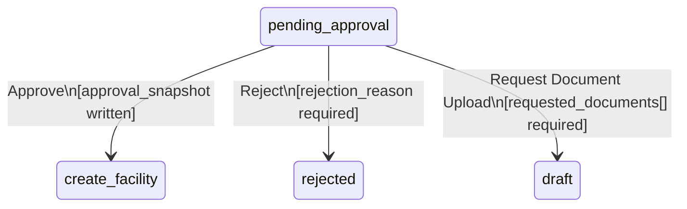

# Feature: Approval Decision

**Capability**: Application Approval — [CAPABILITY](../CAPABILITY.md)
**Product**: Onigiri — [PRODUCT](../../../PRODUCT.md)
**Engineering Owner**: TBD
**Status**: Spec

---

## User Story

As a **credit approver**, I want to Approve, Reject, or Request Document Upload on a loan application from the detail view, so that the application advances to the correct next state and my decision is permanently recorded.

## Job-to-be-Done

Close the loop between reviewing an application and acting on it. The decision panel is the only authorized path for a credit approval outcome — no back-door state transitions, no verbal decisions, no informal overrides. Every outcome is captured with full attribution.

---

## Acceptance Criteria

### General

1. The decision panel is rendered at the bottom of the Application Detail View.
2. The panel is active only when: the application is in `pending_approval` state AND the authenticated user's role exactly matches `required_approver_role`.
3. The panel is disabled (read-only with a status message) when: the application has already been decided by another approver, or the application has exited `pending_approval` for any other reason.
4. All three actions — Approve, Reject, Request Document Upload — are rendered as distinct, clearly labelled buttons. Destructive actions (Reject) are visually differentiated.
5. Before any action is confirmed, a confirmation modal displays a summary of the action and its consequence. The approver must explicitly confirm.

---

### Approve

6. The Approve action requires no additional input beyond the confirmation modal.
7. On confirmation, the system:
   a. Re-validates: application is still in `pending_approval` and `required_approver_role` matches the actor. If not, surface an error and abort.
   b. Writes the approval snapshot atomically to the application record:
      ```
      approval_snapshot: {
        approver_id:       <user ID>,
        approver_role:     <role>,
        risk_level:        <risk level at time of approval>,
        approved_loan_amount: <loan amount from Smart Form at time of approval>,
        approved_term_months: <term from Smart Form at time of approval>,
        approved_at:       <ISO 8601 timestamp>
      }
      ```
   c. Transitions state: `pending_approval` → `create_facility`.
   d. Emits `ApplicationApproved` event to DaVinci: `{ application_id, approver_id, approved_at }`.
   e. Writes to the workflow audit log: action `APPROVED`, actor, role, timestamp.
8. The approval snapshot is immutable once written. No update or override path exists.
9. On success, the approver is redirected to the Worklist. A success banner is shown: "Application [reference] approved."

---

### Reject

10. The Reject action requires the approver to enter a `rejection_reason` (free text, non-empty, max 500 characters) before confirmation.
11. On confirmation, the system:
    a. Re-validates: application is still in `pending_approval` and role matches. If not, surface an error and abort.
    b. Transitions state: `pending_approval` → `rejected`.
    c. Writes to the workflow audit log: action `REJECTED`, actor, role, rejection_reason, timestamp.
12. On success, the approver is redirected to the Worklist. A success banner is shown: "Application [reference] rejected."

---

### Request Document Upload

13. The Request Document Upload action requires the approver to specify at least one document type from a predefined list. Free-text notes are optional (max 500 characters).
14. Document type list is sourced from the campaign's document type configuration. An "Other / specify" free-text fallback is available.
15. On confirmation, the system:
    a. Re-validates: application is still in `pending_approval` and role matches. If not, surface an error and abort.
    b. Transitions state: `pending_approval` → `draft`.
    c. Writes to the workflow audit log: action `RETURNED_FOR_DOCUMENTS`, actor, role, `requested_documents[]`, notes, timestamp.
    d. Notifies the originating CO (mechanism TBD — in-app notification or Sensei task).
16. On success, the approver is redirected to the Worklist. A success banner is shown: "Application [reference] returned for document upload."

---

## Concurrent Decision Handling

17. If two approvers with the same role attempt to decide the same application simultaneously, the system uses an **optimistic lock** on the application record (version field).
    - The first successful write advances the state and increments the version.
    - The second write detects the version mismatch and returns an error: "This application has already been decided. Refreshing your view."
    - The second approver's decision panel is refreshed to show the decided state. No duplicate state transition occurs.

---

## Decision State Machine



---

## Edge Cases and Error States

| Condition | Expected Behavior |
|-----------|-------------------|
| Application exits `pending_approval` between page load and decision submission | Server rejects action; error message shown; decision panel disabled; page refreshed to current state |
| Approver role no longer matches `required_approver_role` at decision time (e.g., role changed mid-session) | Server rejects action; HTTP 403; user prompted to re-authenticate |
| Approval snapshot write succeeds but state transition fails | Roll back snapshot write; surface error; no partial state |
| State transition succeeds but `ApplicationApproved` event to DaVinci fails | Transition is committed (event is retried asynchronously); approver success flow is not blocked by event delivery |
| Reject submitted with empty rejection_reason | Client-side validation blocks submission; server also validates and returns 400 if bypassed |
| Request Document Upload submitted with no documents specified | Client-side validation blocks submission; server also validates and returns 400 if bypassed |

---

## Out of Scope

- Partial approval (approving a modified loan amount — the approval snapshot captures the Smart Form amount at the time of approval)
- Delegation or reassignment of the decision to another approver
- Bulk approval of multiple applications in a single action

---

## Dependencies

- Application Detail View must be rendered and the approver must be authenticated before the decision panel is active.
- Workflow State Machine Engine atomicity guarantee — all write + transition operations must be atomic.
- DaVinci integration for `ApplicationApproved` event (async retry acceptable).
- Notification mechanism to CO on Return for Documents (open — see CAPABILITY.md Open Question #2).
