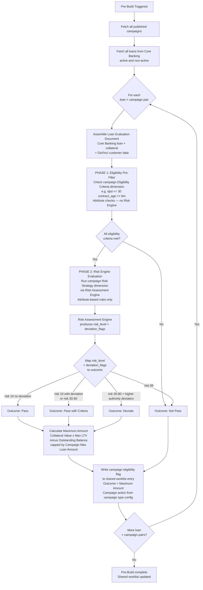
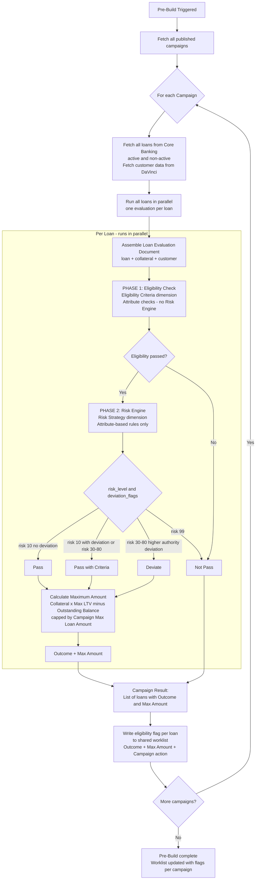

# Capability: Campaign Eligibility Pre-Build

**Product**: Onigiri — [PRODUCT](../../PRODUCT.md)
**Portfolio**: Credit
**Product Owner**: TBD (Credit PO)
**Status**: 📝 Draft
**Last Updated**: 2026-03-09

---

## Business Function

Run a batch eligibility scan across **all loans in Core Banking** (active and non-active) against **all published campaigns**. For each loan × campaign pair, evaluate the campaign's eligibility criteria and execute the campaign's Risk Strategy to produce: an outcome (Pass / Pass with Criteria / Deviate / Not Pass) and a Maximum Amount. Surface the results per loan on the shared worklist, showing Credit Officers which campaigns each loan is eligible for and what action is available.

The Pre-Build engine itself is campaign-type-agnostic — it only produces eligibility outcomes and maximum amounts. What the eligible campaign *does* (e.g., Topup Direct Charge, Topup New Contract, or any future campaign type) is defined entirely by the campaign configuration.

## Why It Exists (First Principles)

- **Proactive Offer Identification**: Many loan products are not customer-initiated. The business must identify which existing applications qualify for a given campaign before making an offer. Without a pre-build engine, CO teams must assess eligibility manually — which is unscalable and error-prone.
- **Campaign-Driven Eligibility**: The criteria for who qualifies for any campaign change per product launch. The pre-build engine reads from the campaign's configured eligibility rules — not from hardcoded logic — so that launching a new campaign does not require a code change.
- **Universal Scope**: Restricting pre-build to only active loans or only certain campaign types creates a maintenance problem as new campaign types are introduced. The engine must work generically across all loan states and all campaign types.
- **Outcome-Aware Worklist**: Not every eligible application has the same eligibility quality. The four-outcome classification (Pass / Pass with Criteria / Deviate / Not Pass) allows COs to prioritize and manage their pipeline per campaign.
- **Campaign Type as Config**: The Pre-Build does not decide what a campaign *does* — that is the campaign's responsibility. A campaign of type Topup Online (Direct Charge) defines that eligibility unlocks a contract amendment. A campaign of type Topup Offline (New Contract) defines that eligibility unlocks a new application. Future campaign types do not require Pre-Build changes.

---

## Feature Inventory

| Feature | Status | Description |
|---------|--------|-------------|
| Loan Evaluation Document Assembler | Concept | For each loan (active and non-active) in Core Banking, fetches loan data from Core Banking and customer data from DaVinci and assembles a normalized JSON document per loan. This document is the input context the Risk Assessment Engine resolves attribute values from during Pre-Build evaluation. |
| Campaign Eligibility Pre-Filter | Concept | For each published campaign, runs the campaign's mandatory eligibility rules (attribute-based, defined in Campaign Pre-Build Configuration) through the Risk Assessment Engine's Rule Evaluator against the Application Evaluation Document. Applications that fail any mandatory rule are immediately classified `Not Pass` for that campaign — the Risk Strategy is not run for them. |
| Risk Strategy Executor (Pre-Build) | Concept | For applications that pass the pre-filter for a given campaign, runs the campaign's assigned `strategy_id` via the Risk Assessment Engine against the Application Evaluation Document. Rules in the strategy reference Attribute Registry entries resolved from Core Banking + DaVinci. Produces: `risk_level` + `deviation_flags`. |
| Outcome Classifier | Concept | Maps `risk_level` + `deviation_flags` from the Risk Strategy output to the four Pre-Build outcomes using the campaign's configured threshold ranges. Produces one outcome per application per campaign. |
| Maximum Amount Calculator | Concept | Computes Maximum Amount using fields from the Application Evaluation Document (`collateral.appraised_value`, `loan.outstanding_balance`) and campaign Pricing config (`max_ltv`, `max_loan_amount`). Produces one Maximum Amount per application per campaign. |
| Campaign Eligibility Flag Writer | Concept | For each loan × campaign pair, writes the outcome and Maximum Amount as a flag on the loan's entry in the shared worklist. Loans may carry multiple flags — one per campaign evaluated. Pre-Build's responsibility ends here. |

---

## Business Rules

### Configuration Source

The Pre-Build reads directly from the campaign's existing dimensions (managed in Loan Campaign Configuration). There is no separate Pre-Build config store and no additional configuration dimension required for Pre-Build participation.

| Rule Set | Purpose | Configured In |
|----------|---------|---------------|
| Eligibility criteria | Pre-filter rules — application fails these → `Not Pass` immediately (Phase 1) | **Eligibility Criteria dimension** of the campaign — same dimension and rule format used by `new_booking` at application creation time |
| Risk Strategy | Four-outcome classification via Risk Assessment Engine (Phase 2) | **Risk Strategy dimension** of the campaign — same strategy assigned to the campaign |

> **Rule**: The Pre-Build can only run against **published** campaigns. Draft or archived campaigns are excluded from the scan.

> **Rule**: Each campaign defines its own Risk Strategy. Different campaigns apply different Risk Strategies to the same applications.

> **Rule**: The Eligibility Criteria dimension is shared across all campaign types. For `new_booking` it is evaluated at application creation time. For Pre-Build campaigns it is evaluated at Phase 1 of each pre-build run. The rule format and criteria builder are identical — only the evaluation timing differs.

### Loan Scope

| Rule | Description |
|------|-------------|
| All loans | Pre-Build scans **all loans in Core Banking** — both active and non-active. Active/non-active distinction is the responsibility of campaign eligibility criteria, not the engine. |
| All published campaigns | Every published campaign is evaluated in each pre-build run. The engine does not filter campaigns by type. |
| Cartesian evaluation | The result of a pre-build run is a matrix: every loan × every campaign pair produces one outcome and one Maximum Amount. |
| Re-run | Pre-build results must be refreshable — new runs update results for the same loan × campaign pair without creating duplicates. |

### Loan Evaluation Document

The Pre-Build has no Application JSON in DocumentDB to query against. JMESPath is not used in Pre-Build. Instead, the Loan Evaluation Document Assembler builds a per-loan JSON object that the Risk Assessment Engine resolves attribute values from — using the Attribute Registry (`source_type: attribute` rules only).

**Assembly sources:**

| Field Group | Source |
|-------------|--------|
| `loan.*` | Core Banking — loan record |
| `customer.*` | DaVinci — customer profile |
| `collateral.*` | Core Banking / DaVinci — collateral record linked to loan |

**Schema:**

```json
{
  "loan": {
    "contract_id": "string",
    "product_type": "car_title | land_title | personal",
    "outstanding_balance": "number",
    "accrued_interest": "number",
    "settlement_fee": "number",
    "dpd": "number",
    "tenor_months": "number",
    "interest_rate": "number",
    "contract_age_months": "number"
  },
  "customer": {
    "customer_id": "string",
    "customer_type": "new | existing",
    "age": "number",
    "nationality": "string",
    "occupation_group": "string",
    "b_score": "number"
  },
  "collateral": {
    "type": "car | land",
    "brand": "string",
    "appraised_value": "number",
    "appraisal_date": "date"
  }
}
```

> **Rule**: The Loan Evaluation Document is assembled once per loan per pre-build run and discarded after evaluation. It is not persisted.

### Evaluation Architecture

#### Why Pre-Build Uses Attribute Method Only

Pre-Build fetches **loans from Core Banking and customer data from DaVinci** — these are database records. They are not Onigiri application JSON documents stored in DocumentDB. There is no Application JSON for Pre-Build to query against, so JMESPath (which evaluates expressions against an Application JSON) is not applicable here.

The Risk Assessment Engine's **Attribute method** (`source_type: attribute`) is designed exactly for this: it reads named fields directly from a registered database source (Core Banking or DaVinci) at evaluation time. This is the only resolution method used in Pre-Build.

> **Rule**: All rules in a Pre-Build strategy must use `source_type: attribute`. `source_type: jmespath` is invalid in the Pre-Build context and is blocked at Campaign Builder publish time.

Pre-Build evaluation for each loan × campaign pair runs in two sequential phases. Both phases use attribute-based rules — attributes (`loan.dpd`, `customer.b_score`, `collateral.brand`, etc.) are registered in the **Attribute Registry** and resolved directly from Core Banking or DaVinci.

**Phase 1 — Eligibility Pre-Filter** (campaign's **Eligibility Criteria** dimension):
- Reads eligibility rules from the campaign's **Eligibility Criteria** dimension — the same dimension used by `new_booking` at application creation time
- Checks attribute values directly against the configured criteria (e.g., `dpd <= 30`, `contract_age >= 6m`, `collateral.type = car`)
- Attribute values fetched from Core Banking or DaVinci via Attribute Registry
- The Risk Engine is **not involved** in Phase 1 — this is a direct eligibility gate, not a strategy evaluation
- Any loan that fails any criterion is immediately classified `Not Pass` for this campaign — Phase 2 is skipped

**Phase 2 — Risk Engine Evaluation** (campaign's **Risk Strategy** dimension):
- Runs the campaign's Risk Strategy via the Risk Assessment Engine against the Application Evaluation Document
- All strategy rules use `source_type: attribute` — values fetched from Core Banking or DaVinci via Attribute Registry
- Produces: `risk_level` (integer) + `deviation_flags` (array)

### Four-Outcome Classification

Outcome per application per campaign is determined from the Risk Strategy output using the campaign's configured threshold ranges:

| Risk Level | Deviation Flags | Outcome |
|------------|----------------|---------|
| 10 | None | **Pass** |
| 10 | Any deviation flag present | **Pass with Criteria** |
| 30 – 80 | Any | **Pass with Criteria** |
| 30 – 80 | Deviation flag with `requires_higher_authority = true` | **Deviate** |
| 99 | Any | **Not Pass** |
| Any | Policy violation flag (`risk_level = 99`) | **Not Pass** |

> **Rule**: The risk level ranges and deviation rules above are the default mapping. Each campaign can configure its own outcome threshold ranges in the Pre-Build Configuration dimension.


| Outcome | Definition | Can Initiate Campaign Action? |
|---------|-----------|-------------------------------|
| **Pass** | Application meets all campaign eligibility criteria with no exceptions | Yes |
| **Pass with Criteria** | Application meets core eligibility criteria but one or more secondary conditions apply | Yes |
| **Deviate** | Application does not fully meet standard criteria but is within a configurable deviation tolerance; requires higher approval authority | Yes |
| **Not Pass** | Application fails one or more mandatory eligibility criteria; cannot proceed | No |

> **Rule**: Only flags with outcome `Pass`, `Pass with Criteria`, or `Deviate` are actionable on the shared worklist for that campaign. `Not Pass` entries are visible for reference but the campaign action is disabled.

### Maximum Amount

The Maximum Amount is calculated per application per campaign and displayed on the worklist flag. Calculation inputs:

| Input | Source |
|-------|--------|
| Current collateral appraised value | DaVinci / Core Banking |
| Outstanding loan balance | Core Banking |
| Campaign Max LTV | Campaign config — Pricing dimension |
| Campaign maximum loan amount cap | Campaign config — Pricing dimension |

```
Maximum Amount = min(
  (Collateral Value × Max LTV) - Outstanding Balance,
  Campaign Max Loan Amount
)
```


### Campaign Type and Actions

The Pre-Build engine returns only: outcome + Maximum Amount. What happens with an eligible result is defined entirely by the **campaign type** configured in Campaign Configuration. The Pre-Build does not determine, infer, or evaluate campaign type.

Current campaign types and their defined actions:

| Campaign Type | Who Acts | Channel | Description |
|---------------|----------|---------|-------------|
| **Topup Direct Charge** (`topup_direct_charge`) | Defined in campaign config | Defined in campaign config | Creates a new Onigiri application using the campaign's Application Template. At disbursement, Core Banking amends the existing loan contract (adds money to the same contract — no new contract created). |
| **Topup New Contract** (`topup_new_contract`) | CO | Shared worklist | CO-initiated from the shared worklist. Closes the old loan and opens a new one. The new loan proceeds are used to settle the old loan: settlement amount fetched from an external settlement service and deducted from new loan total. Net disbursement to customer = new loan amount − settlement amount. A full Onigiri application (Draft → ... → Funded) is created using the campaign's Application Template. |
| **[Future campaign types]** | Defined in campaign config | Defined in campaign config | Pre-Build requires no change to support new campaign types — eligibility evaluation is campaign-type-agnostic. |

> **Rule**: Campaign type is defined in Campaign Configuration, not derived by the Pre-Build engine. Adding a new campaign type requires no Pre-Build changes.

> **Rule**: Both Topup Direct Charge and Topup New Contract create a new Onigiri application. The difference is at the Core Banking contract level: Direct Charge amends the existing contract; New Contract closes the old loan and opens a new one.

> **Rule**: For Topup New Contract — settlement of the old loan uses funds from the new loan. The settlement payment amount is obtained from an external settlement service and deducted from the total new loan amount before disbursement. Net disbursement to customer = new loan total − settlement amount.

### Worklist Rules

Pre-Build results surface as campaign eligibility flags on application entries in the **shared worklist** (the same list COs use for all applications). No separate worklist is created. Each application may carry multiple flags — one per campaign where a result exists.

| Rule | Description |
|------|-------------|
| Shared worklist | Pre-Build results appear as flags on existing application entries — not in a separate view |
| Multiple flags per application | An application may be eligible (or not) for multiple campaigns simultaneously. Each campaign's result appears as a separate flag on the same application entry. |
| Flag visible on all applications | Every application entry shows its campaign eligibility flags. If Pre-Build has not been run, the flag is blank. If outcome is `Not Pass`, the flag shows outcome only — no action available. |
| Outcome displayed | Flag shows outcome clearly: Pass / Pass with Criteria / Deviate / Not Pass |
| Campaign action displayed | For actionable outcomes: flag shows the action the campaign type enables (e.g., "Topup Online — Direct Charge", "Topup Offline — New Contract") |
| Maximum Amount displayed | For actionable outcomes: flag shows computed Maximum Amount |
| Initiate action | Depends on campaign type. For `topup_new_contract`: CO clicks initiate — `campaign_id` resolves the Application Template, pricing, risk strategy, and workflow steps automatically. For `topup_direct_charge`: no CO action — flag is informational only; the offer is surfaced to the customer in the mobile app and the customer initiates Direct Charge themselves. `Not Pass` flags are read-only with no action for any campaign type. |
| CO access | Only COs with access to the relevant branch/region can see and act on worklist entries |

---

## Pre-Build Evaluation Flow



---

## Pre-Build Execution View — Per Campaign with Parallel Loan Evaluation

The flow below shows how the engine executes in practice: the outer loop is **per campaign**. For each campaign, all loans are evaluated **in parallel**. The output per campaign is a list of loans with their outcome and Maximum Amount, which is then written as flags on the shared worklist.



---

## NFRs

| NFR | Requirement |
|-----|-------------|
| Campaign-config-driven | Eligibility criteria are read from the published campaign config — no hardcoded rules in the Pre-Build engine |
| Campaign-type-agnostic | Pre-Build produces only outcome + Maximum Amount. Campaign type and available actions are defined in campaign config — adding a new campaign type requires no Pre-Build changes. |
| Universal loan scope | Pre-Build scans all loans in Core Banking (active and non-active) — filtering by loan state is the responsibility of campaign eligibility criteria |
| Idempotent re-run | Re-running pre-build updates existing results for the same loan × campaign pair; does not create duplicate worklist flags |
| Maximum Amount always displayed | Every actionable worklist flag must show Maximum Amount; a missing value is a system error, not a display omission |
| Flag non-destructive | Adding a campaign eligibility flag to a worklist entry must not alter or reorder the entry's existing data or display |
| Attribute-based evaluation only | All Pre-Build rules must use `source_type: attribute`. Pre-Build fetches loans from Core Banking + customer data from DaVinci (database records) — there is no Onigiri Application JSON to query. JMESPath is inapplicable and blocked at Campaign Builder publish time. |

---

## Open Questions

- What triggers a pre-build run: scheduled batch, manual trigger by branch manager, or campaign publication event?
- How long are pre-build results valid before they must be refreshed (e.g., collateral value may change, customer b_score may change)?
- If a loan is eligible for multiple campaigns of the same type simultaneously, how are conflicts presented on the worklist?
- Does `Pass with Criteria` communicate the specific conditions to the CO on the worklist flag, or just the label?
- For Topup New Contract: what is the exact external settlement service API contract? Is settlement amount fetched at pre-build time or at disbursement time?
- For Topup Direct Charge: what is the Core Banking API contract for contract amendment? Is it a PATCH on the existing loan resource or a dedicated endpoint?
- For Topup Direct Charge: does the amended contract retain its original tenor and interest rate, or are these updated as part of the amendment?
- For Topup Direct Charge: does the Direct Charge require any approval step within Onigiri, or is it fully automated once the customer initiates?
