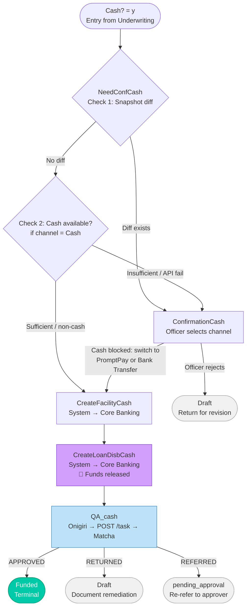

# Capability: Cash Disbursement

**Parent Product**: [Onigiri — Loan Origination System](../../PRODUCT.md)
**Product Owner**: Engineering
**Status**: Draft
**Last Updated**: 2026-03-31

---

## Business Function

Orchestrate the cash loan disbursement path from the point the application is routed as cash (`Cash?=y`) through a conditional officer confirmation, two sequential Core Banking execution commands (Create Facility, Create Loan + Disbursement), and a mandatory post-disbursement QA review before the application reaches the `Funded` terminal state.

This capability is the cash-specific counterpart to [Disbursement Orchestration](../disbursement-orchestration/CAPABILITY.md), which owns the non-cash path. The two capabilities are deliberately separate because the cash path inverts the sequencing of QA and disbursement — funds leave the institution before compliance verification, which carries a distinct operational risk profile, set of business rules, and actor responsibilities.

---

## Capability Boundary

**This capability IS responsible for:**
- Evaluating whether officer confirmation is required before fund release (`NeedConfCash` gate)
- Processing officer confirmation or bypass for the cash path (`ConfirmationCash`)
- Issuing the Create Facility command to Core Banking and advancing state (`CreateFacilityCash`)
- Issuing the Create Loan + Disbursement command to Core Banking and advancing state (`CreateLoanDisbCash`)
- Post-disbursement QA review and routing to `Funded` or back to `Draft` (`QA_cash`)

**This capability IS NOT responsible for:**
- The `Cash?` routing decision — owned by [Underwriting Workflow](../underwriting-workflow/CAPABILITY.md)
- Non-cash path post-document-verification states — owned by [Disbursement Orchestration](../disbursement-orchestration/CAPABILITY.md)
- Confirmation logic for the non-cash path (`waiting_for_confirmation`) — owned by [Disbursement Orchestration](../disbursement-orchestration/CAPABILITY.md)
- Core Banking API contracts — defined in [ARCHITECTURE.md](../../ARCHITECTURE.md)
- Disbursement channel lockpoint enforcement — governed by [PRODUCT.md Cross-Capability Integrity Rules](../../PRODUCT.md)

---

## Feature Inventory

| Feature | Status | Description |
|---------|--------|-------------|
| [Approval Snapshot](features/FEATURE_approval-snapshot.md) | Concept | Capture full application JSON snapshot when application enters `Approval` state. Stored as immutable `approval_snapshot` on the application record. Consumed by Cash Confirmation Gate for field-level diff. |
| [Cash Confirmation Gate](features/FEATURE_cash-confirmation-gate.md) | Concept | Diff `approval_snapshot` against current application JSON on entry to `NeedConfCash`. Any field change OR cash insufficiency → require officer confirmation (`ConfirmationCash`). Both conditions clear → bypass to `CreateFacilityCash`. |
| [Payment Channel Selection](features/FEATURE_payment-channel-selection.md) | Concept | Officer selects disbursement channel (Cash / PromptPay / Bank Transfer) at `ConfirmationCash`. When Cash is blocked due to insufficient balance, officer is forced to select an alternative channel to proceed. |
| [Branch Cash Availability Check](features/FEATURE_branch-cash-availability-check.md) | Concept | On entry to `NeedConfCash` with Cash channel: system checks live branch cash balance. If `disbursement_amount > available_cash` → route to `ConfirmationCash` (cannot bypass). Cash option blocked; officer must switch to PromptPay or Bank Transfer. |
| [Cash Facility & Loan Disbursement](features/FEATURE_cash-facility-loan-disbursement.md) | Concept | Issue Create Facility command to Core Banking, then issue Create Loan + Disbursement command. Both are system-executed, sequential, and guarded by idempotency controls. |
| [Post-Disbursement QA](features/FEATURE_post-disbursement-qa.md) | Concept | On entry to `QA_cash`, Onigiri submits a document verification task to Matcha. Matcha callback routes: `APPROVED` → `Funded`; `RETURNED` → `Draft` (document remediation); `REFERRED` → `pending_approval` (re-approval). Post-disbursement — funds already released. |

---

## Business Rules

### Decision Table 1: Confirmation Gate (`NeedConfCash`)

Two sequential checks on entry to `NeedConfCash`. Bypass to `CreateFacilityCash` requires **both** to pass. Either failing condition routes to `ConfirmationCash`.

**Check 1 — Snapshot Diff**

| Condition | Result |
|-----------|--------|
| `Diff(approval_snapshot, current JSON)` = empty | Pass ✓ |
| `Diff(approval_snapshot, current JSON)` ≠ empty | Fail → `ConfirmationCash` |
| `approval_snapshot` missing or null | Fail → `ConfirmationCash` (fail safe) |

**Check 2 — Branch Cash Availability** *(evaluated only when Check 1 passes)*

| Condition | Result |
|-----------|--------|
| `disbursement_channel` ≠ Cash | Pass ✓ (check skipped) |
| `disbursement_channel` = Cash AND `available_cash ≥ disbursement_amount` | Pass ✓ |
| `disbursement_channel` = Cash AND `available_cash < disbursement_amount` | Fail → `ConfirmationCash` (Cash blocked; officer must switch channel) |
| Branch Management API error or timeout | Fail → `ConfirmationCash` (fail safe) |

**Bypass:** Only when Check 1 = Pass AND Check 2 = Pass → advance to `CreateFacilityCash`.

> **Key behaviour:** Cash insufficiency routes to `ConfirmationCash` **even when there are zero field changes since approval**. The officer is forced to select PromptPay or Bank Transfer — the Cash option is disabled at `ConfirmationCash` until balance is replenished.

---

### Decision Table 2: Cash Confirmation Outcomes (`ConfirmationCash`)

Triggered by loan officer action in `ConfirmationCash` state.

| Actor | Action | Condition | Outcome | Target State |
|-------|--------|-----------|---------|--------------|
| Loan Officer | Confirm disbursement | — | Proceed with cash disbursement | `CreateFacilityCash` |
| Loan Officer | Reject / cancel | — | Return application for revision | `Draft` |
| System | Timeout | No officer action within SLA | Escalate / auto-expire | TBD (Open Question 5) |

> ~~**Open Question 2:** Who is the actor for cash confirmation — the originating loan officer, a supervisor, or either?~~ **Resolved 2026-03-31:** Actor is the **Loan Officer**.

---

### Decision Table 3: Post-Disbursement QA Outcomes (`QA_cash`)

On entry to `QA_cash`, Onigiri submits a document verification task to **Matcha** (`POST /task`). Routing is driven by Matcha's callback — the same integration pattern as `pending_document_checking` in the non-cash path, but with different target states because disbursement has already occurred.

| Actor | Matcha Outcome | Condition | Outcome | Target State |
|-------|---------------|-----------|---------|--------------|
| Matcha (callback) | `APPROVED` | Documents verified and compliant | Loan formally active | `Funded` |
| Matcha (callback) | `RETURNED` | Documents missing or deficient | Return for document remediation | `Draft` |
| Matcha (callback) | `REFERRED` | Requires human re-assessment | Re-refer to approver | `pending_approval` |

> **Note:** QA in the cash path is **post-disbursement**. Funds have already left the institution. A `RETURNED` or `REFERRED` outcome does not recall funds — it triggers document remediation or re-approval on the application record only.

> ~~**Open Question 4:** What is the QA checklist?~~ **Resolved 2026-03-31:** `QA_cash` is a Matcha document verification step — same integration as non-cash path. Matcha owns the verification logic and checklist.

---

## User Flow

> **Key:** Purple = Core Banking execution step. Blue = Matcha integration step. Green = terminal state. Funds are released at `CreateLoanDisbCash` — all subsequent steps are post-disbursement.

---

## Non-Functional Requirements

| NFR | Requirement | Rationale |
|-----|-------------|-----------|
| **Idempotency — Create Loan + Disbursement** | Hard block: if `Create Loan + Disbursement` HWM is already set, the step MUST NOT re-execute regardless of reason | Double disbursement is an irreversible financial loss. Defense-in-depth layer in addition to HWM channel lock. |
| **Idempotency — Create Facility** | Skip guard: if facility ID already exists for this application, return existing ID without creating a new one | Facility is idempotent; duplicate creation is safe but wasteful and creates orphaned records. |
| **Atomicity** | HWM update and state transition must be written in a single PG transaction per state entry | Prevents state/HWM divergence on partial failure. |
| **Auditability** | All Core Banking request/response payloads must be stored (MongoDB) before returning 200 OK to the state machine | Provides full evidence trail for dispute resolution on cash disbursements. |
| **QA Dwell Monitoring** | Alert if application remains in `QA_cash` beyond the defined SLA (value TBD) | QA stalls on cash loans are high-risk: loan is active but paperwork is incomplete. |
| **Confirmation Timeout** | Alert if application remains in `ConfirmationCash` beyond SLA (value TBD) | Unconfirmed cash disbursements represent a blocked branch operation. |
| **Cash balance — live only** | Branch cash balance must be fetched live from Branch Management API at each `NeedConfCash` evaluation and each Refresh action. No cached balance permitted. | A stale balance could allow a disbursement that exceeds actual cash. |
| **Cash check — server-side enforced** | The `disbursement_amount > available_cash` block must be evaluated and enforced by the server-side execution step, not UI logic alone. | UI-only blocks can be bypassed. The block must hold even on direct API calls. |
| **Cash API fail-safe** | If the Branch Management API returns an error or times out, treat as insufficient — route to `ConfirmationCash`. Never bypass on API uncertainty. | Conservative default prevents over-disbursement on infrastructure failures. |

---

## Open Questions

1. ~~**What defines "variance" in the NeedConfCash gate?**~~ **Resolved 2026-03-31:** Trigger is any field diff vs. `approval_snapshot`. No tolerance threshold. See Decision Table 1.
2. ~~**Who is the confirmation actor for cash?**~~ **Resolved 2026-03-31:** Actor is the **Loan Officer**.
3. **What is the Core Banking API contract for Create Loan + Disbursement (cash)?** Request payload, response schema, error codes, timeout SLA, auth mechanism. Needed before `FEATURE_cash-facility-loan-disbursement` can advance to Spec.
4. ~~**What is the authoritative QA checklist for cash loans?**~~ **Resolved 2026-03-31:** `QA_cash` is a Matcha document verification step. Matcha owns the checklist and verification logic.
5. **What is the SLA and escalation path for ConfirmationCash timeout?** Does the application auto-expire, auto-reject, or escalate to a supervisor queue?
6. **Recovery path if Create Loan + Disbursement fails in Core Banking?** Hard block idempotency means retry is not automatic. Does an operator manually intervene? Is there a supervisor unlock flow?
7. **Branch Management API contract for cash balance check.** Endpoint, request (branch ID), response schema (`available_cash`, `currency`, `as_of`), error codes, timeout SLA, auth mechanism. Needed before `FEATURE_branch-cash-availability-check` can advance to Spec.
