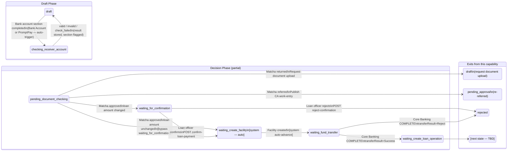

# Capability: Disbursement Orchestration

**Product**: Onigiri — [PRODUCT](../../PRODUCT.md)
**Portfolio**: Credit
**Product Owner**: TBD (Credit PO)
**Status**: 📝 Draft — @FEATURE decomposition in progress
**Last Updated**: 2026-03-04

---

## Business Function

Receive external system callbacks that confirm document verification approval and fund transfer success, and advance the loan application through the final pre-disbursement states — from post-document-verification through fund transfer confirmation to loan operation creation readiness.

## Why It Exists (First Principles)

- **Observable Progress**: Business stakeholders must distinguish "documents approved" from "funds transferred" from "loan operation created." These are three discrete business events, each representing a commitment from a different external system. Collapsing them into a single opaque state hides failure points and makes SLA measurement impossible.
- **Separation of Concerns**: Post-document-verification orchestration involves distinct external dependencies (Core Banking fund transfer) that are entirely separate from underwriting logic. Conflating this with the Underwriting Workflow capability would blur the capability boundary and misattribute ownership.
- **Auditability**: Each external callback represents a financial commitment. The transitions triggered by these callbacks must be atomic, idempotent, and independently auditable — properties that are easier to guarantee when the capability owns a narrow, well-defined state scope.

---

## Feature Inventory

| Feature | Status | Description |
|---------|--------|-------------|
| [Receiver Account Pre-Check](features/FEATURE_receiver-account-pre-check.md) | Concept | Validates receiver bank account via bank API when the bank account section is completed in draft. Gates submission on a valid result. |
| [Matcha Callback Handler](features/FEATURE_matcha-callback-handler.md) | Concept | Handles all three Matcha outcomes from `pending_document_checking`: `approved` → `waiting_for_confirmation` or `waiting_fund_transfer` (bypass if amount unchanged); `returned` → `draft` (request document upload); `referred` → `pending_approval`. Matcha callbacks are no-ops once the application is past `pending_document_checking`. |
| [Fund Transfer Callback Handler](features/FEATURE_fund-transfer-callback-handler.md) | Concept | Loan officer Confirm → `waiting_create_facility` (system auto) → `waiting_fund_transfer`; Loan officer Reject → `rejected`. Core Banking `COMPLETE` callback routes to `waiting_create_loan_operation` (Success) or `rejected` (Reject). |

---

## Business Rules

### Decision Table 1: Matcha Initial Callback Routing

Applies when: application is in state `pending_document_checking`.

| Current State | `outcome` | `isReDecision` | Loan Amount Changed? | Action |
|---|---|---|---|---|
| `pending_document_checking` | `approved` | `false` | Yes | Transition → `waiting_for_confirmation`. Store payload in MongoDB. |
| `pending_document_checking` | `approved` | `false` | No | Bypass `waiting_for_confirmation`. Transition → `waiting_fund_transfer`. Store payload in MongoDB. |
| `pending_document_checking` | `returned` | `false` | — | Transition → `draft`. Request document upload. Store payload in MongoDB. |
| `pending_document_checking` | `referred` | `false` | — | Transition → `pending_approval`. Publish CA work-entry via Raijin (processId=3, CA role). Store payload in MongoDB. |
| Any state ≠ `pending_document_checking` | any | `false` | — | No-op. Store payload in MongoDB for audit. Return 200 OK. |

> **Loan amount changed** means the disbursement amount at `pending_document_checking` entry differs from the approved disbursement amount stored at the `pending_approval` → `create_facility` transition. The exact comparison field must be defined before this table can advance from Concept → Spec.

---

### Decision Table 2: Loan Officer Actions from `waiting_for_confirmation`

Applies when: application is in state `waiting_for_confirmation`. The only actors who can advance or exit this state are authorised loan officers. Matcha callbacks received while the application is in this state are no-ops — Matcha has no authority over state transitions once the application has passed document verification.

| Current State | Action | Trigger | Immediate Next State | Notes |
|---|---|---|---|---|
| `waiting_for_confirmation` | Confirm | Loan officer calls `POST /applications/{id}/confirm-loan-payment` | `waiting_create_facility` | System state — no human action required. System auto-advances to `waiting_fund_transfer` on completion. |
| `waiting_for_confirmation` | Reject | Loan officer calls `POST /applications/{id}/reject-confirmation` | `rejected` | Terminal state. |
| `waiting_for_confirmation` | Any Matcha callback | Matcha POSTs any callback | — | No-op. Store payload in MongoDB for audit. Return 200 OK. |

---

### Decision Table 3: Core Banking Fund Transfer Callback Routing

Applies when: Core Banking POSTs a `COMPLETE` fund transfer callback to Onigiri. The callback envelope always has `status=COMPLETE`; the routing decision is made on the `transferResult` field.

| Current State | CB `status` | CB `transferResult` | Action |
|---|---|---|---|
| `waiting_fund_transfer` | `COMPLETE` | `Success` | Transition → `waiting_create_loan_operation`. Store payload in MongoDB. Return 200 OK. |
| `waiting_fund_transfer` | `COMPLETE` | `Reject` | Transition → `rejected`. Store payload in MongoDB. Return 200 OK. |
| `waiting_fund_transfer` | `COMPLETE` | any other value | Reject. Response: 400. No state change. Flag in monitoring. |
| Any state ≠ `waiting_fund_transfer` | any | any | No-op. Store payload in MongoDB for audit. Return 200 OK. |

---

## State Flow Diagram

---

## NFRs

| NFR | Requirement |
|-----|-------------|
| Transition atomicity | Each callback-triggered state transition is written to RDS in a single PG transaction. Partial transitions must not be recorded. MongoDB payload write may be in a separate transaction but must complete before returning 200. |
| Idempotency | Duplicate callbacks (same Matcha `taskUuid` + completion event ID; same Core Banking transfer reference ID) must be detected and no-op'd. Returns 200 OK. Idempotency key stored in RDS alongside transition record. |
| Auditability | Every callback payload (including no-op and failure cases) must be stored in MongoDB. RDS transition log records: actor = system, trigger = callback type, external reference ID, timestamp. |
| Callback failure tolerance | Onigiri returns 5xx only for genuine internal processing failures. State mismatches, idempotent duplicates, and out-of-scope callbacks all return 200 OK to prevent external systems from entering retry loops on non-retriable conditions. |
| Failure state visibility | A Core Banking `failure` result received while in `waiting_fund_transfer` must produce an observable alert. The application must not silently remain in `waiting_fund_transfer` without operator visibility. Alert mechanism TBD (see Open Questions). |

---

## Open Questions

1. **What triggers the fund transfer?** The user story for `FEATURE_fund-transfer-callback-handler` covers receiving the callback. It is not yet specified whether Onigiri initiates the fund transfer call to Core Banking on entering `waiting_fund_transfer`, or whether an external actor (e.g., a branch officer action in Sensei) triggers it. This must be resolved before this capability can advance from Concept → Spec.

2. **What is the next state after `waiting_create_loan_operation`?** Based on the existing PRODUCT.md state machine, the downstream path likely involves a QA or Confirmation step before `funded`. The exact target state and the cash/non-cash path split (if it applies here) must be defined. This is the primary open question blocking full specification of this capability.

3. **Recovery path for Core Banking fund transfer failure.** If Core Banking returns `failure`, what is the operator recovery action? Can the transfer be retried without restarting the application? Is there a maximum retry count? Does the application revert to a prior state or stay in `waiting_fund_transfer`? The alerting mechanism is also undefined.

4. **Timeout on `waiting_fund_transfer`.** If Core Banking does not callback within N hours/days, should the application be auto-escalated or expired? If yes, the timeout value and escalation target must be defined (similar to Draft state auto-expiry).
