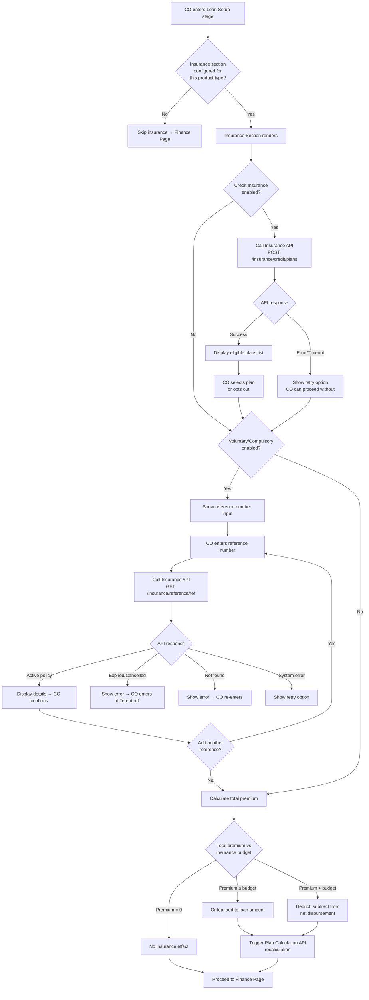
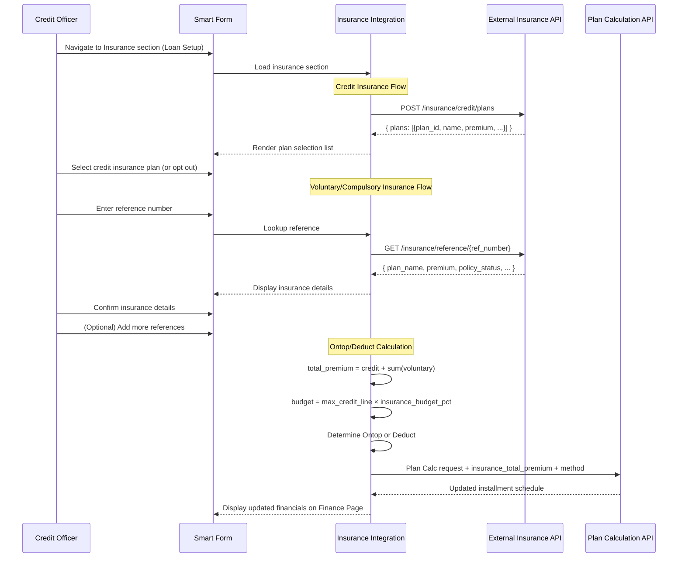
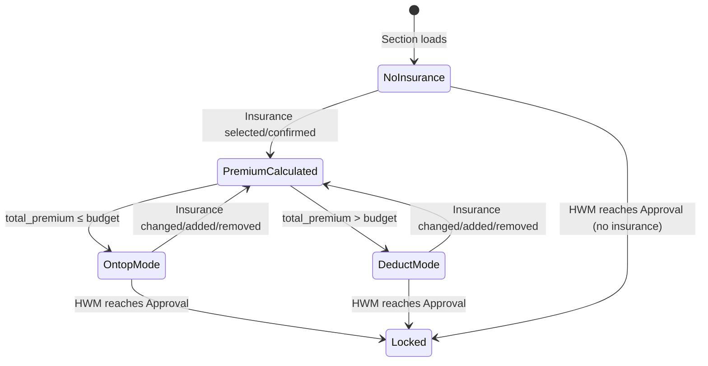

# Capability: Insurance Integration

**Product**: Onigiri — [PRODUCT](../../PRODUCT.md)
**Portfolio**: Credit
**Product Owner**: TBD (Credit PO)
**Status**: 📝 Draft
**Last Updated**: 2026-03-30

---

## Business Function

Orchestrate insurance plan selection during the Smart Form Loan Setup stage — including credit insurance plan retrieval from an external insurance system and voluntary/compulsory insurance reference lookup — compute premium impact on loan financials using Ontop/Deduct logic, and pass insurance data to the Plan Calculation API for final loan computation.

## Why It Exists (First Principles)

- **Regulatory and Business Requirement**: Many loan products bundle credit insurance or require customers to hold voluntary/compulsory insurance (e.g., vehicle insurance). Insurance premium is a core financial input that directly changes what the customer borrows or receives.
- **Two Acquisition Flows**: Credit insurance is selected within Onigiri (internal), while voluntary/compulsory insurance is purchased externally and linked by reference number. These distinct flows require dedicated orchestration.
- **Loan Calculation Impact**: Insurance premium either increases the loan amount (Ontop) or reduces net disbursement (Deduct), determined by a campaign-level budget threshold. This logic must execute before the Plan Calculation API computes installment schedules.

## Why a Separate Capability

| Existing Capability | Why Insurance Does Not Belong There |
|---|---|
| **Smart Form** | Smart Form owns form structure and field rendering. Insurance involves external API calls, Ontop/Deduct business logic, and dynamic plan lists — beyond form composition. |
| **Campaign Configuration** | Campaign Config owns static campaign parameters. The `insurance_budget_pct` parameter belongs there, but runtime selection logic, API integration, and premium calculation do not. |
| **Disbursement Orchestration** | Disbursement owns post-approval states. Insurance selection happens during Draft/Loan Setup, before submission. |

---

## Capability Boundary

**IS responsible for:**
- Rendering insurance selection UI within Smart Form Loan Setup stage
- Calling external insurance API to retrieve eligible credit insurance plans
- Calling external insurance API with reference number to retrieve voluntary/compulsory insurance details
- Ontop/Deduct premium calculation logic
- Passing insurance premium data to Plan Calculation API (via Smart Form Finance Page integration)
- Persisting selected insurance data in the application JSON (DocumentDB)

**IS NOT responsible for:**
- Insurance plan catalog management (owned by **External Insurance System**)
- Policy issuance or policy lifecycle (owned by **External Insurance System**)
- Campaign-level insurance budget configuration (owned by **Campaign Configuration** — new `insurance_budget_pct` parameter)
- Smart Form field rendering engine (owned by **Smart Form**)
- Plan Calculation API installment computation (owned by **external Plan Calculation service**)
- Defining which insurance types are available per product type (owned by **Product Type Configuration** — new insurance enablement flags)

---

## Feature Inventory

| Feature | Status | Description |
|---------|--------|-------------|
| [Credit Insurance Plan Retrieval](features/FEATURE_credit-insurance-plan-retrieval.md) | Concept | Call external insurance API with loan context to retrieve eligible credit insurance plans; CO selects or opts out |
| [External Insurance Reference Lookup](features/FEATURE_external-insurance-reference-lookup.md) | Concept | CO enters reference number from external insurance purchase; system looks up policy details via API; supports multiple references |
| [Insurance Premium Ontop/Deduct Calculator](features/FEATURE_insurance-premium-ontop-deduct-calculator.md) | Concept | Core business logic: compare total insurance premium against campaign budget (max_credit_line × insurance_budget_pct) to determine Ontop or Deduct |
| [Insurance Section in Smart Form](features/FEATURE_insurance-section-smart-form.md) | Concept | New section in Loan Setup stage with Credit Insurance sub-section (plan picker) and Voluntary/Compulsory sub-section (reference input, multi-reference) |
| [Insurance Data Pass-through to Plan Calculation](features/FEATURE_insurance-plan-calculation-passthrough.md) | Concept | Include insurance premium + Ontop/Deduct designation in Plan Calculation API request; trigger recalculation on insurance change |

---

## Business Rules

### Two Insurance Types

| Type | Source | Selection Method | Multiplicity |
|------|--------|-----------------|-------------|
| **Loan Credit Insurance** | External Insurance API | CO selects from fetched eligible plans list | One plan (or opt out) |
| **Voluntary / Compulsory Insurance** | External website → reference number → API lookup | CO enters reference number, system validates and retrieves details | Multiple references allowed |

Both types can coexist on a single application. Credit insurance is **optional** — CO can skip even if enabled for the product type.

### Ontop/Deduct Decision Table

The calculation method is determined by comparing total insurance premium against the campaign's insurance budget.

**Formula:**
```
insurance_budget = max_credit_line × insurance_budget_pct
total_premium = credit_insurance_premium + SUM(voluntary_compulsory_premiums[])
```

| Condition | Result | Effect on Loan |
|---|---|---|
| `total_premium ≤ insurance_budget` | **Ontop** | Premium added to total loan amount — customer borrows more |
| `total_premium > insurance_budget` | **Deduct** | Premium subtracted from net disbursement — customer receives less |
| `total_premium == 0` | No effect | No insurance impact on calculation |

**Worked Examples:**

| Campaign `max_credit_line` | `insurance_budget_pct` | Insurance Budget | Credit Ins Premium | Vol/Comp Premiums | Total Premium | Result |
|---|---|---|---|---|---|---|
| 500,000 | 10% | 50,000 | 20,000 | 10,000 | 30,000 (≤ 50,000) | **Ontop** — loan amount += 30,000 |
| 500,000 | 10% | 50,000 | 40,000 | 25,000 | 65,000 (> 50,000) | **Deduct** — net disbursement -= 65,000 |
| 300,000 | 15% | 45,000 | 0 (opted out) | 45,000 | 45,000 (≤ 45,000) | **Ontop** — loan amount += 45,000 |
| 300,000 | 10% | 30,000 | 0 | 0 | 0 | No effect |

### Insurance API Call Triggers

| Insurance Type | Trigger Event | API Endpoint | Request | Response |
|---|---|---|---|---|
| Credit Insurance | CO enters insurance section | `POST /insurance/credit/plans` | `{ loan_amount, customer_id, collateral_type, campaign_id }` | `{ plans[]: { plan_id, name, premium, coverage_amount, coverage_term, insurer_name } }` |
| Voluntary/Compulsory | CO enters reference number + clicks "Look up" | `GET /insurance/reference/{ref_number}` | Reference number in path | `{ reference_number, plan_name, premium, coverage_amount, coverage_term, expiry_date, insurer_name, policy_status }` |

### Reference Lookup Validation

| API Response | `policy_status` | Action |
|---|---|---|
| 200 OK | `active` | Display details → CO confirms → premium added to calculation |
| 200 OK | `expired` | Error: "กรมธรรม์หมดอายุแล้ว" — CO cannot use this reference |
| 200 OK | `cancelled` | Error: "กรมธรรม์ถูกยกเลิกแล้ว" — CO cannot use this reference |
| 404 Not Found | — | Error: "ไม่พบหมายเลขอ้างอิง กรุณาตรวจสอบ" — CO re-enters |
| 5xx / timeout | — | Error: "ระบบไม่สามารถตรวจสอบได้ กรุณาลองใหม่" — CO retries |

### Insurance Visibility per Product Type

Product Type Configuration controls which insurance sub-sections appear:

| `credit_insurance` | `voluntary_insurance` | Credit Insurance Sub-section | Voluntary/Compulsory Sub-section |
|---|---|---|---|
| `enabled` | `enabled` | Visible | Visible |
| `enabled` | `disabled` | Visible | Hidden |
| `disabled` | `enabled` | Hidden | Visible |
| `disabled` | `disabled` | Hidden | Hidden |

### Insurance Field Lockpoints

Insurance fields participate in the existing Smart Form lockpoint system:

| HWM Reached | Insurance Fields Status |
|---|---|
| Before `Approval` | Fully editable — CO can change plans, add/remove references |
| `Approval` or higher | **Locked** — all insurance selections frozen (credit plan + all voluntary/compulsory references) |

**Rationale:** Insurance premiums affect loan amount (Ontop) or disbursement (Deduct). These were reviewed and authorized by the credit authority at Approval. Post-approval changes would bypass that authorization.

---

## Integration Contract

### External Insurance System (New Integration)

**Onigiri SENDS to External Insurance System:**

| Endpoint | Method | Request Payload | When |
|---|---|---|---|
| `/insurance/credit/plans` | POST | `{ loan_amount, customer_id, collateral_type, campaign_id }` | CO enters Credit Insurance sub-section |
| `/insurance/reference/{ref_number}` | GET | Reference number in URL path | CO clicks "Look up" after entering reference number |

**Onigiri RECEIVES from External Insurance System:**

| Endpoint | Response Payload |
|---|---|
| `/insurance/credit/plans` | `{ plans[]: { plan_id, name, premium, coverage_amount, coverage_term, insurer_name, insurer_code } }` |
| `/insurance/reference/{ref_number}` | `{ reference_number, plan_name, premium, coverage_amount, coverage_term, expiry_date, insurer_name, policy_status }` |

### Plan Calculation API (Existing Integration — Extended)

Insurance data is added to the existing Plan Calculation API request:

| New Field | Type | Description |
|---|---|---|
| `insurance_total_premium` | decimal | Sum of all insurance premiums |
| `insurance_method` | enum: `ontop` / `deduct` / `none` | Ontop/Deduct designation |
| `insurance_items[]` | array | Breakdown: `{ type, plan_id, plan_name, premium, source }` |

---

## Application JSON Schema (Insurance Section)

Insurance data is stored in the application JSON document alongside other Smart Form sections:

```json
{
  "insurance": {
    "credit_insurance": {
      "selected": true,
      "plan_id": "CI-2026-001",
      "plan_name": "สินเชื่อคุ้มครอง แผน A",
      "premium": 15000,
      "coverage_amount": 500000,
      "coverage_term": 12,
      "insurer_name": "บริษัท ประกันภัย จำกัด",
      "source": "insurance_api",
      "fetched_at": "2026-03-30T10:15:00Z"
    },
    "voluntary_compulsory": [
      {
        "reference_number": "VOL-2026-12345",
        "plan_name": "ประกัน พ.ร.บ. รถจักรยานยนต์",
        "premium": 645,
        "coverage_amount": 100000,
        "coverage_term": 12,
        "expiry_date": "2027-03-30",
        "insurer_name": "บริษัท ประกันวินาศภัย จำกัด",
        "policy_status": "active",
        "source": "insurance_api_ref",
        "confirmed_at": "2026-03-30T10:20:00Z"
      }
    ],
    "calculation": {
      "total_premium": 15645,
      "insurance_budget": 50000,
      "method": "ontop",
      "calculated_at": "2026-03-30T10:20:30Z"
    }
  }
}
```

---

## Mermaid Diagrams

### Insurance Selection Flow



### Insurance API Integration Sequence



### Ontop/Deduct State Diagram



---

## Cross-Capability Dependencies

| Capability | Dependency | Direction |
|---|---|---|
| **Campaign Configuration** | `insurance_budget_pct` parameter in Pricing dimension | Insurance Integration reads campaign config |
| **Smart Form** | Insurance section registered in Loan Setup stage; fields in `LOAN_TERMS` lockpoint group | Insurance Integration renders within Smart Form |
| **Product Type Configuration** | `credit_insurance` and `voluntary_insurance` enablement flags per product type | Insurance Integration reads product type config |
| **Plan Calculation API** | Insurance premium + method included in calculation request | Insurance Integration sends to Plan Calc |

---

## NFRs

| Requirement | Target | Rationale |
|---|---|---|
| Insurance API response time (plan retrieval) | < 3 seconds (p95) | CO should not wait excessively during form navigation |
| Insurance API response time (reference lookup) | < 2 seconds (p95) | Single-record lookup should be fast |
| Insurance API availability | Graceful degradation | API failure must not block loan application — CO can proceed without insurance |
| Audit trail | All insurance selections, confirmations, and Ontop/Deduct calculations logged immutably | Regulatory requirement for financial traceability |

---

## Open Questions

1. Does the external insurance API require authentication tokens managed by Onigiri, or is there an API gateway handling auth?
2. Should credit insurance plan list be re-fetched when loan amount changes (since eligible plans may depend on amount)?
3. Does selecting insurance add any document requirements to the Document Upload stage (e.g., insurance policy copy)?
4. Is there a maximum number of voluntary/compulsory insurance references per application?
