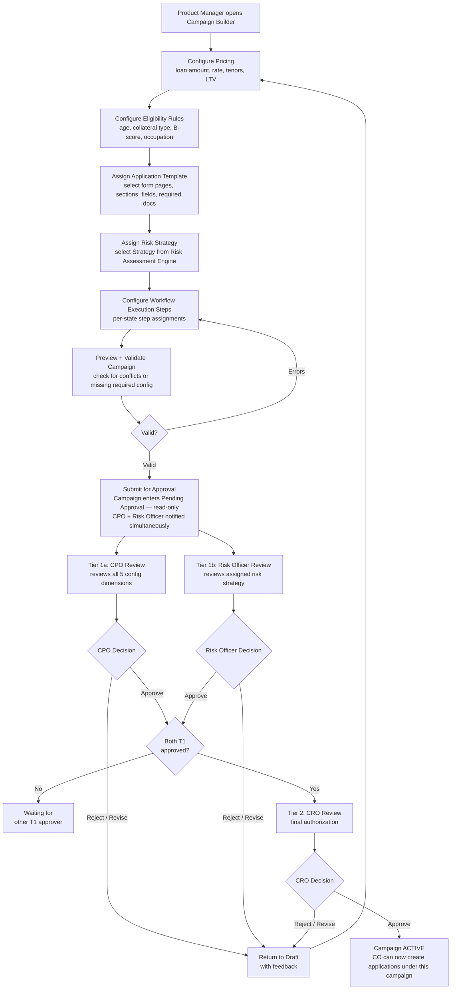

# Capability: Loan Campaign Configuration

**Product**: Onigiri — [PRODUCT](../../PRODUCT.md)
**Portfolio**: Credit
**Product Owner**: TBD (Credit PO)
**Status**: 📝 Draft — @FEATURE decomposition pending
**Last Updated**: 2026-03-12

---

## Business Function

Define and manage loan product configurations (campaigns) that house all configuration for the loan a campaign will create — pricing, eligibility, application template, risk strategy, and workflow execution steps — enabling new loan products to be launched without code changes.

## Why It Exists (First Principles)

- **Product Launch Speed**: The business launches new loan products (campaigns) regularly — new car title products, seasonal promotions, segment-specific offers. Each needs distinct eligibility rules, pricing, risk strategies, and field requirements.
- **Operational Independence**: Product managers and credit officers need to configure new campaigns without developer involvement.
- **Single Source of Truth**: A single campaign configuration drives the **entire** application lifecycle — from which form fields appear, to which risk policies execute, to what execution steps run inside each workflow state. This prevents misalignment between intake, underwriting, and decision.

---

## Feature Inventory

| Feature | Status | Description |
|---------|--------|-------------|
| Campaign Builder | Concept | Create and manage loan campaign with all 5 configuration dimensions in one place |
| Pricing Configuration | Concept | Set loan amount range, interest rate, available tenors, max LTV, min/max credit line |
| Eligibility Rules Builder | Concept | Rule-based gateway: configure criteria (customer type, age, collateral, B-score, occupation) evaluated before full application entry |
| Application Template Assignment | Concept | Select which form pages/sections/fields appear; configure required documents; set conditional document logic |
| Risk Strategy Assignment | Concept | Assign which risk strategy (Strategy → Policy → Rule hierarchy) executes for applications under this campaign |
| Workflow Execution Steps Configuration | Concept | Configure which pluggable steps run inside each workflow state for applications under this campaign |
| Campaign Publication Approval Workflow | Spec | Two-tier approval workflow before a campaign transitions to ACTIVE — Tier 1 (parallel): CPO + Risk Officer; Tier 2: CRO. Runs on the Underwriting Workflow state machine engine. — [FEATURE](features/FEATURE_campaign-publication-authorization.md) |

---

## Business Rules

### Campaign Configuration Dimensions

| Dimension | What It Configures |
|-----------|-------------------|
| **Campaign Type** | `application_type` this campaign targets (`new_booking`, `topup`, `restructure`); for restructure campaigns, whether it is EasyPass or Non-EasyPass |
| **Pricing** | Loan amount range, interest rate, available tenors, max LTV, min/max credit line; for restructure campaigns, Plan Calculation parameters (tenor options, interest rate for installment computation) |
| **Eligibility Criteria** | Rule-based gateway (customer type, age, collateral, credit score, occupation) — evaluated before full application entry |
| **Application Template** | Which pages/sections/fields appear; required documents; conditional document logic |
| **Risk Strategy** | Which risk assessment strategy to execute (Strategy → Policy → Rule) |
| **Workflow Execution Steps** | What pluggable steps run inside each workflow state |

### Pricing Parameters

| Parameter | Example Value |
|-----------|---------------|
| Loan amount range | 3,000 – 500,000 |
| Interest rate | 24% |
| Available tenors | 3, 6, 9, 12, ... months |
| Max LTV | 120% |
| Min/Max credit line | Configurable per campaign |

### Campaign Publication Authorization

Any campaign version publication (Draft → ACTIVE) requires a two-tier approval workflow. Product managers cannot publish directly.

Tier 1 is a **parallel gate** — both functional owners must approve simultaneously (in any order) before the change advances to Tier 2.

| Tier | Approver Role | Mode | Responsibility |
|------|--------------|------|----------------|
| Tier 1 | CPO (Chief Product Officer) | Parallel | Reviews all 5 configuration dimensions for business intent, pricing soundness, and eligibility correctness |
| Tier 1 | Risk Officer | Parallel | Reviews the assigned risk strategy for policy soundness and downstream evaluation impact |
| Tier 2 | CRO (Chief Risk Officer) | Sequential (after both T1) | Final authorization — mandatory for all campaign publications |

Both Tier 1 approvers must approve before the change advances to Tier 2. Either Tier 1 approver can reject, returning the campaign to Draft.

**Campaign lifecycle states:**

| State | Mutability | Description |
|-------|------------|-------------|
| Draft | Fully editable | Campaign is being configured; no version increment |
| Pending Approval | Read-only | Submitted; both T1 approvers notified simultaneously |
| Pending CRO | Read-only | Both T1 approvals received; awaiting CRO final sign-off |
| ACTIVE | Append-only | Live; any change creates a new Draft version |
| Archived | Read-only | Superseded by a newer version or manually sunset |

In-flight applications use the campaign version at submission time — no retroactive version migration.

**Risk strategy coupling:**

Because the Risk Officer is a mandatory Tier 1 approver on every campaign publication, campaign version and risk strategy alignment is enforced structurally — neither side can be published without the other functional owner's sign-off.

*Resolves audit finding AI-2 and the Open Question: "Is there a campaign approval workflow before publishing?" → **Yes.***

---

### EasyPass Campaign Designation (Restructure Campaigns Only)

EasyPass is a **campaign-type property** — it designates whether a restructure campaign's risk level is within local CO authority. This determination is made at campaign configuration time by the Risk Officer, based on the campaign's assigned risk strategy and pricing parameters.

| EasyPass Designation | Effect on Pre-Approval Flow | Effect on Underwriting |
|---|---|---|
| **EasyPass** | CO converts directly from `created` to Draft — approval step bypassed | At `pending_approval`, routes to local approver queue |
| **Non-EasyPass** | CO must submit an Approval Request; pre-approval enters `pending_approval` → `approved` before Draft creation; approved pre-approval carries an expiry date | At `pending_approval`, routes through standard escalation path — higher authority required |

EasyPass designation is stored on the campaign configuration — not derived at runtime and not stored as a flag on the application record. The system reads `campaign.easypass` when routing the pre-approval approval step and the underwriting approval step.

---

### Restructure Campaign Type

Restructure campaigns differ from `new_booking` and `topup` campaigns in their eligibility shape and pricing parameters.

**Eligibility Criteria — Restructure**

Restructure campaigns target **existing borrowers** whose repayment capacity has decreased. Eligibility is evaluated against the existing loan record (from Core Banking), not a new application profile.

| Criteria | Description |
|---|---|
| `customer_type = existing` | Only existing borrowers are eligible |
| `loan_status = active` | Loan must be active (not already closed or written off) |
| `dpd_range` | Days past due within a configured band (e.g., 30–90 DPD) — too low means no hardship; too high means unrecoverable |
| `contract_age_months` | Minimum contract age before a restructure is offered |
| `outstanding_balance` | Minimum outstanding balance to make a restructure economically viable |
| `collateral_type` | Collateral type gate (same as other campaign types) |

> Specific threshold values (DPD band, min contract age, min outstanding balance) are configured per campaign by the Credit PO and Risk Officer. These are not hardcoded.

**Pricing Parameters — Restructure**

In addition to the standard Pricing dimension, restructure campaigns carry Plan Calculation parameters used by the Plan Calculation API and displayed on the Finance Page.

| Parameter | Description |
|---|---|
| Loan amount range | Derived from Outstanding Balance + any additional top-up amount (if applicable) |
| Interest rate | Rate applied to the restructured loan — may differ from the original loan's rate |
| Available tenors | Tenor options offered to the CO on the Finance Page; must all be **longer than** the original loan tenor (tenor filter enforced by Smart Form) |
| Max LTV | Maximum loan-to-value ratio based on current collateral valuation |
| Plan Calculation input | Tenor list + interest rate passed to Plan Calculation API to compute installment schedule per tenor option |

---

### Zero-Code Launch Rule

A new campaign must be launchable by a product manager without any code deployment. If configuring a new campaign requires a code change, it is a violation of this capability's design intent and must be escalated to engineering for resolution.

---

### Collateral Type as a Configuration Driver

Collateral Type is the primary axis that differentiates campaigns within Onigiri. A campaign is, in practice, a collateral type + credit policy combination. Every one of the five configuration dimensions is shaped by Collateral Type:

| Configuration Dimension | How Collateral Type Affects It |
|------------------------|-------------------------------|
| **Pricing** | LTV ceiling and loan amount range differ by collateral type (e.g., land carries a lower LTV ceiling than vehicles) |
| **Eligibility Criteria** | The `collateral_type =` rule gates which campaign a customer enters |
| **Application Template** | Exactly one Collateral Section (from the Smart Form Collateral Section Registry) is selected per campaign; each section carries its own field list and document declarations |
| **Risk Strategy** | A named strategy (e.g., `BikeTitleDefault`, `LandTitleDefault`) is assigned; each strategy contains policies specific to that collateral type's risk characteristics |
| **Workflow Execution Steps** | Identical across all collateral types — the fixed underwriting topology does not change by collateral type |

To launch Bike, Tractor, or Land campaigns, no new capability is required. A product manager creates a campaign, selects the appropriate Collateral Section in the Application Template, assigns the collateral-specific risk strategy, and configures pricing. Everything else is inherited from the existing infrastructure.

---

### Collateral Type Variants Reference

Authoritative cross-reference for all four supported collateral types. Each row maps a collateral type to its Smart Form section ID, Matcha document keys, and indicative pricing parameters. Values marked "(example)" require confirmation from the Credit PO and Risk Officer before campaign go-live.

| Collateral Type | Campaign Example | Smart Form Section ID | Matcha Document Keys (type-specific) | Typical LTV Ceiling | Typical Loan Amount Range |
|----------------|-----------------|----------------------|--------------------------------------|--------------------|-----------------------|
| **Car** | Car Title Default 2026 | `collateral_car` | `vehicle_registration_book`, `vehicle_insurance` | 120% (example) | 3,000 – 500,000 (example) |
| **Bike (Motorbike)** | Bike Title Default 2026 | `collateral_bike` | `motorbike_registration_book`, `motorbike_insurance` | 80% (example) | 3,000 – 150,000 (example) |
| **Tractor** | Tractor Title Default 2026 | `collateral_tractor` | `tractor_registration_document`, `proof_of_agricultural_use` | 70% (example) | 5,000 – 300,000 (example) |
| **Land** | Land Title Default 2026 | `collateral_land` | `land_title_deed`, `land_appraisal_certificate` | 50% (example) | 10,000 – 2,000,000 (example) |

**Shared Base Document Set (all collateral types):**

| Matcha Document Key | Document Name |
|--------------------|--------------|
| `applicant_id_card` | National ID Card |
| `proof_of_income` | Proof of Income (payslip / bank statement / business registration) |
| `household_registration` | Household Registration (ทะเบียนบ้าน) |

**How the document list reaches Matcha:** The Application Template for a campaign declares the required document type keys (shared base + collateral-type-specific). When the application transitions to `create_facility`, the Onigiri worker reads this list from the `document_verification_mapping` table and constructs the `documents[]` array in the POST /task payload to Matcha. Campaign configuration is therefore the upstream source of Matcha's document checklist — not a separate configuration maintained in Matcha.

---

### Eligibility Criteria Examples

The table below shows representative eligibility rules per collateral type. A campaign for one collateral type combines the collateral type gate with age, B-score, and occupation criteria.

| Criteria | Operator | Car Campaign | Bike Campaign | Tractor Campaign | Land Campaign |
|----------|----------|-------------|--------------|-----------------|--------------|
| Collateral type | `=` | `"car"` | `"bike"` | `"tractor"` | `"land"` |
| Customer age | `>=` | 20 | 20 | 20 | 20 |
| Customer age | `<=` | 70 | 70 | 70 | 70 |
| Customer type | `=` | `"new"` / `"existing"` | `"new"` / `"existing"` | `"new"` / `"existing"` | `"new"` / `"existing"` |
| B-score | `>` | 500 (example) | 500 (example) | 450 (example) | 600 (example) |
| Occupation group | `in` | Civil servant, Salaried | Civil servant, Salaried | Farmer, Agricultural worker | Any (example) |
| Vehicle brand | `like` | Toyota, Honda (example) | Honda, Yamaha, Kawasaki (example) | Kubota, Yanmar (example) | — |
| Land title deed type | `=` | — | — | — | `"Chanote"` (example) |

> **Note on land deed type:** Land campaigns may restrict eligible collateral to specific deed types (e.g., Chanote only vs. accepting NS-3K/NS-3G). This is an eligibility rule, not a form field — the gate is evaluated before the form loads. Confirm acceptable deed types per campaign with the Credit PO.

---

### Risk Strategy Names by Collateral Type

Each collateral type should have at least one named strategy in the Risk Assessment Engine. Strategies are created in the admin UI — no code deployment required. The naming convention is `<CollateralType>Title<Variant>`:

| Collateral Type | Example Strategy Name | Notes |
|----------------|----------------------|-------|
| Car | `CarTitleDefault` | Existing strategy — reference implementation |
| Bike | `BikeTitleDefault` | To be created — mirrors CarTitleDefault structure with bike-specific policies (brand, age, engine size) |
| Tractor | `TractorTitleDefault` | To be created — likely adds agricultural usage area and seasonal income policies |
| Land | `LandTitleDefault` | To be created — likely adds title deed type, land area, and appraisal value policies |

Strategy design (which policies and rules to include) is a separate @CAPABILITY session with the Risk Officer.

---

## User Flow

---

## NFRs

| NFR | Requirement |
|-----|-------------|
| Zero-code campaign creation | New campaigns require no code deployment — configuration only |
| Single umbrella | All 5 configuration dimensions live under one campaign entity — no split-configuration paths |
| Campaign versioning | Changes to an active campaign must be versioned — in-flight applications use the campaign version at submission time |

---

## Open Questions

- Can a campaign be edited while applications are in-flight? Or must it be versioned + cloned?
- ~~Is there a campaign approval workflow before publishing, or can product managers publish directly?~~ **Resolved**: Two-tier approval required (Tier 1: CPO, Tier 2: CRO). Product managers cannot publish directly. See Campaign Publication Authorization.
- What is the campaign archive / sunset process for old campaigns?
