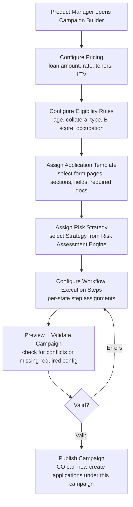

# Capability: Loan Campaign Configuration

**Product**: Onigiri — [PRODUCT](../../PRODUCT.md)
**Portfolio**: Credit
**Product Owner**: TBD (Credit PO)
**Status**: 📝 Draft — @FEATURE decomposition pending
**Last Updated**: 2026-03-04

---

## Business Function

Define and manage loan product configurations (campaigns) that house all configuration for the loan a campaign will create — pricing, eligibility, application template, risk strategy, and workflow execution steps — enabling new loan products to be launched without code changes.

## Why It Exists (First Principles)

- **Product Launch Speed**: The business launches new loan products (campaigns) regularly — new car title products, seasonal promotions, segment-specific offers. Each needs distinct eligibility rules, pricing, risk strategies, and field requirements.
- **Operational Independence**: Product managers and credit officers need to configure new campaigns without developer involvement.
- **Single Source of Truth**: A single campaign configuration drives the **entire** application lifecycle — from which form fields appear, to which risk policies execute, to what execution steps run inside each workflow state. This prevents misalignment between intake, underwriting, and decision.

---

## Feature Inventory

| Feature | Status | Description |
|---------|--------|-------------|
| Campaign Builder | Concept | Create and manage loan campaign with all 5 configuration dimensions in one place |
| Pricing Configuration | Concept | Set loan amount range, interest rate, available tenors, max LTV, min/max credit line |
| Eligibility Rules Builder | Concept | Rule-based gateway: configure criteria (customer type, age, collateral, B-score, occupation) evaluated before full application entry |
| Application Template Assignment | Concept | Select which form pages/sections/fields appear; configure required documents; set conditional document logic |
| Risk Strategy Assignment | Concept | Assign which risk strategy (Strategy → Policy → Rule hierarchy) executes for applications under this campaign |
| Workflow Execution Steps Configuration | Concept | Configure which pluggable steps run inside each workflow state for applications under this campaign |

---

## Business Rules

### Campaign Configuration Dimensions

| Dimension | What It Configures |
|-----------|-------------------|
| **Pricing** | Loan amount range, interest rate, available tenors, max LTV, min/max credit line |
| **Eligibility Criteria** | Rule-based gateway (customer type, age, collateral, credit score, occupation) — evaluated before full application entry |
| **Application Template** | Which pages/sections/fields appear; required documents; conditional document logic |
| **Risk Strategy** | Which risk assessment strategy to execute (Strategy → Policy → Rule) |
| **Workflow Execution Steps** | What pluggable steps run inside each workflow state |

### Eligibility Criteria Examples

| Criteria | Operator | Example Value |
|----------|----------|---------------|
| Customer type | `=` | "new" |
| Customer age | `>=` | 20 |
| Customer age | `<=` | 70 |
| Car brand | `like` | Toyota, Honda |
| Collateral type | `=` | "car" |
| Occupation group | `in` | Civil servant |
| B-score | `>` | 500 |

### Pricing Parameters

| Parameter | Example Value |
|-----------|---------------|
| Loan amount range | 3,000 – 500,000 |
| Interest rate | 24% |
| Available tenors | 3, 6, 9, 12, ... months |
| Max LTV | 120% |
| Min/Max credit line | Configurable per campaign |

### Zero-Code Launch Rule

A new campaign must be launchable by a product manager without any code deployment. If configuring a new campaign requires a code change, it is a violation of this capability's design intent and must be escalated to engineering for resolution.

---

## User Flow

---

## NFRs

| NFR | Requirement |
|-----|-------------|
| Zero-code campaign creation | New campaigns require no code deployment — configuration only |
| Single umbrella | All 5 configuration dimensions live under one campaign entity — no split-configuration paths |
| Campaign versioning | Changes to an active campaign must be versioned — in-flight applications use the campaign version at submission time |

---

## Open Questions

- Can a campaign be edited while applications are in-flight? Or must it be versioned + cloned?
- Is there a campaign approval workflow before publishing, or can product managers publish directly?
- What is the campaign archive / sunset process for old campaigns?
