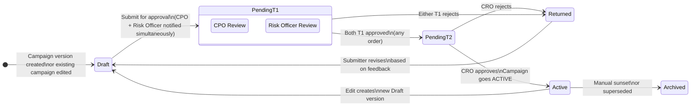

# Feature: Campaign Publication Authorization

**Parent Capability**: Loan Campaign Configuration — [CAPABILITY](../CAPABILITY.md)
**Product**: Onigiri — [PRODUCT](../../../PRODUCT.md)
**Engineering Owner**: TBD
**Status**: Spec
**Changelog Reference**: CHANGELOG_004 — Group B / AI-2
**Last Updated**: 2026-03-10

---

## User Story

As a **CPO**, I want every campaign publication to require explicit Risk Officer review and CRO sign-off before going live, so that no campaign — with its pricing, eligibility rules, and assigned risk strategy — can be activated without cross-functional authorization.

## Job-to-be-Done

Product managers can currently publish a campaign directly with no approval gate. A campaign drives the entire loan lifecycle — pricing, eligibility, risk strategy, and execution steps. This feature gates every campaign publication behind a two-tier parallel approval workflow, using the same state machine engine as the Underwriting Workflow. Because the Risk Officer is a mandatory T1 approver, campaign and risk strategy changes are structurally coupled — neither goes live without the other functional owner's sign-off.

---

## Architecture: Reuse of Underwriting Workflow State Machine

This feature does **not** introduce a new state machine engine. It defines a second workflow topology — the **Campaign Publication Approval Workflow** — that runs on the same state machine infrastructure as the Underwriting Workflow (fixed topology, configurable execution steps per state).

```
Underwriting Workflow engine
    ├── Topology A: Loan Application Workflow         (existing)
    ├── Topology B: Rule Change Approval Workflow      (FEATURE_rule-change-authorization)
    └── Topology C: Campaign Publication Workflow      (this feature)
```

Topologies B and C are structurally symmetric: same two-tier parallel approval pattern, same engine, different entities and execution steps.

---

## Approval Workflow Diagram



---

## Workflow Topology

| State | Description | Execution Steps |
|-------|-------------|-----------------|
| `DRAFT` | Campaign version is being configured; not yet submitted | Editable; all 5 dimensions configurable |
| `PENDING_T1` | Submitted; awaiting parallel T1 approvals | Notify CPO + Risk Officer simultaneously; enforce role checks; track individual approvals |
| `PENDING_T2` | Both T1 approved; awaiting CRO | Notify CRO; display both T1 approval records and full campaign config summary |
| `ACTIVE` | CRO approved; campaign is live | Append-only; COs can create applications under this campaign version |
| `RETURNED` | Rejected at T1 or T2; back for revision | Notify submitter with feedback; reset T1 approval tracking; return to `DRAFT` |
| `ARCHIVED` | Superseded or manually sunset | Read-only; no new applications |

---

## Acceptance Criteria

| # | Criterion | Pass Condition |
|---|-----------|---------------|
| AC-1 | Campaign edited or new version created → `DRAFT` | Campaign version in `DRAFT`; all 5 config dimensions editable |
| AC-2 | Submit → `PENDING_T1` | Campaign version becomes read-only; CPO AND Risk Officer notified simultaneously |
| AC-3 | Either T1 rejects → `RETURNED` | Version returns to `DRAFT`; feedback reason recorded; submitter notified; T1 tracking reset |
| AC-4 | One T1 approves, other has not yet acted | Version stays `PENDING_T1`; waiting state visible on both approver dashboards |
| AC-5 | Both T1 approve (any order) → `PENDING_T2` | CRO notified; version remains read-only |
| AC-6 | CRO approves → `ACTIVE` | Campaign version goes live; previous `ACTIVE` version transitions to `ARCHIVED` |
| AC-7 | CRO rejects → `RETURNED` | Version returns to `DRAFT`; CRO feedback recorded; submitter notified |
| AC-8 | Submitter cannot act as T1 approver | System enforces: submitter's own T1 approval action is rejected regardless of role |
| AC-9 | `ACTIVE` campaign is append-only | Any modification creates a new `DRAFT` version; `ACTIVE` version is immutable |
| AC-10 | In-flight applications pin to submission-time campaign version | Approving a new campaign version does not alter applications already in the workflow |
| AC-11 | `ARCHIVED` campaigns are read-only | No edits; no new applications; visible in history |
| AC-12 | Immutable audit trail entry on every state transition | Entry contains: actor ID, action, campaign version snapshot, both T1 approver IDs, CRO approver ID, timestamp |

---

## Edge Cases & Error States

| Scenario | Expected Behavior |
|----------|------------------|
| CPO and Risk Officer are the same person | Both T1 approvals must still be explicitly acted on — same person completes both actions sequentially |
| Submitter holds both CPO and Risk Officer roles | Submitter cannot self-approve either T1 action |
| CRO role unassigned in system | Submission blocked at T2 with clear error message |
| Two simultaneous edits to the same campaign | Only one draft version in `PENDING_T1` or `PENDING_T2` at a time; second edit blocked until first resolves |
| Submitter withdraws a `PENDING_T1` version | Version returns to `DRAFT`; all in-progress T1 approvals voided; re-submission restarts the flow |
| New version approved while applications reference old version | Old version remains `ACTIVE` for those applications; new version becomes `ACTIVE` for new submissions |

---

## Dependencies

| Dependency | Type | Notes |
|------------|------|-------|
| Underwriting Workflow state machine engine | Internal — [CAPABILITY](../../underwriting-workflow/CAPABILITY.md) | Provides the fixed-topology + configurable execution steps infrastructure this workflow runs on |
| Rule Change Authorization | Internal — [FEATURE](../../risk-assessment-engine/features/FEATURE_rule-change-authorization.md) | Mirror feature; both functional owners are T1 approvers on both workflows for structural coupling |
| RBAC / role system | Internal platform | Must support role checks for CPO, Risk Officer, CRO at transition time |
| Immutable audit trail | Internal | INSERT-only; no UPDATE/DELETE at application layer |

---

## Out of Scope

- Campaign archive / sunset process definition — separate open question in CAPABILITY.md
- Approval delegation (acting CRO, out-of-office) — operational procedure
- Migration of existing live campaigns into the new approval lifecycle — all campaigns at ship time are grandfathered as `ACTIVE`
