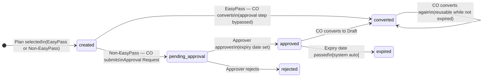
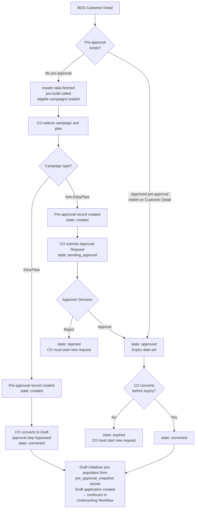

# Capability: Pre-Approval

**Product**: Onigiri — [PRODUCT](../../PRODUCT.md)
**Portfolio**: Credit
**Product Owner**: TBD (Credit PO)
**Status**: 📝 Draft
**Last Updated**: 2026-03-10

---

## Business Function

Enable a CO to evaluate which restructure plans a customer is eligible for and present viable options before initiating a formal application — and route the resulting application to the correct approval authority based on the EasyPass designation returned by Campaign Eligibility Pre-Build.

## Why It Exists (First Principles)

- **Offer accuracy**: CO needs to know what is achievable before making a commitment to the customer. Without pre-approval, offers are speculative — the CO risks presenting plans that will not be approved.
- **Authority clarity**: Not all restructure campaigns require escalation to a higher approver. EasyPass campaigns fall within local CO authority — the CO already has the authority to proceed without waiting. This must be surfaced before the application is created, not discovered at `pending_approval`.
- **Queue efficiency**: Only applications that genuinely require a higher authority should enter the approver queue. Pre-approval filters noise before it becomes workflow volume.

---

## Feature Inventory

| Feature | Status | Description |
|---------|--------|-------------|
| [Pre-Approval Request Creation](features/FEATURE_pre-approval-request-creation.md) | Concept | CO arrives at a dedicated pre-approval screen (not Smart Form) from BOS Customer Detail. Three pre-condition calls in sequence: (1) DaVinci master data fetch, (2) Campaign Eligibility Pre-Build → eligible campaigns with EasyPass designation, (3) Plan Calculation API → available plan options per campaign (tenor, grace period, term of payment). Screen displays plan options with EasyPass and tenor filters. Tenor options ≤ original loan tenor are disabled. CO selects a plan option. Pre-approval record created with master data snapshot and selected plan stored. |
| [Approval Request](features/FEATURE_approval-request.md) | Concept | Non-EasyPass path only. Pre-approval submitted to designated approver. Outcomes: Approve or Reject. Approver may revise own decision. CO may not. |
| [Pre-Approval Expiry Management](features/FEATURE_pre-approval-expiry-management.md) | Concept | Non-EasyPass path only. Approved pre-approval carries an expiry date. System-configured default. Approver may override at approval time. Expired pre-approval is invalidated — new request required. |
| [Draft Initializer](features/FEATURE_draft-initializer.md) | Concept | Converts a valid pre-approval into a Draft application. Pre-populates form with selected plan data and existing loan reference. Stores pre-approval snapshot on application record. Entry: BOS only — accessible from Customer Detail. |
| [Pre-Approval Status Visibility](features/FEATURE_pre-approval-status-visibility.md) | Concept | BOS surfaces pre-approval status on Customer List (badge indicator per customer) and Customer Detail (status section with state, plan, expiry, and context-sensitive action). CO sees when a plan has been approved and can convert to Draft directly from Customer Detail without needing a separate worklist. |

---

## Business Rules

### EasyPass Authority Rule

EasyPass is a statement of authority alignment — not a shortcut. A CO initiating a pre-approval for an EasyPass campaign already satisfies the approval authority requirement because the campaign's risk level falls within local CO authority. The CO is not bypassing approval — the CO IS the approval authority for that risk level.

| Campaign Designation (from pre-build) | Meaning | Pre-Approval Behaviour |
|---|---|---|
| EasyPass campaign | Campaign risk level is within local CO authority | No Approval Request generated — CO converts directly to Draft. No expiry on pre-approval. |
| Non-EasyPass campaign | Campaign risk level exceeds local CO authority | Approval Request required — submitted to designated approver. Approved pre-approval carries expiry date. |

### Workflow State Machine — Topology D

Pre-approval runs as **Topology D** on the Underwriting Workflow engine. The diagram below shows the workflow states and transitions — not the user journey. For the user-facing entry flow, see [User Flow — Restructure Pre-Approval Entry](#user-flows) below.



---

### Pre-Approval Lifecycle (Topology D)

Pre-approval runs as **Topology D** on the Underwriting Workflow engine — same audit trail, same execution step infrastructure, same transition atomicity as all other topologies.

| State | Description |
|---|---|
| `created` | Pre-approval record created after CO selects plan from pre-built results. For EasyPass plans, stays here until CO converts to Draft — no Approval Request required (approval step bypassed). For non-EasyPass plans, stays here until CO submits Approval Request; persists if CO closes without submitting. |
| `pending_approval` | Submitted for Approval Request. Waiting for designated approver. Non-EasyPass path only. |
| `approved` | Approver confirmed. Valid until expiry date. Non-EasyPass path only. |
| `rejected` | Approver rejected. CO must initiate a new pre-approval request. Non-EasyPass path only. |
| `expired` | Approved pre-approval passed its expiry date — invalidated. New request required. Non-EasyPass path only. |
| `converted` | Draft Initializer used this pre-approval to create an application. Pre-approval remains reusable — additional Drafts can be created from the same pre-approval as long as it is still valid (not `rejected` or `expired`). |

**HWM note**: Pre-approval is pre-Origination. It does not write to `state_high_water_mark`. HWM begins at `draft` as in Topology A.

### Path by EasyPass

```
EasyPass (local authority met):
  plan selected → created → converted → Draft application created
                            [CO converts — approval step bypassed, no Approval Request]

Non-EasyPass (authority gap — escalation required):
  plan selected → created → pending_approval → approved → converted (reusable) → Draft application created
                                              → rejected       ↑ can convert again while approved and not expired
                                              → expired
```

### Approval Decision Rules

| Actor | Allowed Actions |
|---|---|
| Approver | Approve or Reject. May revise own previous decision (e.g., Approve → Reject) as long as pre-approval has not reached `converted`. |
| CO | Cannot influence or change the approver's decision after submission. |

### Expiry Rules

| Path | Expiry |
|---|---|
| EasyPass | No expiry — EasyPass pre-approval carries no expiry date. |
| Non-EasyPass | Carries expiry date. Default duration set by system configuration. Approver may override expiry date at time of approval. On expiry: transitions to `expired` — CO must submit a new pre-approval request. |

**Why expiry exists**: An approved pre-approval is a snapshot of campaign terms, eligibility conditions, and risk assessment at a point in time. If any of these change (campaign archived, eligibility rules updated, risk strategy revised), the pre-approval may no longer reflect valid conditions. Expiry enforces a recheck cadence.

### Tenor Filter Business Rule

Restructure is intended to extend the repayment period for customers whose ability to pay has reduced. A restructure that results in a tenor equal to or shorter than the original loan does not serve this purpose.

| Condition | Behaviour |
|---|---|
| Plan option tenor > original loan tenor | Available — CO may select |
| Plan option tenor ≤ original loan tenor | Disabled — CO cannot select; option displayed but not interactive |
| All plan options for a campaign have tenor ≤ original loan tenor | No valid options for that campaign — campaign not selectable |

Original loan tenor is sourced from DaVinci contract detail at master data fetch time.

---

### Change Detection at Draft Submission

Applies to **non-EasyPass restructure applications only** — where a higher-authority approver reviewed the plan at pre-approval stage. Executed as a configurable execution step inside the Underwriting Workflow at Draft submission.

| Condition | Outcome at Draft Submission |
|---|---|
| `pre_approval_id` present + non-EasyPass campaign + no data change from snapshot | Skip `pending_approval` — approver already reviewed at pre-approval stage |
| `pre_approval_id` present + non-EasyPass campaign + delta detected | Route through `pending_approval` as normal |
| No `pre_approval_id` (direct restructure application, no pre-approval) | Full workflow — `pending_approval` runs unchanged |

### Pre-Approval Record Fields (stored at creation)

| Field | Type | Source | Purpose |
|---|---|---|---|
| `customer_reference` | reference | BOS context | Links pre-approval to the customer |
| `selected_campaign` | reference | CO plan selection | Campaign chosen by CO — campaign type carries EasyPass designation |
| `selected_plan` | JSON | CO plan selection | Selected plan option from Plan Calculation API: tenor, grace period, term of payment |
| `payment_due_date` | date | CO-confirmed (pre-filled from DaVinci, editable) | Monthly payment due date — input to Plan Calculation API; stored at confirmation |
| `reason_for_restructure` | enum | CO dropdown selection (required) | Reason type selected by CO — surfaced to approver |
| `reason_detail` | string | CO free-text (optional) | Additional explanation beyond the reason type — surfaced to approver |
| `supporting_documents` | reference[] | CO file upload (optional) | Document references (e.g. medical cert, income proof) — accessible by approver |
| `financial_snapshot` | JSON | CO-reviewed (pre-filled from DaVinci, editable) | CO-reviewed financial figures: primary income, supplementary income, monthly debt burden, debt end date, monthly expenses, tax due date — surfaced to approver in Approval Request view |

### Application Record Fields Set by Draft Initializer

| Field | Type | Source | Purpose |
|---|---|---|---|
| `pre_approval_id` | reference | Draft Initializer | Links application to originating pre-approval for audit trail and change detection |
| `pre_approval_snapshot` | JSON | Draft Initializer | Point-in-time copy of pre-approval data (including master data snapshot and reason for restructure) — compared at Draft submission for change detection |

EasyPass routing is determined at `pending_approval` by the campaign type of the application's selected campaign — not by a stored flag. Campaign type is derived from the campaign record linked to the application.

---

## User Flows

> User flows describe how the CO navigates through the system. They are distinct from the workflow state machine (Topology D above) — which describes engine states only.

### Entry Points

Two systems can navigate into pre-approval. Each has a defined scope:

| Entry Point | Allowed Actions | Pre-conditions |
|---|---|---|
| **BOS** → Customer List → Customer Detail | **Create new pre-approval** — triggers master data fetch from DaVinci, then Campaign Eligibility Pre-Build, then Plan Calculation API; opens pre-approval screen. Also allows **converting an existing pre-approval to Draft** — accessible from the Pre-Approval Status section on Customer Detail. | Master data fetch must succeed; pre-built must return at least one eligible campaign; plan calculation must return at least one valid option. |

CO Worklist is not an entry point for pre-approval — at this stage no application number exists, so there is no item to surface in a worklist. Instead, BOS Customer Detail surfaces the pre-approval status and provides the Convert to Draft action directly on the customer record (see Pre-Approval Status Visibility feature).

### User Flow — Restructure Pre-Approval Entry



---

## NFRs

| NFR | Requirement |
|-----|-------------|
| Topology D on shared engine | Pre-approval runs on the Underwriting Workflow engine — no separate state machine infrastructure |
| Audit trail | Every pre-approval state transition logged with actor, timestamp, and reason — same as all other topologies |
| Snapshot integrity | `pre_approval_snapshot` stored at Draft creation time must be immutable — no post-creation modification |
| Expiry enforcement | System must automatically transition `approved` pre-approvals to `expired` on the expiry date — no manual intervention required |
| Pre-HWM | Pre-approval transitions must never write to `state_high_water_mark` on the linked application record |

---

## Dependencies

| Dependency | Type | Detail |
|---|---|---|
| BOS (Branch Operations System) | Entry point | Two modes: (1) Create new pre-approval — BOS orchestrates master data fetch from DaVinci, then Campaign Eligibility Pre-Build, then Plan Calculation API before opening the pre-approval screen. (2) Convert existing pre-approval to Draft — CO navigates to Customer Detail where the Pre-Approval Status section surfaces the current state and provides the Convert to Draft action. CO Worklist is not used — no application number exists at pre-approval stage. |
| DaVinci (Customer & Product Master Data) | Data source | Provides person detail, contract detail (outstanding balance, DPD, loan status, prior restructure count, loan age, existing loan reference), and collateral data (type, valuation, status) by customer/contract reference. Called before screen opens. |
| Campaign Eligibility Pre-Build | External capability | Called by BOS after master data fetch. Receives customer context including contract and collateral data. Returns eligible restructure campaigns with EasyPass designation per campaign. Not defined in this capability. |
| Plan Calculation API | External capability | Called after Pre-Build with eligible campaigns, customer loan context, and monthly payment due date. Returns available plan options per campaign — each option defined by tenor, grace period, and term of payment. Re-called when CO changes the monthly payment due date; plan options refresh with each recalculation. Screen does not open if the initial call fails or returns no valid options. |
| Smart Form | Form rendering | Used for the Draft application form after conversion. Pre-approval plan selection screen is a dedicated screen — not Smart Form. |
| Sensei notification | Deferred | Approver notification via Sensei TaskCreationRequest when Approval Request is submitted. Out of scope for restructure 1.3. |

---

## Open Questions

- What is the system-configured default expiry duration for approved non-EasyPass pre-approvals?
- Who is the designated approver for non-EasyPass Approval Requests — fixed role or campaign-configurable?
- Can a CO have multiple in-flight pre-approvals for the same customer simultaneously, or is one at a time enforced?
- If pre-built returns no eligible campaigns, what does the CO see and what action is available?
