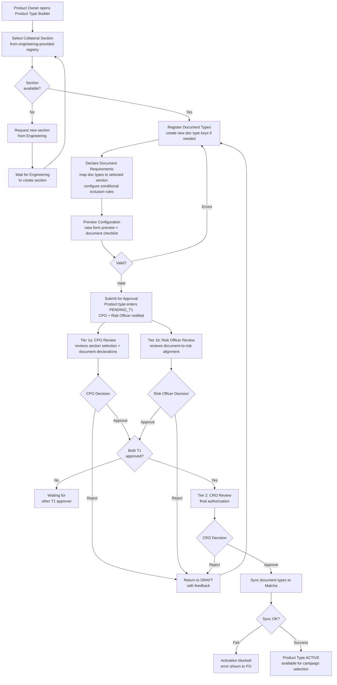
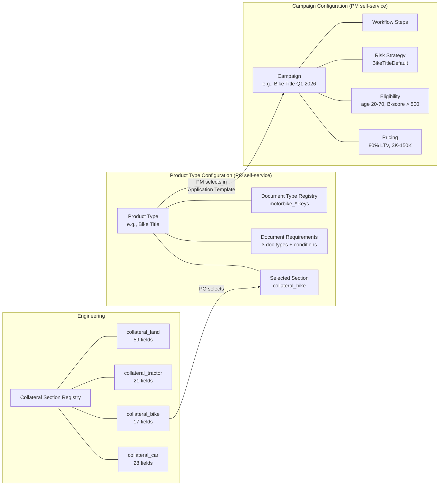

# Capability: Product Type Configuration

**Product**: Onigiri — [PRODUCT](../../PRODUCT.md)
**Portfolio**: Credit
**Product Owner**: TBD (Credit PO)
**Status**: 📝 Draft — @FEATURE decomposition pending
**Last Updated**: 2026-03-10

---

## Business Function

Define and manage collateral-backed product types — selecting from engineering-provided collateral sections, configuring document requirements, and registering document types — through an Admin UI, so that new product types can be assembled and launched without engineering involvement beyond initial section creation.

## Why It Exists (First Principles)

- **Reduced User Complexity**: Collateral sections are complex (17–60+ fields with types, validation, conditional logic). Engineering pre-creates these sections as reusable building blocks. POs **select** a section and configure documents — they don't build forms from scratch.
- **Partial Zero-Code Product Type Assembly**: Of the 3 engineering steps previously required to launch a new collateral type, **2 are now self-service** (document type registration, document verification mapping). Collateral section creation remains an engineering responsibility — but sections are reusable and rarely change.
- **Upstream Enabler for Campaign Configuration**: A campaign selects a product type — it doesn't define one. Product types are reusable building blocks configured once and used across many campaigns.
- **Governance**: Product type definitions carry risk impact (they determine what fields, documents, and data flow into the risk engine). A two-tier approval workflow ensures cross-functional sign-off before a product type becomes available for campaign use.

---

## Feature Inventory

| Feature | Status | Owner | Description |
|---------|--------|-------|-------------|
| [Collateral Section Registry](features/FEATURE_collateral-section-registry.md) | Concept | Engineering | Engineering pre-creates collateral sections (field definitions, validation, conditional visibility). PO selects from available sections when assembling a product type. |
| [Document Requirement Declaration](features/FEATURE_document-requirement-declaration.md) | Concept | PO (self-service) | Admin UI to declare which documents are required per collateral type, with conditional inclusion rules |
| [Document Type Registration](features/FEATURE_document-type-registration.md) | Concept | PO (self-service) | Self-service document type registration in Onigiri, with sync to Matcha via API |
| [Product Type Publication Authorization](features/FEATURE_product-type-publication-authorization.md) | Concept | Cross-functional | Two-tier approval workflow (CPO + Risk Officer → CRO) before a product type becomes ACTIVE |

---

## Business Rules

### Product Type as a Reusable Building Block

A product type is a **template** — it defines what a collateral-backed loan product looks like (fields, documents, conditions). A campaign **references** a product type and adds pricing, eligibility, risk strategy, and workflow configuration on top.

| Concept | Owns | Created By | Used By |
|---------|------|-----------|---------|
| **Collateral Section** | Field definitions, validation rules, conditional visibility, lockpoint groups | **Engineering** | Product Type (selected by PO) |
| **Product Type** | Collateral section selection + document requirements + document type keys | **PO** (assembles from engineering-provided sections) | Campaign Configuration (Application Template dimension) |
| **Campaign** | Pricing, eligibility, risk strategy, workflow steps + product type reference | **PM** | Loan applications |

**One product type → many campaigns.** Example: Product type "Bike Title" is used by campaigns "Bike Title Q1 2026", "Bike Title Promo Summer 2026", etc.

### Product Type Configuration Dimensions

| Dimension | What It Configures | Owner | How |
|-----------|-------------------|-------|-----|
| **Collateral Section** | Which fields appear in the loan application form for this collateral type | **Engineering** | Pre-creates section with fields, types, validation, conditional visibility. PO selects from registry. |
| **Document Requirements** | Which documents are required, under what conditions, and how data is extracted | **PO** (self-service) | Admin UI: select document types, configure conditional rules |
| **Document Types** | Registration of new document type keys in Onigiri's registry (synced to Matcha) | **PO** (self-service) | Admin UI: register key, display name, category |

### Collateral Section: Engineering-Owned

Collateral sections are **complex** — each contains 17–60+ fields with specific types, validation rules, conditional visibility logic, and lockpoint group assignments. To reduce user complexity and prevent configuration errors:

- **Engineering creates** collateral sections and registers them in the Collateral Section Registry
- **PO selects** a section when assembling a product type — they do not build or modify sections
- Each section is a fully self-contained, tested form definition

| Section ID | Fields | Created By | Status |
|-----------|--------|-----------|--------|
| `collateral_car` | 28 fields | Engineering | Available |
| `collateral_bike` | 17 fields | Engineering | Pending implementation |
| `collateral_tractor` | 21 fields | Engineering | Pending implementation |
| `collateral_land` | 59 fields | Engineering | Pending implementation |

**When a new collateral type is needed:** PO requests it → Engineering implements the section → Section registered in the Collateral Section Registry → PO can select it in the Product Type Builder.

This is the **one remaining engineering dependency** in the product type launch process. Document requirements and document type registration are fully self-service.

### Document Requirement Conditional Logic

POs can configure conditional document inclusion using the same simple rule pattern:

| Rule Component | Configurable By PO | Example |
|---------------|-------------------|---------|
| Trigger field | Select from section's field list | `bike_act_type` |
| Trigger condition | `= value` | `= "RY-17"` |
| Target document | Select from registered document types | `motorbike_dlt_web_page` |
| Action | Include / Exclude | Exclude |

At activation time, these rules are compiled into `conditional_expr` values in the `document_verification_mapping` table.

### Product Type Lifecycle States

| State | Mutability | Description |
|-------|------------|-------------|
| `DRAFT` | Fully editable | Product type is being configured |
| `PENDING_T1` | Read-only | Submitted; CPO + Risk Officer notified simultaneously |
| `PENDING_T2` | Read-only | Both T1 approved; awaiting CRO |
| `ACTIVE` | Append-only | Available for campaign selection; changes create new DRAFT version |
| `RETURNED` | Editable | Rejected at T1 or T2; back for revision |
| `ARCHIVED` | Read-only | Superseded or manually retired |

### Document Type Sync to Matcha

When a product type transitions to `ACTIVE`, Onigiri syncs any newly registered document types to Matcha via API:

| Step | System | Action |
|------|--------|--------|
| 1 | Onigiri | Reads all document types declared in the product type |
| 2 | Onigiri | Filters to types not yet synced (new registrations only) |
| 3 | Onigiri | Calls Matcha `POST /document-types` for each new type |
| 4 | Matcha | Creates `DocumentType` row; returns confirmation |
| 5 | Onigiri | Marks type as synced; product type activation completes |

**Failure handling:** If Matcha sync fails, product type activation is blocked. The PO sees a clear error: "Document type sync to Matcha failed. Contact support." This is a hard prerequisite — a product type cannot go ACTIVE with unsynced document types.

---

## User Flow

---

## Relationship to Campaign Configuration

---

## NFRs

| NFR | Requirement |
|-----|-------------|
| Self-service product type assembly | POs assemble product types (section selection + document config) without code deployment. Only collateral section creation requires engineering. |
| Low user complexity | POs select from pre-built sections — they do not define fields, validation, or conditional visibility logic |
| Matcha sync reliability | Document type sync must succeed before product type activation completes |
| Version immutability | ACTIVE product types are append-only; changes create new DRAFT version |
| Audit trail | Every state transition and configuration change is logged immutably |

---

## Cross-Product Dependencies

| Dependency | Product | Type | Description |
|-----------|---------|------|-------------|
| Document Type Registration API | Matcha | API contract | Matcha must expose `POST /document-types` endpoint for Onigiri to register new types at activation time |

---

## Open Questions

- Should document type keys follow a naming convention enforced by the system (e.g., `<collateral>_<document_name>`)?
- How should product type retirement work when campaigns still reference it?
- ~~Should POs build collateral sections from scratch via a form builder?~~ **Resolved:** No. Engineering pre-creates sections to reduce user complexity and prevent configuration errors. PO selects from registry.
