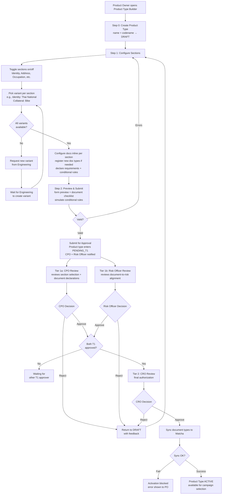
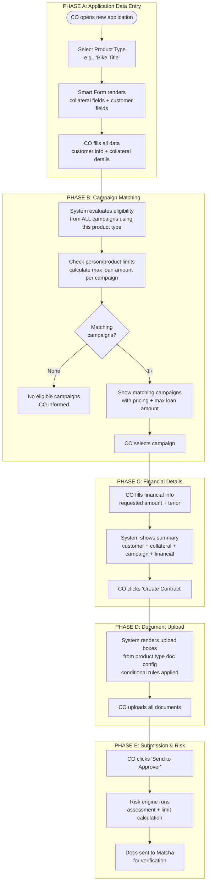
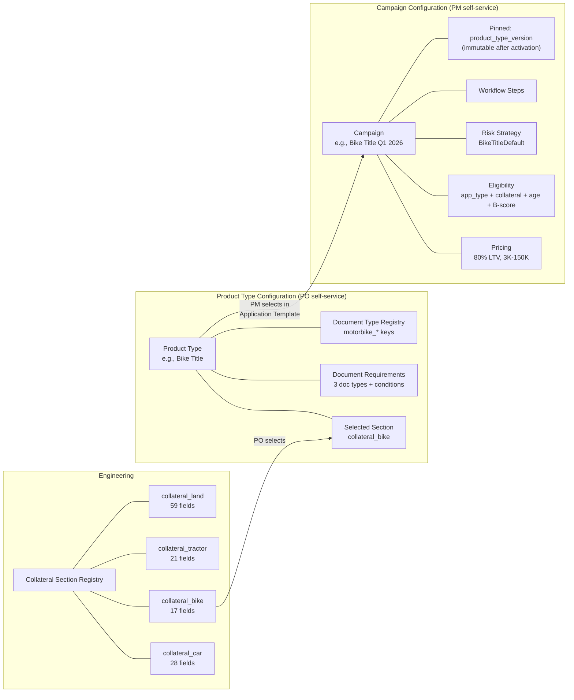

# Capability: Product Type Configuration

**Product**: Onigiri — [PRODUCT](../../PRODUCT.md)
**Portfolio**: Credit
**Product Owner**: TBD (Credit PO)
**Status**: 📝 Draft — @FEATURE decomposition pending
**Last Updated**: 2026-03-18

---

## Business Function

Define and manage collateral-backed product types — assembling application templates from multiple sections (standard customer sections + collateral section), configuring document requirements, and registering document types — through an Admin UI, so that new product types can be assembled and launched without engineering involvement beyond initial collateral section creation.

## Why It Exists (First Principles)

- **Reduced User Complexity**: Collateral sections are complex (17–60+ fields with types, validation, conditional logic). Engineering pre-creates these sections as reusable building blocks. POs **select** a section and configure documents — they don't build forms from scratch.
- **Partial Zero-Code Product Type Assembly**: Of the original engineering steps required to launch a new collateral type, document type registration and document requirement declaration are now **self-service**. Two engineering dependencies remain: (1) section variant creation in Smart Form, and (2) data extraction template creation for new document types. Both are reusable building blocks that rarely change once created.
- **Upstream Enabler for Campaign Configuration**: A campaign selects a product type — it doesn't define one. Product types are reusable building blocks configured once and used across many campaigns.
- **Governance**: Product type definitions carry risk impact (they determine what fields, documents, and data flow into the risk engine). A two-tier approval workflow ensures cross-functional sign-off before a product type becomes available for campaign use.

---

## Feature Inventory

| Feature | Status | Owner | Description |
|---------|--------|-------|-------------|
| [Collateral Section Registry](features/FEATURE_collateral-section-registry.md) | Concept | Engineering | Engineering pre-creates collateral sections (field definitions, validation, conditional visibility). PO selects from available sections when assembling a product type. |
| [Document Requirement Declaration](features/FEATURE_document-requirement-declaration.md) | Concept | PO (self-service) | Declare evidence requirements per section (what customer must bring + upload box configuration) with conditional inclusion rules. Evidence references document types for AI classification. |
| [Document Type Registration](features/FEATURE_document-type-registration.md) | Concept | Engineering | Engineering-owned document type registry — AI classification categories (e.g., `copy_of_id_card`). Synced to Matcha at product type activation. Same type can map to multiple evidence entries. |
| [Product Type Publication Authorization](features/FEATURE_product-type-publication-authorization.md) | Concept | Cross-functional | Two-tier approval workflow (CPO + Risk Officer → CRO) before a product type becomes ACTIVE |
| [Product Type Builder](features/FEATURE_product-type-builder.md) | Concept | Engineering (UI) / PO | 3-step wizard: Create → Configure Sections (select variants + declare document requirements inline per section) → Preview & Submit. Each section card shows fields + documents together in context. Integration point for Campaign Configuration. |

---

## Business Rules

### Product Type as a Reusable Building Block

A product type is a **template** — it defines what a collateral-backed loan product looks like (fields, documents, conditions). A campaign **references** a product type and adds pricing, eligibility, risk strategy, and workflow configuration on top.

| Concept | Owns | Created By | Used By |
|---------|------|-----------|---------|
| **Collateral Section** | Field definitions, validation rules, conditional visibility, lockpoint groups | **Engineering** | Product Type (selected by PO) |
| **Product Type** | Collateral section selection + document requirements + document type keys | **PO** (assembles from engineering-provided sections) | Campaign Configuration (Application Template dimension) |
| **Campaign** | Pricing, eligibility, risk strategy, workflow steps + product type reference | **PM** | Loan applications |

**One product type → many campaigns.** Example: Product type "Bike Title" is used by campaigns "Bike Title Q1 2026", "Bike Title Promo Summer 2026", etc.

**Campaign integration:** Campaign Configuration's "Application Template Assignment" feature selects an ACTIVE product type — see [FEATURE](../loan-campaign-configuration/features/FEATURE_application-template-assignment.md). Campaign pins `product_type_version` at activation; in-flight applications use the pinned version.

### Application Template: Sections & Variants

An application template (product type) is composed of **multiple sections** that together define what data the Credit Officer collects. Each section can have **multiple variants** — different field configurations for different use cases. The PO selects which sections to include and picks one variant per section.

Section and variant definitions (field specs, types, validation, Thai labels) are owned by the [Smart Form capability](../smart-form/CAPABILITY.md#section--variant-registry). Product Type Configuration selects from Smart Form's Section & Variant Registry to assemble application templates.

| Concept | Definition |
|---------|-----------|
| **Section** | A category of data collection (e.g., Identity, Address, Collateral). Sections are toggleable — PO decides which to include in the template. |
| **Variant** | A specific field configuration within a section. Each variant has a different field set. Engineering creates variants; PO selects one per included section. |

**Rules:**
- The **Collateral** section is always required (cannot be toggled off)
- All other sections are optional — PO toggles on/off per product type
- Exactly **one variant** per included section
- Engineering creates new variants; PO selects from available variants

**Example — Bike Title product type:**
- Identity: Thai National (12) + Address: Standard (15) + Occupation: Employed (10) + Collateral: Bike (17) = **54 fields across 4 sections**

### 3-Level Document Hierarchy

Onigiri models documents in three levels. Understanding this hierarchy is essential for configuring product types:

| Level | What It Is | Owner | Example |
|-------|-----------|-------|---------|
| **Document Type** | AI classification category — tells Matcha what kind of document it's looking at | **Engineering** | `copy_of_id_card`, `vehicle_registration_book`, `income_certificate` |
| **Evidence** | What the customer must bring to CO — a named requirement configured per section | **PO** (in Product Type Builder) | "สำเนาบัตรประชาชนผู้กู้" (Customer ID Card), "สมุดทะเบียนรถ" (Registration Book) |
| **Upload Box** | A specific upload slot within an evidence — what the CO actually uploads | **PO** (per evidence) | "หน้าปก", "หน้ากรรมสิทธิ์ล่าสุด", "หน้าภาษี" |

**Key rules:**
- **One document type → many evidence entries.** Both "Customer ID Card" and "Guarantor ID Card" use document type `copy_of_id_card` — same AI classification, different upload contexts.
- **One evidence → many upload boxes.** "Car Registration Book" has 6 upload boxes (หน้าปก, หน้ากรรมสิทธิ์ล่าสุด, หน้ากรรมสิทธิ์ก่อนหน้า, หน้าภาษี, etc.).
- **Evidence is per section.** Configured in the section's accordion card in Product Type Builder.
- **Two evidence categories:** (1) Customer/guarantor documents — PO-configured per section, and (2) System-generated documents (Contract, PDPA, Insurance Form) — always the same across all product types.

### Product Type Configuration Dimensions

| Dimension | What It Configures | Owner | How |
|-----------|-------------------|-------|-----|
| **Sections & Variants** | Which sections to include and which variant per section — selected from [Smart Form's Section & Variant Registry](../smart-form/CAPABILITY.md#section--variant-registry) | **PO** selects sections + variants; **Engineering** creates variants | Admin UI: toggle sections on/off, pick variant per section from dropdown |
| **Evidence Requirements** | Which evidence is required per section, with upload box configuration and conditional rules | **PO** (self-service) | Admin UI: add evidence per section → configure upload boxes (order, allow multiple, min/max files, tooltip) → set conditional rules |
| **Document Types** | AI classification categories for the document verification system | **Engineering** | Engineering registers types in Onigiri registry; synced to Matcha at activation |
| **Data Extraction Templates** | Which application fields map to Matcha's `check_name` keys per document type | **Engineering** creates templates | Engineering seeds templates; PO selects template per evidence entry |

### Section Variants: Engineering-Owned

All section variants (collateral and standard) are defined in [Smart Form's Section & Variant Registry](../smart-form/CAPABILITY.md#section--variant-registry). Engineering creates variants with full field definitions, validation rules, and conditional visibility logic. PO selects from available variants in the Product Type Builder.

**When a new variant is needed:** PO requests it → Engineering implements the variant in Smart Form → Variant registered in the Section & Variant Registry → PO can select it in the Product Type Builder.

This is the **one remaining engineering dependency** in the product type launch process. Document requirements and document type registration are fully self-service.

### Document Data Extraction: Three-Way Contract

Document verification spans two products. The boundary is:

| Concern | Owner | What They Configure | Stored Where |
|---------|-------|-------------------|--------------|
| **What to verify** (instructions) | Matcha / Operations | `DocumentVerificationItem` records: data items (`check_name`) and policy items (`check_description`, e.g., "มีลายเซ็น", "ข้อมูลตรงกับในระบบ") | Matcha DB |
| **Which fields to send** (extraction) | Onigiri / Engineering | Data Extraction Templates: maps Matcha `check_name` → application field path | Onigiri DB (`extraction_template`) |
| **Which evidence is required** (declarations) | Onigiri / PO | Evidence declarations per section, with upload box config + conditional rules + template selection | Onigiri DB (`document_verification_mapping`) |

**Data Extraction Templates** are engineering-owned mappings that tell Onigiri Worker which application fields to extract and send to Matcha for each document type. Engineering creates templates because the mapping requires understanding both Matcha's `check_name` keys and Smart Form's field structure.

**Example — `copy_of_id_card` (Customer ID Card):**

| Layer | Owner | Configuration |
|-------|-------|--------------|
| Matcha instruction | Operations | data item: `check_name = "id_card_number"` — verifier compares doc image vs this value |
| Matcha instruction | Operations | policy item: "มีลายเซ็น" — verifier checks visually |
| Extraction template | Engineering | `check_name: "id_card_number"` → application field: `identity.id_national_id` |
| Evidence declaration | PO | Product Type "Bike Title" → Identity section → Evidence "สำเนาบัตรประชาชนผู้กู้" → doc type: `copy_of_id_card`, template: `thai_id_card_standard`, 1 upload box |

**Runtime:** Onigiri Worker reads the extraction template, extracts field values from the application, builds `documents[].data = { "id_card_number": "1234567890123" }`, and sends to Matcha POST /task.

### Evidence Conditional Logic

POs can configure conditional evidence inclusion using a simple rule pattern:

| Rule Component | Configurable By PO | Example |
|---------------|-------------------|---------|
| Trigger field | Select from parent section's field list | `bike_act_type` |
| Trigger condition | `= value` | `= "RY-17"` |
| Target evidence | The evidence entry being configured | "ใบตรวจสอบจาก DLT" |
| Action | Include / Exclude | Exclude |

When an evidence entry is conditionally excluded, **all its upload boxes** are excluded too. Conditional logic operates at the evidence level, not individual upload box level.

At activation time, these rules are compiled into `conditional_expr` values in the `document_verification_mapping` table.

### Product Type Lifecycle States

| State | Mutability | Description |
|-------|------------|-------------|
| `DRAFT` | Fully editable | Product type is being configured |
| `PENDING_T1` | Read-only | Submitted; CPO + Risk Officer notified simultaneously |
| `PENDING_T2` | Read-only | Both T1 approved; awaiting CRO |
| `ACTIVE` | Append-only | Available for campaign selection; changes create new DRAFT version |
| `RETURNED` | Editable | Rejected at T1 or T2; back for revision |
| `ARCHIVED` | Read-only | Superseded or manually retired |

### Product Type as Application Entry Point (Runtime)

At runtime, the Credit Officer does **not** select a campaign first. Product Type is the entry point for application creation. The system matches eligible campaigns after customer data is collected.

| Phase | Name | What Happens | Data Source |
|-------|------|-------------|-------------|
| **A** | Application Data Entry | CO selects product type → Smart Form renders all included sections using their configured variants → CO fills data | Product Type → sections + variants (e.g., Identity: Thai National, Address: Standard, Collateral: Bike) |
| **B** | Campaign Matching | System evaluates eligibility from all campaigns using this product type + checks person/product limits → shows matching campaigns with pricing + max loan amount | Campaign → eligibility + pricing + limits |
| **C** | Financial Details | CO fills requested payment amount + selects tenor → system shows summary → CO clicks "Create Contract" | Campaign → tenors, pricing |
| **D** | Document Upload | System renders upload boxes from product type's document config (conditional rules applied) → CO uploads | Product Type → document_verification_mapping |
| **E** | Submission & Risk | CO clicks "Send to Approver" → risk engine runs → docs sent to Matcha for verification | Campaign → risk strategy |

**Why Product Type must be separate from Campaign:** Product Type is selected in Phase A; Campaign is matched in Phase B. One product type serves many campaigns. Document upload boxes (Phase D) are driven by the product type's document configuration, not the campaign.

### Document Type Sync to Matcha

When a product type transitions to `ACTIVE`, Onigiri syncs any newly registered document types (Engineering-created) to Matcha via API:

| Step | System | Action |
|------|--------|--------|
| 1 | Onigiri | Reads all document types referenced by the product type's evidence declarations |
| 2 | Onigiri | Filters to types not yet synced (new registrations only) |
| 3 | Onigiri | Calls Matcha `POST /document-types` for each new type |
| 4 | Matcha | Creates `DocumentType` row; returns confirmation |
| 5 | Onigiri | Marks type as synced; product type activation completes |

**Failure handling:** If Matcha sync fails, product type activation is blocked. The PO sees a clear error: "Document type sync to Matcha failed. Contact support." This is a hard prerequisite — a product type cannot go ACTIVE with unsynced document types.

---

## User Flow

### Runtime: Credit Officer Application Flow (5 Phases)

---

## Relationship to Campaign Configuration

---

## NFRs

| NFR | Requirement |
|-----|-------------|
| Self-service product type assembly | POs assemble product types (section selection + document config) without code deployment. Only collateral section creation requires engineering. |
| Low user complexity | POs select from pre-built sections — they do not define fields, validation, or conditional visibility logic |
| Matcha sync reliability | Document type sync must succeed before product type activation completes |
| Version immutability | ACTIVE product types are append-only; changes create new DRAFT version |
| Audit trail | Every state transition and configuration change is logged immutably |

---

## Cross-Product Dependencies

| Dependency | Product | Type | Description |
|-----------|---------|------|-------------|
| Document Type Registration API | Matcha | API contract | Matcha must expose `POST /document-types` endpoint for Onigiri to register new types at activation time |
| Verification Config API | Matcha | API contract (reference) | `GET /api/document-verification/config/{documentTypeKey}` — Engineering references this to know which `check_name` keys exist per document type when creating Data Extraction Templates |

---

## Open Questions

- Should document type keys follow a naming convention enforced by the system (e.g., `<collateral>_<document_name>`)?
- How should product type retirement work when campaigns still reference it?
- ~~Should POs build collateral sections from scratch via a form builder?~~ **Resolved:** No. Engineering pre-creates sections to reduce user complexity and prevent configuration errors. PO selects from registry.
