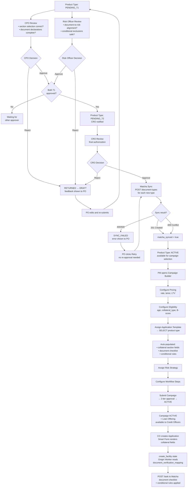

# Feature: Product Type Builder

**Capability**: [Product Type Configuration](../CAPABILITY.md)
**Product**: Onigiri — Loan Origination System
**Owner**: Engineering (UI) / PO (user)
**Status**: Concept
**Created**: 2026-03-12
**Last Updated**: 2026-03-18

---

## User Story

As a **Product Owner**, I want a **guided multi-step interface to assemble a new product type** by creating a product type record, configuring sections (selecting variants and declaring document requirements inline per section), previewing the configuration, and submitting for approval — so that **I can launch new collateral-backed product types without code deployment**.

## Job-to-be-Done

When a PO needs to define a new collateral-backed product type (e.g., Bike Title), they need a single coherent workflow that orchestrates all configuration steps — with document requirements visible in context alongside the sections they serve — validates completeness, and integrates with the downstream Campaign Configuration capability.

---

## Scope

**IS responsible for:**
- 3-step wizard UI guiding PO through product type assembly (Create → Configure Sections → Preview & Submit)
- Product type CRUD (create, read, update DRAFT records)
- Application template assembly: selecting sections, choosing a variant per section, and declaring evidence requirements with upload box configuration inline per section — so the PO sees fields + documents together in context
- Document type reference inline (select Engineering-registered document types when declaring evidence)
- Draft auto-save and resume across sessions
- Cross-section validation (e.g., conditional rule fields must exist in the section's selected variant)
- Preview and simulation of form + document checklist
- Submission trigger (DRAFT → PENDING_T1)
- Approval status display and SYNC_FAILED retry UI
- Integration point: ACTIVE product types available in Campaign Builder's Application Template dimension

**IS NOT responsible for:**
- Collateral section creation (Engineering — via Collateral Section Registry feature)
- Approval decision logic (Product Type Publication Authorization feature)
- Matcha API implementation (Matcha product)
- Campaign configuration (Loan Campaign Configuration capability)

---

## Workflow

### 3-Step Wizard Flow

The wizard merges section selection and evidence declaration into a single **Configure Sections** step. This keeps evidence requirements visible in context alongside the sections they serve — when a PO picks a collateral variant, they immediately see and configure which evidence (with upload boxes) is required for that section.

| Step | Name | What Happens |
|------|------|-------------|
| **0** | Create Product Type | Name + codename → DRAFT |
| **1** | Configure Sections | For each section: toggle on/off → pick variant → configure evidence requirements + upload boxes inline. Expandable accordion cards. |
| **2** | Preview & Submit | Full summary (form preview + document checklist + rule simulation) → Submit for approval |

```mermaid
flowchart TD
    START([PO opens Product Type Builder]) --> CREATE[Step 0: Create Product Type\nname + codename\nstatus: DRAFT]

    CREATE --> STEP1[Step 1: Configure Sections]

    subgraph "Step 1 — Per Section (accordion card)"
        STEP1 --> TOGGLE[Toggle sections on/off\nIdentity, Address, Occupation,\nIncome, References, Collateral]
        TOGGLE --> VARIANT[Pick variant per section\ne.g., Identity: Thai National\nCollateral: Bike]
        VARIANT --> FIELD_PREVIEW[Inline field preview\nshows variant's fields read-only]

        FIELD_PREVIEW --> EVIDENCE[Configure evidence requirements\n— inline below variant —]
        EVIDENCE --> ADD_EV[Add evidence entry\nname + select document type\nfrom Engineering registry]
        ADD_EV --> UPLOAD[Configure upload boxes\nname, order, allow multiple,\nmin/max files, tooltip]
        UPLOAD --> SET_REQUIRED{Always\nrequired?}
        SET_REQUIRED -- Yes --> SAVE_EV[Save evidence\nconditional_expr = null]
        SET_REQUIRED -- No --> COND_RULE[Configure conditional rule\nWHEN field = value\nTHEN INCLUDE/EXCLUDE]
        COND_RULE --> VALIDATE_FIELD{Trigger field\nin this variant?}
        VALIDATE_FIELD -- No --> ERR_FIELD[Error: 'Field not\nin selected variant']
        ERR_FIELD --> COND_RULE
        VALIDATE_FIELD -- Yes --> SAVE_EV
    end

    SAVE_EV --> SAVE1[Auto-save draft]
    SAVE1 --> STEP2

    STEP2 --> STEP2_TITLE[Step 2: Preview & Submit]
    STEP2_TITLE --> FORM_PREVIEW[Form Preview\nall sections rendered read-only]
    FORM_PREVIEW --> DOC_PREVIEW[Evidence Checklist Preview\nsystem-generated + section-specific\nwith upload box counts]
    DOC_PREVIEW --> SIMULATE[Simulate Conditional Rules\nenter sample values → see evidence include/exclude]
    SIMULATE --> FINAL_VALIDATE[System validates completeness:\n✓ Collateral variant selected\n✓ ≥1 evidence entry\n✓ All evidence has ≥1 upload box\n✓ All conditional fields exist\n✓ Sections still ACTIVE]
    FINAL_VALIDATE --> SUBMIT_OK{Validation\npassed?}
    SUBMIT_OK -- No --> BLOCK[Errors shown\nper section card]
    BLOCK --> STEP1
    SUBMIT_OK -- Yes --> PENDING[Product Type → PENDING_T1\nread-only from here]
    PENDING --> NOTIFY[CPO + Risk Officer\nnotified simultaneously]
```



### Section Configuration Card (UI Pattern)

Each section in Step 1 is rendered as an expandable accordion card:

```
┌─────────────────────────────────────────────────────────────────────┐
│ [x] Identity — Thai National                                  [v] ▼ │
│     12 fields · 2 evidence items · 2 upload boxes                   │
│ ┌─────────────────────────────────────────────────────────────────┐ │
│ │ Variant: [Thai National ▼]                                      │ │
│ │ Fields: id_national_id, title_th, first_name_th, ...            │ │
│ ├─────────────────────────────────────────────────────────────────┤ │
│ │ 📄 Evidence Requirements                                       │ │
│ │ ┌──────────────────────────────┬──────────────┬────────┬──────┐ │ │
│ │ │ Evidence                     │ Doc Type     │ Req'd  │ Boxes│ │ │
│ │ ├──────────────────────────────┼──────────────┼────────┼──────┤ │ │
│ │ │ สำเนาบัตร ปชช.ผู้กู้         │ copy_of_id   │ Always │ 1    │ │ │
│ │ │ สำเนาบัตร ปชช.ผู้ค้ำ         │ copy_of_id   │ Always │ 1    │ │ │
│ │ └──────────────────────────────┴──────────────┴────────┴──────┘ │ │
│ │ [+ Add Evidence]                                                │ │
│ │                                                                  │ │
│ │ ▸ สำเนาบัตร ปชช.ผู้กู้  (expanded upload boxes)                 │ │
│ │   ┌─────┬────────────────┬─────────┬─────┬─────┬───────────┐    │ │
│ │   │ Ord │ Upload Box     │ Multi?  │ Min │ Max │ Tooltip   │    │ │
│ │   ├─────┼────────────────┼─────────┼─────┼─────┼───────────┤    │ │
│ │   │  1  │ สำเนาหน้า-หลัง │ No      │  1  │  1  │ —         │    │ │
│ │   └─────┴────────────────┴─────────┴─────┴─────┴───────────┘    │ │
│ │   [+ Add Upload Box]                                             │ │
│ └─────────────────────────────────────────────────────────────────┘ │
└─────────────────────────────────────────────────────────────────────┘

┌─────────────────────────────────────────────────────────────────────┐
│ [x] Collateral — Bike  (required)                           [v] ▼   │
│     17 fields · 3 evidence items · 8 upload boxes                   │
│ ┌─────────────────────────────────────────────────────────────────┐ │
│ │ Variant: [Bike ▼]                                               │ │
│ │ Fields: bike_brand, bike_model, bike_year, bike_act_type...     │ │
│ ├─────────────────────────────────────────────────────────────────┤ │
│ │ 📄 Evidence Requirements                                       │ │
│ │ ┌──────────────────────────────┬──────────────┬────────┬──────┐ │ │
│ │ │ Evidence                     │ Doc Type     │ Req'd  │ Boxes│ │ │
│ │ ├──────────────────────────────┼──────────────┼────────┼──────┤ │ │
│ │ │ สมุดทะเบียนรถจักรยานยนต์     │ vehicle_reg  │ Always │ 6    │ │ │
│ │ │ กรมธรรม์ประกันภัย             │ insurance    │ Always │ 1    │ │ │
│ │ │ ใบตรวจสอบจาก DLT             │ dlt_web_page │ Cond.  │ 1    │ │ │
│ │ └──────────────────────────────┴──────────────┴────────┴──────┘ │ │
│ │ [+ Add Evidence]                                                │ │
│ │                                                                  │ │
│ │ ▸ สมุดทะเบียนรถจักรยานยนต์  (expanded upload boxes)             │ │
│ │   ┌─────┬──────────────────────────────┬───────┬─────┬─────┐    │ │
│ │   │ Ord │ Upload Box                   │ Multi │ Min │ Max │    │ │
│ │   ├─────┼──────────────────────────────┼───────┼─────┼─────┤    │ │
│ │   │  1  │ รูปถ่ายหลักประกันกับลูกค้า    │ No    │  1  │  1  │    │ │
│ │   │  2  │ หน้าปก                        │ No    │  1  │  1  │    │ │
│ │   │  3  │ หน้ากรรมสิทธิ์ล่าสุด           │ No    │  1  │  1  │    │ │
│ │   │  4  │ หน้ากรรมสิทธิ์ก่อนหน้า         │ No    │  1  │  1  │    │ │
│ │   │  5  │ หน้าภาษี                      │ No    │  1  │  1  │    │ │
│ │   │  6  │ หน้าบันทึก จนท.18 เป็นต้นไป    │ Yes   │  1  │  5  │    │ │
│ │   └─────┴──────────────────────────────┴───────┴─────┴─────┘    │ │
│ │   [+ Add Upload Box]                                             │ │
│ └─────────────────────────────────────────────────────────────────┘ │
└─────────────────────────────────────────────────────────────────────┘
```

### Approval → Activation → Campaign Flow



---

## Acceptance Criteria

### Step 0: Create Product Type

- **AC-1**: PO creates a new product type in DRAFT status → product type record created with name, codename, description, version=1, status=DRAFT; codename validated as unique snake_case; audit trail entry logged with actor ID and timestamp

### Step 1: Configure Sections (merged: sections + variants + documents)

- **AC-2a**: PO selects sections for the application template → sections sourced from [Smart Form's Section & Variant Registry](../../smart-form/CAPABILITY.md#section--variant-registry); sections available: Identity, Address, Occupation, Income & Expenses, References, Collateral; PO toggles on/off which sections to include; Collateral section is always required (cannot be toggled off)
- **AC-2b**: PO selects a variant for each included section → variants sourced from [Smart Form's Section & Variant Registry](../../smart-form/CAPABILITY.md#section--variant-registry); each section has one or more variants (e.g., Identity: Thai National / Foreigner / Corporate; Collateral: Bike / Car / Tractor / Land); only ACTIVE variants shown; product type stores `section_variant_ids[]` mapping each section to its chosen variant
- **AC-2c**: Each section card shows variant fields inline (read-only preview) and evidence requirements + upload boxes below → PO sees the full picture per section: fields + documents together in context
- **AC-3**: PO adds evidence entries per section, selecting from Engineering-registered document types → same document type can be used for multiple evidence entries (e.g., `copy_of_id_card` for customer + guarantor); PO configures upload boxes per evidence (name, order, allow multiple, min/max files, tooltip message, tooltip image)
- **AC-4**: PO declares evidence requirements per section with conditional rules → Document Requirement Declaration feature invoked inline within the section card; conditional rule trigger field validated against that section's selected variant field list; system-generated documents (Contract, PDPA, Insurance Form) auto-included and shown but not editable

### Step 2: Preview & Submit

- **AC-5**: PO previews the complete configuration before submission → form preview renders all included sections with their chosen variants (read-only); evidence checklist shows all evidence grouped by section with upload box counts (system-generated + section-specific); PO can enter sample field values to simulate conditional inclusion/exclusion; conditional rules evaluate in real-time
- **AC-6**: Builder validates completeness before allowing submission → submission blocked if: no collateral variant selected, zero evidence entries declared, any evidence has zero upload boxes, or any conditional rule references a field not in the selected variant; each included section must have a variant selected; validation errors displayed per section card
- **AC-7**: PO submits product type → status transitions to PENDING_T1; product type becomes read-only; CPO and Risk Officer notified simultaneously; PO sees approval status dashboard

### General

- **AC-8**: PO can save and resume a DRAFT product type → partially configured product type persists across sessions; PO can return and continue from any step

### Approval Status & Sync

- **AC-9**: Builder displays approval status after submission → shows T1 approver statuses (CPO: approved/pending, Risk Officer: approved/pending); shows T2 status (CRO: pending/approved/rejected); if RETURNED: shows rejection feedback, PO can edit and re-submit
- **AC-10**: Builder handles SYNC_FAILED state → if Matcha sync fails after CRO approval, shows error message; retry button available, no re-approval needed; on retry success, product type transitions to ACTIVE

### Campaign Integration

- **AC-11**: ACTIVE product type appears in Campaign Builder → Campaign Configuration's "Application Template" dimension lists the new product type; selecting it auto-populates collateral section and document checklist
- **AC-12**: Campaign carries product type data to runtime → application created under campaign stores `product_type_id` + `product_type_version`; at `create_facility` state, Onigiri Worker reads `document_verification_mapping` rows from pinned product type version; Matcha POST /task payload includes correct document checklist with conditional rules applied
- **AC-13**: Product type version pinning → campaign pins to a specific `product_type_version` at campaign activation; if PO publishes v2, existing campaigns continue using v1; new campaigns can select v2

---

## Edge Cases and Error States

| Scenario | Expected Behavior |
|----------|-------------------|
| PO selects a section, then Engineering deprecates it before submission | Validation error at submit: "Selected section is no longer ACTIVE" |
| PO registers a doc type key that conflicts with Matcha-seeded type | Rejected with "Key already exists" message |
| Two POs create product types with the same codename concurrently | Second save fails with uniqueness error |
| CRO approves but Matcha is down | SYNC_FAILED state; retry without re-approval |
| PO tries to edit an ACTIVE product type | System creates a new DRAFT version (v2) |
| PO archives a product type that has ACTIVE campaigns | Campaigns keep working (version pinned); no new campaigns can select it |
| PM selects a product type, then PO publishes v2 | Campaign still references v1 (pinned at activation) |
| PO navigates away mid-wizard | Draft auto-saved; PO can resume from any step |

---

## Concrete Example: Bike Title Loan

**Project goal:** Add Bike Title Loan as a new offering in the system.

| Phase | Step | Actor | Action | System State |
|-------|------|-------|--------|-------------|
| **1. Engineering** | 1.1 | Engineering | Implement `collateral_bike` (17 fields), register in Section Registry | Section: ACTIVE |
| **2. Product Type** | 2.1 | PO | **Step 0:** Create product type "Bike Title" (`bike_title`) | PT: DRAFT |
| | 2.2 | PO | **Step 1:** Toggle on Identity, Address, Occupation, Collateral. Pick variants: Identity → Thai National, Address → Standard, Occupation → Employed, Collateral → Bike | PT: DRAFT (4 sections, 54 fields) |
| | 2.3 | PO | **Step 1 (Collateral card):** Add 3 evidence entries inline — "สมุดทะเบียนรถจักรยานยนต์" (doc type: `vehicle_registration_book`, 6 upload boxes), "กรมธรรม์ประกันภัย" (doc type: `insurance_policy`, 1 box), "ใบตรวจสอบ DLT" (doc type: `dlt_web_page`, 1 box, rule: `WHEN bike_act_type = "RY-17" THEN EXCLUDE`) | PT: DRAFT (evidence configured per section) |
| | 2.4 | PO | **Step 1 (Identity card):** Add 2 evidence entries — "สำเนาบัตร ปชช.ผู้กู้" + "สำเนาบัตร ปชช.ผู้ค้ำ" (both doc type: `copy_of_id_card`, 1 upload box each) | PT: DRAFT |
| | 2.5 | PO | **Step 2:** Preview form + evidence checklist; simulate `bike_act_type = "RY-17"` → verify DLT evidence excluded | Preview validated |
| | 2.6 | PO | **Step 2:** Submit for approval | PT: PENDING_T1 |
| **3. Approval** | 3.1 | CPO | Reviews section + documents → Approve | T1: 1/2 |
| | 3.2 | Risk Officer | Reviews risk alignment → Approve | T1: 2/2 → PENDING_T2 |
| | 3.3 | CRO | Final authorization → Approve | Matcha sync triggered |
| | 3.4 | System | Sync 3 doc types to Matcha API | PT: ACTIVE |
| **4. Campaign** | 4.1 | PM | Create campaign "Bike Title Loan - Bangkok Q2" | Campaign: DRAFT |
| | 4.2 | PM | Pricing: 1.25%, 12-48mo, LTV 80% | |
| | 4.3 | PM | Eligibility: age 20-70, collateral_type=bike | |
| | 4.4 | PM | Application Template → select "Bike Title" product type | Auto-populates form + docs |
| | 4.5 | PM | Risk Strategy → `BikeTitleDefault` | |
| | 4.6 | PM | Submit → 2-tier approval → ACTIVE | Campaign: ACTIVE |
| **5. Operations (Phase A)** | 5.1 | CO | Selects "Bike Title" product type | App: product type selected |
| | 5.2 | System | Renders Smart Form (17 bike fields + customer fields) | Form rendered |
| | 5.3 | CO | Fills customer + collateral data | Data entered |
| **5. Operations (Phase B)** | 5.4 | System | Evaluates eligibility + checks person/product limits | Matching campaigns found |
| | 5.5 | System | Shows 2 matching campaigns: "Bike Q2" (1.25%, max 150K), "Bike Promo" (0.99%, max 100K) | Campaigns presented |
| | 5.6 | CO | Selects "Bike Q2" (1.25%, 12-48mo, LTV 80%) | Campaign selected |
| **5. Operations (Phase C)** | 5.7 | CO | Fills financial info: requested 80K, tenor 36mo | Financial details entered |
| | 5.8 | System | Shows summary (customer + collateral + campaign + financial) | Summary displayed |
| | 5.9 | CO | Clicks "Create Contract" | Contract created |
| **5. Operations (Phase D)** | 5.10 | System | Renders evidence with upload boxes: สมุดทะเบียน (6 boxes), ประกันภัย (1 box); DLT evidence excluded per rule | Upload UI rendered |
| | 5.11 | CO | Uploads all documents | Documents uploaded |
| **5. Operations (Phase E)** | 5.12 | CO | Clicks "Send to Approver" | Submitted |
| | 5.13 | System | Risk engine runs assessment + limit calculation | Risk evaluated |
| | 5.14 | System | Sends docs to Matcha for verification | Matcha task created |

---

## Dependencies

| Dependency | Feature | Type | Description |
|-----------|---------|------|-------------|
| Smart Form — Section & Variant Registry | External capability | Data source | Provides all section/variant definitions (field specs, types, validation, Thai labels) for the section picker |
| Collateral Section Registry | Feature 1 | Data source | Provides section picker data (read-only for PO) |
| Document Type Registration | Feature 2 | Data source | Engineering-registered document types available for PO to reference when declaring evidence |
| Document Requirement Declaration | Feature 3 | Inline invocation | PO declares evidence requirements + configures upload boxes within the builder wizard |
| Product Type Publication Authorization | Feature 4 | State management | Handles approval workflow + Matcha sync after submission |
| Campaign Configuration | External capability | Integration | ACTIVE product types appear in Campaign Builder's Application Template picker |
