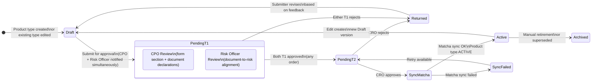

# Feature: Product Type Publication Authorization

**Parent Capability**: Product Type Configuration — [CAPABILITY](../CAPABILITY.md)
**Product**: Onigiri — [PRODUCT](../../../PRODUCT.md)
**Engineering Owner**: TBD
**Status**: Concept
**Last Updated**: 2026-03-10

---

## User Story

As a **CRO**, I want to review and approve new product type definitions before they can be used in campaigns, so that I maintain control over what collateral types the company accepts and what documents are collected.

## Job-to-be-Done

Product type definitions are high-impact: they determine which form fields appear, which documents are collected, and what data flows into the risk assessment engine. Without an approval gate, a PO could inadvertently define a product type that collects insufficient documentation or introduces fields that don't align with risk policies. This feature reuses the same two-tier parallel approval pattern as Campaign Publication Authorization — CPO + Risk Officer (Tier 1, parallel) → CRO (Tier 2, sequential) — ensuring cross-functional sign-off before any product type becomes available for campaign use.

---

## Architecture: Reuse of Underwriting Workflow State Machine

This feature defines a fourth workflow topology running on the same state machine engine:

```
Underwriting Workflow engine
    ├── Topology A: Loan Application Workflow           (existing)
    ├── Topology B: Rule Change Approval Workflow        (FEATURE_rule-change-authorization)
    ├── Topology C: Campaign Publication Workflow        (FEATURE_campaign-publication-authorization)
    └── Topology D: Product Type Publication Workflow    (this feature)
```

Topologies B, C, and D are structurally symmetric: same two-tier parallel approval pattern, same engine, different entities and execution steps.

---

## Approval Workflow Diagram



---

## Workflow Topology

| State | Description | Execution Steps |
|-------|-------------|-----------------|
| `DRAFT` | Product type is being configured; all dimensions editable | PO configures collateral section, document requirements, document type registrations |
| `PENDING_T1` | Submitted; awaiting parallel T1 approvals | Notify CPO + Risk Officer simultaneously; enforce role checks; track individual approvals |
| `PENDING_T2` | Both T1 approved; awaiting CRO | Notify CRO; display full product type config summary including collateral section preview and document checklist |
| `ACTIVE` | CRO approved + Matcha sync complete; product type available for campaign selection | Append-only; changes create new DRAFT version |
| `RETURNED` | Rejected at T1 or T2; back for revision | Notify submitter with feedback; reset T1 approval tracking; return to DRAFT |
| `SYNC_FAILED` | CRO approved but Matcha sync failed | PO sees error; retry button available; no re-approval needed |
| `ARCHIVED` | Superseded or manually retired | Read-only; existing campaigns continue to reference this version |

---

## Tier 1 Review Responsibilities

| Approver | Reviews | Checks |
|----------|---------|--------|
| **CPO** | Collateral section definition + document declarations | Are the right fields captured? Are the right documents collected? Does this align with business intent? |
| **Risk Officer** | Document-to-risk alignment + field completeness | Do the collected documents and fields provide sufficient data for risk assessment? Are conditional exclusions safe? |

---

## Acceptance Criteria

| # | Criterion | Pass Condition |
|---|-----------|---------------|
| AC-1 | Product type edited or created → `DRAFT` | All dimensions editable; not yet available for campaign selection |
| AC-2 | Submit → `PENDING_T1` | Product type becomes read-only; CPO AND Risk Officer notified simultaneously |
| AC-3 | Either T1 rejects → `RETURNED` | Returns to DRAFT; feedback reason recorded; submitter notified; T1 tracking reset |
| AC-4 | One T1 approves, other has not yet acted | Stays `PENDING_T1`; waiting state visible on both approver dashboards |
| AC-5 | Both T1 approve → `PENDING_T2` | CRO notified; product type config summary displayed |
| AC-6 | CRO approves → Matcha sync triggered | Document types synced; on success → `ACTIVE` |
| AC-7 | Matcha sync fails → `SYNC_FAILED` | PO sees error; retry available without re-approval |
| AC-8 | CRO rejects → `RETURNED` | CRO feedback recorded; submitter notified |
| AC-9 | Submitter cannot self-approve T1 | System enforces: submitter's own T1 approval action rejected regardless of role |
| AC-10 | `ACTIVE` product type is append-only | Any modification creates a new DRAFT version; ACTIVE version immutable |
| AC-11 | `ACTIVE` product type appears in campaign builder | Campaign's Application Template dimension can select this product type |
| AC-12 | Immutable audit trail | Every state transition logged: actor ID, action, product type version snapshot, approver IDs, timestamp |
| AC-13 | Campaigns referencing old version unaffected | Activating new version does not alter campaigns referencing previous version |

---

## Edge Cases & Error States

| Scenario | Expected Behavior |
|----------|------------------|
| CPO and Risk Officer are the same person | Both T1 approvals must be explicitly acted on — same person completes both actions sequentially |
| Submitter holds both CPO and Risk Officer roles | Submitter cannot self-approve either T1 action |
| CRO role unassigned | Submission blocked at T2 with clear error message |
| Two simultaneous edits to the same product type | Only one DRAFT version in `PENDING_T1` or `PENDING_T2` at a time; second edit blocked until first resolves |
| Submitter withdraws a `PENDING_T1` version | Version returns to DRAFT; all in-progress T1 approvals voided; re-submission restarts the flow |
| Matcha sync times out | Product type enters `SYNC_FAILED`; PO retries; timeout threshold configurable |
| Product type archived while campaigns still reference it | Existing campaigns continue to work with the archived version; no new campaigns can select it |

---

## Dependencies

| Dependency | Type | Notes |
|-----------|------|-------|
| Underwriting Workflow state machine engine | Internal — [CAPABILITY](../../underwriting-workflow/CAPABILITY.md) | Provides the fixed-topology + configurable execution steps infrastructure |
| Campaign Publication Authorization | Internal — [FEATURE](../../loan-campaign-configuration/features/FEATURE_campaign-publication-authorization.md) | Mirror feature; same pattern, different entity |
| Document Type Registration | Internal — [FEATURE](FEATURE_document-type-registration.md) | Matcha sync triggered at activation |
| RBAC / role system | Internal platform | Must support role checks for CPO, Risk Officer, CRO at transition time |
| Immutable audit trail | Internal | INSERT-only; no UPDATE/DELETE at application layer |
