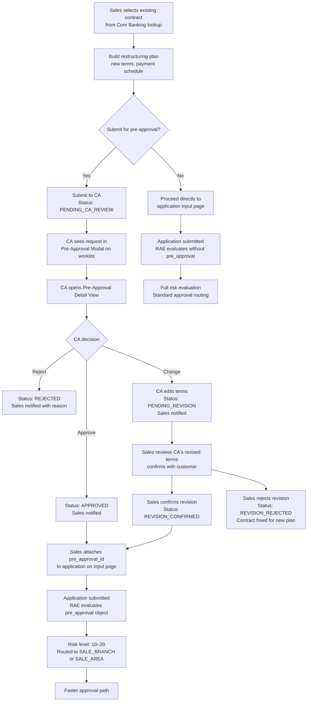

# Capability: Restructure Pre-Approval

**Product**: Onigiri — [PRODUCT](../../PRODUCT.md)
**Portfolio**: Credit
**Product Owner**: TBD (Credit PO)
**Status**: 📝 Draft
**Last Updated**: 2026-05-25

---

## Business Function

Allow the sales team to build a restructuring payment plan for an existing loan contract and optionally submit it to CA for pre-approval before the customer submits a formal application. A CA-approved pre-approval plan, when attached to the application, causes the Risk Assessment Engine to produce a lower risk level (10–20), routing the application to SALE_BRANCH or SALE_AREA for final approval instead of CA — materially reducing origination cycle time.

## Why It Exists (First Principles)

- **Cycle Time Reduction**: Restructuring applications that go through the full CA approval path take significantly longer. Pre-approval front-loads the credit judgment before the customer even fills in the form, so the downstream workflow can run at branch/area speed.
- **Customer Experience**: A sales officer who can present a pre-approved restructuring offer to the customer converts the conversation from exploration to commitment — reducing customer drop-off during the application phase.
- **Optional, Not Mandatory**: Forcing pre-approval would add friction to simple cases. The flow is opt-in — the application can proceed directly to input without it.
- **RAE-Driven, Not Workflow-Bypassing**: The pre-approval reduces risk level via the RAE strategy rule evaluation, not by skipping workflow states. The underwriting topology remains unchanged. This preserves auditability and topology integrity.

---

## Feature Inventory

| Feature | Status | Description |
|---------|--------|-------------|
| [Restructure Plan Builder](features/FEATURE_restructure-plan-builder.md) | Spec | Sales team selects an existing loan contract and builds a proposed restructuring plan (new terms, payment schedule). Submits for CA pre-approval optionally, or proceeds directly to application input without pre-approval. |
| [Pre-Approval Request Tracker](features/FEATURE_pre-approval-request-tracker.md) | Spec | Sales-side view showing all pre-approval requests submitted by the team: status (Pending / Approved / Pending Revision / Rejected), CA's comments, and revised terms if CA changed the plan. |
| [Pre-Approval Worklist Modal](features/FEATURE_pre-approval-worklist-modal.md) | Spec | A button on the CA Application Approval worklist page that opens a modal listing pending pre-approval requests routed to `CA` group_role. Separate from the normal application list. |
| [Pre-Approval Detail View](features/FEATURE_pre-approval-detail-view.md) | Spec | CA-facing detail page showing the proposed restructuring plan: contract summary, proposed new terms, payment schedule, and customer context. |
| [Pre-Approval Decision](features/FEATURE_pre-approval-decision.md) | Spec | CA's three actions on the detail page: Approve (plan accepted as-is), Change (CA edits terms → sent back to sales for customer re-confirmation), Reject (plan rejected with reason). |

---

## Business Rules

### Pre-Approval Lifecycle

```
DRAFT → PENDING_CA_REVIEW → APPROVED
                          → REJECTED
                          → PENDING_REVISION → REVISION_CONFIRMED (→ treated as APPROVED with revised terms)
                                             → REVISION_REJECTED  (→ sales may submit a new plan for the same contract)
```

| Status | Meaning | Who Sets It |
|--------|---------|-------------|
| `DRAFT` | Plan built but not yet submitted for pre-approval | Sales |
| `PENDING_CA_REVIEW` | Submitted to CA, awaiting decision | System (on submit) |
| `APPROVED` | CA approved the plan as-is | CA |
| `REJECTED` | CA rejected the plan | CA |
| `PENDING_REVISION` | CA changed terms; waiting for sales/customer re-confirmation | System (on CA Change) |
| `REVISION_CONFIRMED` | Sales confirmed CA's revised terms | Sales |
| `REVISION_REJECTED` | Sales declined CA's revised terms | Sales |

`APPROVED` and `REVISION_CONFIRMED` are the two statuses that confer pre-approval benefit on the linked application.

After `REVISION_REJECTED`, the pre-approval record is closed. Sales may submit a **new** pre-approval for the same contract (the 1-per-contract constraint applies only to active pre-approvals — see below).

### RAE Integration: Pre-Approval Impact on Risk Level

When an application is submitted with a linked `pre_approval_id` referencing an `APPROVED` or `REVISION_CONFIRMED` pre-approval record, the application JSON contains a `pre_approval` object. The RAE strategy for restructuring campaigns includes a policy that evaluates this object:

- If `pre_approval.status` is `APPROVED` or `REVISION_CONFIRMED` **and** the pre-approval has not expired → the pre-approval policy rule produces a **lower risk contribution** for that policy
- If `pre_approval.status` is absent, `REJECTED`, `REVISION_REJECTED`, or expired → the pre-approval policy does not fire; application evaluated at full risk under remaining policies

**The final risk level is still the RAE aggregate** (max across all evaluated policies). The pre-approval lowers the contribution of the restructuring-specific policy, but other policies in the strategy still evaluate independently. The final routed approver depends on what the RAE produces as the aggregate risk level — it is not guaranteed to always be `SALE_BRANCH` or `SALE_AREA`.

The risk level reduction is a **RAE rule output**, not a workflow bypass. The application enters `pending_approval` and routes to whatever approver the aggregate risk level designates.

### Pre-Approval Expiry

CA sets an explicit **expiry date** for each plan at the time of approval. The expiry date is a required field in the Approve action. After the expiry date passes, the pre-approval loses its risk-reduction benefit — the RAE pre-approval policy does not fire for expired records.

The expiry date is set per-plan at CA's discretion, reflecting the CA's judgment of how long the proposed terms remain viable given market conditions.

### One Pre-Approval per Contract (Active)

A contract may have only **one active pre-approval** at a time. "Active" means status is `DRAFT`, `PENDING_CA_REVIEW`, `PENDING_REVISION`, `APPROVED`, or `REVISION_CONFIRMED`.

A new pre-approval for the same contract may be submitted only after the existing pre-approval reaches a closed status: `REJECTED`, `REVISION_REJECTED`, or `EXPIRED`.

### Contract Source

The existing loan contract selected by the sales team is retrieved from **Core Banking** (read-only lookup by contract number / customer ID). Onigiri does not own contract data. The contract details (outstanding balance, current terms, product type, remaining tenure) are fetched at plan creation time and stored as a snapshot on the pre-approval record.

### CA Pre-Approval is CA-Only

Pre-approval requests are always routed to `CA` group_role regardless of the risk level the pre-approved application would eventually produce. The CA is the credit authority validating the restructuring terms before the customer commits.

---

## User Flow



---

## NFRs

| NFR | Requirement |
|-----|-------------|
| Pre-approval is optional | No application is blocked from proceeding without a pre-approval. The input page accepts applications with or without a linked pre-approval ID. |
| Audit trail | Every pre-approval status transition is recorded with actor, role, timestamp, and reason. Immutable. |
| Contract data snapshot | Contract details from Core Banking are snapshotted at plan creation time. The RAE and detail views display the snapshotted data — no live Core Banking re-fetch at review or approval time. |
| Expiry enforcement | CA sets an explicit expiry date per plan at approval time. Expired pre-approvals are silently skipped by the RAE (no risk reduction applied). The pre-approval record is flagged `EXPIRED` — not deleted. |
| CA-only routing | Pre-approval requests are always routed to `CA` group_role. No other group_role may action a pre-approval. |

---

## Open Questions

1. ~~Pre-approval expiry window~~ — **Resolved**: CA sets an explicit expiry date per plan at time of approval.
2. ~~Sales rejection of CA revision~~ — **Resolved**: Sales can reject CA's revised terms (`REVISION_REJECTED`). Contract is freed and sales may submit a new plan.
3. ~~Multiple pre-approvals per contract~~ — **Resolved**: One active pre-approval per contract. New submission is allowed only after the existing one reaches a closed status (`REJECTED`, `REVISION_REJECTED`, or `EXPIRED`).
4. **Contract data boundary** *(open)*: Confirm the Core Banking API or integration mechanism for read-only contract lookup. Onigiri must not write to Core Banking at pre-approval time.
5. ~~Risk level fixed or RAE-dependent~~ — **Resolved**: Risk level is not fixed. The pre-approval lowers the risk contribution of the restructuring-specific policy in the RAE strategy. The final aggregated risk level is still the RAE max across all policies.
