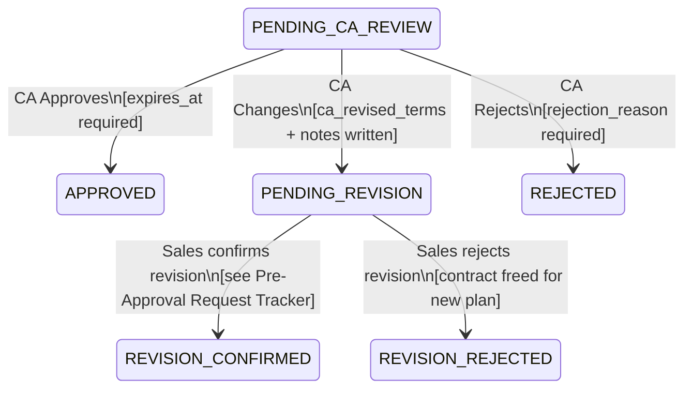

# Feature: Pre-Approval Decision

**Capability**: Restructure Pre-Approval — [CAPABILITY](../CAPABILITY.md)
**Product**: Onigiri — [PRODUCT](../../../PRODUCT.md)
**Engineering Owner**: TBD
**Status**: Spec

---

## User Story

As a **CA (Credit Analyst)**, I want to Approve, Change, or Reject a restructuring pre-approval request from the detail view, so that the sales team has a credible, CA-sanctioned plan to present to the customer or a clear reason why the plan was not accepted.

## Job-to-be-Done

Convert the CA's credit judgment into a structured outcome that is immediately visible to the sales team and, if approved, becomes a binding reference for the downstream application risk assessment.

---

## Acceptance Criteria

### General

1. The decision panel is rendered at the bottom of the Pre-Approval Detail View.
2. The panel is active only when: the pre-approval record is in `PENDING_CA_REVIEW` status AND the authenticated user has `CA` group_role.
3. Three actions are available: **Approve**, **Change**, **Reject**. Each requires an explicit confirmation before executing.
4. All three actions are recorded in an immutable audit log: `{ ca_id, ca_role, action, timestamp, reason/changes }`.

---

### Approve

5. The Approve action requires CA to enter an **expiry date** (date picker, required). This is the date after which the pre-approval no longer confers risk-reduction benefit on a linked application.
6. On confirmation:
   a. Pre-approval status transitions to `APPROVED`.
   b. `approved_by`, `approved_at`, `expires_at` (CA-entered date) written to the pre-approval record.
   c. Sales officer notified: "Pre-approval [reference] has been approved. Valid until [expires_at]."
7. On success, CA is returned to the worklist (modal closed, worklist refreshed).

---

### Change

8. The Change action opens an **inline edit form** on the detail page. CA can modify:

| Field | Editable |
|-------|----------|
| Proposed New Tenure (months) | Yes |
| Proposed Monthly Instalment | Yes |
| Proposed Interest Rate | Yes |
| Restructuring Fee | Yes |
| CA Notes to Sales | Yes — required (non-empty, max 500 characters) |

9. CA notes are mandatory when submitting a Change — the reason for revision must be documented.
10. The payment schedule preview recalculates in real-time as CA edits the fields, before submission.
11. On confirmation:
    a. Pre-approval status transitions to `PENDING_REVISION`.
    b. CA's revised terms are written to the pre-approval record as `ca_revised_terms: { tenure, instalment, rate, fee }`.
    c. Original sales terms are preserved as `original_proposed_terms` — immutable.
    d. Sales officer notified: "CA has revised the terms for pre-approval [reference]. Please review and confirm with the customer."
12. On success, CA is returned to the worklist.

---

### Reject

13. The Reject action requires CA to enter a `rejection_reason` (free text, non-empty, max 500 characters).
14. On confirmation:
    a. Pre-approval status transitions to `REJECTED`.
    b. `rejected_by`, `rejected_at`, `rejection_reason` written to the pre-approval record.
    c. Sales officer notified: "Pre-approval [reference] has been rejected. Reason: [rejection_reason]."
15. On success, CA is returned to the worklist.

---

## Status Transition Diagram



---

## Downstream Impact on Risk Assessment

When an application is linked to a pre-approval in `APPROVED` or `REVISION_CONFIRMED` status (and not yet expired), the application JSON includes:

```json
"pre_approval": {
  "id": "<pre_approval_id>",
  "status": "APPROVED",
  "approved_terms": {
    "tenure_months": ...,
    "monthly_instalment": ...,
    "interest_rate": ...,
    "restructuring_fee": ...
  },
  "approved_by": "<ca_user_id>",
  "approved_at": "<ISO 8601>",
  "expires_at": "<ISO 8601>"
}
```

The RAE restructuring strategy policy evaluates `pre_approval.status` and `pre_approval.expires_at`. A valid, non-expired pre-approval causes the pre-approval policy to produce a **lower risk contribution** for that policy. The final aggregated risk level is still the RAE max across all evaluated policies — the pre-approval lowers one policy's contribution but does not override other policy results.

For `REVISION_CONFIRMED` records, `approved_terms` contains CA's revised terms (not the original proposed terms).

---

## Concurrent Decision Handling

16. If two CA users open the same pre-approval simultaneously and both attempt to decide, the system uses an **optimistic lock** (version field on the pre-approval record).
    - First successful write advances the status.
    - Second write returns a conflict error: "This pre-approval has already been decided. Refreshing."

---

## Edge Cases and Error States

| Condition | Expected Behavior |
|-----------|-------------------|
| Pre-approval already decided when CA submits | Optimistic lock conflict error; page refreshed to current status |
| CA submits Change with no fields modified | Validation error: "No changes detected. Modify at least one term or use Approve." |
| CA submits Change with empty notes | Validation error: "CA notes are required when changing terms." |
| Sales notification fails to deliver | Transition is committed; notification is retried asynchronously. CA decision flow is not blocked by notification delivery. |

---

## Out of Scope

- CA initiating a new restructuring plan on behalf of the sales team
- Re-opening a `REJECTED` pre-approval (requires a new plan submission by sales)
- CA communicating directly with the customer

---

## Dependencies

- Pre-Approval Detail View must be loaded before the decision panel is active.
- Optimistic lock on the pre-approval record (version field).
- Pre-Approval Request Tracker feature handles the `PENDING_REVISION → REVISION_CONFIRMED` transition (sales side).
- Notification mechanism — open (see CAPABILITY.md Open Question #4).
