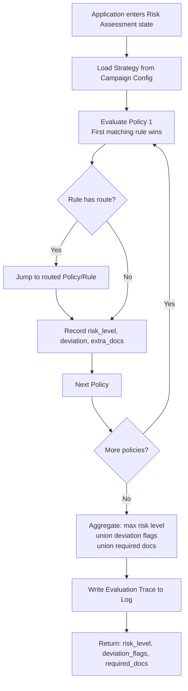

# Capability: Risk Assessment Engine

**Product**: Onigiri — [PRODUCT](../../PRODUCT.md)
**Portfolio**: Credit
**Product Owner**: TBD (Credit PO / Risk Officer)
**Status**: 📝 Draft — @FEATURE decomposition pending
**Last Updated**: 2026-03-04

---

## Business Function

Execute a configurable risk assessment strategy that evaluates loan applications against policies and rules to produce a risk level, deviation flags, and conditional document requirements — with zero code changes for rule modifications.

## Why It Exists (First Principles)

- **Market Volatility**: Subprime lending is highly susceptible to economic forces and special circumstances. Risk policies must change rapidly — sometimes weekly — in response to market conditions, regulatory changes, and portfolio performance.
- **Operational Agility**: If every risk rule change requires a code deployment, the business cannot react fast enough. The rule engine must be fully configurable by risk officers.
- **Auditability**: Every risk decision must be traceable back to which strategy, policy, and rule produced it. The evaluation chain must be logged and reproducible.

---

## Feature Inventory

| Feature | Status | Description |
|---------|--------|-------------|
| JMESPath Rule Evaluator | Concept | Extract values from JSON application object using JMESPath expressions; compare against parameters using configurable operators |
| Strategy/Policy/Rule Manager | Concept | Create, edit, activate/deactivate strategies, policies, and rules via admin UI — no code deployment |
| Risk Evaluation Executor | Concept | Run a named strategy against a JSON application object; produce aggregate risk level, deviation flags, required docs, and full evaluation trace |
| Evaluation Trace Logger | Concept | Immutable per-evaluation log: which strategy/policy/rule was evaluated, what value was extracted, what comparison was made, what result was produced |
| Rule Chaining (Route) | Concept | Rules can route evaluation to a specific policy or rule, enabling decision tree behavior without hardcoded branching |

---

## Business Rules

### Strategy → Policy → Rule Hierarchy

```
Strategy (e.g., "CarTitleDefault")
  └── Policy 1: Customer Nationality
      ├── Rule 1.1: Thai → Risk 10
      └── Rule 1.2: Non-Thai → Risk 99 + Deviation
  └── Policy 2: Customer Age
      ├── Rule 2.1: < 20 → Risk 70
      ├── Rule 2.2: 20–70 → Risk 10
      └── Rule 2.3: > 70 → Risk 10
  └── Policy 3: Service Area
      ├── Rule 3.1: Current address in service area ≥ 1yr → Risk 10
      └── Rule 3.2: No qualifying address → Route → Policy 4
  └── ...
```

### Rule Definition Model

| Field | Description | Example |
|-------|-------------|---------|
| `policy_id` | Parent policy | `1` |
| `rule_id` | Unique ID within policy | `1.1` |
| `rule_name` | Human-readable name | `CustomerNationality` |
| `jmespath_expr` | JMESPath expression to extract value from JSON app | `borrower.nationality_id` |
| `logic` | Comparison operator | `=`, `!=`, `>=`, `<=`, `>`, `<`, `in`, `between`, `not_in` |
| `value` | Fixed comparison value(s) | `1`, `[20,70]`, `"Toyota,Honda"` |
| `risk_level` | Resulting risk level if rule matches | `10`, `70`, `99` |
| `route` | Next rule/policy to evaluate (chaining) | `policy_4.rule_4.1` or blank |
| `extra_docs` | Additional docs required if rule matches | `"proof_of_income"` or blank |
| `deviation` | Whether result flags a deviation (requires higher approval) | `true` / `false` |
| `active` | Whether rule is currently active | `true` / `false` |
| `version` | Rule version for audit | `1` |

### Evaluation Logic

1. Load Strategy assigned to the campaign
2. For each Policy in the Strategy (in order):
   - For each Rule in the Policy (in order): first match wins
   - Record: risk_level, deviation flag, extra_docs, route
   - If route specified: jump to that policy/rule
   - If no route: proceed to next policy
3. Aggregate results: max(risk_level) across all policies, union(deviation_flags), union(required_docs)
4. Produce full evaluation trace log

### Risk Level to Approval Authority

| Risk Level | Approver |
|------------|----------|
| 10 | CO / SCO / BM / SBM |
| 20 | AM (Area Manager) |
| 30 | CA (Credit Analyst) |
| 40 | CA Manager |
| 50 | CRO |
| 60 | CEO |
| 70 | Auto-decline or special handling |
| 99 | Auto-decline (policy violation) |

### Aggregation Rule

The final risk level is the **maximum** risk level across all evaluated policies. Deviation flags and required documents are **unioned**. Conservative by design — a single policy violation elevates the entire application.

---

## User Flow (Evaluation)



---

## NFRs

| NFR | Requirement |
|-----|-------------|
| Zero-code rule changes | Rule modifications require no code deployment — admin UI only |
| Evaluation auditability | Every evaluation produces an immutable trace log traceable by application ID |
| Deterministic evaluation | Same application data + same strategy always produces the same result |
| Version control | Rules carry a version field; active flag enables safe rule rollout and rollback |

---

## Open Questions

- Is there a simulation/preview mode for risk officers to test a new rule against a sample set of applications before activating?
- How are rule conflicts handled (e.g., two rules in the same policy match simultaneously)?
