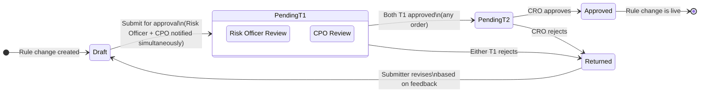

# Feature: Rule Change Authorization

**Parent Capability**: Risk Assessment Engine — [CAPABILITY](../CAPABILITY.md)
**Product**: Onigiri — [PRODUCT](../../../PRODUCT.md)
**Engineering Owner**: TBD
**Status**: Spec
**Changelog Reference**: CHANGELOG_004 — Group B / AI-1
**Last Updated**: 2026-03-10

---

## User Story

As a **Risk Officer**, I want every strategy, policy, or rule change I submit to go through a structured approval workflow — requiring both a CPO review and a CRO sign-off — so that no risk configuration change goes live without cross-functional authorization, and the change history is fully auditable.

## Job-to-be-Done

Risk Officers can currently deactivate any rule — including auto-decline rules — unilaterally. Deactivating an auto-decline rule silently removes a hard stop from the evaluation chain. This feature gates every rule change behind a two-tier parallel approval workflow, using the same state machine engine as the Underwriting Workflow to avoid new infrastructure.

---

## Architecture: Reuse of Underwriting Workflow State Machine

This feature does **not** introduce a new state machine engine. It defines a second workflow topology — the **Rule Change Approval Workflow** — that runs on the same state machine infrastructure as the Underwriting Workflow (fixed topology, configurable execution steps per state).

```
Underwriting Workflow engine
    ├── Topology A: Loan Application Workflow    (existing)
    └── Topology B: Rule Change Approval Workflow (this feature)
```

The Rule Change Approval Workflow topology is fixed. Its execution steps (notifications, role enforcement, audit logging) are configured per-state — consistent with how the Underwriting Workflow operates.

---

## Approval Workflow Diagram



---

## Workflow Topology

| State | Description | Execution Steps |
|-------|-------------|-----------------|
| `DRAFT` | Change is being authored; not yet submitted | Editable; no approvals required |
| `PENDING_T1` | Submitted; awaiting parallel T1 approvals | Notify Risk Officer + CPO simultaneously; enforce role checks; track individual approvals |
| `PENDING_T2` | Both T1 approved; awaiting CRO | Notify CRO; display both T1 approval records |
| `APPROVED` | CRO approved; change is live | Activate rule version; trigger Compliance notification if auto-decline class; write audit entry |
| `RETURNED` | Rejected at T1 or T2; back for revision | Notify submitter with feedback; reset T1 approval tracking; return to `DRAFT` |

---

## Acceptance Criteria

| # | Criterion | Pass Condition |
|---|-----------|---------------|
| AC-1 | Rule change created → `DRAFT` | Change entity created with `DRAFT` state; existing active rule is unaffected |
| AC-2 | Submit → `PENDING_T1` | Entity becomes read-only; Risk Officer AND CPO notified simultaneously; existing rule remains active |
| AC-3 | Either T1 rejects → `RETURNED` | Entity returns to `DRAFT`; feedback reason recorded; submitter notified; T1 approval tracking reset |
| AC-4 | One T1 approves, other has not yet acted | Entity stays `PENDING_T1`; waiting state visible on both approver dashboards |
| AC-5 | Both T1 approve (any order) → `PENDING_T2` | CRO notified; entity remains read-only |
| AC-6 | CRO approves → `APPROVED` | Rule version activated; previous version deactivated atomically |
| AC-7 | CRO rejects → `RETURNED` | Entity returns to `DRAFT`; CRO feedback recorded; submitter notified |
| AC-8 | Submitter cannot act as T1 approver | System enforces: submitter's own T1 approval action is rejected regardless of role |
| AC-9 | Auto-decline class (risk_level ≥ 70) on `APPROVED` | Compliance notification triggered asynchronously; does NOT fire on rejection |
| AC-10 | Rule in `PENDING_T1` or `PENDING_T2` is not evaluated | In-flight approval version has no effect on live risk evaluation |
| AC-11 | Immutable audit trail entry on every state transition | Entry contains: actor ID, action, rule snapshot (before/after), both T1 approver IDs, CRO approver ID, timestamp, affected campaign IDs |
| AC-12 | Only one change per rule in flight at a time | A second edit to the same rule is blocked while the first is in `PENDING_T1` or `PENDING_T2` |

---

## Edge Cases & Error States

| Scenario | Expected Behavior |
|----------|------------------|
| Risk Officer and CPO are the same person | Both T1 approvals must still be explicitly acted on — same person completes both actions sequentially |
| Submitter holds both Risk Officer and CPO roles | Submitter cannot self-approve either T1 action |
| CRO role unassigned in system | Submission blocked at T2 with clear error message |
| Auto-decline rule rejected at T2 | Compliance notification NOT sent; only fires on successful `APPROVED` |
| Submitter withdraws a `PENDING_T1` change | Entity returns to `DRAFT`; all in-progress T1 approvals voided; re-submission restarts the flow |

---

## Dependencies

| Dependency | Type | Notes |
|------------|------|-------|
| Underwriting Workflow state machine engine | Internal — [CAPABILITY](../../underwriting-workflow/CAPABILITY.md) | Provides the fixed-topology + configurable execution steps infrastructure this workflow runs on |
| Campaign Publication Authorization | Internal — [FEATURE](../../loan-campaign-configuration/features/FEATURE_campaign-publication-authorization.md) | Mirror feature; both functional owners are T1 approvers on both workflows for structural coupling |
| RBAC / role system | Internal platform | Must support role checks for Risk Officer, CPO, CRO at transition time |
| Compliance notification system | Internal platform | Async; non-blocking; fires on auto-decline class `APPROVED` only |
| Immutable audit trail | Internal | INSERT-only; no UPDATE/DELETE at application layer |

---

## Out of Scope

- Simulation / preview mode for rule testing before submission — separate open question in CAPABILITY.md
- Approval delegation (acting CRO, out-of-office) — operational procedure
- Retroactive approval of already-live rules — all rules at ship time are grandfathered
