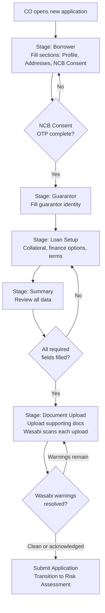

# Capability: Smart Form

**Product**: Onigiri — [PRODUCT](../../PRODUCT.md)
**Portfolio**: Credit
**Product Owner**: TBD (Credit PO)
**Status**: 📝 Draft — @FEATURE decomposition pending
**Last Updated**: 2026-03-06

---

## Business Function

Provide a configurable, section-based loan application form that captures borrower, guarantor, loan setup, and collateral information — storing all application data as a flexible JSON object to support rapid product evolution without database schema migrations.

## Why It Exists (First Principles)

- **Product Variety Problem**: The company offers multiple loan products (car title, land title, personal). Each product requires different fields, sections, and validation rules. A rigid, column-per-field relational model cannot keep up with product launches and changes.
- **Branch UX**: Collection officers and branch staff fill applications in the field — sometimes at the customer's home, sometimes at the branch. The form must be steppable, savable mid-way, and resumable.
- **Data Flexibility**: Loan products evolve. New fields, new sections, new conditional logic. Storing application data as a JSON document in DocumentDB means the form schema can evolve without database migrations for every field change.

---

## Feature Inventory

| Feature | Status | Description |
|---------|--------|-------------|
| Page/Section/Field Composer | Concept | Configuration engine for composing form pages from reusable sections containing typed fields |
| Save Draft (Mid-Session Persistence) | Concept | Persist full JSON application document to DocumentDB on every explicit save and every stage transition |
| Stage Navigator | Concept | Locked-sequence stage progression (Borrower → Guarantor → Loan Setup → Summary → Document Upload) with completion tracking |
| NCB Consent + OTP Flow | Concept | Embedded credit bureau inquiry consent with OTP verification inside the Borrower stage |
| Document Upload Interface | Concept | Upload required supporting documents within the Draft stage; trigger Wasabi early-warning scan on upload |

---

## Business Rules

### Permanent vs. Configurable Stages

| Stage | Configurable? | Description |
|-------|--------------|-------------|
| **Borrower** | ✅ Sections can be added, split across pages, reordered | Captures applicant profile, addresses, NCB consent |
| **Guarantor** | 🔒 Structure is permanent; pages within are splittable | Guarantor identity, relationship to borrower |
| **Loan Setup** | ✅ Sections can be added, reordered | Collateral, finance options, terms |
| **Summary** | 🔒 Permanent | Review of all entered information before submission |
| **Document Upload** | 🔒 Permanent | Upload required supporting documents |

### Data Persistence Rules

| Layer | Database | What It Stores | When It Writes |
|-------|----------|----------------|----------------|
| Application Data | DocumentDB | Full JSON application document (all form sections, field values, uploaded document references) | Every save-draft and every workflow transition |
| Workflow State | RDS | Current workflow state, transition history, timestamps, actor IDs, audit trail | Every workflow transition |

### Field Definition Properties

| Property | Description |
|----------|-------------|
| `field_name` | Machine-readable key (e.g., `first_name`, `credit_line`) |
| `label` | Human-readable display name (Thai/English) |
| `required` | Whether the field is mandatory for form submission |
| `type` | Input type (text, number, date, select, etc.) |
| `validation` | Rules (regex, range, conditional) |

### Section Properties

Each section must carry: Section ID (unique), Field List (ordered, with types and validation), Information Owner (borrower / guarantor / collateral), Validation Rules (field-level and section-level), External Integration flag (some sections trigger external actions e.g. NCB OTP), Logical Document Requirement (sections can declare document requirements based on their data), Section Completion status (all required fields filled).

---

### Collateral Section Variants

The **Loan Setup** stage includes exactly one Collateral Section per campaign. The Collateral Section is selected via Application Template Assignment in the Loan Campaign Configuration capability. This table is the registry of all defined Collateral Sections. Engineering must implement each section before it can be referenced by a campaign.

Each campaign selects one Section ID from this registry. Fields, document declarations, and open questions are defined per section below.

---

#### `collateral_car` — Car (Vehicle Title)

The car collateral section presents a **vehicle type selector** at the top. Sedan (รถเก๋ง) and Van (รถตู้) share the same field set. Pickup Truck (รถกระบะ) has one additional field.

| `field_name` | Label (EN) | Label (TH) | Type | Required | Validation / Notes |
|-------------|-----------|-----------|------|----------|--------------------|
| `car_vehicle_type` | Vehicle Type | เลือกประเภทรถยนต์ | select | Yes | Options: `sedan` (รถเก๋ง), `pickup_truck` (รถกระบะ), `van` (รถตู้) |
| `car_registration_date` | Registration Date | วันที่จดทะเบียน | date | Yes | |
| `car_possession_date` | Possession Date | วันที่ครอบครอง | date | Yes | |
| `car_ownership_type` | Ownership Type | ประเภทการครอบครอง | select | Yes | |
| `car_previous_possession_date` | Previous Possession Date | วันที่ครอบครอง (ผู้ถือครองก่อนหน้า) | date | No | Required when `car_previous_owner` is filled |
| `car_previous_owner` | Previous Owner | ผู้ถือครองก่อนหน้า | select | No | |
| `car_plate_number` | License Plate Number | เลขทะเบียน | text | Yes | Thai plate format |
| `car_province` | Province | จังหวัด | select | Yes | Thai province enumeration |
| `car_act_type` | Act Type (ร.ย.) | ประเภทตาม พ.ร.บ.(รย.) | select | Yes | Vehicle class per Motor Vehicle Act |
| `car_brand` | Brand | ยี่ห้อรถ | select | Yes | |
| `car_model` | Model | แบบรุ่น | select | Yes | Dependent on `car_brand` |
| `car_year` | Year (C.E.) | รุ่นปี (ค.ศ.) | select | Yes | CE year |
| `car_gear` | Gear / Transmission | เกียร์ | select | Yes | |
| `car_submodel` | Sub-model | รุ่นย่อย | select | Yes | Dependent on `car_model` |
| `car_num_doors` | Number of Doors | จำนวนประตู | select | Yes | |
| `car_description` | Description | คำอธิบาย | select | No | |
| `car_system_not_found` | No Matching Option in System | ไม่มีตัวเลือกกรณีนี้ในระบบ | boolean | No | Checkbox; allows CO to flag when brand/model not found in system |
| `car_canopy_installed` | Has Canopy / Cargo Box Installed | ติดคอกตู้หรือไม่ | select | Yes (pickup only) | **Pickup Truck only** — hidden for sedan and van |
| `car_color` | Color (up to 3) | สี | multi-select | Yes | Color palette picker; max 3 selections; options include เหลือง/ส้ม/แดง/ชมพู/ม่วง/น้ำเงิน/ฟ้า/เขียว/น้ำตาล/ดำ/เทา/ขาว/หลายสี |
| `car_chassis_number` | Chassis Number | เลขตัวถัง | text | Yes | |
| `car_engine_number` | Engine Number | เลขเครื่องยนต์ | text | Yes | |
| `car_engine_cc` | Engine Size (CC) | จำนวนซีซี | number | Yes | |
| `car_mileage` | Mileage (km) | เลขไมล์ | number | No | |
| `car_tax_renewal_date` | Tax Renewal Date (B.E.) | วันครบกำหนดเสียภาษี (พ.ศ.) | date | No | Buddhist Era date; `car_tax_renewal_date_unknown` flag disables this field |
| `car_tax_renewal_date_unknown` | Tax Date Unknown | ไม่สามารถระบุได้ | boolean | No | Checkbox; when checked, `car_tax_renewal_date` is not required |
| `car_tax_source` | Tax Date Source | ที่มาของวันครบกำหนดเสียภาษี | select | No | Required when `car_tax_renewal_date` is filled |
| `car_gas_modification_status` | Gas Modification Status | สถานะการดัดแปลงสภาพการติดก๊าซ | radio | Yes | Options: `none` (ไม่ดัดแปลง — สภาพตามโรงงาน), `modified` (ดัดแปลง — เปลี่ยน/เพิ่ม/ลด ถังก๊าซ) |
| `car_other_modification_status` | Other Modification Status | สถานะการดัดแปลงสภาพ อื่นๆ | radio | Yes | Options: `none` (ไม่ดัดแปลง), `modified` (ดัดแปลง) |
| `car_name_match` | Registration Name Matches ID Card | ชื่อในเล่มทะเบียนรถตรงกับในบัตรประชาชน | radio | Yes | Options: `match` (ตรงกัน), `no_match` (ไม่ตรงกัน) |

**Information Owner:** `collateral`
**Document Declarations:** `vehicle_registration_book` (required), `vehicle_insurance` (required), `vehicle_dlt_web_page` (required — no act-type exclusion; car has no RY condition)

---

#### `collateral_bike` — Bike (Motorbike Title)

| `field_name` | Label (EN) | Label (TH) | Type | Required | Validation / Notes |
|-------------|-----------|-----------|------|----------|--------------------|
| `bike_registration_date` | Registration Date | วันที่จดทะเบียน | date | Yes | |
| `bike_possession_date` | Possession Date | วันที่ครอบครอง | date | Yes | |
| `bike_ownership_type` | Ownership Type | ประเภทการครอบครอง | select | Yes | |
| `bike_previous_owner` | Previous Owner | ผู้ถือครองก่อนหน้า | text | No | |
| `bike_previous_possession_date` | Previous Possession Date | วันที่ครอบครอง (ก่อนหน้า) | date | No | Required when `bike_previous_owner` is filled |
| `bike_plate_number` | License Plate Number | เลขทะเบียน | text | Yes | Thai plate format |
| `bike_province` | Province | จังหวัด | select | Yes | Thai province enumeration |
| `bike_act_type` | Act Type (ร.ย.) | ประเภทตาม พ.ร.บ. | select | Yes | Vehicle class per Motor Vehicle Act; drives DLT photo requirement |
| `bike_brand` | Brand | ยี่ห้อรถ | select | Yes | |
| `bike_model` | Model | แบบรุ่น | select | Yes | Dependent on `bike_brand` |
| `bike_year` | Year (C.E.) | รุ่นปี (ค.ศ.) | number | Yes | 4-digit CE year |
| `bike_chassis_number` | Chassis Number | เลขตัวถัง | select+text | Yes | Select source type; then enter number |
| `bike_engine_number` | Engine Number | เลขเครื่องยนต์ | select+text | Yes | Select source type; then enter number |
| `bike_engine_cc` | Engine Size (CC) | จำนวนซีซี | number | Yes | |
| `bike_tax_renewal_date` | Tax Renewal Date | วันครบกำหนดเสียภาษี | date | Yes | |
| `bike_tax_source` | Tax Date Source | ที่มาของวันครบกำหนดเสียภาษี | select | Yes | Options: `front_of_tax_page`, `tax_receipt` |
| `bike_name_match` | Registration Name Matches ID Card | ชื่อในเล่มทะเบียนรถตรงกับในบัตรประชาชน | boolean | Yes | |

**Information Owner:** `collateral`
**Document Declarations:** `motorbike_registration_book` (required), `motorbike_insurance` (required), `motorbike_dlt_web_page` (conditionally required — excluded when `bike_act_type = RY-17`)

> **Note (Act Type RY-17):** For motorbikes registered under ร.ย.17, no DLT (กรมขนส่ง) web page photo is required. The Onigiri Worker excludes `motorbike_dlt_web_page` from the Matcha task's `documents[]` array when `bike_act_type = "RY-17"`.

---

#### `collateral_tractor` — Tractor (Agricultural Equipment Title)

| `field_name` | Label (EN) | Label (TH) | Type | Required | Validation / Notes |
|-------------|-----------|-----------|------|----------|--------------------|
| `tractor_registration_date` | Registration Date | วันที่จดทะเบียน | date | Yes | |
| `tractor_possession_date` | Possession Date | วันที่ครอบครอง | date | Yes | |
| `tractor_ownership_type` | Ownership Type | ประเภทการครอบครอง | select | Yes | |
| `tractor_previous_owner` | Previous Owner | ผู้ถือครองก่อนหน้า | text | No | |
| `tractor_previous_possession_date` | Previous Possession Date | วันที่ครอบครอง (ก่อนหน้า) | date | No | Required when `tractor_previous_owner` is filled |
| `tractor_plate_number` | License Plate Number | เลขทะเบียน | text | Yes | Thai plate format |
| `tractor_province` | Province | จังหวัด | select | Yes | Thai province enumeration |
| `tractor_act_type` | Act Type (ร.ย.) | ประเภทตาม พ.ร.บ. | select | Yes | Vehicle class per Motor Vehicle Act; drives DLT photo requirement |
| `tractor_brand` | Brand | ยี่ห้อรถ | select | Yes | |
| `tractor_model` | Model | แบบรุ่น | text | Yes | |
| `tractor_year` | Year (C.E.) | รุ่นปี (ค.ศ.) | number | Yes | 4-digit CE year |
| `tractor_color` | Color | สี | select | Yes | |
| `tractor_chassis_number` | Chassis Number | เลขตัวถัง | text | Yes | |
| `tractor_engine_number` | Engine Number | เลขเครื่องยนต์ | text | Yes | |
| `tractor_horsepower` | Horsepower | แรงม้า | number | Yes | |
| `tractor_working_hours` | Working Hours | จำนวนชั่วโมงการทำงาน | number | Yes | |
| `tractor_tax_renewal_date` | Tax Renewal Date | วันครบกำหนดเสียภาษี | date | Yes | |
| `tractor_tax_source` | Tax Date Source | ที่มาของวันครบกำหนดเสียภาษี | select | Yes | Options: `front_of_tax_page`, `tax_receipt` |
| `tractor_modification_status` | Modification Status | สถานะการดัดแปลงสภาพ | select | Yes | |
| `tractor_name_match` | Registration Name Matches ID Card | ชื่อในเล่มทะเบียนรถตรงกับในบัตรประชาชน | boolean | Yes | |
| `tractor_accessories` | Accessories | อุปกรณ์เสริม | checklist | No | Multi-select: blades, plows, grass cutters |

**Information Owner:** `collateral`
**Document Declarations:** `tractor_registration_book` (required), `tractor_dlt_web_page` (conditionally required — excluded when `tractor_act_type = RY-13`)

> **Note (Act Type RY-13):** For tractors registered under ร.ย.13, no DLT (กรมขนส่ง) web page photo is required. The Onigiri Worker excludes `tractor_dlt_web_page` from the Matcha task's `documents[]` array when `tractor_act_type = "RY-13"`.

---

#### `collateral_land` — Land (Title Deed)

The land collateral section is organized into five sub-sections. All sub-sections are part of the single `collateral_land` Smart Form section rendered in the Loan Setup stage.

---

##### Sub-section 1: Ownership (ผู้ถือครองกรรมสิทธิ์)

| `field_name` | Label (EN) | Label (TH) | Type | Required | Validation / Notes |
|-------------|-----------|-----------|------|----------|--------------------|
| `land_owner_prefix` | Prefix | คำนำหน้า | select | Yes | |
| `land_owner_first_name` | First Name | ชื่อ | text | Yes | |
| `land_owner_last_name` | Last Name | นามสกุล | text | Yes | |
| `land_possession_date` | Possession Date | วันที่ครอบครอง | date | Yes | |
| `land_ownership_type` | Ownership Type | ประเภทการครอบครอง | select | Yes | |
| `land_previous_owner` | Previous Owner | ผู้ถือครองก่อนหน้า | text | No | |
| `land_previous_possession_date` | Previous Possession Date | วันที่ครอบครอง (ก่อนหน้า) | date | No | Required when `land_previous_owner` is filled |

---

##### Sub-section 2: Title Deed Details (เอกสารสิทธิ)

| `field_name` | Label (EN) | Label (TH) | Type | Required | Validation / Notes |
|-------------|-----------|-----------|------|----------|--------------------|
| `land_title_deed_type` | Title Deed Type | ประเภทเอกสารสิทธิ | select | Yes | |
| `land_collateral_type` | Collateral Type | ประเภทหลักประกัน | select | Yes | |
| `land_collateral_subtype` | Collateral Sub-type | ประเภทหลักประกันย่อย | select | Yes | Dependent on `land_collateral_type` |
| `land_title_deed_number` | Title Deed Number | เลขที่โฉนด | text | Yes | |
| `land_number` | Land Number | เลขที่ดิน | text | Yes | |
| `land_area_rai` | Area — Rai | เนื้อที่ ไร่ | number | Yes | Non-negative integer |
| `land_area_ngan` | Area — Ngan | เนื้อที่ งาน | number | Yes | Integer 0–3 |
| `land_area_sqwa` | Area — Square Wa | เนื้อที่ ตารางวา | number | Yes | Decimal 0–99 |
| `land_subdistrict` | Subdistrict (Tambon) | ตำบล | select | Yes | |
| `land_district` | District (Amphoe) | อำเภอ | select | Yes | Dependent on `land_subdistrict` |
| `land_province` | Province | จังหวัด | select | Yes | Dependent on `land_district` |
| `land_address_match_check` | Collateral Location Matches Which Address | ที่ตั้งหลักประกันตรงกับที่อยู่ใด | select | Yes | Links collateral location to a registered address in borrower profile |
| `land_loc_house_number` | House Number | บ้านเลขที่ | text | No | Collateral physical location |
| `land_loc_village` | Village / Building | หมู่บ้าน/อาคาร | text | No | |
| `land_loc_moo` | Moo | หมู่ | text | No | |
| `land_loc_soi` | Soi | ซอย | text | No | |
| `land_loc_road` | Road | ถนน | text | No | |
| `land_loc_subdistrict` | Location Subdistrict | แขวง/ตำบล | select | No | |
| `land_loc_district` | Location District | เขต/อำเภอ | select | No | |
| `land_loc_province` | Location Province | จังหวัด | select | No | |
| `land_loc_postcode` | Postcode | รหัสไปรษณีย์ | text | No | |
| `land_latitude` | Latitude | ละติจูด | number | Yes | Decimal degrees |
| `land_longitude` | Longitude | ลองติจูด | number | Yes | Decimal degrees |
| `land_map_pin` | Google Map Pin | Pin google map | file | Yes | Map screenshot or Google Maps link |
| `land_conditions` | Conditions Checklist | เงื่อนไขต่างๆ | checklist | No | Multiple condition flags |

**Condominium-only fields** (conditional — shown when `land_collateral_type` = condominium / อช.2):

| `field_name` | Label (EN) | Label (TH) | Type | Required |
|-------------|-----------|-----------|------|----------|
| `condo_built_on_deed_number` | Built on Title Deed No. | ปลูกสร้างบนโฉนดเลขที่ | text | Conditional |
| `condo_area_sqm` | Area (sq.m.) | เนื้อที่ประมาณ (ตารางเมตร) | number | Conditional |
| `condo_unit_number` | Unit Number | ห้องชุดเลขที่ | text | Conditional |
| `condo_floor` | Floor | ชั้นที่ | number | Conditional |
| `condo_building_number` | Building Number | อาคารเลขที่ | text | Conditional |
| `condo_juristic_registration` | Condominium Registration | ทะเบียนอาคารชุด | text | Conditional |
| `condo_name` | Condominium Name | ชื่ออาคารชุด | text | Conditional |

---

##### Sub-section 3: Land Characteristics (ลักษณะที่ดิน)

| `field_name` | Label (EN) | Label (TH) | Type | Required |
|-------------|-----------|-----------|------|----------|
| `land_shape` | Land Shape | รูปแปลงที่ดิน | select | Yes |
| `land_access_road` | Access Road Type | ถนนเข้า-ออกหลักประกัน | select | Yes |
| `land_electrical_system` | Electrical System | ระบบไฟฟ้า | select | Yes |

---

##### Sub-section 4: Appraisal Data (ข้อมูลใบประเมินจากกรมที่ดิน)

| `field_name` | Label (EN) | Label (TH) | Type | Required | Validation / Notes |
|-------------|-----------|-----------|------|----------|--------------------|
| `land_appraisal_price` | Land Appraisal Price (THB) | ราคาประเมินหลักประกัน (ที่ดิน) | number | Yes | Positive integer |
| `land_building_appraisal_price` | Building Appraisal Price (THB) | ราคาประเมินหลักประกัน (สิ่งปลูกสร้าง) | number | No | Required if structure exists on land |
| `land_appraisal_conditions` | Appraisal Conditions Checklist | เงื่อนไขใบประเมิน | checklist | No | |
| `land_appraisal_date` | Appraisal Date | วันที่ออกใบประเมินหลักประกัน | date | Yes | |

---

##### Sub-section 5: Registered Address (ที่อยู่ตามทะเบียนบ้าน)

| `field_name` | Label (EN) | Label (TH) | Type | Required |
|-------------|-----------|-----------|------|----------|
| `land_reg_address_name` | Address Name | ชื่อเรียกที่อยู่ | text | No |
| `land_reg_house_number` | House Number | บ้านเลขที่ | text | Yes |
| `land_reg_village` | Village / Building | หมู่บ้าน/อาคาร | text | No |
| `land_reg_moo` | Moo | หมู่ | text | No |
| `land_reg_soi` | Soi | ซอย | text | No |
| `land_reg_road` | Road | ถนน | text | No |
| `land_reg_subdistrict` | Subdistrict | แขวง/ตำบล | select | Yes |
| `land_reg_district` | District | เขต/อำเภอ | select | Yes |
| `land_reg_province` | Province | จังหวัด | select | Yes |
| `land_reg_postcode` | Postcode | รหัสไปรษณีย์ | text | Yes |
| `land_reg_description` | Additional Description | คำอธิบายเพิ่มเติม | text | No |
| `land_reg_latitude` | Latitude | ละติจูด | number | No |
| `land_reg_longitude` | Longitude | ลองติจูด | number | No |
| `land_reg_map_pin` | Google Map Pin | Pin google map | file | No |
| `land_reg_house_code` | House Code Number | เลขรหัสประจำบ้าน | text | No |
| `land_reg_owner_status` | Is Owner of this Address | สถานะเป็นเจ้าของบ้าน | boolean | No |

---

**Information Owner:** `collateral`
**Document Declarations:** `land_title_deed` (required), `land_appraisal_certificate` (required)

---

### Section Selection Rule

A campaign selects exactly one Collateral Section from the registry above. Multiple collateral types under a single campaign are not supported — each collateral type must be its own campaign. Enforcement is via the campaign's eligibility rule (`collateral_type = <type>`), which gates entry before the form loads.

---

## User Flow

---

## NFRs

| NFR | Requirement |
|-----|-------------|
| Mid-session persistence | Application data must survive browser close; recoverable on re-open |
| Schema-free evolution | New fields and sections added via configuration — zero DDL changes |
| DocumentDB write on every save-draft | Full JSON document persisted, not incremental patch |
| Stage sequence locked | Stages cannot be reordered or skipped at runtime |

---

## Open Questions

- Should partial (incomplete) sections be savable, or must all required fields be complete before a section save is accepted?
- How are conditional sections (e.g., Guarantor section appearing only if risk assessment flags it) handled — pre-submission or post-submission?
