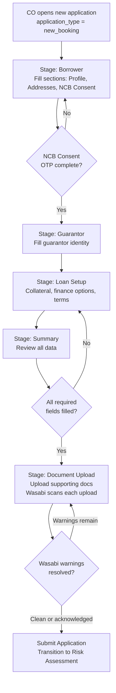

# Capability: Smart Form

**Product**: Onigiri — [PRODUCT](../../PRODUCT.md)
**Portfolio**: Credit
**Product Owner**: TBD (Credit PO)
**Status**: 📝 Draft — @FEATURE decomposition pending
**Last Updated**: 2026-03-11

> **Topup-specific behavior** (Topup Finance Summary section, topup application template, topup approver data groups, topup user flow) is documented in the consolidated Topup reference: [product/credit/topup/TOPUP.md](../../../../topup/TOPUP.md)

---

## Business Function

Provide a configurable, section-based loan application form that captures borrower, guarantor, loan setup, and collateral information — storing all application data as a flexible JSON object to support rapid product evolution without database schema migrations.

## Why It Exists (First Principles)

- **Product Variety Problem**: The company offers multiple loan products (car title, land title, personal). Each product requires different fields, sections, and validation rules. A rigid, column-per-field relational model cannot keep up with product launches and changes.
- **Branch UX**: Collection officers and branch staff fill applications in the field — sometimes at the customer's home, sometimes at the branch. The form must be steppable, savable mid-way, and resumable.
- **Data Flexibility**: Loan products evolve. New fields, new sections, new conditional logic. Storing application data as a JSON document in DocumentDB means the form schema can evolve without database migrations for every field change.

---

## Feature Inventory

| Feature | Status | Description |
|---------|--------|-------------|
| Page/Section/Field Composer | Concept | Configuration engine for composing form pages from reusable sections containing typed fields |
| Auto-Prefill | Concept | On application creation, auto-populate form fields from known data sources (DaVinci customer record, Core Banking loan record). Prefill scope and source are determined by application type and campaign config. All prefilled data is written to the DocumentDB JSON document at creation time. |
| Save Draft (Mid-Session Persistence) | Concept | Persist full JSON application document to DocumentDB on every explicit save and every stage transition |
| Stage Navigator | Concept | Locked-sequence stage progression with completion tracking. Sequence is defined by the Application Template configured in the campaign. |
| NCB Consent + OTP Flow | Concept | Embedded credit bureau inquiry consent with OTP verification inside the Borrower stage |
| Document Upload Interface | Concept | Upload required supporting documents within the Draft stage; trigger Wasabi early-warning scan on upload |
| Approver Data Aggregation | Concept | In the Approval state, render data groups for the approver based on `application_type`. Each application type defines its own set of data groups. Reusable across all application types — adding a new type does not require changes to this feature, only a new group configuration. |
| Finance Page | Concept | Renders campaign and plan options within the Loan Setup stage. Supports plan selection, plan re-selection, and Plan Calculation API recalculation when CO changes campaign, plan option, or payment due date. Behaviour differs by `application_type` — see Finance Page Rules in Business Rules. |

---

## Business Rules

### Auto-Prefill Rules

Auto-prefill applies to all application types. On Draft creation, the form populates matching fields automatically. The prefill source and field scope differ by `application_type`.

| Application Type | Prefill Source | Prefilled Fields |
|-----------------|---------------|-----------------|
| `new_booking` | DaVinci (customer record) | Customer identity and profile fields where a match is found |
| `topup` | DaVinci + Core Banking (existing loan record) | See [Topup Reference — Auto-Prefill](../../../../topup/TOPUP.md#offline-path--auto-prefill) |
| `restructure` (all paths) | DaVinci (customer record) + Core Banking (existing loan record) | Customer name, ID number, address, phone, occupation — from DaVinci. Existing loan reference, outstanding balance, original loan tenor, DPD, contract age, interest rate — from Core Banking. Collateral type, collateral valuation, appraisal date — from Core Banking / DaVinci. |

> **Rule**: All fields with a matching data source must be prefilled. Omission of a prefillable field is a system defect, not an accepted blank state.

> **Rule**: Prefilled data is written into the DocumentDB JSON document at Draft creation time — it is not fetched live on every page load.

> **Rule**: For `restructure` via pre-approval, the plan and campaign data (`selected_campaign`, `selected_plan`, `payment_due_date`) are carried forward from `pre_approval_snapshot` by the Draft Initializer as a starting point. These are editable in the Finance Page — the CO may re-select a different plan option. Form field prefill (customer identity, loan data, collateral) still comes from DaVinci + Core Banking.

### Prefill Field Editability

Editability of prefilled fields is determined per field per `application_type`. Some fields are read-only (sourced from authoritative systems — DaVinci or Core Banking), while others are CO-editable. Detailed editability rules per field are defined within each `application_type`'s section below.

### Application Types

| Type | Description |
|------|-------------|
| `new_booking` | Standard new loan application. Borrower → Guarantor → Loan Setup → Summary → Upload. Fields prefilled from DaVinci where available. |
| `topup` | Topup loan — **Offline (New Contract) path only**. Smart Form does not apply to the Online (Direct Charge) path. See [Topup Reference](../../../../topup/TOPUP.md) for full behavior. |
| `restructure` | Restructure loan application. Two entry paths: **(1) Via pre-approval (Draft Initializer)** — Draft created from a confirmed pre-approval; form fields prefilled from DaVinci + Core Banking; Finance Page pre-populates with the confirmed plan from `pre_approval_snapshot` as a starting point. **(2) Direct (no pre-approval)** — Draft created directly; form fields prefilled from DaVinci + Core Banking; CO selects campaign and plan on the Finance Page. Both paths support Finance Page re-selection and Plan Calculation API recalculation. |

> **Rule**: Smart Form (and the Onigiri application lifecycle) applies only to the **Offline** Topup path. Online (Direct Charge) does not create a new Onigiri application — Core Banking amends the existing contract directly.

> **Rule**: For `restructure` via pre-approval, the Draft is created by the Draft Initializer with `pre_approval_id` and `pre_approval_snapshot` set. For `restructure` direct, the Draft is created without these fields — Smart Form behaves like a standard application for plan selection and prefill.

### Permanent vs. Configurable Stages (New Booking)

| Stage | Configurable? | Description |
|-------|--------------|-------------|
| **Borrower** | ✅ Sections can be added, split across pages, reordered | Captures applicant profile, addresses, NCB consent |
| **Guarantor** | 🔒 Structure is permanent; pages within are splittable | Guarantor identity, relationship to borrower |
| **Loan Setup** | ✅ Sections can be added, reordered | Collateral, finance options, terms |
| **Summary** | 🔒 Permanent | Review of all entered information before submission |
| **Document Upload** | 🔒 Permanent | Upload required supporting documents |

### Topup Finance Summary Section — Calculation Rules

The Finance page for `topup` applications renders all standard finance sections from campaign config **plus** this additional section:

| Field | Calculation |
|-------|-------------|
| Outstanding Balance | Fetched from Core Banking at Draft creation |
| Settlement Amount | `Outstanding Balance + Accrued Interest + Settlement Fee` |
| Gross New Loan Amount | Amount configured / approved under the Topup Campaign (≤ Maximum Topup Amount from Pre-Build) |
| Net Disbursement to Customer | `Gross New Loan Amount − Settlement Amount` |
| New Monthly Installment | `amortize(Gross New Loan Amount, New Tenor, Campaign Interest Rate)` |

> **Rule**: Net Disbursement to Customer must be > 0 to allow form progression. The form must display an inline error and block progression to Summary if this condition fails.

### Finance Page Rules by Application Type

The Finance Page renders differently depending on `application_type`. For restructure, the Finance Page always supports re-selection and recalculation — the pre-approval plan is a starting point, not a lock.

| Application Type | Campaign Source | Plan Source | Behaviour in Smart Form |
|---|---|---|---|
| `new_booking` | Not applicable | Not applicable | No Finance Page — standard Loan Setup fields only. Campaign config drives form structure but there is no plan selection step. |
| `topup` | CO-initiated from shared worklist (campaign pre-selected) | Campaign Eligibility Pre-Build result — Maximum Amount per campaign, pricing from campaign config | Finance Page renders the selected campaign's plan details (Maximum Amount, tenor, interest rate). CO cannot switch campaign inside Smart Form — campaign was locked at worklist initiation. |
| `restructure` (via pre-approval) | Pre-selected at pre-approval stage; pre-populated from `pre_approval_snapshot` as starting point | Plan Calculation API — pre-approval selection pre-fills the page; CO may re-select | Finance Page pre-populates with the confirmed plan from `pre_approval_snapshot`. CO may change campaign or plan option. Any change triggers Plan Calculation API recalculation. Tenor filter applies. |
| `restructure` (direct, no pre-approval) | CO selects on Finance Page; Pre-Build called before page renders | Plan Calculation API — called before page renders and on any change | Finance Page renders eligible campaigns and plan options. CO selects campaign and plan option. Any change triggers Plan Calculation API recalculation. Tenor filter applies. |

> **Rule**: For `restructure` (both paths), the Finance Page must call Plan Calculation API whenever the CO changes the selected campaign, plan option, or payment due date. CO cannot progress to Summary until a successful recalculation confirms the selected plan.

> **Rule**: For `restructure` via pre-approval, the pre-approval plan is the default selection — it does not lock the Finance Page. If the CO changes the plan in Smart Form, the new selection overrides the snapshot. The `pre_approval_snapshot` on the application record still reflects the original pre-approval data for change detection purposes.

> **Rule**: For `topup`, if the CO changes any finance field that affects the plan calculation (e.g., loan amount), the Finance Summary section must recalculate Net Disbursement to Customer and enforce the > 0 guard before progression to Summary.

#### Tenor Filter (Restructure Only)

Tenor options ≤ the customer's original loan tenor are disabled on the Finance Page. Applies to both restructure paths. CO cannot select a plan that does not extend the repayment period. If no valid options exist after recalculation, CO cannot progress.

### Approver Data Aggregation Rules

Data groups rendered at Approval state entry differ by `application_type`. Each type defines its own group set.

| Group | Applicable To | Source | Behaviour |
|-------|--------------|--------|-----------|
| Latest Customer Data | All types | DaVinci — fetched at Approval state entry | Always shows the most current customer profile, not the snapshot from Draft creation |
| Current Application Documents | All types | Current application in Onigiri | Standard document view |
| Source Application Documents | `topup` only | Originating application (fetched by `source_application_id`) | Read-only. See [Topup Reference](../../../../topup/TOPUP.md#offline-path--approver-data-aggregation) |

> **Rule**: Future application types define their own data group set — this feature is driven by `application_type`, not hardcoded to any specific type.

### Document Upload Rules by Application Type

The Document Upload stage renders the required document checklist based on the campaign's Application Template. The required document set differs by `application_type` — the campaign's template defines which document types are mandatory for that loan type.

| Application Type | Required Document Set | Source |
|---|---|---|
| `new_booking` | Standard required documents for the loan product (e.g. ID, income proof, collateral documents) | Campaign Application Template — Document Checklist dimension |
| `topup` | Standard required documents + any topup-specific documents defined in the campaign template (e.g. existing loan statement) | Campaign Application Template — Document Checklist dimension |
| `restructure` | Restructure-specific required documents defined in the restructure campaign template (e.g. medical certificate, income proof if not already uploaded at pre-approval stage) | Campaign Application Template — Document Checklist dimension |

> **Rule**: The required document checklist is always driven by the campaign's Application Template — not hardcoded by application type. Adding a new document requirement for any loan type requires only a campaign configuration change, not a code change.

> **Rule**: For `restructure`, supporting documents uploaded at the pre-approval stage (e.g. medical cert, income proof) are stored on the pre-approval record — not on the Draft application. The Document Upload stage in Smart Form shows the campaign's required documents for the application independently. If the campaign template requires the same document type, the CO must upload it again on the application.

> **Rule**: Wasabi early-warning scan is triggered on every document upload regardless of `application_type`.

### Data Persistence Rules

| Layer | Database | What It Stores | When It Writes |
|-------|----------|----------------|----------------|
| Application Data | DocumentDB | Full JSON application document (all form sections, field values, uploaded document references) | Every save-draft and every workflow transition |
| Workflow State | RDS | Current workflow state, transition history, timestamps, actor IDs, audit trail | Every workflow transition |

### Field Definition Properties

| Property | Description |
|----------|-------------|
| `field_name` | Machine-readable key (e.g., `first_name`, `credit_line`) |
| `label` | Human-readable display name (Thai/English) |
| `required` | Whether the field is mandatory for form submission |
| `type` | Input type (text, number, date, select, etc.) |
| `validation` | Rules (regex, range, conditional) |

### Section Properties

Each section must carry: Section ID (unique), Field List (ordered, with types and validation), Information Owner (borrower / guarantor / collateral), Validation Rules (field-level and section-level), External Integration flag (some sections trigger external actions e.g. NCB OTP), Logical Document Requirement (sections can declare document requirements based on their data), Section Completion status (all required fields filled).

---

## User Flow

### New Booking

> For the Topup user flow, see [Topup Reference — Offline Path User Flow](../../../../topup/TOPUP.md#offline-path--user-flow)

---

## NFRs

| NFR | Requirement |
|-----|-------------|
| Mid-session persistence | Application data must survive browser close; recoverable on re-open |
| Schema-free evolution | New fields and sections added via configuration — zero DDL changes |
| DocumentDB write on every save-draft | Full JSON document persisted, not incremental patch |
| Stage sequence locked | Stages cannot be reordered or skipped at runtime |
| Prefill completeness | All fields with a matching data source must be prefilled on Draft creation (all application types) — omission is a system defect |
| Net Disbursement guard | Topup Finance page must block Summary progression if Net Disbursement ≤ 0 — missing guard is a blocking defect |
| Plan Calculation guard | Restructure Finance page must block Summary progression until a successful Plan Calculation API response confirms the selected plan — no progression on stale or failed calculation |

---

## Open Questions

- Should partial (incomplete) sections be savable, or must all required fields be complete before a section save is accepted?
- How are conditional sections (e.g., Guarantor section appearing only if risk assessment flags it) handled — pre-submission or post-submission?
