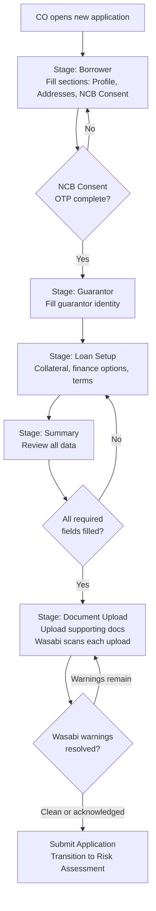

# Capability: Smart Form

**Product**: Onigiri — [PRODUCT](../../PRODUCT.md)
**Portfolio**: Credit
**Product Owner**: TBD (Credit PO)
**Status**: 📝 Draft — @FEATURE decomposition pending
**Last Updated**: 2026-03-04

---

## Business Function

Provide a configurable, section-based loan application form that captures borrower, guarantor, loan setup, and collateral information — storing all application data as a flexible JSON object to support rapid product evolution without database schema migrations.

## Why It Exists (First Principles)

- **Product Variety Problem**: The company offers multiple loan products (car title, land title, personal). Each product requires different fields, sections, and validation rules. A rigid, column-per-field relational model cannot keep up with product launches and changes.
- **Branch UX**: Collection officers and branch staff fill applications in the field — sometimes at the customer's home, sometimes at the branch. The form must be steppable, savable mid-way, and resumable.
- **Data Flexibility**: Loan products evolve. New fields, new sections, new conditional logic. Storing application data as a JSON document in DocumentDB means the form schema can evolve without database migrations for every field change.

---

## Feature Inventory

| Feature | Status | Description |
|---------|--------|-------------|
| Page/Section/Field Composer | Concept | Configuration engine for composing form pages from reusable sections containing typed fields |
| Save Draft (Mid-Session Persistence) | Concept | Persist full JSON application document to DocumentDB on every explicit save and every stage transition |
| Stage Navigator | Concept | Locked-sequence stage progression (Borrower → Guarantor → Loan Setup → Summary → Document Upload) with completion tracking |
| NCB Consent + OTP Flow | Concept | Embedded credit bureau inquiry consent with OTP verification inside the Borrower stage |
| Document Upload Interface | Concept | Upload required supporting documents within the Draft stage; trigger Wasabi early-warning scan on upload |
| Field Lockpoint Enforcement | Concept | Read-only rendering of field groups based on application `state_high_water_mark`; server-side API rejection of writes to locked fields |

---

## Business Rules

### Permanent vs. Configurable Stages

| Stage | Configurable? | Description |
|-------|--------------|-------------|
| **Borrower** | ✅ Sections can be added, split across pages, reordered | Captures applicant profile, addresses, NCB consent |
| **Guarantor** | 🔒 Structure is permanent; pages within are splittable | Guarantor identity, relationship to borrower |
| **Loan Setup** | ✅ Sections can be added, reordered | Collateral, finance options, terms |
| **Summary** | 🔒 Permanent | Review of all entered information before submission |
| **Document Upload** | 🔒 Permanent | Upload required supporting documents |

### Data Persistence Rules

| Layer | Database | What It Stores | When It Writes |
|-------|----------|----------------|----------------|
| Application Data | DocumentDB | Full JSON application document (all form sections, field values, uploaded document references) | Every save-draft and every workflow transition |
| Workflow State | RDS | Current workflow state, transition history, timestamps, actor IDs, audit trail | Every workflow transition |

### Field Lockpoint Groups

Fields are organized into **Lockpoint Groups** bound to `state_high_water_mark` thresholds. Once the application's HWM reaches or exceeds a group's threshold, every field in that group becomes permanently read-only in all subsequent Draft states — regardless of what caused the return to Draft.

| Lockpoint Group | Fields | Lock When HWM ≥ | Rationale |
|-----------------|--------|-----------------|-----------|
| `LOAN_TERMS` | Loan amount, interest rate, product type, loan term | `Approval` | These were reviewed and authorized by a credit authority. Post-approval changes bypass that authorization. |
| `DISBURSEMENT_CHANNEL` | Disbursement channel, bank account number, payment details | `Create Facility` | The Core Banking facility is created against a specific disbursement type. Changing it post-facility requires a new facility — a new application. |
| `ALL_FINANCIAL` | All fields in `LOAN_TERMS` + `DISBURSEMENT_CHANNEL` | `Create Loan + Disbursement` | Funds have been released. No financial field may be changed. |

### Read-Only Rendering Rules

| Rule | Specification |
|------|---------------|
| Locked fields render as read-only | Fields in a locked group display their stored value with a lock indicator. They are never hidden or removed from the form. |
| Tooltip on locked fields | Each locked field shows a tooltip explaining which event caused the lock and the required remediation (e.g., *"Disbursement channel locked when facility was created in Core Banking. To change, cancel this application and submit a new one."*) |
| Submit remains available | The Submit action is available whenever all non-locked required fields are filled. Locked fields do not block submission. |
| Server-side enforcement | The application data update API rejects writes to fields in locked groups, regardless of client-side rendering state. The API lock is authoritative; the client lock is UX. |

### Field Definition Properties

| Property | Description |
|----------|-------------|
| `field_name` | Machine-readable key (e.g., `first_name`, `credit_line`) |
| `label` | Human-readable display name (Thai/English) |
| `required` | Whether the field is mandatory for form submission |
| `type` | Input type (text, number, date, select, etc.) |
| `validation` | Rules (regex, range, conditional) |
| `lock_group` | Lockpoint Group this field belongs to (`LOAN_TERMS`, `DISBURSEMENT_CHANNEL`, `ALL_FINANCIAL`, or omitted for no locking) |

### Section Properties

Each section must carry: Section ID (unique), Field List (ordered, with types and validation), Information Owner (borrower / guarantor / collateral), Validation Rules (field-level and section-level), External Integration flag (some sections trigger external actions e.g. NCB OTP), Logical Document Requirement (sections can declare document requirements based on their data), Section Completion status (all required fields filled).

---

## User Flow

---

## NFRs

| NFR | Requirement |
|-----|-------------|
| Mid-session persistence | Application data must survive browser close; recoverable on re-open |
| Schema-free evolution | New fields and sections added via configuration — zero DDL changes |
| DocumentDB write on every save-draft | Full JSON document persisted, not incremental patch |
| Stage sequence locked | Stages cannot be reordered or skipped at runtime |

---

## Open Questions

- Should partial (incomplete) sections be savable, or must all required fields be complete before a section save is accepted?
- How are conditional sections (e.g., Guarantor section appearing only if risk assessment flags it) handled — pre-submission or post-submission?
