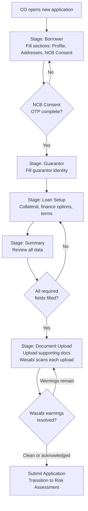

# Capability: Smart Form

**Product**: Onigiri — [PRODUCT](../../PRODUCT.md)
**Portfolio**: Credit
**Product Owner**: TBD (Credit PO)
**Status**: 📝 Draft — @FEATURE decomposition pending
**Last Updated**: 2026-03-12

---

## Business Function

Provide a configurable, section-based loan application form that captures borrower, guarantor, loan setup, and collateral information — storing all application data as a flexible JSON object to support rapid product evolution without database schema migrations.

## Why It Exists (First Principles)

- **Product Variety Problem**: The company offers multiple loan products (car title, land title, personal). Each product requires different fields, sections, and validation rules. A rigid, column-per-field relational model cannot keep up with product launches and changes.
- **Branch UX**: Collection officers and branch staff fill applications in the field — sometimes at the customer's home, sometimes at the branch. The form must be steppable, savable mid-way, and resumable.
- **Data Flexibility**: Loan products evolve. New fields, new sections, new conditional logic. Storing application data as a JSON document in DocumentDB means the form schema can evolve without database migrations for every field change.

---

## Feature Inventory

| Feature | Status | Description |
|---------|--------|-------------|
| Page/Section/Field Composer | Concept | Configuration engine for composing form pages from reusable sections containing typed fields |
| Auto-Prefill | Concept | Pre-populate form fields from authoritative data sources (DaVinci, Core Banking) based on `application_type`; prefilled fields render with source indicators |
| Save Draft (Mid-Session Persistence) | Concept | Persist full JSON application document to DocumentDB on every explicit save and every stage transition |
| Stage Navigator | Concept | Locked-sequence stage progression (Borrower → Guarantor → Loan Setup → Summary → Document Upload) with completion tracking |
| NCB Consent + OTP Flow | Concept | Embedded credit bureau inquiry consent with OTP verification inside the Borrower stage |
| Document Upload Interface | Concept | Upload required supporting documents within the Draft stage; trigger Wasabi early-warning scan on upload |
| Field Lockpoint Enforcement | Concept | Read-only rendering of field groups based on application `state_high_water_mark`; server-side API rejection of writes to locked fields |
| Finance Page | Concept | Renders eligible campaign and plan options within Loan Setup; supports plan selection, re-selection, and Plan Calculation API recalculation on campaign, plan option, or payment due date change |

---

## Business Rules

### Permanent vs. Configurable Stages

| Stage | Configurable? | Description |
|-------|--------------|-------------|
| **Borrower** | ✅ Sections can be added, split across pages, reordered | Captures applicant profile, addresses, NCB consent |
| **Guarantor** | 🔒 Structure is permanent; pages within are splittable | Guarantor identity, relationship to borrower |
| **Loan Setup** | ✅ Sections can be added, reordered | Collateral, finance options, terms |
| **Summary** | 🔒 Permanent | Review of all entered information before submission |
| **Document Upload** | 🔒 Permanent | Upload required supporting documents |

### Data Persistence Rules

| Layer | Database | What It Stores | When It Writes |
|-------|----------|----------------|----------------|
| Application Data | DocumentDB | Full JSON application document (all form sections, field values, uploaded document references) | Every save-draft and every workflow transition |
| Workflow State | RDS | Current workflow state, transition history, timestamps, actor IDs, audit trail | Every workflow transition |

### Field Lockpoint Groups

Fields are organized into **Lockpoint Groups** bound to `state_high_water_mark` thresholds. Once the application's HWM reaches or exceeds a group's threshold, every field in that group becomes permanently read-only in all subsequent Draft states — regardless of what caused the return to Draft.

| Lockpoint Group | Fields | Lock When HWM ≥ | Rationale |
|-----------------|--------|-----------------|-----------|
| `LOAN_TERMS` | Loan amount, interest rate, product type, loan term | `Approval` | These were reviewed and authorized by a credit authority. Post-approval changes bypass that authorization. |
| `DISBURSEMENT_CHANNEL` | Disbursement channel, bank account number, payment details | `Create Facility` | The Core Banking facility is created against a specific disbursement type. Changing it post-facility requires a new facility — a new application. |
| `ALL_FINANCIAL` | All fields in `LOAN_TERMS` + `DISBURSEMENT_CHANNEL` | `Create Loan + Disbursement` | Funds have been released. No financial field may be changed. |

### Read-Only Rendering Rules

| Rule | Specification |
|------|---------------|
| Locked fields render as read-only | Fields in a locked group display their stored value with a lock indicator. They are never hidden or removed from the form. |
| Tooltip on locked fields | Each locked field shows a tooltip explaining which event caused the lock and the required remediation (e.g., *"Disbursement channel locked when facility was created in Core Banking. To change, cancel this application and submit a new one."*) |
| Submit remains available | The Submit action is available whenever all non-locked required fields are filled. Locked fields do not block submission. |
| Server-side enforcement | The application data update API rejects writes to fields in locked groups, regardless of client-side rendering state. The API lock is authoritative; the client lock is UX. |

### Field Definition Properties

| Property | Description |
|----------|-------------|
| `field_name` | Machine-readable key (e.g., `first_name`, `credit_line`) |
| `label` | Human-readable display name (Thai/English) |
| `required` | Whether the field is mandatory for form submission |
| `type` | Input type (text, number, date, select, etc.) |
| `validation` | Rules (regex, range, conditional) |
| `lock_group` | Lockpoint Group this field belongs to (`LOAN_TERMS`, `DISBURSEMENT_CHANNEL`, `ALL_FINANCIAL`, or omitted for no locking) |

### Section Properties

Each section must carry: Section ID (unique), Field List (ordered, with types and validation), Information Owner (borrower / guarantor / collateral), Validation Rules (field-level and section-level), External Integration flag (some sections trigger external actions e.g. NCB OTP), Logical Document Requirement (sections can declare document requirements based on their data), Section Completion status (all required fields filled).

---

### Section & Variant Registry

Each section can have **multiple variants** — different field configurations for different use cases. A product type selects which sections to include and picks one variant per section. Engineering implements each variant; PO selects from available variants in the Product Type Builder.

The registry is organized by section. Collateral variants have full field specifications below. Standard section variants (Identity, Address, Occupation, etc.) follow.

---

#### Standard Section Variants

##### `identity_thai_national` — Identity: Thai National

| `field_name` | Label (EN) | Label (TH) | Type | Required | Validation / Notes |
|-------------|-----------|-----------|------|----------|--------------------|
| `id_prefix` | Prefix | คำนำหน้า | select | Yes | Options: นาย/นาง/นางสาว |
| `id_first_name` | First Name | ชื่อ | text | Yes | |
| `id_last_name` | Last Name | นามสกุล | text | Yes | |
| `id_national_id` | National ID Number | เลขบัตรประจำตัวประชาชน | text | Yes | 13-digit Thai ID format |
| `id_date_of_birth` | Date of Birth | วันเดือนปีเกิด | date | Yes | |
| `id_gender` | Gender | เพศ | select | Yes | |
| `id_marital_status` | Marital Status | สถานภาพ | select | Yes | |
| `id_nationality` | Nationality | สัญชาติ | select | Yes | Default: Thai |
| `id_phone_primary` | Primary Phone | เบอร์โทรศัพท์หลัก | text | Yes | Thai mobile format |
| `id_phone_secondary` | Secondary Phone | เบอร์โทรศัพท์สำรอง | text | No | |
| `id_email` | Email | อีเมล | text | No | |
| `id_line_id` | LINE ID | ไลน์ไอดี | text | No | |

**Information Owner:** `borrower`

---

##### `identity_foreigner` — Identity: Foreigner

| `field_name` | Label (EN) | Label (TH) | Type | Required | Validation / Notes |
|-------------|-----------|-----------|------|----------|--------------------|
| `id_prefix` | Prefix | คำนำหน้า | select | Yes | Mr./Mrs./Ms./Dr. |
| `id_first_name` | First Name | ชื่อ | text | Yes | |
| `id_middle_name` | Middle Name | ชื่อกลาง | text | No | |
| `id_last_name` | Last Name | นามสกุล | text | Yes | |
| `id_passport_number` | Passport Number | เลขหนังสือเดินทาง | text | Yes | |
| `id_passport_expiry` | Passport Expiry Date | วันหมดอายุหนังสือเดินทาง | date | Yes | Must be > today |
| `id_work_permit_number` | Work Permit Number | เลขใบอนุญาตทำงาน | text | Yes | |
| `id_work_permit_expiry` | Work Permit Expiry | วันหมดอายุใบอนุญาตทำงาน | date | Yes | Must be > today |
| `id_date_of_birth` | Date of Birth | วันเดือนปีเกิด | date | Yes | |
| `id_gender` | Gender | เพศ | select | Yes | |
| `id_marital_status` | Marital Status | สถานภาพ | select | Yes | |
| `id_nationality` | Nationality | สัญชาติ | select | Yes | |
| `id_phone_primary` | Primary Phone | เบอร์โทรศัพท์หลัก | text | Yes | |
| `id_email` | Email | อีเมล | text | Yes | Required for foreigners |
| `id_thai_address_proof` | Thai Address Proof | เอกสารยืนยันที่อยู่ในไทย | select | Yes | Lease / work permit / embassy letter |

**Information Owner:** `borrower`

---

##### `identity_corporate` — Identity: Corporate Entity

| `field_name` | Label (EN) | Label (TH) | Type | Required | Validation / Notes |
|-------------|-----------|-----------|------|----------|--------------------|
| `corp_name_th` | Company Name (Thai) | ชื่อบริษัท (ไทย) | text | Yes | |
| `corp_name_en` | Company Name (English) | ชื่อบริษัท (อังกฤษ) | text | Yes | |
| `corp_tax_id` | Tax ID | เลขประจำตัวผู้เสียภาษี | text | Yes | 13-digit Thai tax ID |
| `corp_registration_number` | Registration Number | เลขทะเบียนนิติบุคคล | text | Yes | |
| `corp_registration_date` | Registration Date | วันที่จดทะเบียน | date | Yes | |
| `corp_type` | Company Type | ประเภทนิติบุคคล | select | Yes | Ltd / PLC / Partnership |
| `corp_registered_capital` | Registered Capital (THB) | ทุนจดทะเบียน | number | Yes | |
| `corp_business_type` | Business Type | ประเภทธุรกิจ | select | Yes | |
| `corp_authorized_signatory` | Authorized Signatory | ผู้มีอำนาจลงนาม | text | Yes | |
| `corp_signatory_position` | Signatory Position | ตำแหน่ง | text | Yes | |
| `corp_signatory_id` | Signatory National ID | เลขบัตรประชาชนผู้ลงนาม | text | Yes | 13-digit |
| `corp_phone` | Company Phone | เบอร์โทรบริษัท | text | Yes | |
| `corp_email` | Company Email | อีเมลบริษัท | text | Yes | |
| `corp_website` | Website | เว็บไซต์ | text | No | |
| `corp_employee_count` | Number of Employees | จำนวนพนักงาน | number | No | |
| `corp_annual_revenue` | Annual Revenue (THB) | รายได้ต่อปี | number | Yes | |
| `corp_years_in_business` | Years in Business | จำนวนปีที่ดำเนินธุรกิจ | number | Yes | |
| `corp_director_count` | Number of Directors | จำนวนกรรมการ | number | Yes | |

**Information Owner:** `borrower`

---

##### `address_standard` — Address: Standard

| `field_name` | Label (EN) | Label (TH) | Type | Required | Validation / Notes |
|-------------|-----------|-----------|------|----------|--------------------|
| `addr_current_house_number` | House Number | บ้านเลขที่ | text | Yes | |
| `addr_current_village` | Village / Building | หมู่บ้าน/อาคาร | text | No | |
| `addr_current_moo` | Moo | หมู่ | text | No | |
| `addr_current_soi` | Soi | ซอย | text | No | |
| `addr_current_road` | Road | ถนน | text | No | |
| `addr_current_subdistrict` | Subdistrict | แขวง/ตำบล | select | Yes | Cascading dropdown |
| `addr_current_district` | District | เขต/อำเภอ | select | Yes | Cascading dropdown |
| `addr_current_province` | Province | จังหวัด | select | Yes | Thai province enumeration |
| `addr_current_postcode` | Postcode | รหัสไปรษณีย์ | text | Yes | 5-digit Thai postal code |
| `addr_current_years` | Years at Current Address | อาศัยมาแล้ว (ปี) | number | No | |
| `addr_registration_same` | Registration Address Same as Current | ที่อยู่ตามทะเบียนบ้านตรงกับที่อยู่ปัจจุบัน | boolean | Yes | If true, copy fields |
| `addr_reg_house_number` | Reg. House Number | บ้านเลขที่ (ทะเบียนบ้าน) | text | Conditional | Required if `addr_registration_same` = false |
| `addr_reg_subdistrict` | Reg. Subdistrict | แขวง/ตำบล (ทะเบียนบ้าน) | select | Conditional | |
| `addr_reg_district` | Reg. District | เขต/อำเภอ (ทะเบียนบ้าน) | select | Conditional | |
| `addr_reg_province` | Reg. Province | จังหวัด (ทะเบียนบ้าน) | select | Conditional | |

**Information Owner:** `borrower`

---

##### `address_rural` — Address: Rural / Agricultural

| `field_name` | Label (EN) | Label (TH) | Type | Required | Validation / Notes |
|-------------|-----------|-----------|------|----------|--------------------|
| `addr_village_name` | Village Name | ชื่อหมู่บ้าน | text | Yes | |
| `addr_moo` | Moo Number | หมู่ที่ | text | Yes | |
| `addr_tambon` | Tambon | ตำบล | select | Yes | |
| `addr_amphoe` | Amphoe | อำเภอ | select | Yes | |
| `addr_province` | Province | จังหวัด | select | Yes | |
| `addr_postcode` | Postcode | รหัสไปรษณีย์ | text | Yes | |
| `addr_land_title_ref` | Nearby Land Title Reference | เลขที่โฉนดใกล้เคียง | text | No | |
| `addr_gps_latitude` | GPS Latitude | ละติจูด | number | No | |
| `addr_gps_longitude` | GPS Longitude | ลองติจูด | number | No | |
| `addr_years_in_area` | Years in Area | อาศัยในพื้นที่ (ปี) | number | No | |
| `addr_housing_type` | Housing Type | ลักษณะที่อยู่อาศัย | select | Yes | Own / Rent / Family |
| `addr_nearest_landmark` | Nearest Landmark | จุดสังเกตใกล้เคียง | text | No | |

**Information Owner:** `borrower`

---

##### `occupation_employed` — Occupation: Employed

| `field_name` | Label (EN) | Label (TH) | Type | Required | Validation / Notes |
|-------------|-----------|-----------|------|----------|--------------------|
| `occ_employment_status` | Employment Status | สถานะการทำงาน | select | Yes | Permanent / Contract / Probation |
| `occ_employer_name` | Employer Name | ชื่อบริษัท/นายจ้าง | text | Yes | |
| `occ_employer_phone` | Employer Phone | เบอร์โทรที่ทำงาน | text | No | |
| `occ_position` | Position / Title | ตำแหน่ง | text | Yes | |
| `occ_department` | Department | แผนก | text | No | |
| `occ_years_employed` | Years at Current Employer | อายุงาน (ปี) | number | Yes | |
| `occ_monthly_income` | Monthly Income (THB) | รายได้ต่อเดือน | number | Yes | |
| `occ_income_proof_type` | Income Proof Type | ประเภทเอกสารรายได้ | select | Yes | Payslip / Bank statement / Tax cert |
| `occ_business_type` | Business / Industry Type | ประเภทธุรกิจ | select | Yes | |
| `occ_work_address_same` | Work Address Same as Employer | ที่อยู่ทำงานตรงกับที่อยู่บริษัท | boolean | No | |

**Information Owner:** `borrower`

---

##### `occupation_self_employed` — Occupation: Self-Employed

| `field_name` | Label (EN) | Label (TH) | Type | Required | Validation / Notes |
|-------------|-----------|-----------|------|----------|--------------------|
| `occ_business_name` | Business Name | ชื่อกิจการ | text | Yes | |
| `occ_business_registration` | Business Registration Number | เลขทะเบียนพาณิชย์ | text | No | |
| `occ_business_type` | Business Type | ประเภทกิจการ | select | Yes | |
| `occ_years_in_business` | Years in Business | ดำเนินกิจการมาแล้ว (ปี) | number | Yes | |
| `occ_monthly_revenue` | Monthly Revenue (THB) | รายรับต่อเดือน | number | Yes | |
| `occ_monthly_expenses` | Monthly Business Expenses (THB) | รายจ่ายกิจการต่อเดือน | number | Yes | |
| `occ_net_income` | Estimated Net Income (THB) | รายได้สุทธิประมาณ | number | Yes | |
| `occ_employee_count` | Number of Employees | จำนวนพนักงาน | number | No | |
| `occ_business_address` | Business Address | ที่อยู่กิจการ | text | Yes | |
| `occ_business_phone` | Business Phone | เบอร์โทรกิจการ | text | No | |
| `occ_income_proof_type` | Income Proof Type | ประเภทเอกสารรายได้ | select | Yes | Bank statement / Tax filing / Revenue receipt |
| `occ_tax_filing_status` | Tax Filing Status | สถานะการยื่นภาษี | select | Yes | Filed / Not filed |

**Information Owner:** `borrower`

---

##### `occupation_freelance` — Occupation: Freelance / Gig

| `field_name` | Label (EN) | Label (TH) | Type | Required | Validation / Notes |
|-------------|-----------|-----------|------|----------|--------------------|
| `occ_work_type` | Type of Work | ลักษณะงาน | text | Yes | |
| `occ_primary_platform` | Primary Platform / Client | แพลตฟอร์มหลัก/ลูกค้าหลัก | text | No | e.g., Grab, Shopee, direct clients |
| `occ_years_freelancing` | Years Freelancing | ทำงานอิสระมาแล้ว (ปี) | number | Yes | |
| `occ_avg_monthly_income` | Avg Monthly Income (THB) | รายได้เฉลี่ยต่อเดือน | number | Yes | |
| `occ_income_frequency` | Income Frequency | ความถี่ของรายได้ | select | Yes | Daily / Weekly / Monthly / Per-job |
| `occ_bank_account_for_income` | Bank Account for Income | บัญชีรับรายได้ | text | Yes | |
| `occ_income_proof_type` | Income Proof Type | ประเภทเอกสารรายได้ | select | Yes | Bank statement / Platform screenshot |
| `occ_has_secondary_income` | Has Secondary Income | มีรายได้เสริม | boolean | No | |

**Information Owner:** `borrower`

---

##### `income_standard` — Income & Expenses: Standard

| `field_name` | Label (EN) | Label (TH) | Type | Required | Validation / Notes |
|-------------|-----------|-----------|------|----------|--------------------|
| `inc_monthly_income` | Total Monthly Income (THB) | รายได้รวมต่อเดือน | number | Yes | |
| `inc_monthly_expenses` | Total Monthly Expenses (THB) | รายจ่ายรวมต่อเดือน | number | Yes | |
| `inc_existing_loan_payments` | Existing Loan Payments (THB) | ภาระหนี้สินต่อเดือน | number | Yes | All existing loan installments |
| `inc_number_of_dependents` | Number of Dependents | จำนวนผู้อยู่ในอุปการะ | number | Yes | |
| `inc_housing_cost` | Monthly Housing Cost (THB) | ค่าที่พักต่อเดือน | number | No | Rent / mortgage |
| `inc_other_obligations` | Other Monthly Obligations (THB) | ภาระอื่นๆ ต่อเดือน | number | No | |
| `inc_savings_account` | Has Savings Account | มีบัญชีออมทรัพย์ | boolean | No | |
| `inc_debt_to_income_ratio` | Debt-to-Income Ratio | อัตราส่วนหนี้สินต่อรายได้ | number | No | Auto-calculated |

**Information Owner:** `borrower`

---

##### `income_detailed` — Income & Expenses: Detailed

| `field_name` | Label (EN) | Label (TH) | Type | Required | Validation / Notes |
|-------------|-----------|-----------|------|----------|--------------------|
| `inc_salary` | Monthly Salary (THB) | เงินเดือน | number | Yes | |
| `inc_bonus_avg` | Avg Monthly Bonus (THB) | โบนัสเฉลี่ยต่อเดือน | number | No | |
| `inc_commission` | Monthly Commission (THB) | ค่าคอมมิชชั่นต่อเดือน | number | No | |
| `inc_rental_income` | Rental Income (THB) | รายได้จากการเช่า | number | No | |
| `inc_investment_income` | Investment Income (THB) | รายได้จากการลงทุน | number | No | |
| `inc_other_income` | Other Income (THB) | รายได้อื่นๆ | number | No | |
| `inc_total_income` | Total Monthly Income (THB) | รายได้รวมต่อเดือน | number | Yes | Auto-sum of above |
| `inc_housing_cost` | Housing Cost (THB) | ค่าที่พัก | number | Yes | |
| `inc_food_transport` | Food & Transport (THB) | ค่าอาหารและเดินทาง | number | Yes | |
| `inc_utilities` | Utilities (THB) | ค่าสาธารณูปโภค | number | No | |
| `inc_education` | Education (THB) | ค่าการศึกษา | number | No | |
| `inc_existing_loans` | Existing Loan Payments (THB) | ภาระหนี้สิน | number | Yes | |
| `inc_other_expenses` | Other Expenses (THB) | รายจ่ายอื่นๆ | number | No | |
| `inc_total_expenses` | Total Monthly Expenses (THB) | รายจ่ายรวม | number | Yes | Auto-sum |

**Information Owner:** `borrower`

---

##### `reference_standard` — References: Standard

| `field_name` | Label (EN) | Label (TH) | Type | Required | Validation / Notes |
|-------------|-----------|-----------|------|----------|--------------------|
| `ref1_name` | Reference 1 Name | ชื่อบุคคลอ้างอิง 1 | text | Yes | |
| `ref1_relationship` | Relationship | ความสัมพันธ์ | select | Yes | Parent / Sibling / Spouse / Friend / Colleague |
| `ref1_phone` | Phone | เบอร์โทร | text | Yes | |
| `ref2_name` | Reference 2 Name | ชื่อบุคคลอ้างอิง 2 | text | No | |
| `ref2_relationship` | Relationship | ความสัมพันธ์ | select | No | |
| `ref2_phone` | Phone | เบอร์โทร | text | No | |

**Information Owner:** `borrower`

---

##### `reference_with_guarantor` — References: With Guarantor

| `field_name` | Label (EN) | Label (TH) | Type | Required | Validation / Notes |
|-------------|-----------|-----------|------|----------|--------------------|
| `ref1_name` | Reference 1 Name | ชื่อบุคคลอ้างอิง 1 | text | Yes | |
| `ref1_relationship` | Relationship | ความสัมพันธ์ | select | Yes | |
| `ref1_phone` | Phone | เบอร์โทร | text | Yes | |
| `ref2_name` | Reference 2 Name | ชื่อบุคคลอ้างอิง 2 | text | No | |
| `ref2_relationship` | Relationship | ความสัมพันธ์ | select | No | |
| `ref2_phone` | Phone | เบอร์โทร | text | No | |
| `guar_prefix` | Guarantor Prefix | คำนำหน้าผู้ค้ำประกัน | select | Yes | |
| `guar_first_name` | Guarantor First Name | ชื่อผู้ค้ำประกัน | text | Yes | |
| `guar_last_name` | Guarantor Last Name | นามสกุลผู้ค้ำประกัน | text | Yes | |
| `guar_national_id` | Guarantor National ID | เลขบัตรประชาชนผู้ค้ำประกัน | text | Yes | 13-digit |

**Information Owner:** `borrower`

---

#### Collateral Section Variants

#### `collateral_car` — Car (Vehicle Title)

The car collateral section presents a **vehicle type selector** at the top. Sedan (รถเก๋ง) and Van (รถตู้) share the same field set. Pickup Truck (รถกระบะ) has one additional field.

| `field_name` | Label (EN) | Label (TH) | Type | Required | Validation / Notes |
|-------------|-----------|-----------|------|----------|--------------------|
| `car_vehicle_type` | Vehicle Type | เลือกประเภทรถยนต์ | select | Yes | Options: `sedan` (รถเก๋ง), `pickup_truck` (รถกระบะ), `van` (รถตู้) |
| `car_registration_date` | Registration Date | วันที่จดทะเบียน | date | Yes | |
| `car_possession_date` | Possession Date | วันที่ครอบครอง | date | Yes | |
| `car_ownership_type` | Ownership Type | ประเภทการครอบครอง | select | Yes | |
| `car_previous_possession_date` | Previous Possession Date | วันที่ครอบครอง (ผู้ถือครองก่อนหน้า) | date | No | Required when `car_previous_owner` is filled |
| `car_previous_owner` | Previous Owner | ผู้ถือครองก่อนหน้า | select | No | |
| `car_plate_number` | License Plate Number | เลขทะเบียน | text | Yes | Thai plate format |
| `car_province` | Province | จังหวัด | select | Yes | Thai province enumeration |
| `car_act_type` | Act Type (ร.ย.) | ประเภทตาม พ.ร.บ.(รย.) | select | Yes | Vehicle class per Motor Vehicle Act |
| `car_brand` | Brand | ยี่ห้อรถ | select | Yes | |
| `car_model` | Model | แบบรุ่น | select | Yes | Dependent on `car_brand` |
| `car_year` | Year (C.E.) | รุ่นปี (ค.ศ.) | select | Yes | CE year |
| `car_gear` | Gear / Transmission | เกียร์ | select | Yes | |
| `car_submodel` | Sub-model | รุ่นย่อย | select | Yes | Dependent on `car_model` |
| `car_num_doors` | Number of Doors | จำนวนประตู | select | Yes | |
| `car_description` | Description | คำอธิบาย | select | No | |
| `car_system_not_found` | No Matching Option in System | ไม่มีตัวเลือกกรณีนี้ในระบบ | boolean | No | Checkbox; allows CO to flag when brand/model not found in system |
| `car_canopy_installed` | Has Canopy / Cargo Box Installed | ติดคอกตู้หรือไม่ | select | Yes (pickup only) | **Pickup Truck only** — hidden for sedan and van |
| `car_color` | Color (up to 3) | สี | multi-select | Yes | Color palette picker; max 3 selections; options include เหลือง/ส้ม/แดง/ชมพู/ม่วง/น้ำเงิน/ฟ้า/เขียว/น้ำตาล/ดำ/เทา/ขาว/หลายสี |
| `car_chassis_number` | Chassis Number | เลขตัวถัง | text | Yes | |
| `car_engine_number` | Engine Number | เลขเครื่องยนต์ | text | Yes | |
| `car_engine_cc` | Engine Size (CC) | จำนวนซีซี | number | Yes | |
| `car_mileage` | Mileage (km) | เลขไมล์ | number | No | |
| `car_tax_renewal_date` | Tax Renewal Date (B.E.) | วันครบกำหนดเสียภาษี (พ.ศ.) | date | No | Buddhist Era date; `car_tax_renewal_date_unknown` flag disables this field |
| `car_tax_renewal_date_unknown` | Tax Date Unknown | ไม่สามารถระบุได้ | boolean | No | Checkbox; when checked, `car_tax_renewal_date` is not required |
| `car_tax_source` | Tax Date Source | ที่มาของวันครบกำหนดเสียภาษี | select | No | Required when `car_tax_renewal_date` is filled |
| `car_gas_modification_status` | Gas Modification Status | สถานะการดัดแปลงสภาพการติดก๊าซ | radio | Yes | Options: `none` (ไม่ดัดแปลง — สภาพตามโรงงาน), `modified` (ดัดแปลง — เปลี่ยน/เพิ่ม/ลด ถังก๊าซ) |
| `car_other_modification_status` | Other Modification Status | สถานะการดัดแปลงสภาพ อื่นๆ | radio | Yes | Options: `none` (ไม่ดัดแปลง), `modified` (ดัดแปลง) |
| `car_name_match` | Registration Name Matches ID Card | ชื่อในเล่มทะเบียนรถตรงกับในบัตรประชาชน | radio | Yes | Options: `match` (ตรงกัน), `no_match` (ไม่ตรงกัน) |

**Information Owner:** `collateral`
**Document Declarations:** `vehicle_registration_book` (required), `vehicle_insurance` (required), `vehicle_dlt_web_page` (required — no act-type exclusion; car has no RY condition)

---

#### `collateral_bike` — Bike (Motorbike Title)

| `field_name` | Label (EN) | Label (TH) | Type | Required | Validation / Notes |
|-------------|-----------|-----------|------|----------|--------------------|
| `bike_registration_date` | Registration Date | วันที่จดทะเบียน | date | Yes | |
| `bike_possession_date` | Possession Date | วันที่ครอบครอง | date | Yes | |
| `bike_ownership_type` | Ownership Type | ประเภทการครอบครอง | select | Yes | |
| `bike_previous_owner` | Previous Owner | ผู้ถือครองก่อนหน้า | text | No | |
| `bike_previous_possession_date` | Previous Possession Date | วันที่ครอบครอง (ก่อนหน้า) | date | No | Required when `bike_previous_owner` is filled |
| `bike_plate_number` | License Plate Number | เลขทะเบียน | text | Yes | Thai plate format |
| `bike_province` | Province | จังหวัด | select | Yes | Thai province enumeration |
| `bike_act_type` | Act Type (ร.ย.) | ประเภทตาม พ.ร.บ. | select | Yes | Vehicle class per Motor Vehicle Act; drives DLT photo requirement |
| `bike_brand` | Brand | ยี่ห้อรถ | select | Yes | |
| `bike_model` | Model | แบบรุ่น | select | Yes | Dependent on `bike_brand` |
| `bike_year` | Year (C.E.) | รุ่นปี (ค.ศ.) | number | Yes | 4-digit CE year |
| `bike_chassis_number` | Chassis Number | เลขตัวถัง | select+text | Yes | Select source type; then enter number |
| `bike_engine_number` | Engine Number | เลขเครื่องยนต์ | select+text | Yes | Select source type; then enter number |
| `bike_engine_cc` | Engine Size (CC) | จำนวนซีซี | number | Yes | |
| `bike_tax_renewal_date` | Tax Renewal Date | วันครบกำหนดเสียภาษี | date | Yes | |
| `bike_tax_source` | Tax Date Source | ที่มาของวันครบกำหนดเสียภาษี | select | Yes | Options: `front_of_tax_page`, `tax_receipt` |
| `bike_name_match` | Registration Name Matches ID Card | ชื่อในเล่มทะเบียนรถตรงกับในบัตรประชาชน | boolean | Yes | |

**Information Owner:** `collateral`
**Document Declarations:** `motorbike_registration_book` (required), `motorbike_insurance` (required), `motorbike_dlt_web_page` (conditionally required — excluded when `bike_act_type = RY-17`)

> **Note (Act Type RY-17):** For motorbikes registered under ร.ย.17, no DLT (กรมขนส่ง) web page photo is required. The Onigiri Worker excludes `motorbike_dlt_web_page` from the Matcha task's `documents[]` array when `bike_act_type = "RY-17"`.

---

#### `collateral_tractor` — Tractor (Agricultural Equipment Title)

| `field_name` | Label (EN) | Label (TH) | Type | Required | Validation / Notes |
|-------------|-----------|-----------|------|----------|--------------------|
| `tractor_registration_date` | Registration Date | วันที่จดทะเบียน | date | Yes | |
| `tractor_possession_date` | Possession Date | วันที่ครอบครอง | date | Yes | |
| `tractor_ownership_type` | Ownership Type | ประเภทการครอบครอง | select | Yes | |
| `tractor_previous_owner` | Previous Owner | ผู้ถือครองก่อนหน้า | text | No | |
| `tractor_previous_possession_date` | Previous Possession Date | วันที่ครอบครอง (ก่อนหน้า) | date | No | Required when `tractor_previous_owner` is filled |
| `tractor_plate_number` | License Plate Number | เลขทะเบียน | text | Yes | Thai plate format |
| `tractor_province` | Province | จังหวัด | select | Yes | Thai province enumeration |
| `tractor_act_type` | Act Type (ร.ย.) | ประเภทตาม พ.ร.บ. | select | Yes | Vehicle class per Motor Vehicle Act; drives DLT photo requirement |
| `tractor_brand` | Brand | ยี่ห้อรถ | select | Yes | |
| `tractor_model` | Model | แบบรุ่น | text | Yes | |
| `tractor_year` | Year (C.E.) | รุ่นปี (ค.ศ.) | number | Yes | 4-digit CE year |
| `tractor_color` | Color | สี | select | Yes | |
| `tractor_chassis_number` | Chassis Number | เลขตัวถัง | text | Yes | |
| `tractor_engine_number` | Engine Number | เลขเครื่องยนต์ | text | Yes | |
| `tractor_horsepower` | Horsepower | แรงม้า | number | Yes | |
| `tractor_working_hours` | Working Hours | จำนวนชั่วโมงการทำงาน | number | Yes | |
| `tractor_tax_renewal_date` | Tax Renewal Date | วันครบกำหนดเสียภาษี | date | Yes | |
| `tractor_tax_source` | Tax Date Source | ที่มาของวันครบกำหนดเสียภาษี | select | Yes | Options: `front_of_tax_page`, `tax_receipt` |
| `tractor_modification_status` | Modification Status | สถานะการดัดแปลงสภาพ | select | Yes | |
| `tractor_name_match` | Registration Name Matches ID Card | ชื่อในเล่มทะเบียนรถตรงกับในบัตรประชาชน | boolean | Yes | |
| `tractor_accessories` | Accessories | อุปกรณ์เสริม | checklist | No | Multi-select: blades, plows, grass cutters |

**Information Owner:** `collateral`
**Document Declarations:** `tractor_registration_book` (required), `tractor_dlt_web_page` (conditionally required — excluded when `tractor_act_type = RY-13`)

> **Note (Act Type RY-13):** For tractors registered under ร.ย.13, no DLT (กรมขนส่ง) web page photo is required. The Onigiri Worker excludes `tractor_dlt_web_page` from the Matcha task's `documents[]` array when `tractor_act_type = "RY-13"`.

---

#### `collateral_land` — Land (Title Deed)

The land collateral section is organized into five sub-sections. All sub-sections are part of the single `collateral_land` Smart Form section rendered in the Loan Setup stage.

---

##### Sub-section 1: Ownership (ผู้ถือครองกรรมสิทธิ์)

| `field_name` | Label (EN) | Label (TH) | Type | Required | Validation / Notes |
|-------------|-----------|-----------|------|----------|--------------------|
| `land_owner_prefix` | Prefix | คำนำหน้า | select | Yes | |
| `land_owner_first_name` | First Name | ชื่อ | text | Yes | |
| `land_owner_last_name` | Last Name | นามสกุล | text | Yes | |
| `land_possession_date` | Possession Date | วันที่ครอบครอง | date | Yes | |
| `land_ownership_type` | Ownership Type | ประเภทการครอบครอง | select | Yes | |
| `land_previous_owner` | Previous Owner | ผู้ถือครองก่อนหน้า | text | No | |
| `land_previous_possession_date` | Previous Possession Date | วันที่ครอบครอง (ก่อนหน้า) | date | No | Required when `land_previous_owner` is filled |

---

##### Sub-section 2: Title Deed Details (เอกสารสิทธิ)

| `field_name` | Label (EN) | Label (TH) | Type | Required | Validation / Notes |
|-------------|-----------|-----------|------|----------|--------------------|
| `land_title_deed_type` | Title Deed Type | ประเภทเอกสารสิทธิ | select | Yes | |
| `land_collateral_type` | Collateral Type | ประเภทหลักประกัน | select | Yes | |
| `land_collateral_subtype` | Collateral Sub-type | ประเภทหลักประกันย่อย | select | Yes | Dependent on `land_collateral_type` |
| `land_title_deed_number` | Title Deed Number | เลขที่โฉนด | text | Yes | |
| `land_number` | Land Number | เลขที่ดิน | text | Yes | |
| `land_area_rai` | Area — Rai | เนื้อที่ ไร่ | number | Yes | Non-negative integer |
| `land_area_ngan` | Area — Ngan | เนื้อที่ งาน | number | Yes | Integer 0–3 |
| `land_area_sqwa` | Area — Square Wa | เนื้อที่ ตารางวา | number | Yes | Decimal 0–99 |
| `land_subdistrict` | Subdistrict (Tambon) | ตำบล | select | Yes | |
| `land_district` | District (Amphoe) | อำเภอ | select | Yes | Dependent on `land_subdistrict` |
| `land_province` | Province | จังหวัด | select | Yes | Dependent on `land_district` |
| `land_address_match_check` | Collateral Location Matches Which Address | ที่ตั้งหลักประกันตรงกับที่อยู่ใด | select | Yes | Links collateral location to a registered address in borrower profile |
| `land_loc_house_number` | House Number | บ้านเลขที่ | text | No | Collateral physical location |
| `land_loc_village` | Village / Building | หมู่บ้าน/อาคาร | text | No | |
| `land_loc_moo` | Moo | หมู่ | text | No | |
| `land_loc_soi` | Soi | ซอย | text | No | |
| `land_loc_road` | Road | ถนน | text | No | |
| `land_loc_subdistrict` | Location Subdistrict | แขวง/ตำบล | select | No | |
| `land_loc_district` | Location District | เขต/อำเภอ | select | No | |
| `land_loc_province` | Location Province | จังหวัด | select | No | |
| `land_loc_postcode` | Postcode | รหัสไปรษณีย์ | text | No | |
| `land_latitude` | Latitude | ละติจูด | number | Yes | Decimal degrees |
| `land_longitude` | Longitude | ลองติจูด | number | Yes | Decimal degrees |
| `land_map_pin` | Google Map Pin | Pin google map | file | Yes | Map screenshot or Google Maps link |
| `land_conditions` | Conditions Checklist | เงื่อนไขต่างๆ | checklist | No | Multiple condition flags |

**Condominium-only fields** (conditional — shown when `land_collateral_type` = condominium / อช.2):

| `field_name` | Label (EN) | Label (TH) | Type | Required |
|-------------|-----------|-----------|------|----------|
| `condo_built_on_deed_number` | Built on Title Deed No. | ปลูกสร้างบนโฉนดเลขที่ | text | Conditional |
| `condo_area_sqm` | Area (sq.m.) | เนื้อที่ประมาณ (ตารางเมตร) | number | Conditional |
| `condo_unit_number` | Unit Number | ห้องชุดเลขที่ | text | Conditional |
| `condo_floor` | Floor | ชั้นที่ | number | Conditional |
| `condo_building_number` | Building Number | อาคารเลขที่ | text | Conditional |
| `condo_juristic_registration` | Condominium Registration | ทะเบียนอาคารชุด | text | Conditional |
| `condo_name` | Condominium Name | ชื่ออาคารชุด | text | Conditional |

---

##### Sub-section 3: Land Characteristics (ลักษณะที่ดิน)

| `field_name` | Label (EN) | Label (TH) | Type | Required |
|-------------|-----------|-----------|------|----------|
| `land_shape` | Land Shape | รูปแปลงที่ดิน | select | Yes |
| `land_access_road` | Access Road Type | ถนนเข้า-ออกหลักประกัน | select | Yes |
| `land_electrical_system` | Electrical System | ระบบไฟฟ้า | select | Yes |

---

##### Sub-section 4: Appraisal Data (ข้อมูลใบประเมินจากกรมที่ดิน)

| `field_name` | Label (EN) | Label (TH) | Type | Required | Validation / Notes |
|-------------|-----------|-----------|------|----------|--------------------|
| `land_appraisal_price` | Land Appraisal Price (THB) | ราคาประเมินหลักประกัน (ที่ดิน) | number | Yes | Positive integer |
| `land_building_appraisal_price` | Building Appraisal Price (THB) | ราคาประเมินหลักประกัน (สิ่งปลูกสร้าง) | number | No | Required if structure exists on land |
| `land_appraisal_conditions` | Appraisal Conditions Checklist | เงื่อนไขใบประเมิน | checklist | No | |
| `land_appraisal_date` | Appraisal Date | วันที่ออกใบประเมินหลักประกัน | date | Yes | |

---

##### Sub-section 5: Registered Address (ที่อยู่ตามทะเบียนบ้าน)

| `field_name` | Label (EN) | Label (TH) | Type | Required |
|-------------|-----------|-----------|------|----------|
| `land_reg_address_name` | Address Name | ชื่อเรียกที่อยู่ | text | No |
| `land_reg_house_number` | House Number | บ้านเลขที่ | text | Yes |
| `land_reg_village` | Village / Building | หมู่บ้าน/อาคาร | text | No |
| `land_reg_moo` | Moo | หมู่ | text | No |
| `land_reg_soi` | Soi | ซอย | text | No |
| `land_reg_road` | Road | ถนน | text | No |
| `land_reg_subdistrict` | Subdistrict | แขวง/ตำบล | select | Yes |
| `land_reg_district` | District | เขต/อำเภอ | select | Yes |
| `land_reg_province` | Province | จังหวัด | select | Yes |
| `land_reg_postcode` | Postcode | รหัสไปรษณีย์ | text | Yes |
| `land_reg_description` | Additional Description | คำอธิบายเพิ่มเติม | text | No |
| `land_reg_latitude` | Latitude | ละติจูด | number | No |
| `land_reg_longitude` | Longitude | ลองติจูด | number | No |
| `land_reg_map_pin` | Google Map Pin | Pin google map | file | No |
| `land_reg_house_code` | House Code Number | เลขรหัสประจำบ้าน | text | No |
| `land_reg_owner_status` | Is Owner of this Address | สถานะเป็นเจ้าของบ้าน | boolean | No |

---

**Information Owner:** `collateral`
**Document Declarations:** `land_title_deed` (required), `land_appraisal_certificate` (required)

---

### Section Selection Rule

A **product type** selects which sections to include and picks **one variant per section**. The Collateral section is always required; all other sections (Identity, Address, Occupation, Income & Expenses, References) are toggleable by the PO. A **campaign** references the product type — it does not select sections directly.

| Rule | Detail |
|------|--------|
| Collateral section | Always required — cannot be toggled off |
| Standard sections | PO toggles on/off per product type |
| Variant per section | Exactly one variant selected per included section |
| Multiple collateral types | Not supported within a single product type — each collateral type is a separate product type |
| Enforcement | Product type defines the section/variant set; campaign's eligibility rule gates entry before the form loads |

### Stage-to-Section Mapping

Smart Form stages map to the sections selected in the product type:

| Stage | Sections | Selection |
|-------|----------|-----------|
| **Borrower** | Identity, Address, Occupation, Income & Expenses, References | PO selects which to include + one variant per section |
| **Guarantor** | Identity, Address | Fixed structure (uses same variant definitions) |
| **Loan Setup** | Collateral | One variant per product type (always required) |
| **Summary** | — | Auto-generated from filled sections |
| **Document Upload** | — | Driven by product type's document configuration |

---

### Auto-Prefill Rules

#### Auto-Prefill — `restructure`

Prefill source: **DaVinci** (customer record) + **Core Banking** (existing loan record).

Applies to both restructure entry paths (via pre-approval and direct).

| Data Group | Source | Fields Prefilled |
|---|---|---|
| Customer identity and profile | DaVinci | Name, ID card, address, contact details |
| Existing loan reference | Core Banking | Loan account number, product type |
| Loan financial data | Core Banking | Outstanding balance, original tenor, DPD, contract age, interest rate |
| Collateral data | Core Banking / DaVinci | Collateral type, valuation amount, appraisal date |

For restructure **via pre-approval**: `pre_approval_snapshot` carries the selected campaign and plan as a starting point for the Finance Page. This is separate from form field prefill — the snapshot is not used as a field data source.

#### Prefill Field Editability

Editability of prefilled fields is determined per field per `application_type`. A prefilled field may be editable (CO can override), read-only (CO cannot change), or conditionally editable (editable until a workflow state threshold is reached). Detail is defined per loan type section.

---

### Application Types — `restructure`

Restructure has two entry paths. Both produce the same application record structure and follow the same workflow from Draft onwards.

**Path 1 — Via Pre-Approval (Draft Initializer)**

- Draft is created from a confirmed pre-approval (`pre_approval_id` present on the application)
- Form fields prefilled from DaVinci + Core Banking
- Finance Page pre-populates from `pre_approval_snapshot` as the starting point
- CO may re-select campaign or plan option on the Finance Page

**Path 2 — Direct (No Pre-Approval)**

- Draft is created without a prior pre-approval
- Form fields prefilled from DaVinci + Core Banking
- CO selects campaign and plan option on the Finance Page

Both paths support Finance Page re-selection and Plan Calculation API recalculation triggered by any change.

---

### Finance Page Rules by Application Type

| Application Type | Behaviour |
|---|---|
| `new_booking` | No Finance Page — standard Loan Setup fields only |
| `topup` | Campaign pre-selected at worklist; Finance Page renders plan details for CO confirmation; campaign cannot be switched inside Smart Form |
| `restructure` (via pre-approval) | Finance Page pre-populates from `pre_approval_snapshot`; CO may change campaign or plan option; any change triggers Plan Calculation API recalculation |
| `restructure` (direct) | Finance Page renders eligible campaigns and plan options; CO selects; any change triggers Plan Calculation API recalculation |

- The restructure Finance Page must call the Plan Calculation API whenever the CO changes the selected campaign, plan option, or payment due date. The CO cannot progress to Summary until a successful recalculation response confirms the selected plan.
- The pre-approval plan is the **default selection**, not a lock. Changes made in Smart Form override the snapshot. `pre_approval_snapshot` is preserved for change detection at submission.

---

### Tenor Filter (Restructure Only)

- Tenor options **equal to or shorter than** the original loan tenor are disabled on the Finance Page for all restructure paths.
- Applies to both restructure entry paths (via pre-approval and direct).
- If no valid tenor options remain after Plan Calculation API recalculation, the CO cannot progress to Summary.

---

### Document Upload Rules by Application Type

- The required document checklist is always driven by the campaign's **Application Template** — not hardcoded by `application_type`.
- `restructure` uses a restructure-specific document set defined in the restructure campaign template.
- Documents uploaded at the **pre-approval stage** are stored on the pre-approval record — not on the Draft application. If the campaign template requires the same document type at the Draft stage, the CO must upload again on the application.
- Wasabi early-warning scan is triggered on every document upload regardless of `application_type`.

---

## User Flow

---

## NFRs

| NFR | Requirement |
|-----|-------------|
| Mid-session persistence | Application data must survive browser close; recoverable on re-open |
| Schema-free evolution | New fields and sections added via configuration — zero DDL changes |
| DocumentDB write on every save-draft | Full JSON document persisted, not incremental patch |
| Stage sequence locked | Stages cannot be reordered or skipped at runtime |
| Plan Calculation guard | Restructure Finance Page must block Summary progression until a successful Plan Calculation API response confirms the selected plan |

---

## Open Questions

- Should partial (incomplete) sections be savable, or must all required fields be complete before a section save is accepted?
- How are conditional sections (e.g., Guarantor section appearing only if risk assessment flags it) handled — pre-submission or post-submission?
