# Capability: Underwriting Workflow

**Product**: Onigiri — [PRODUCT](../../PRODUCT.md)
**Portfolio**: Credit
**Product Owner**: TBD (Credit PO)
**Status**: 📝 Draft — @FEATURE decomposition pending
**Last Updated**: 2026-03-10

---

## Business Function

Provide a multi-topology workflow engine that powers regulated business processes across Onigiri — each process runs as a fixed-topology state machine with configurable execution steps per state. The first and primary topology is the loan application lifecycle; additional topologies (rule change approval, campaign publication approval) run on the same engine.

## Why It Exists (First Principles)

- **Process Integrity**: Regulated processes (loan underwriting, risk rule changes, campaign publication) require mandatory, auditable steps. Fixed topologies enforce this — no step can be skipped.
- **Maintenance Cost**: Fully customizable workflow engines are extremely hard to maintain, test, and audit. A single engine with multiple fixed topologies is testable and predictable.
- **Practical Flexibility**: What changes frequently is not *which states exist* but *what happens inside each state*. Configurable execution steps provide operational flexibility without topology risk.
- **Infrastructure Reuse**: Approval workflows for risk rules and campaign publication share the same state machine, audit trail, and execution step infrastructure as the loan application workflow — no parallel engine to build or maintain.

---

## Feature Inventory

| Feature | Status | Description |
|---------|--------|-------------|
| Workflow Engine (Multi-Topology) | Spec | Shared engine that runs multiple fixed-topology state machines; each topology has its own states and configurable execution steps — [FEATURE](features/FEATURE_workflow-state-machine-engine.md) |
| Loan Application Workflow (Topology A) | Concept | 4-phase fixed topology: Origination → Underwriting → Decision → Terminal with 11 named states |
| 4-Phase State Machine | Concept | Fixed-topology workflow: Origination → Underwriting → Decision → Terminal with 17 named states (includes Disbursement Orchestration states) |
| Configurable Execution Steps | Concept | Per-state pluggable step execution (document checks, risk criteria, integrations, approvals, printouts) |
| Cash vs. Non-Cash Path Router | Concept | Automatic routing decision at Create Facility state based on disbursement type |
| Return Paths to Draft | Concept | Multiple states can return application to Draft for corrections (Risk Assessment, Approval, QA) |
| Workflow Audit Log | Concept | Immutable RDS record of every state transition with actor, timestamp, and reason |
| Inbound Callback Authentication | Spec | HMAC-SHA256 signature verification on all inbound callbacks (Matcha, Wasabi) before any state transition is triggered — [FEATURE](features/FEATURE_inbound-callback-authentication.md) |
| Application High-Water Mark | Concept | Monotonically increasing `state_high_water_mark` on the application record; written on every state entry; drives Smart Form field lockpoints |

---

## Business Rules

### Shared Engine Topologies

The workflow engine hosts multiple fixed topologies. Each topology defines its own state graph, but all share the same execution step infrastructure, audit trail, and transition atomicity guarantees.

| Topology | Entity Type | States | Feature Spec |
|----------|-------------|--------|-------------|
| **A — Loan Application Workflow** | Loan application | 11 states across 4 phases | [Topology A diagram below](#workflow-diagram) |
| **B — Rule Change Approval** | Risk strategy / policy / rule change | 5 states | [FEATURE](../../risk-assessment-engine/features/FEATURE_rule-change-authorization.md) |
| **C — Campaign Publication Approval** | Campaign version | 6 states | [FEATURE](../../loan-campaign-configuration/features/FEATURE_campaign-publication-authorization.md) |

All topologies share: transition atomicity, immutable audit trail, configurable execution steps per state.

---

### State Definitions

> **State identifier convention**: machine-readable state IDs are `snake_case`. Human-readable labels are shown in parentheses where different.

| State ID | Human Label | Phase | Purpose | Key Actions |
|----------|-------------|-------|---------|-------------|
| `draft` | Draft | Origination | Application data entry, document upload, returns for edits | CO fills smart form, uploads docs, Wasabi scan, submits |
| `risk_assessment` | Risk Assessment | Underwriting | Automated + manual risk scoring | Execute risk strategy engine, generate risk level, required docs |
| `pending_approval` | Approval + Risk Level | Underwriting | Authorization based on risk level | Approver reviews; Approve → Create Facility; Reject → `rejected`; Request docs → Draft |
| `create_facility` | Create Facility | Decision | Create facility accounts in core banking | System integration to create facility |
| `cash_routing` | Cash? | Decision | Routing decision based on disbursement type | System auto-routes: cash vs. non-cash path |
| `confirmation` | Confirmation (cash) | Decision | Confirm loan details before cash disbursement | Variance confirmation — cash path only |
| `create_loan_disbursement` | Create Loan + Disbursement (cash) | Decision | Create loan account and release funds (cash) | System integration to create loan and disburse — cash path |
| `qa` | QA (cash) | Decision | Post-disbursement quality assurance — cash path | Verify completeness, risk criteria, deviation docs, printouts |
| `pending_document_checking` | Pending Document Checking | Decision | Waiting for Matcha async verification callback — non-cash path | Matcha verifies submitted documents; application blocked until callback arrives |
| `waiting_for_confirmation` | Waiting for Confirmation | Decision | Branch must confirm disbursement details with customer | Loan officer calls `POST /confirm-loan-payment` (→ `waiting_create_facility`) or `POST /reject-confirmation` (→ `rejected`); owned by Disbursement Orchestration |
| `waiting_create_facility` | Waiting Create Facility | Decision | System creates facility record; no human action required | System auto-advances to `waiting_fund_transfer` on completion — not mandatory (automated) |
| `waiting_fund_transfer` | Waiting Fund Transfer | Decision | Waiting for Core Banking COMPLETE callback | Core Banking executes fund transfer; application blocked until callback arrives |
| `waiting_create_loan_operation` | Waiting Create Loan Operation | Decision | Fund transfer confirmed; ready to create loan operation record | Next step TBD — see Disbursement Orchestration Open Question #2 |
| `funded` | Funded | Terminal | Loan successfully disbursed | End state — loan is active |
| `rejected` | Rejected | Terminal | Application rejected — at Approval, via loan officer reject from `waiting_for_confirmation`, or via Core Banking `Reject` callback | End state |
| `withdrawn` | Withdrawn | Terminal | Customer not interested / withdrew | End state |
| `expired` | Expired | Terminal | Application exceeded time limit | End state — system-triggered |

### Cash vs. Non-Cash Path

| Path | Sequence After Create Facility | Rationale |
|------|-------------------------------|-----------|
| Cash | `cash_routing` → `confirmation` → `create_loan_disbursement` → `qa` → `funded` | Money disbursed before QA. Post-disbursement verification. |
| Non-Cash | `cash_routing` → `qa` → `pending_document_checking` → `waiting_for_confirmation` → `waiting_create_facility` (system) → `waiting_fund_transfer` → `waiting_create_loan_operation` → `funded` | Transfer can be held. Pre-disbursement Matcha verification + Core Banking async fund transfer. `waiting_create_facility` is system-automated. |

### Return Paths to Draft

| From State | Trigger | Purpose |
|-----------|---------|---------|
| Risk Assessment | Request additional documents | Missing docs discovered during risk review |
| Approval | Request document upload | Approver needs more documentation |
| QA (cash path) | Request document upload | Post-disbursement doc issues |
| QA (non-cash path) | Request document upload | Pre-disbursement doc issues |
| Any active state | Supervisor recall | Supervisor pulls back application |

### Inbound Callback Authentication

Matcha (document QA outcome) and Wasabi (AI verification report) send inbound callbacks that trigger workflow state transitions. All inbound callbacks must be authenticated before any state transition is triggered. Unauthenticated or invalid callbacks are rejected — no state transition occurs.

| Caller | Callback Purpose | Authentication Requirement |
|--------|-----------------|---------------------------|
| Matcha | QA outcome: `APPROVED` / `RETURNED` / `REFERRED` | HMAC-SHA256 signature; shared secret stored in Onigiri secrets manager |
| Wasabi | Async document verification report | HMAC-SHA256 signature; shared secret stored in Onigiri secrets manager |

**Enforcement rules:**

| Condition | Response | Side Effect |
|-----------|----------|-------------|
| Signature missing | HTTP 401 — reject | Raise security alert; no state transition |
| Signature invalid | HTTP 403 — reject | Raise security alert; no state transition |
| Signature valid but timestamp > 5 min old | HTTP 400 — reject | Log replay attempt; no state transition |
| Signature valid and timestamp within window | HTTP 200 — accept | Trigger state transition normally |

*Resolves audit finding IS-1.*

---
### State High-Water Mark (HWM)

The application record maintains a `state_high_water_mark` — the highest-order state the application has **ever entered**, regardless of subsequent returns to Draft. HWM is monotonically increasing: it advances on every new state entry and never retreats.

HWM is written at **state entry** (before execution steps run), ensuring it reflects every state the application has reached.

| HWM Order | State |
|-----------|-------|
| 1 | Draft |
| 2 | Risk Assessment |
| 3 | Approval |
| 4 | Create Facility |
| 5 | Cash? / Confirmation / QA |
| 6 | Create Loan + Disbursement |
| 7 | Funded / Rejected / Withdrawn / Expired |

The Smart Form reads HWM to determine which field groups are locked. See [Smart Form CAPABILITY.md](../smart-form/CAPABILITY.md) — Field Lockpoint Groups.

### Execution Step Idempotency Guards

Execution steps that call Core Banking carry pre-condition guards evaluated **before** the external call is made. These are defense-in-depth against the field lockpoints in Smart Form.

| Execution Step | Pre-Condition Check | Action on Match |
|----------------|---------------------|-----------------|
| Create Facility | `facility_id` already exists on application record | Skip Core Banking call; reuse existing `facility_id` |
| Create Loan + Disbursement | `disbursement_id` already exists on application record | **Hard block** — raise exception; requires supervisor override to proceed |

The Create Loan + Disbursement guard is a hard stop, not a skip. A second disbursement against an existing loan record is never safe to silently bypass — it must be explicitly resolved by a supervisor.

### Configurable Execution Steps (Inside States)

Execution steps inside each state can be plugged in via campaign configuration. Example steps: Document checks, Risk criteria checks, Integration calls (NCB, Core Banking, Wasabi), Approval routing, Printouts & reports.

---

## Workflow Diagram

```mermaid
stateDiagram-v2
    direction LR

    state "Origination" as orig {
        Draft: draft
    }

    state "Underwriting" as uw {
        RiskAssessment: risk_assessment
        Approval: pending_approval\n(Approval + Risk Level)
    }

    state "Decision — Cash Path" as cash_path {
        Confirmation1: confirmation
        CreateLoanDisb1: create_loan_disbursement
        QA_top: qa
    }

    state "Decision — Non-Cash Path (Disbursement Orchestration)" as noncash_path {
        QA_bottom: qa
        DocCheck: pending_document_checking
        WaitConfirm: waiting_for_confirmation
        WaitCreateFacility: waiting_create_facility
        WaitFund: waiting_fund_transfer
        WaitLoan: waiting_create_loan_operation
    }

    state "Decision — Routing" as routing {
        CreateFacility: create_facility
        Cash: cash_routing
    }

    state "Terminal" as term {
        Funded: funded
        Rejected: rejected
        Withdrawn: withdrawn
        Expired: expired
    }

    [*] --> Draft
    Draft --> RiskAssessment: Submit
    RiskAssessment --> Approval
    RiskAssessment --> Draft: Request docs
    Approval --> CreateFacility: Approve
    Approval --> Rejected: Reject
    Approval --> Draft: Request docs
    CreateFacility --> Cash
    Cash --> Confirmation1: Cash
    Confirmation1 --> CreateLoanDisb1
    CreateLoanDisb1 --> QA_top
    QA_top --> Funded
    QA_top --> Draft: Request docs
    Cash --> QA_bottom: Non-cash
    QA_bottom --> DocCheck: Submit to Matcha
    QA_bottom --> Draft: Request docs
    DocCheck --> WaitConfirm: Matcha approved\n(amount changed)
    DocCheck --> WaitCreateFacility: Matcha approved\n(amount unchanged — bypass)
    DocCheck --> Draft: Matcha returned\nRequest document upload
    DocCheck --> Approval: Matcha referred\nRe-refer to approver
    WaitConfirm --> WaitCreateFacility: Officer confirms
    WaitConfirm --> Rejected: Officer rejects
    WaitCreateFacility --> WaitFund: Facility created\n[system auto]
    WaitFund --> WaitLoan: CB Success
    WaitFund --> Rejected: CB Reject
    WaitLoan --> Funded
    Draft --> Withdrawn
    Draft --> Expired
```

---

## NFRs

| NFR | Requirement |
|-----|-------------|
| Fixed topology per type | Each workflow type has a hardcoded topology — not configurable by users. New topologies require an engineering change; execution steps within states do not. |
| Configurable execution | What happens inside each state is configurable via campaign config — zero code deployment |
| Transition atomicity | Every state transition must be atomic — no partial transitions recorded |
| Audit trail completeness | Every transition logged in RDS with actor, timestamp, trigger reason |
| Auto-expiry | Draft state applications exceeding time limit must automatically transition to Expired |

---

## Open Questions

- What is the configurable expiry time for Draft state? Is it per-campaign or global?
- Can Supervisor recall from *any* active state, or only specific states?
