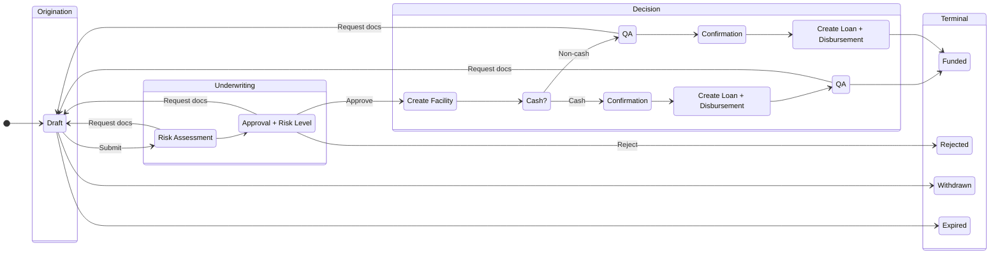

# Capability: Underwriting Workflow

**Product**: Onigiri — [PRODUCT](../../PRODUCT.md)
**Portfolio**: Credit
**Product Owner**: TBD (Credit PO)
**Status**: 📝 Draft — @FEATURE decomposition pending
**Last Updated**: 2026-03-10

---

## Business Function

Provide a multi-topology workflow engine that powers regulated business processes across Onigiri — each process runs as a fixed-topology state machine with configurable execution steps per state. The first and primary topology is the loan application lifecycle; additional topologies (rule change approval, campaign publication approval) run on the same engine.

## Why It Exists (First Principles)

- **Process Integrity**: Regulated processes (loan underwriting, risk rule changes, campaign publication) require mandatory, auditable steps. Fixed topologies enforce this — no step can be skipped.
- **Maintenance Cost**: Fully customizable workflow engines are extremely hard to maintain, test, and audit. A single engine with multiple fixed topologies is testable and predictable.
- **Practical Flexibility**: What changes frequently is not *which states exist* but *what happens inside each state*. Configurable execution steps provide operational flexibility without topology risk.
- **Infrastructure Reuse**: Approval workflows for risk rules and campaign publication share the same state machine, audit trail, and execution step infrastructure as the loan application workflow — no parallel engine to build or maintain.

---

## Feature Inventory

| Feature | Status | Description |
|---------|--------|-------------|
| Workflow Engine (Multi-Topology) | Spec | Shared engine that runs multiple fixed-topology state machines; each topology has its own states and configurable execution steps — [FEATURE](features/FEATURE_workflow-state-machine-engine.md) |
| Loan Application Workflow (Topology A) | Concept | 4-phase fixed topology: Origination → Underwriting → Decision → Terminal with 11 named states |
| Configurable Execution Steps | Concept | Per-state pluggable step execution (document checks, risk criteria, integrations, approvals, printouts) |
| Cash vs. Non-Cash Path Router | Concept | Automatic routing decision at Create Facility state based on disbursement type |
| Return Paths to Draft | Concept | Multiple states can return application to Draft for corrections (Risk Assessment, Approval, QA) |
| Workflow Audit Log | Concept | Immutable RDS record of every state transition with actor, timestamp, and reason |
| Inbound Callback Authentication | Spec | HMAC-SHA256 signature verification on all inbound callbacks (Matcha, Wasabi) before any state transition is triggered — [FEATURE](features/FEATURE_inbound-callback-authentication.md) |

---

## Business Rules

### Shared Engine Topologies

The workflow engine hosts multiple fixed topologies. Each topology defines its own state graph, but all share the same execution step infrastructure, audit trail, and transition atomicity guarantees.

| Topology | Entity Type | States | Feature Spec |
|----------|-------------|--------|-------------|
| **A — Loan Application Workflow** | Loan application | 11 states across 4 phases | [Topology A diagram below](#workflow-diagram) |
| **B — Rule Change Approval** | Risk strategy / policy / rule change | 5 states | [FEATURE](../../risk-assessment-engine/features/FEATURE_rule-change-authorization.md) |
| **C — Campaign Publication Approval** | Campaign version | 6 states | [FEATURE](../../loan-campaign-configuration/features/FEATURE_campaign-publication-authorization.md) |

All topologies share: transition atomicity, immutable audit trail, configurable execution steps per state.

---

### State Definitions

| State | Phase | Purpose | Key Actions |
|-------|-------|---------|-------------|
| **Draft** | Origination | Application data entry, document upload, returns for edits | CO fills smart form, uploads docs, Wasabi scan, submits |
| **Risk Assessment** | Underwriting | Automated + manual risk scoring | Execute risk strategy engine, generate risk level, required docs |
| **Approval + Risk Level** | Underwriting | Authorization based on risk level | Approver reviews; Approve → Create Facility; Reject → Rejected; Request docs → Draft |
| **Create Facility** | Decision | Create facility accounts in core banking | System integration to create facility |
| **Cash?** | Decision | Routing decision based on disbursement type | System auto-routes: cash vs. non-cash path |
| **Confirmation** | Decision | Confirm loan details and disbursement terms | Variance confirmation (differs for cash vs. non-cash) |
| **Create Loan + Disbursement** | Decision | Create loan account and release funds | System integration to create loan and disburse |
| **QA** | Decision | Quality assurance check | Verify completeness, risk criteria, deviation docs, printouts |
| **Funded** | Terminal | Loan successfully disbursed | End state — loan is active |
| **Rejected** | Terminal | Application rejected at approval | End state |
| **Withdrawn** | Terminal | Customer not interested / withdrew | End state |
| **Expired** | Terminal | Application exceeded time limit | End state — system-triggered |

### Cash vs. Non-Cash Path

| Path | Sequence After Create Facility | Rationale |
|------|-------------------------------|-----------|
| Cash | Cash? → Confirmation → Create Loan + Disbursement → QA → Funded | Money disbursed before QA. Post-disbursement verification. |
| Non-Cash | Cash? → QA → Confirmation → Create Loan + Disbursement → Funded | Transfer can be held. Pre-disbursement QA check. |

### Return Paths to Draft

| From State | Trigger | Purpose |
|-----------|---------|---------|
| Risk Assessment | Request additional documents | Missing docs discovered during risk review |
| Approval | Request document upload | Approver needs more documentation |
| QA (cash path) | Request document upload | Post-disbursement doc issues |
| QA (non-cash path) | Request document upload | Pre-disbursement doc issues |
| Any active state | Supervisor recall | Supervisor pulls back application |

### Inbound Callback Authentication

Matcha (document QA outcome) and Wasabi (AI verification report) send inbound callbacks that trigger workflow state transitions. All inbound callbacks must be authenticated before any state transition is triggered. Unauthenticated or invalid callbacks are rejected — no state transition occurs.

| Caller | Callback Purpose | Authentication Requirement |
|--------|-----------------|---------------------------|
| Matcha | QA outcome: `APPROVED` / `RETURNED` / `REFERRED` | HMAC-SHA256 signature; shared secret stored in Onigiri secrets manager |
| Wasabi | Async document verification report | HMAC-SHA256 signature; shared secret stored in Onigiri secrets manager |

**Enforcement rules:**

| Condition | Response | Side Effect |
|-----------|----------|-------------|
| Signature missing | HTTP 401 — reject | Raise security alert; no state transition |
| Signature invalid | HTTP 403 — reject | Raise security alert; no state transition |
| Signature valid but timestamp > 5 min old | HTTP 400 — reject | Log replay attempt; no state transition |
| Signature valid and timestamp within window | HTTP 200 — accept | Trigger state transition normally |

*Resolves audit finding IS-1.*

---

### Configurable Execution Steps (Inside States)

Execution steps inside each state can be plugged in via campaign configuration. Example steps: Document checks, Risk criteria checks, Integration calls (NCB, Core Banking, Wasabi), Approval routing, Printouts & reports.

---

## Workflow Diagram

---

## NFRs

| NFR | Requirement |
|-----|-------------|
| Fixed topology per type | Each workflow type has a hardcoded topology — not configurable by users. New topologies require an engineering change; execution steps within states do not. |
| Configurable execution | What happens inside each state is configurable via campaign config — zero code deployment |
| Transition atomicity | Every state transition must be atomic — no partial transitions recorded |
| Audit trail completeness | Every transition logged in RDS with actor, timestamp, trigger reason |
| Auto-expiry | Draft state applications exceeding time limit must automatically transition to Expired |

---

## Open Questions

- What is the configurable expiry time for Draft state? Is it per-campaign or global?
- Can Supervisor recall from *any* active state, or only specific states?
