# Capability: Underwriting Workflow

**Product**: Onigiri — [PRODUCT](../../PRODUCT.md)
**Portfolio**: Credit
**Product Owner**: TBD (Credit PO)
**Status**: 📝 Draft — @FEATURE decomposition pending
**Last Updated**: 2026-03-04

---

## Business Function

Provide a state-machine-driven workflow that governs the lifecycle of a loan application from creation through to funding, with configurable execution steps within each state — without making the workflow topology itself customizable.

## Why It Exists (First Principles)

- **Process Integrity**: Loan underwriting is a regulated process with mandatory steps (risk assessment, approval authority, QA). The workflow topology must enforce this sequence.
- **Maintenance Cost**: Fully customizable workflow engines (arbitrary state transitions, user-defined states) are extremely hard to maintain, test, and audit. Bugs in workflow logic can cause loans to skip mandatory checks.
- **Practical Flexibility**: What changes frequently is not *which states exist* but *what happens inside each state* — the execution steps, the checks, the integrations. By fixing the workflow topology and making execution steps configurable, we get the right trade-off between rigidity (for compliance) and flexibility (for operations).

---

## Feature Inventory

| Feature | Status | Description |
|---------|--------|-------------|
| 4-Phase State Machine | Concept | Fixed-topology workflow: Origination → Underwriting → Decision → Terminal with 11 named states |
| Configurable Execution Steps | Concept | Per-state pluggable step execution (document checks, risk criteria, integrations, approvals, printouts) |
| Cash vs. Non-Cash Path Router | Concept | Automatic routing decision at Create Facility state based on disbursement type |
| Return Paths to Draft | Concept | Multiple states can return application to Draft for corrections (Risk Assessment, Approval, QA) |
| Workflow Audit Log | Concept | Immutable RDS record of every state transition with actor, timestamp, and reason |

---

## Business Rules

### State Definitions

| State | Phase | Purpose | Key Actions |
|-------|-------|---------|-------------|
| **Draft** | Origination | Application data entry, document upload, returns for edits | CO fills smart form, uploads docs, Wasabi scan, submits |
| **Risk Assessment** | Underwriting | Automated + manual risk scoring | Execute risk strategy engine, generate risk level, required docs |
| **Approval + Risk Level** | Underwriting | Authorization based on risk level | Approver reviews; Approve → Create Facility; Reject → Rejected; Request docs → Draft |
| **Create Facility** | Decision | Create facility accounts in core banking + submit Matcha verification task | System integration to create facility; POST /task to Matcha; transition → Pending Document Checking |
| **Pending Document Checking** | Decision | Matcha task created; QA verifying uploaded documents | Matcha webhook callback routes outcomes: `approved` → Disbursement Orchestration; `returned` / `referred` → this capability |
| **Waiting Fund Transfer** | Decision | Awaiting Core Banking fund transfer confirmation | Owned by: Disbursement Orchestration. Matcha re-decision callbacks (`returned` / `referred`) can still route back from this state to `returned_for_revision` / `pending_approval`. |
| **Waiting Create Loan Operation** | Decision | Awaiting loan operation creation after fund transfer confirmed | Owned by: Disbursement Orchestration. Next state TBD — see Open Questions. |
| **Cash?** | Decision | Routing decision based on disbursement type | System auto-routes: cash vs. non-cash path |
| **Confirmation** | Decision | Confirm loan details and disbursement terms | Variance confirmation (differs for cash vs. non-cash) |
| **Create Loan + Disbursement** | Decision | Create loan account and release funds | System integration to create loan and disburse |
| **QA** | Decision | Quality assurance check | Verify completeness, risk criteria, deviation docs, printouts |
| **Funded** | Terminal | Loan successfully disbursed | End state — loan is active |
| **Rejected** | Terminal | Application rejected at approval | End state |
| **Withdrawn** | Terminal | Customer not interested / withdrew | End state |
| **Expired** | Terminal | Application exceeded time limit | End state — system-triggered |

### Handoff to Disbursement Orchestration

At `waiting_fund_transfer`, this capability hands off ownership to the [Disbursement Orchestration](../disbursement-orchestration/CAPABILITY.md) capability.

The Matcha callback endpoint (`POST /api/credit-application/verification-callback`) is shared between capabilities. Routing is by **current application state**:

| Application State | Outcome | Owning Capability |
|---|---|---|
| `pending_document_checking` | `approved` | Disbursement Orchestration |
| `pending_document_checking` | `returned` | Underwriting Workflow (this capability) |
| `pending_document_checking` | `referred` | Underwriting Workflow (this capability) |
| `waiting_fund_transfer` | any (`isReDecision=true`) | Disbursement Orchestration |

---

### Cash vs. Non-Cash Path

| Path | Sequence After Create Facility | Rationale |
|------|-------------------------------|-----------|
| Cash | Cash? → Confirmation → Create Loan + Disbursement → QA → Funded | Money disbursed before QA. Post-disbursement verification. |
| Non-Cash | Cash? → QA → Confirmation → Create Loan + Disbursement → Funded | Transfer can be held. Pre-disbursement QA check. |

### Return Paths to Draft

| From State | Trigger | Purpose |
|-----------|---------|---------|
| Risk Assessment | Request additional documents | Missing docs discovered during risk review |
| Approval | Request document upload | Approver needs more documentation |
| QA (cash path) | Request document upload | Post-disbursement doc issues |
| QA (non-cash path) | Request document upload | Pre-disbursement doc issues |
| Any active state | Supervisor recall | Supervisor pulls back application |

### Configurable Execution Steps (Inside States)

Execution steps inside each state can be plugged in via campaign configuration. Example steps: Document checks, Risk criteria checks, Integration calls (NCB, Core Banking, Wasabi), Approval routing, Printouts & reports.

---

## Workflow Diagram

```mermaid
stateDiagram-v2
    direction LR

    state "Origination" as orig {
        Draft
    }

    state "Underwriting" as uw {
        RiskAssessment: Risk Assessment
        Approval: Approval + Risk Level
    }

    state "Decision" as dec {
        CreateFacility: Create Facility
        DocCheck: Pending Document Checking
        WaitFund: waiting_fund_transfer\n[Disbursement Orchestration]
        WaitLoan: waiting_create_loan_operation\n[Disbursement Orchestration]
        Cash: Cash?\n[TBD — post WaitLoan]
        Confirmation1: Confirmation
        CreateLoanDisb1: Create Loan + Disbursement
        QA_top: QA
        QA_bottom: QA
        ConfirmationBottom: Confirmation
        CreateLoanDisbBottom: Create Loan + Disbursement
    }

    state "Terminal" as term {
        Funded
        Rejected
        Withdrawn
        Expired
        ReturnedForRevision: returned_for_revision
    }

    [*] --> Draft
    Draft --> RiskAssessment: Submit
    RiskAssessment --> Approval
    RiskAssessment --> Draft: Request docs
    Approval --> CreateFacility: Approve
    Approval --> Rejected: Reject
    Approval --> Draft: Request docs
    CreateFacility --> DocCheck: Matcha task created
    DocCheck --> WaitFund: Matcha approved
    DocCheck --> ReturnedForRevision: Matcha returned
    DocCheck --> Approval: Matcha referred
    WaitFund --> WaitLoan: CB fund transfer success
    WaitFund --> ReturnedForRevision: Matcha re-decision returned
    WaitFund --> Approval: Matcha re-decision referred
    WaitLoan --> Cash: next state TBD
    Cash --> Confirmation1: Cash
    Confirmation1 --> CreateLoanDisb1
    CreateLoanDisb1 --> QA_top
    QA_top --> Funded
    QA_top --> Draft: Request docs
    Cash --> QA_bottom: Non-cash
    QA_bottom --> ConfirmationBottom
    QA_bottom --> Draft: Request docs
    ConfirmationBottom --> CreateLoanDisbBottom
    CreateLoanDisbBottom --> Funded
    Draft --> Withdrawn
    Draft --> Expired
```

---

## NFRs

| NFR | Requirement |
|-----|-------------|
| Fixed topology | Workflow state machine topology is hardcoded — not configurable by users |
| Configurable execution | What happens inside each state is configurable via campaign config — zero code deployment |
| Transition atomicity | Every state transition must be atomic — no partial transitions recorded |
| Audit trail completeness | Every transition logged in RDS with actor, timestamp, trigger reason |
| Auto-expiry | Draft state applications exceeding time limit must automatically transition to Expired |

---

## Open Questions

- What is the configurable expiry time for Draft state? Is it per-campaign or global?
- Can Supervisor recall from *any* active state, or only specific states?
- What is the next state after `waiting_create_loan_operation`? Does the cash/non-cash routing (Cash?) apply at that point, or does it remain at the `Create Facility` stage as in the original design? Resolution is required before the Disbursement Orchestration capability can advance from Concept → Spec. See [Disbursement Orchestration — Open Question #2](../disbursement-orchestration/CAPABILITY.md).
- `next_dummy_state` has been retired and replaced by `waiting_fund_transfer`. See [CHANGELOG_003](../../changelogs/CHANGELOG_003_disbursement-orchestration.md).
