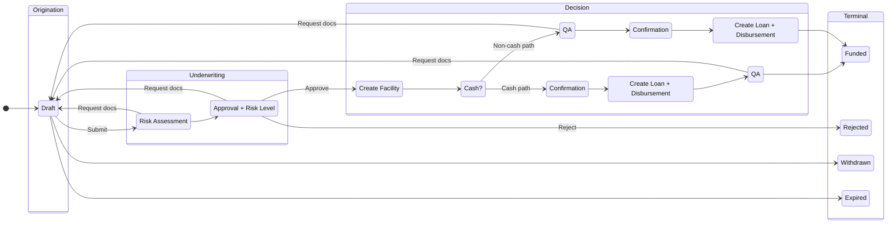
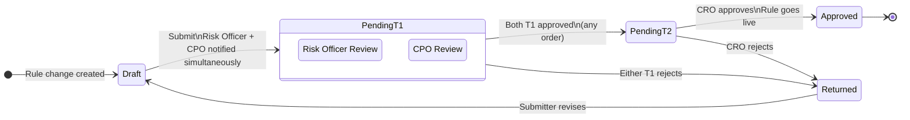
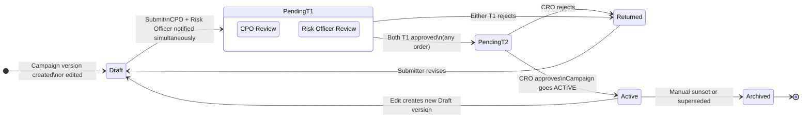

# Feature: Workflow Engine (Multi-Topology)

**Parent Capability**: Underwriting Workflow — [CAPABILITY](../CAPABILITY.md)
**Product**: Onigiri — [PRODUCT](../../../PRODUCT.md)
**Engineering Owner**: TBD
**Status**: Spec
**Changelog Reference**: CHANGELOG_004 — Group B (shared infrastructure)
**Last Updated**: 2026-03-10

---

## User Story

As an **Onigiri engineer**, I want a single workflow engine that can host multiple fixed-topology state machines, so that regulated business processes — loan application underwriting, risk rule approval, and campaign publication approval — all run on shared infrastructure with consistent transition atomicity, audit logging, and execution step extensibility.

## Job-to-be-Done

Onigiri now has three distinct regulated processes, each with a fixed state sequence and configurable steps inside each state. Building separate state machine infrastructure per process would triple the maintenance surface and fragment the audit trail. This feature defines the shared engine that all three topologies run on.

---

## Engine Design

The engine separates two concerns that change at different rates:

| Concern | Change Frequency | Owner |
|---------|-----------------|-------|
| **Topology** — which states exist and which transitions are allowed | Rare — requires engineering change | Engineering |
| **Execution Steps** — what happens inside each state | Frequent — configuration only | Product / Operations |

A topology is a named, registered state graph. The engine enforces valid transitions for a given topology and rejects any transition not defined in that graph.

---

## Registered Topologies

### Topology A — Loan Application Workflow

Used by: all loan applications under any campaign.

---

### Topology B — Rule Change Approval Workflow

Used by: every create, edit, deactivate, or delete on a Risk Assessment Engine strategy, policy, or rule.
Full spec: [FEATURE_rule-change-authorization.md](../../risk-assessment-engine/features/FEATURE_rule-change-authorization.md)

| State | Exit Transitions |
|-------|-----------------|
| `DRAFT` | → `PENDING_T1` (submit) |
| `PENDING_T1` | → `PENDING_T2` (both T1 approved) · → `RETURNED` (either T1 rejects) |
| `PENDING_T2` | → `APPROVED` (CRO approves) · → `RETURNED` (CRO rejects) |
| `RETURNED` | → `DRAFT` (submitter revises) |
| `APPROVED` | Terminal |

---

### Topology C — Campaign Publication Approval Workflow

Used by: every campaign version publication (Draft → ACTIVE).
Full spec: [FEATURE_campaign-publication-authorization.md](../../loan-campaign-configuration/features/FEATURE_campaign-publication-authorization.md)

| State | Exit Transitions |
|-------|-----------------|
| `DRAFT` | → `PENDING_T1` (submit) |
| `PENDING_T1` | → `PENDING_T2` (both T1 approved) · → `RETURNED` (either T1 rejects) |
| `PENDING_T2` | → `ACTIVE` (CRO approves) · → `RETURNED` (CRO rejects) |
| `RETURNED` | → `DRAFT` (submitter revises) |
| `ACTIVE` | → `DRAFT` (edit triggers new version) · → `ARCHIVED` (sunset) |
| `ARCHIVED` | Terminal |

---

## Acceptance Criteria

### Engine Core

| # | Criterion | Pass Condition |
|---|-----------|---------------|
| AC-1 | Topology registration | Each topology is registered by name; the engine resolves the correct graph for each entity type |
| AC-2 | Invalid transition rejected | Any transition not defined in the topology's state graph returns an error; no partial state change occurs |
| AC-3 | Transition atomicity | State transitions are atomic — no partial transitions visible; if the transition fails, the entity stays in its previous state |
| AC-4 | Audit trail on every transition | Every state transition across all topologies writes an immutable entry: topology name, entity ID, actor ID, from-state, to-state, timestamp, execution step results |
| AC-5 | Execution steps per state | Each state in each topology can have zero or more execution steps configured; steps run in order; a failing step blocks the transition |
| AC-6 | Topology A, B, C all operational | All three registered topologies execute correctly and independently — a transition in one topology has no side effects on another |

### Topology B & C Shared Parallel Gate

| # | Criterion | Pass Condition |
|---|-----------|---------------|
| AC-7 | `PENDING_T1` tracks approvals per-approver-role | Engine records which T1 roles have approved; advances to `PENDING_T2` only when all required T1 roles have approved |
| AC-8 | Either T1 rejection short-circuits to `RETURNED` | No waiting for the other T1 approver once one rejects |
| AC-9 | T1 approval tracking resets on `RETURNED → DRAFT` | Re-submission starts a fresh approval cycle; prior approvals are not carried forward |

---

## Dependencies

| Dependency | Type | Notes |
|------------|------|-------|
| RBAC / role system | Internal platform | Needed by Topologies B and C for T1 and T2 role enforcement |
| Immutable audit store (RDS) | Internal | INSERT-only; shared across all topologies |
| Compliance notification system | Internal platform | Used by Topology B on auto-decline class `APPROVED`; async, non-blocking |

---

## Out of Scope

- User-defined topologies — topology changes require an engineering change; this is by design
- Topology A cash vs. non-cash routing detail — documented in the Loan Application Workflow feature (Concept, pending decomposition)
- Per-topology execution step catalogue — each capability documents its own execution steps
