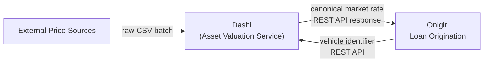

# Product: Asset Valuation Service

**Codename**: Dashi (だし)
**Portfolio**: Credit → [PORTFOLIO](../PORTFOLIO.md)
**Status**: 📝 Draft
**Executive Owner**: CPO / Chief Credit Officer / Head of Risk Management
**Last Updated**: 2026-03-09

> *Dashi (だし) — A fundamental clear broth drawn by extracting essence from multiple raw sources. Like the stock, Dashi (TurboRate) draws the true price signal from multiple noisy, inconsistent external market sources and produces a single clean, canonical rate — the invisible foundation on which every lending decision is built.*

---

## Problem Statement

Vehicle-secured loans require an accurate, up-to-date vehicle market value to compute collateral adequacy and guide lending decisions. Without a dedicated valuation service:

- Each loan campaign uses a static LTV table that goes stale as the used car market fluctuates — there is no mechanism to update it without a code deployment.
- Multiple external price sources provide inconsistent data using different vehicle identification schemes, field naming conventions, and price methodologies — there is no reconciliation step.
- The Risk Management team has no direct mechanism to respond to market events (e.g., a sudden drop in used car prices) without engineering involvement.
- There is no audit trail linking a specific lending decision to the specific canonical rate that was in effect at that time.

---

## Value Proposition

A standalone, pipeline-based asset valuation service that ingests raw vehicle price data from multiple external sources, cleanses and reconciles it into canonical vehicle market rates, provides the Risk Management team a no-code dashboard to apply immediate market corrections, and exposes canonical rates via a simple lookup API to any authorized lending system.

**For whom**: Risk Management teams who manage vehicle price data and respond to market shifts; Product Managers who need dynamic collateral values in loan campaigns; Engineering teams integrating collateral valuation into origination workflows; Compliance and audit teams requiring a traceable record of what rate was in effect at the time of a lending decision.

---

## Product Boundary

**This product IS responsible for:**
- Accepting and immutably storing raw CSV price data from multiple external vehicle price sources
- Per-source configurable data cleansing: field name mapping, value normalization, and vehicle matching rules — all no-code, managed by super-users
- Cross-source vehicle identity resolution: merging records into single canonical vehicle entities, each assigned a stable TurboRate Vehicle ID
- Price consolidation using configurable aggregation logic (avg, min, max, weighted avg, percentile) to produce one canonical market rate per vehicle
- Risk team no-code dashboard to view canonical rates and apply time-bound market adjustment factors
- Maintaining an immutable audit trail of every canonical rate change (automated pipeline and manual adjustment)
- Exposing canonical vehicle market rates via a single-mode lookup API (vehicle identifier → canonical rate)

**This product IS NOT responsible for:**
- Behavioral pricing adjustments based on customer character, application data, or borrower risk profile (owned by **Onigiri** — Loan Campaign Configuration)
- LTV ratio calculation or loan eligibility determination (owned by **Onigiri** — Loan Campaign Configuration)
- Any rate logic that depends on the borrower — Dashi knows only the vehicle and the market, never the customer
- Loan application data storage, workflow state, or underwriting decisions (owned by **Onigiri**)
- Credit risk scoring or borrower assessment (owned by **Miso**)
- Customer identity, consent, or PDPA enforcement (owned by **DaVinci**)
- Collateral ownership records — which customer is linked to which vehicle on which application (owned by **Onigiri** — Smart Form)
- Document verification of vehicle ownership papers (owned by **Matcha**)
- Vehicle registration authority data or title verification (external government system — consumed as a source, not managed)
- Loan disbursement or account management (owned by **Core Banking**)

**This product RECEIVES from:**
- External Price Sources → raw CSV files per source schema → via scheduled batch ingestion (push or pull, configurable per source)
- Onigiri → vehicle identifier (brand + model + year + grade, or TurboRate Vehicle ID) → via REST API lookup

**This product SENDS to:**
- Onigiri → canonical market rate for the requested vehicle → via REST API response
- (Future) Loan Servicing → updated vehicle market rate for collateral revaluation → via REST API or event

---

## Capability Registry

| Capability | Owner | Status | Description |
|-----------|-------|--------|-------------|
| [Raw Source Ingestion](capabilities/raw-source-ingestion/CAPABILITY.md) | Engineering | Draft | Accept and immutably store raw CSV price files from multiple external sources. Each source has a registered schema. Files are validated and versioned before any transformation is applied. |
| [Source Cleansing Configuration](capabilities/source-cleansing-configuration/CAPABILITY.md) | Engineering / Risk | Draft | No-code per-source transformation pipeline. Super-users define field mapping, value normalization rules, and vehicle matching keys. Config is versioned. Historical raw data can be reprocessed with new config. |
| [Vehicle Identity Resolution](capabilities/vehicle-identity-resolution/CAPABILITY.md) | Engineering | Draft | Cross-source identity resolution. Determines which records across sources represent the same canonical vehicle model and assigns each a stable, immutable TurboRate Vehicle ID. |
| [Price Consolidation Engine](capabilities/price-consolidation-engine/CAPABILITY.md) | Engineering / Risk | Draft | Aggregates prices from all sources for each canonical vehicle using configurable aggregation functions (avg, min, max, weighted avg, percentile). Produces the canonical TurboRate market rate. |
| [Rate Management Dashboard](capabilities/rate-management-dashboard/CAPABILITY.md) | Risk | Draft | No-code UI for the Risk Management team to view canonical rates, apply time-bound market adjustment factors, and maintain a full audit trail. Handles macro market corrections only — not per-customer pricing. |
| [Rate Publishing API](capabilities/rate-publishing-api/CAPABILITY.md) | Engineering | Draft | Exposes canonical vehicle market rates to authorized consumers. Simple vehicle lookup: brand + model + year + grade → canonical rate (with active market adjustments applied). Stateless. No PII. |

---

## Product-Level Pipeline Flow

```mermaid
flowchart LR
    Sources["External Price Sources\n(CSV per source)"]
    Ingestion["Raw Source Ingestion\n(immutable snapshot)"]
    Cleansing["Source Cleansing Configuration\n(mapping + normalization + matching)"]
    Identity["Vehicle Identity Resolution\n(canonical vehicle + TurboRate Vehicle ID)"]
    Consolidation["Price Consolidation Engine\n(avg / min / max / weighted)"]
    Dashboard["Rate Management Dashboard\n(Risk Team market adjustments)"]
    API["Rate Publishing API\n(vehicle lookup → canonical rate)"]
    Onigiri["Onigiri\n(Loan Origination)"]

    Sources -->|batch CSV| Ingestion
    Ingestion --> Cleansing
    Cleansing --> Identity
    Identity --> Consolidation
    Consolidation --> Dashboard
    Dashboard --> API
    Onigiri -->|vehicle identifier| API
    API -->|canonical market rate| Onigiri
```

---

## Integration Map

**Boundary note:** Onigiri receives the canonical market rate from Dashi, then applies all behavioral pricing logic — customer character, campaign-specific adjustments, and LTV rules — within its own Loan Campaign Configuration capability. Dashi never receives or stores customer data.

---

## Product-Level Metrics and KPIs

| Metric | Description | Target |
|--------|-------------|--------|
| Rate Coverage | % of vehicle lookups (by Onigiri) that return a canonical rate | > 95% |
| Source Freshness | Age of the most recent successful ingestion per registered source | < 7 days per source |
| Pipeline Latency | Time from source file receipt to canonical rate available via API | < 4 hours |
| Market Adjustment Propagation | Time from Risk team saving an adjustment to it reflecting in API responses | < 60 seconds |
| Rate Lookup API Latency (p99) | End-to-end latency for GET /rate/{vehicle_id} | < 200ms |
| Audit Trail Completeness | % of canonical rate changes (automated and manual) with an immutable audit record | 100% |

---

## Key Design Decisions

| # | Decision | Context | Consequence | Reversibility |
|---|----------|---------|-------------|---------------|
| **D1** | New product (not a capability of Onigiri) | Asset valuation has a distinct lifecycle owner (Risk Management vs. Credit PO), distinct data domain (vehicle market data vs. loan application), and distinct infrastructure (batch pipeline vs. underwriting state machine). Bundling with Onigiri would make the cleansing pipeline, source management, and rate management a sub-concern of the origination workflow. | Dashi is a standalone product. Onigiri calls Dashi's API for a market rate, then applies its own pricing logic. | Low — a product boundary decision; reversing would require merging product teams and data stores. |
| **D2** | Codename: Dashi (だし) | Dashi is the fundamental clear broth extracted from multiple raw sources (kombu + katsuobushi). The multi-source extraction and distillation metaphor is exact: TurboRate draws the true price signal from noisy, inconsistent inputs and produces a clean canonical broth. | Follows the Japanese food naming convention. Communicates: "fundamental base, invisible but essential." | N/A — cosmetic. |
| **D3** | Credit Portfolio (not Platform Portfolio) | Primary consumer is Onigiri (Credit). Business owner is the Risk Management team within Credit. Rate logic is lending-specific. | Placed in Credit Portfolio. If Dashi is later consumed by non-Credit products (e.g., auto insurance valuation), re-evaluate portfolio placement. | Medium — portfolio restructuring requires documentation updates but no technical changes. |
| **D4** | TurboRate Vehicle ID (not VIN or license plate) | VINs are not universally available in Thai used-car market data. License plates change when vehicles are sold. Brand + model + year + grade is the most stable and source-agnostic vehicle identity key for lending valuation purposes. | Dashi uses a system-generated stable ID as a proxy for the identity key. Dashi does NOT manage individual-unit assets (a specific car owned by a specific customer) — it manages model-level market rates. | Medium — changing the identity key would require re-deriving the entire canonical vehicle catalog. |
| **D5** | Immutable raw storage before any transformation | Any cleansing configuration change can be retroactively applied to historical source data to re-derive the consolidation result. The system must answer: "what was the rate derived from, from which source, on which date?" | Raw CSV storage costs grow with every source and every ingestion run. A storage tiering policy (hot 90 days → cold → archive after 1 year) is required. | High — immutability is enforced by design; tiering policy is operationally adjustable. |
| **D6** | Market adjustments are a separate layer, not overwrites | Adjustments sit on top of the system-computed canonical price. They have a mandatory expiry date. After expiry, rates revert to data-driven values automatically. | Prevents the Risk team from permanently baking in a manual value that becomes stale. The pipeline remains the authoritative source; adjustments are temporary corrections. | High — the layer model is a data architecture choice; can add new adjustment types without redesign. |
| **D7** | No behavioral pricing in Dashi — single canonical market rate only | Behavioral adjustments (customer character, campaign-specific pricing, LTV rules) belong in Onigiri's Loan Campaign Configuration. Onigiri already has a configurable rule engine (JMESPath). Mixing market data logic with borrower-specific logic would couple Dashi to lending campaign rules. | Dashi's API is simple: vehicle in → rate out. Onigiri is responsible for all rate logic that involves the borrower. | Low — this is a core product boundary decision; reversing would require significant redesign of both products. |
| **D8** | Rate Management Dashboard adjusts market conditions only | The Risk team reacts to macro market events (used car market crash, seasonal depreciation) — not to individual customer profiles. Per-customer pricing belongs in Onigiri's Campaign Configuration. | Keeps the dashboard's scope clear. Risk team does not need access to customer data or campaign logic to perform their function in Dashi. | Low — a product boundary decision enforced by UI scope and data model. |
| **D9** | Dashi does NOT integrate with DaVinci | Dashi manages vehicle model-level market rates, not customer-vehicle ownership records. DaVinci's Collateral Master Data gap (which customer owns which vehicle) is a separate concern not in Dashi's scope. | Dashi stores no customer data. DaVinci integration is not required. | N/A — a deliberate scope exclusion. |
