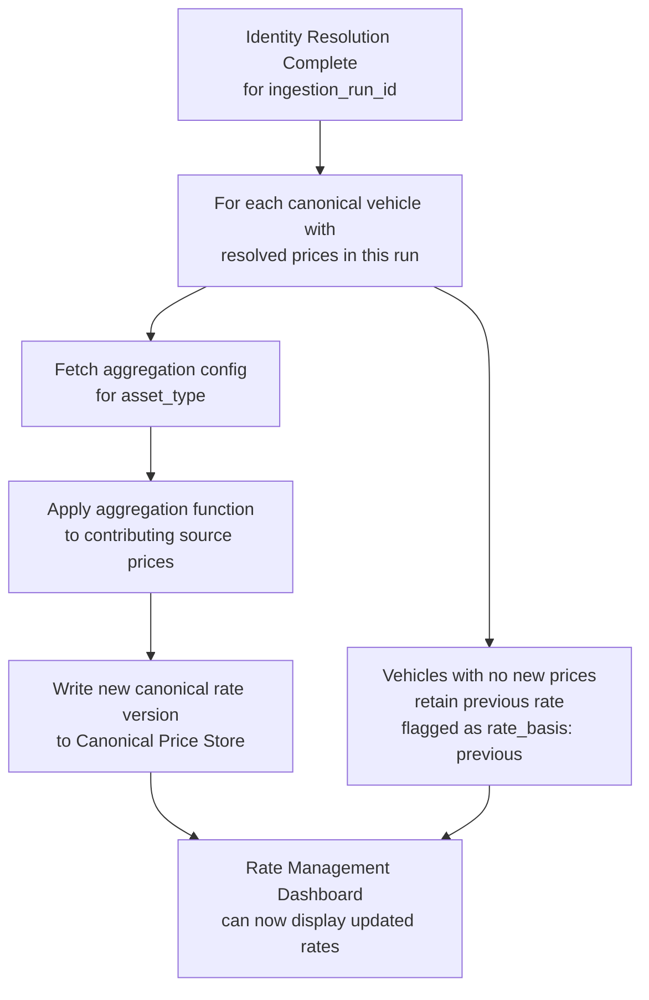

# Capability: Price Consolidation Engine

**Capability Name**: Price Consolidation Engine
**Parent Product**: Dashi (Asset Valuation Service) → [PRODUCT](../../PRODUCT.md)
**Product Owner**: TBD
**Status**: 📝 Draft
**Last Updated**: 2026-03-09

---

## Business Function

For each canonical vehicle in the catalog, aggregate the prices contributed by all sources into a single canonical TurboRate market rate using a configurable aggregation function. The canonical rate is the output of this capability — the single number that represents what this vehicle is worth in the market today, as computed from all available data sources. The Rate Management Dashboard then layered market adjustments on top of this computed rate.

---

## Feature Inventory

| Feature | Status | Description |
|---------|--------|-------------|
| Aggregation Function Configuration | Concept | Configure the aggregation function per asset type (car, motorcycle, etc.): avg, min, max, weighted avg, percentile(n). Configurable per asset class or per source group. No code required. |
| Source Weight Configuration | Concept | Assign contribution weights per source for weighted aggregation. Super-users can set which sources are more authoritative. Weights must sum to 1.0 per canonical vehicle. |
| Consolidation Run Executor | Concept | Triggered after identity resolution completes. For each canonical vehicle, collects all resolved source prices from the current run and applies the configured aggregation function. |
| Canonical Price Store | Concept | The authoritative store of TurboRate canonical rates. Each canonical vehicle has one current rate version. Previous rate versions are retained as immutable history. |
| Price Version History | Concept | Every consolidation run produces a new immutable price version per vehicle. Super-users can view price history per vehicle: which sources contributed, what aggregation was used, what the computed rate was. |

---

## Supported Aggregation Functions

| Function | Description | Use Case |
|----------|-------------|----------|
| `avg` | Simple average across all contributing source prices | Default: balanced view of the market |
| `min` | Minimum price across sources | Conservative: most borrower-protective valuation |
| `max` | Maximum price across sources | Liberal: highest collateral claim |
| `weighted_avg` | Weighted average using source weight configuration | When some sources are considered more authoritative |
| `percentile(n)` | nth percentile of source prices (e.g., p50, p25, p75) | Risk team preference for market positioning |

---

## Business Rules

| Rule | Description |
|------|-------------|
| BR-PCE-01 | A canonical vehicle must have at least one contributing source price in the current run to produce a canonical rate. Vehicles with no prices in the current run retain their previous canonical rate until a new run succeeds. |
| BR-PCE-02 | Canonical rates are immutable once published. A new consolidation run produces a new rate version; it does not overwrite the previous version. |
| BR-PCE-03 | The aggregation function configuration is versioned. Each price version records which aggregation config was used to produce it. |
| BR-PCE-04 | Source weights must sum to 1.0 for weighted avg configurations. A weight configuration that does not sum to 1.0 cannot be activated. |
| BR-PCE-05 | A consolidation run is triggered automatically after each successful identity resolution run. Manual re-runs are permitted by super-users. |
| BR-PCE-06 | Every canonical price version records: `vehicle_id`, `canonical_rate`, `contributing_sources[]`, `prices_by_source{}`, `aggregation_function`, `config_version_id`, `run_id`, `computed_at`. |
| BR-PCE-07 | Vehicles missing a price in a run are flagged with `rate_basis: previous` so the API and Rate Management Dashboard can surface staleness. |

---

## Consolidation Flow



---

## Price Version Data Model

```
CanonicalRate {
    rate_version_id    : string    // unique per version
    vehicle_id         : string    // TurboRate Vehicle ID
    canonical_rate     : decimal   // the computed rate in THB
    rate_basis         : enum      // "computed" | "previous" (if no new prices this run)
    contributing_sources: string[] // source_ids that contributed
    prices_by_source   : map       // { source_id: price }
    aggregation_function: string   // "avg" | "min" | "max" | "weighted_avg" | "percentile_N"
    config_version_id  : string    // aggregation config version used
    run_id             : string    // pipeline run that produced this version
    computed_at        : datetime
    superseded_at      : datetime? // set when a newer version is published
}
```

---

## Non-Functional Requirements

| NFR | Requirement |
|-----|------------|
| ACID Writes | Canonical price store writes must be transactional — a partial run must not produce a partial price update. |
| Immutability | Published canonical rate versions are write-once. No modification after publication. |
| Traceability | Every canonical rate must carry complete provenance: which sources, which prices, which aggregation function, which run. |
| Performance | Consolidation for up to 50,000 canonical vehicles must complete within 2 hours after identity resolution. |
| Auditability | All aggregation config changes are timestamped and attributed to an actor. |

---

## Open Questions

- Should the aggregation function be configurable per individual source group (e.g., "use avg for auction sources, weighted_avg for dealer sources") in addition to per asset type?
- What is the staleness threshold for `rate_basis: previous`? If a vehicle has not received a new price in 30 days, should it be flagged differently (e.g., `rate_basis: stale`)?
- Should super-users be able to exclude specific source prices from a consolidation run without modifying the cleansing config?
