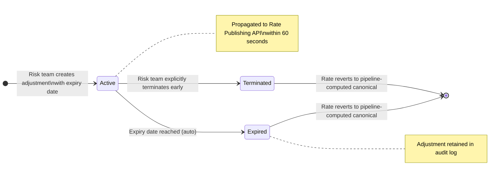
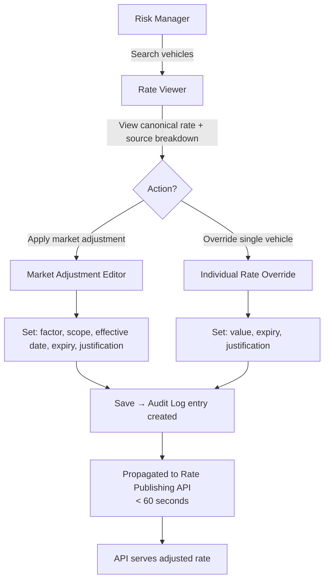

# Capability: Rate Management Dashboard

**Capability Name**: Rate Management Dashboard
**Parent Product**: Dashi (Asset Valuation Service) → [PRODUCT](../../PRODUCT.md)
**Product Owner**: TBD
**Status**: 📝 Draft
**Last Updated**: 2026-03-09

---

## Business Function

Provide the Risk Management team a no-code interface to view the current canonical vehicle rates, apply time-bound market adjustment factors when the market moves faster than the ingestion pipeline can react, and maintain a complete, immutable audit trail of every rate change. This capability handles macro market corrections (e.g., reacting to a sudden drop in the used car market) — it does not handle per-customer or per-campaign pricing, which remains exclusively within Onigiri's Loan Campaign Configuration.

---

## Feature Inventory

| Feature | Status | Description |
|---------|--------|-------------|
| Rate Viewer | Concept | Browse and search the canonical vehicle catalog with current rates. Filter by asset type, make, model, year, rate staleness. View source contribution breakdown per vehicle. |
| Market Adjustment Editor | Concept | Apply a multiplicative adjustment factor (e.g., ×0.90 = reduce by 10%) to a group of vehicles (by asset type, make, model range, or individual vehicle). Requires: factor value, effective date, mandatory expiry date (max 90 days), and justification text. |
| Individual Rate Override | Concept | Override the canonical rate for a single vehicle with a manually specified value. Requires justification text and mandatory expiry. Override sits on top of the consolidation layer; the underlying pipeline-computed rate is unchanged. |
| Adjustment Expiry Management | Concept | View all active adjustments and overrides with their expiry dates. Receive alerts before expiry. Extend or terminate adjustments by explicit action (not automatic silently). |
| Rate Audit Log | Concept | Immutable, append-only log of every adjustment and override: who made it, when, what factor/value, which vehicles affected, justification text, effective period. Read-only. Export capability for compliance. |

---

## Adjustment Layer Model

The Rate Management Dashboard operates as a **correction layer** on top of the system-computed canonical rate from the Price Consolidation Engine:

```
Published Rate (served by API) = Canonical Rate (pipeline-computed) × Active Adjustment Factor
                                 OR Individual Override Value (if active)
```

Key properties:
- Adjustments are **additive, not destructive**: the canonical pipeline rate is never modified.
- Adjustments have a **mandatory expiry**: after expiry, the published rate reverts to the pipeline-computed canonical rate automatically.
- Multiple overlapping adjustments: if a vehicle matches both an asset-type adjustment and a make-specific adjustment, the most specific adjustment takes precedence (individual override > model-specific > make-specific > asset-type-wide).

---

## Business Rules

| Rule | Description |
|------|-------------|
| BR-RMD-01 | Market adjustments must have a mandatory expiry date. Maximum duration is 90 days. Adjustments without an expiry date cannot be saved. |
| BR-RMD-02 | Individual rate overrides must have a mandatory expiry date (maximum 90 days) and a non-empty justification text. |
| BR-RMD-03 | Adjustments are layered — they do not overwrite the canonical rate from the Price Consolidation Engine. After expiry, the API automatically reverts to the pipeline-computed rate. |
| BR-RMD-04 | No adjustment or override may be created, modified, or deleted without producing an audit record. The audit log is append-only; entries cannot be modified after creation. |
| BR-RMD-05 | Specificity hierarchy for overlapping adjustments: Individual Override > Model-specific > Make-specific > Asset-type-wide. The most specific active adjustment wins. |
| BR-RMD-06 | Risk team cannot use this dashboard to configure cleansing rules or aggregation functions (separate capabilities). |
| BR-RMD-07 | An expired adjustment is automatically deactivated at its expiry timestamp. The Risk team must explicitly re-create an adjustment to continue it — there is no auto-renew. |
| BR-RMD-08 | Adjustment propagation to the Rate Publishing API must occur within 60 seconds of save. |

---

## Adjustment Lifecycle State Machine



---

## Rate Viewer and Adjustment Flow



---

## Non-Functional Requirements

| NFR | Requirement |
|-----|------------|
| Propagation Speed | Adjustments must be reflected in Rate Publishing API responses within 60 seconds of save. |
| Audit Completeness | 100% of adjustment and override events must produce an immutable audit record. |
| Auditability | Audit log must be exportable for compliance review. |
| Expiry Enforcement | Expired adjustments must be deactivated at expiry timestamp with ≤ 1 minute tolerance. |
| Access Control | Write access restricted to designated Risk Management role. Read access (audit log view) available to compliance/audit role. |

---

## Open Questions

- Should market adjustments require a maker-checker approval workflow (second Risk team member must approve before activation)?
- What alert mechanism is used for adjustment expiry warning — email, in-app notification, both?
- Should there be a cap on the magnitude of an adjustment factor (e.g., no single adjustment can exceed ±30%)?
