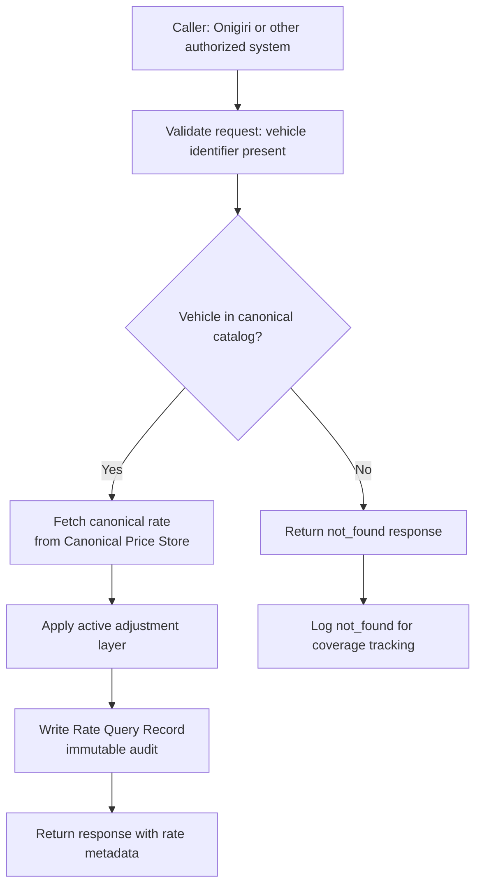

# Capability: Rate Publishing API

**Capability Name**: Rate Publishing API
**Parent Product**: Dashi (Asset Valuation Service) → [PRODUCT](../../PRODUCT.md)
**Product Owner**: TBD
**Status**: 📝 Draft
**Last Updated**: 2026-03-09

---

## Business Function

Expose the canonical vehicle market rate to any authorized consumer via a simple, fast, stateless lookup API. The caller provides a vehicle identifier; Dashi returns the canonical market rate for that vehicle — incorporating the active market adjustment layer from the Rate Management Dashboard. This capability knows only the vehicle. It never receives, stores, or processes customer data, application data, or borrower parameters.

---

## Feature Inventory

| Feature | Status | Description |
|---------|--------|-------------|
| Rate Lookup | Concept | Accept a vehicle identifier (brand + model + year + grade, or TurboRate Vehicle ID) and return the current canonical rate. Incorporates the active adjustment layer. Returns rate with metadata: rate_version_id, vehicle_id, adjustment_applied flag, rate_basis. |
| Rate Query Audit Record | Concept | Every successful rate lookup produces an immutable Rate Query Record: caller_id, vehicle_id, rate_served, adjustment_applied, rate_version_id, queried_at. Used for lending decision traceability. |
| Rate API Contract | Concept | Versioned API contract schema. Any change to the response body structure requires a new API version. Consumers (Onigiri) pre-configure against a stable schema. |
| Fallback and Coverage Handling | Concept | When a requested vehicle has no canonical rate (not in catalog, or all rates are stale beyond threshold), return a structured `not_found` or `stale` response with guidance — not an error. Consumers must handle coverage gaps gracefully. |

---

## API Contract (Draft)

### Request

```
GET /v1/rate?make={make}&model={model}&year={year}&grade={grade}
GET /v1/rate/{turboRateVehicleId}
```

### Response (found)

```json
{
  "status": "found",
  "vehicle_id": "TR-000123",
  "make": "Toyota",
  "model": "Camry",
  "year": 2022,
  "grade": "2.5 Hybrid Premium",
  "canonical_rate": 950000.00,
  "currency": "THB",
  "rate_basis": "computed",
  "adjustment_applied": true,
  "adjustment_factor": 0.95,
  "rate_version_id": "rv-20260309-001",
  "rate_computed_at": "2026-03-09T04:00:00Z",
  "queried_at": "2026-03-09T10:23:45Z"
}
```

### Response (not found)

```json
{
  "status": "not_found",
  "reason": "Vehicle not in catalog",
  "queried_make": "Nissan",
  "queried_model": "Leaf",
  "queried_year": 2024,
  "queried_grade": "Premium"
}
```

### Response (stale)

```json
{
  "status": "stale",
  "vehicle_id": "TR-000456",
  "canonical_rate": 350000.00,
  "rate_basis": "previous",
  "last_updated_at": "2026-01-15T04:00:00Z",
  "staleness_days": 53
}
```

---

## Business Rules

| Rule | Description |
|------|-------------|
| BR-RPA-01 | No customer data, application data, or borrower parameters are accepted in any API request. Dashi knows only the vehicle. |
| BR-RPA-02 | Every successful rate lookup (status: found or stale) produces an immutable Rate Query Record. Unanswered lookups (not_found) are also logged for coverage tracking. |
| BR-RPA-03 | The rate served incorporates the active adjustment layer: if an active adjustment exists for the vehicle, the adjusted rate is returned. The response explicitly flags `adjustment_applied: true`. |
| BR-RPA-04 | The API is stateless. No session, no context, no per-caller rate differentiation. All callers receive the same canonical rate for the same vehicle at the same moment. |
| BR-RPA-05 | Stale rates (rate_basis: previous) are served when a vehicle's rate has not been updated within the staleness threshold. The staleness threshold is configurable (default: 30 days). Stale responses include the `last_updated_at` and `staleness_days` fields so consumers can decide whether to use the rate. |
| BR-RPA-06 | API versioning is enforced. The response schema is versioned (v1, v2, ...). Schema-breaking changes require a new API version. Existing callers continue to receive the previous version until they migrate. |
| BR-RPA-07 | Rate Query Records are immutable after creation. They provide the audit trail linking a lending decision to the exact rate that was served at the moment of that decision. |

---

## Rate Lookup Flow



---

## Non-Functional Requirements

| NFR | Requirement |
|-----|------------|
| Latency | p99 < 200ms end-to-end |
| Statelessness | No session state. Each request is fully self-contained. |
| No PII | No customer or application data accepted, stored, or logged. |
| Audit Completeness | 100% of rate lookups produce a Rate Query Record. |
| Availability | API availability target: 99.9% uptime. |
| Versioning | Response schema versioned. Breaking changes require new API version with consumer migration path. |
| Coverage Gap Handling | `not_found` and `stale` responses are structured (not HTTP errors). Consumers must implement graceful handling. |

---

## Open Questions

- Should there be a bulk rate lookup endpoint (multiple vehicles in one request) for use cases like batch campaign configuration or portfolio revaluation?
- What is the exact staleness threshold in days before a rate is returned as `stale` vs. `found`?
- Should the Rate Query Audit Records be queryable by Onigiri (e.g., "what rate was served for vehicle X on application Y on date Z")?
