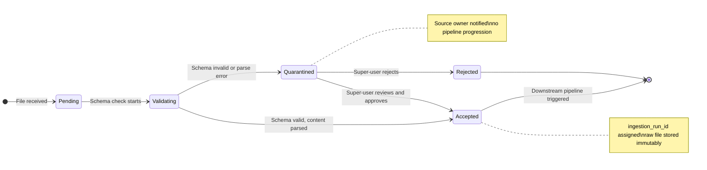
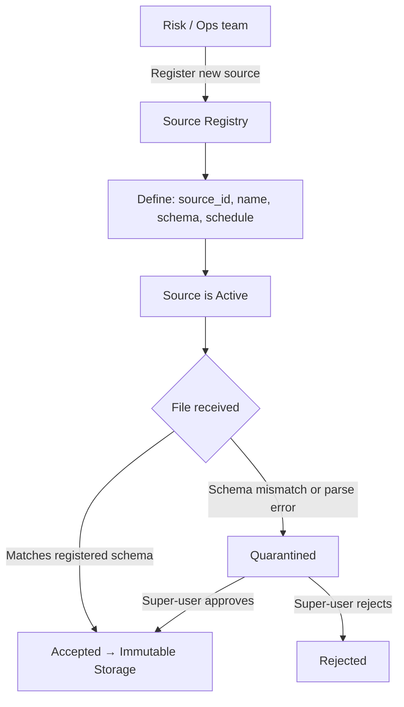

# Capability: Raw Source Ingestion

**Capability Name**: Raw Source Ingestion
**Parent Product**: Dashi (Asset Valuation Service) → [PRODUCT](../../PRODUCT.md)
**Product Owner**: TBD
**Status**: 📝 Draft
**Last Updated**: 2026-03-09

---

## Business Function

Accept raw CSV price files from multiple registered external vehicle price sources, validate each file against its registered schema, and store the file immutably as a versioned snapshot before any transformation is applied. This capability is the entry point of the Dashi pipeline. It guarantees that the original source data is always available for forensic audit and retroactive reprocessing — regardless of how cleansing configurations change in future.

---

## Feature Inventory

| Feature | Status | Description |
|---------|--------|-------------|
| Source Registry | Concept | Register, configure, and manage external price sources. Each source has a unique ID, name, contact, expected schema, and ingestion schedule. |
| CSV Schema Validation | Concept | Validate inbound CSV files against the registered schema for that source. Files that fail validation are quarantined and the source owner is notified. |
| Ingestion Run Lifecycle | Concept | Track the lifecycle of each ingestion attempt: Pending → Validating → Accepted → Quarantined. Each run is assigned a unique `ingestion_run_id`. |
| Immutable Raw Storage | Concept | Store each accepted CSV file as an immutable versioned snapshot. Files are never modified or deleted within retention policy. |
| Ingestion Status Tracking | Concept | Provide a super-user view of ingestion run history per source: run time, file size, row count, validation outcome, and pipeline status. |

---

## Business Rules

| Rule | Description |
|------|-------------|
| BR-RSI-01 | Only registered sources may submit data. Unregistered file submissions are rejected. |
| BR-RSI-02 | Each registered source has exactly one schema definition at any time. Schema changes require a new schema version to be registered before new files are submitted. |
| BR-RSI-03 | Files failing schema validation are quarantined — they do not enter the pipeline. A quarantined file cannot progress to cleansing without super-user manual review and approval. |
| BR-RSI-04 | Accepted files are stored immutably. No overwrite of a previously accepted ingestion snapshot is permitted. |
| BR-RSI-05 | Each ingestion run produces a unique `ingestion_run_id` that propagates through all downstream pipeline stages (cleansing → identity resolution → consolidation). |
| BR-RSI-06 | A source that has not produced a successful ingestion within 7 days triggers a staleness alert. |
| BR-RSI-07 | Ingestion is idempotent: submitting the same file for the same source and same date twice produces one accepted run (duplicate detection by content hash). |

---

## Ingestion Run State Machine

---

## Source Registration Flow

---

## Non-Functional Requirements

| NFR | Requirement |
|-----|------------|
| Immutability | Accepted raw files must be write-once. No delete or overwrite within retention policy. |
| Idempotency | Duplicate file submissions (same source, same content hash) must produce at most one accepted run. |
| Retention | Raw files retained hot for 90 days, cold for 1 year, archived thereafter. |
| Staleness Alerting | Alert triggered if no successful ingestion from a registered source within 7 days. |
| Auditability | Every ingestion run — including quarantined and rejected runs — has a complete lifecycle log attributed to time and actor. |
| Throughput | Must accept and store files up to 50MB per source per run without timeout. |

---

## Open Questions

- Should ingestion be pull-based (Dashi polls an SFTP/S3 location) or push-based (source pushes to Dashi's API)? Or configurable per source?
- Who is notified on quarantine — the source owner, the Risk team, or both?
- Should there be a maximum allowed frequency for manual override of quarantined files (to prevent bypass of schema validation)?
