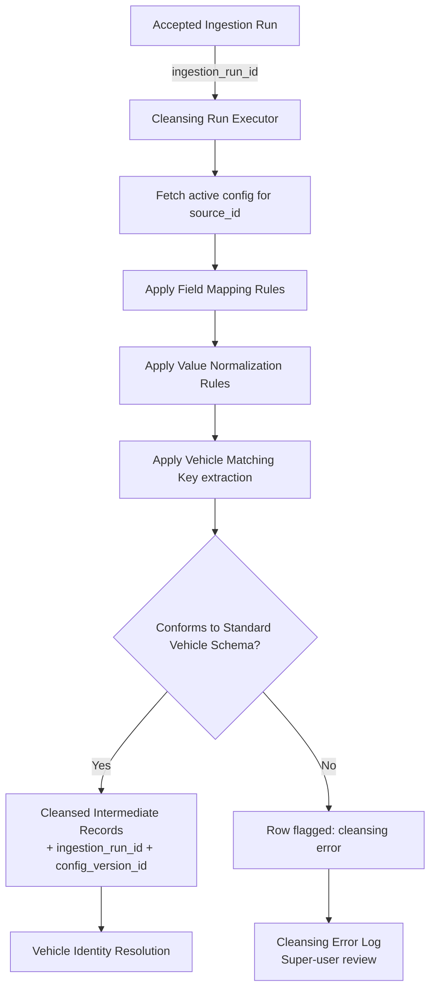

# Capability: Source Cleansing Configuration

**Capability Name**: Source Cleansing Configuration
**Parent Product**: Dashi (Asset Valuation Service) → [PRODUCT](../../PRODUCT.md)
**Product Owner**: TBD
**Status**: 📝 Draft
**Last Updated**: 2026-03-09

---

## Business Function

Allow super-users (Risk Management team) to define, version, and activate per-source transformation rules that convert raw source CSV records into a standardized intermediate form — without writing code. Each source has its own vocabulary: different field names, different value formats, different ways of identifying the same vehicle. This capability provides the mapping, normalization, and matching configuration layer that bridges each source's schema to the Dashi Standard Vehicle Schema consumed by the downstream pipeline.

---

## Feature Inventory

| Feature | Status | Description |
|---------|--------|-------------|
| Field Mapping Rule Builder | Concept | Map source-specific field names to Standard Vehicle Schema fields. Example: source A "brand" → standard "make"; source B "car_make" → standard "make". |
| Value Normalization Rule Builder | Concept | Define value replacement and normalization rules. Example: "TOYOTA" = "toyota" = "Toyota" → normalized to "Toyota". Supports exact match, regex, and lookup table patterns. |
| Vehicle Matching Rule Builder | Concept | Define which source fields compose the vehicle identity key for this source. Example: source A identity key = brand + model + year + variant. |
| Config Version Control | Concept | Every change to a source's cleansing config creates a new version. Versions are immutable once published. Super-users can view history and activate/deactivate a version. |
| Cleansing Run Executor | Concept | Apply the active cleansing config to an accepted ingestion run. Produces a standardized intermediate record per source row. Links each output row to its `ingestion_run_id` and `config_version_id`. |

---

## Standard Vehicle Schema

The standardized intermediate form that all cleansed source records must conform to before entering Vehicle Identity Resolution:

| Field | Type | Description |
|-------|------|-------------|
| `source_id` | string | Originating source identifier |
| `ingestion_run_id` | string | Links back to the raw ingestion snapshot |
| `make` | string | Vehicle manufacturer (e.g., "Toyota") |
| `model` | string | Model name (e.g., "Camry") |
| `year` | integer | Model year (e.g., 2022) |
| `grade` | string | Trim/grade level (e.g., "2.5 Hybrid Premium") |
| `asset_type` | enum | `car`, `motorcycle`, `other` |
| `price` | decimal | Source price value in THB |
| `price_type` | enum | `market`, `book`, `auction`, `asking` |
| `source_row_ref` | string | Reference to original row in the raw file for traceability |

---

## Business Rules

| Rule | Description |
|------|-------------|
| BR-SCC-01 | Every source must have an active cleansing config before its ingestion runs can be processed. Ingestion runs for sources without an active config are held in a "pending config" queue. |
| BR-SCC-02 | A cleansing config version is immutable once published (activated). Changes create a new version; previous versions remain in history. |
| BR-SCC-03 | Field mapping must define a mapping for every required Standard Vehicle Schema field (`make`, `model`, `year`, `grade`, `price`). Configs missing required field mappings cannot be activated. |
| BR-SCC-04 | Value normalization rules are applied in declared order (first match wins within a rule set). |
| BR-SCC-05 | Retroactive reprocessing: any historical accepted ingestion run can be re-cleansed using a different config version by explicit super-user action. The resulting cleansed records are a new version, not an overwrite. |
| BR-SCC-06 | Cleansing run output is linked to both the `ingestion_run_id` (raw data provenance) and `config_version_id` (transformation provenance). |

---

## Cleansing Configuration State Machine

```mermaid
stateDiagram-v2
    direction LR
    [*] --> Draft: Super-user creates config
    Draft --> Active: Activate (publish)
    Active --> Superseded: New version activated
    Superseded --> [*]: Retained for history

    note right of Active: One active config per source at any time
    note right of Superseded: Read-only; can be used for retroactive reprocessing
```

---

## Cleansing Pipeline Flow

---

## Non-Functional Requirements

| NFR | Requirement |
|-----|------------|
| No-code | All field mapping, normalization, and matching rules must be configurable via the UI without code changes or deployments. |
| Versioning | All config changes produce a new immutable version with timestamp and actor attribution. |
| Retroactivity | Any historical ingestion run can be re-cleansed with a superseded config version by explicit action. |
| Auditability | Every cleansing run is traceable: which ingestion run, which config version, how many rows produced, how many errors. |
| Error Isolation | Row-level cleansing errors do not fail the entire run. Errored rows are flagged and logged; valid rows proceed. |

---

## Open Questions

- Should value normalization rule lookup tables be editable inline or maintained as uploaded reference files (CSV)?
- Who has write access to cleansing configs — Risk team only, or also Operations team?
- Should there be an approval workflow (maker-checker) for activating a new config version, given that config changes affect the canonical rate?
