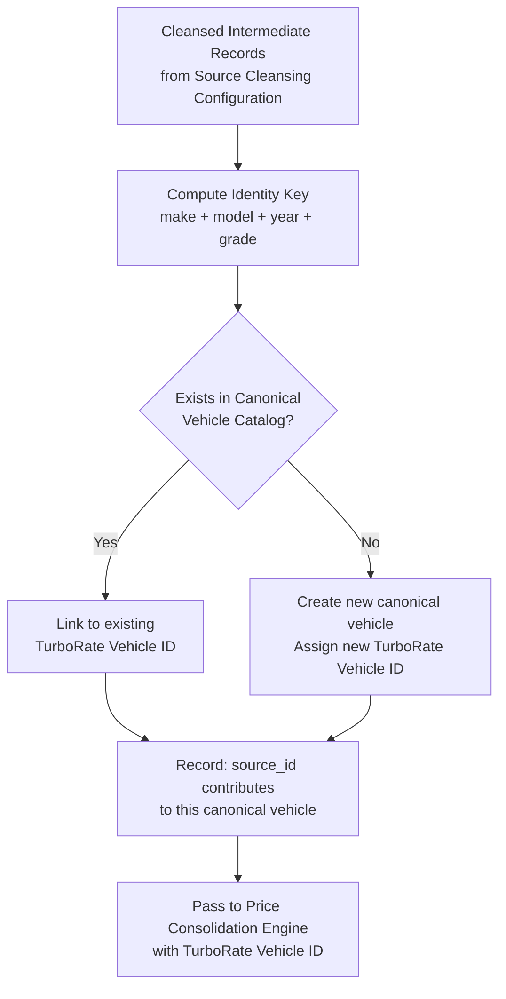

# Capability: Vehicle Identity Resolution

**Capability Name**: Vehicle Identity Resolution
**Parent Product**: Dashi (Asset Valuation Service) → [PRODUCT](../../PRODUCT.md)
**Product Owner**: TBD
**Status**: 📝 Draft
**Last Updated**: 2026-03-09

---

## Business Function

Determine which cleansed records from different sources represent the same canonical vehicle model, and assign each unique vehicle model a stable, immutable TurboRate Vehicle ID. This capability is the identity layer of the pipeline: it eliminates cross-source duplication and establishes the canonical vehicle catalog from which all price consolidation and rate publishing operate. Once a TurboRate Vehicle ID is assigned, it is permanent — it never changes, never gets reassigned, and never gets deleted.

---

## Feature Inventory

| Feature | Status | Description |
|---------|--------|-------------|
| Identity Key Configuration | Concept | Configure the global identity key definition: which Standard Vehicle Schema fields compose the canonical identity (default: make + model + year + grade). Configurable per asset type. |
| Canonical Vehicle Catalog | Concept | The authoritative registry of all known canonical vehicles. Each entry has a TurboRate Vehicle ID, identity key values, asset type, status (Active / Deprecated), and first-seen timestamp. |
| Cross-Source Matching Engine | Concept | For each cleansed record, compute the identity key and look up the canonical vehicle catalog. Match → link to existing TurboRate Vehicle ID. No match → create a new canonical vehicle entry. |
| Vehicle Merge Workflow | Concept | When two canonical vehicle entries are discovered to represent the same vehicle (e.g., a data quality issue), super-users can initiate a merge. Merge requires confirmation and produces an audit record. |
| Canonical Vehicle Lifecycle | Concept | Manage the lifecycle of canonical vehicle entries: Active (actively priced), Deprecated (no longer in market, historical only). Deprecation requires super-user action and justification. |

---

## Business Rules

| Rule | Description |
|------|-------------|
| BR-VIR-01 | The identity key is deterministic: the same identity key values always resolve to the same TurboRate Vehicle ID. |
| BR-VIR-02 | TurboRate Vehicle IDs are immutable once assigned. Re-training, source changes, or schema updates never reassign an existing ID. |
| BR-VIR-03 | New canonical vehicles are created automatically when no match is found. No super-user action is required for new vehicle creation. |
| BR-VIR-04 | Canonical vehicles are never deleted from the catalog. Vehicles no longer available in the market are Deprecated, not removed. |
| BR-VIR-05 | Merging two canonical vehicles requires explicit super-user confirmation. After a merge, the surviving entry retains both TurboRate Vehicle IDs (primary + aliases). The merged-away ID redirects to the primary. |
| BR-VIR-06 | The identity key definition can be changed by super-users, but a change triggers a full re-resolution of all cleansed records. The re-resolution produces new canonical vehicle assignments; existing IDs are not invalidated without an explicit migration audit. |
| BR-VIR-07 | Each canonical vehicle tracks which sources contribute records to it (`contributing_sources[]`). |

---

## Identity Resolution Flow



---

## Canonical Vehicle Lifecycle State Machine

```mermaid
stateDiagram-v2
    direction LR
    [*] --> Active: New vehicle created (no match found)
    Active --> Active: New source contributes price data
    Active --> Deprecated: No source data for > 2 years\nOR super-user explicit deprecation
    Deprecated --> Active: New source data received\nOR super-user reactivation

    note right of Active: TurboRate Vehicle ID is stable throughout
    note right of Deprecated: Historical rate data retained;\nnot returned in standard API lookup (opt-in flag required)
```

---

## Non-Functional Requirements

| NFR | Requirement |
|-----|------------|
| Determinism | Same identity key values must always produce the same TurboRate Vehicle ID resolution. |
| Stability | TurboRate Vehicle IDs, once assigned, are never changed or reassigned. |
| Completeness | Every cleansed record that passes schema validation must resolve to a TurboRate Vehicle ID before price consolidation can proceed. |
| Merge Auditability | Every merge event is recorded with: actor, timestamp, primary vehicle ID, merged-away vehicle ID, justification text. |
| Performance | Identity resolution for a full ingestion run (up to 10,000 records) must complete within 30 minutes. |

---

## Open Questions

- Should the identity key be configurable per source, or must it be globally uniform across all sources? (A per-source key allows flexibility but complicates cross-source deduplication.)
- What happens to historical price consolidation results when two canonical vehicles are merged? Should past rates be re-derived?
- Should Deprecated vehicles still appear in the Rate Publishing API when queried by legacy TurboRate Vehicle ID?
