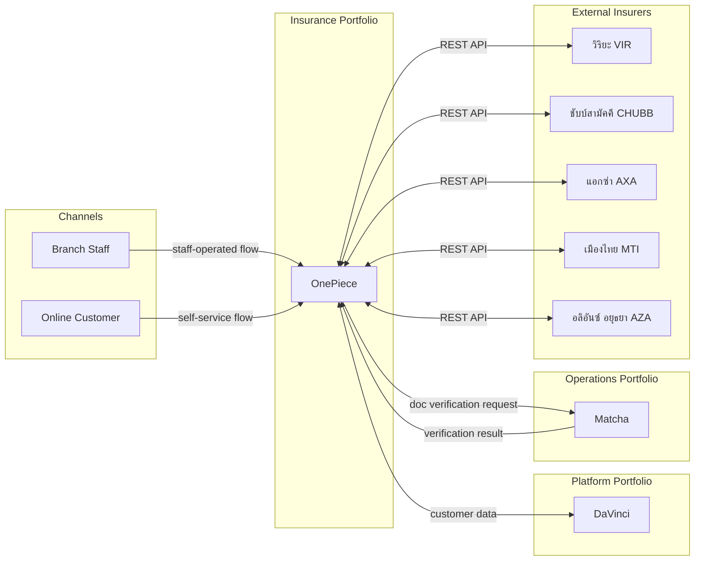
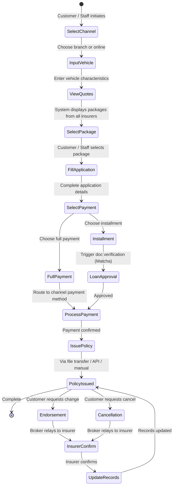

# Product: Insurance Distribution Platform

> **Codename:** OnePiece (ワンピース)
> **Status:** Draft
> **Portfolio:** Insurance
> **Executive Owner:** TBD
> **Last Updated:** 2026-03-05

---

## Problem Statement

Insurance customers (and branch staff serving them) must navigate multiple insurer websites or contacts to compare and purchase insurance products. There is no unified platform to compare packages across insurers, manage applications, process payments with flexible terms, and receive issued policies -- all through the customer's preferred channel.

## Value Proposition

OnePiece is a multi-channel insurance distribution platform that enables customers and branch staff to:
- Compare insurance packages from multiple insurers in a single view
- Purchase single policies or bundle 1 compulsory + 1 voluntary insurance in a single checkout
- Complete the full purchase flow from quotation to issued policy
- Pay via channel-appropriate methods (cash/QR for branch, 2C2P for online)
- Choose between full payment and installment terms
- Request endorsements and cancellations through the broker as intermediary

---

## Product Boundary

**This product IS responsible for:**
- Insurance product catalog and channel availability configuration
- Aggregating and displaying quotation packages from multiple insurers
- Managing the application lifecycle from submission to completion
- Payment processing: routing to correct payment channel based on sale channel and payment term
- Triggering policy issuance via the appropriate insurer integration method
- Post-sale endorsement and cancellation brokering (relay between customer and insurer)
- Installment eligibility determination and triggering loan approval flow

**This product IS NOT responsible for:**
- Underwriting or risk assessment (owned by insurer partners)
- Customer master data management (owned by DaVinci, Platform portfolio)
- Document verification for installment loan approval (owned by Matcha, Operations portfolio)
- Policy renewal (future scope -- not current)
- Claims processing (out of scope)

**This product RECEIVES from:**
- DaVinci -> customer data -> via event / API
- Insurer partners -> quotation packages, policy documents, endorsement/cancellation confirmations -> via REST API / file transfer / manual
- Matcha -> document verification results (for installment approval) -> via event / API

**This product SENDS to:**
- DaVinci -> customer data updates -> via event / API
- Insurer partners -> policy issuance requests, endorsement/cancellation requests -> via REST API / file transfer / manual
- Matcha -> document verification requests (for installment approval) -> via event / API

---

## Insurance Products

| Code | Insurance Product | Vehicle | Coverage Year | Insurers | Branch | Online |
|------|-------------------|---------|---------------|----------|--------|--------|
| CMI-CAR | Compulsory Car Insurance | Car | 1 year | VIR | Yes | Yes |
| VMI-CAR-1 | Voluntary Car Insurance Type 1 | Car | 1 year | VIR, CHUBB | Yes | Yes |
| VMI-CAR-3 | Voluntary Car Insurance Type 3 | Car | 1 year | VIR, CHUBB, AXA, MTI, AZA | Yes | Yes |
| VMI-CAR-3 | Voluntary Car Insurance Type 3 | Car | > 1 year | VIR, CHUBB | Yes | No |
| VMI-CAR-5 | Voluntary Car Insurance Type 5 | Car | 1 year | VIR, CHUBB, AXA, MTI, AZA | Yes | Yes |
| VMI-CAR-5 | Voluntary Car Insurance Type 5 | Car | > 1 year | VIR, CHUBB | Yes | No |
| VMI-MC-3 | Voluntary Motorcycle Insurance Type 3 | Motorcycle | 1 year | CHUBB | Yes | No |
| VMI-MC-5 | Voluntary Motorcycle Insurance Type 5 | Motorcycle | 1 year | CHUBB | Yes | No |

> **Bundle checkout:** Customers can purchase 1 compulsory insurance + 1 voluntary insurance as a bundle in a single checkout. Available in both branch and online.
> **Future plan:** All products to be available in all sale channels. The information acquisition process may differ by channel.

---

## Sale Channels

| Channel | Operator | Products Available | Coverage Year | Payment Channels (Current) | Payment Channels (Planned) | Payment Terms | Notes |
|---------|----------|-------------------|---------------|---------------------------|---------------------------|---------------|-------|
| Branch | Branch staff | All 6 products | 1 year, > 1 year | Cash, Bill Payment QR | Cash, Bill Payment QR, 2C2P QR, 2C2P DPAY, 2C2P Credit Card, 2C2P IRR | Full Payment, Installment | Staff-operated flow |
| Online | Customer (self-service) | CMI-CAR, VMI-CAR-1, VMI-CAR-3, VMI-CAR-5 | 1 year only | 2C2P | 2C2P QR, 2C2P DPAY, 2C2P Credit Card, 2C2P IRR | Full Payment only | Customer self-service flow |

---

## Payment Model

### Current State

| Channel | Payment Term | Available Payment Channels |
|---------|-------------|---------------------------|
| Branch | Full Payment | Cash, Bill Payment QR |
| Branch | Installment | Cash, Bill Payment QR |
| Online | Full Payment | 2C2P |

> **Note:** Installment payment requires loan approval, which triggers document verification via Matcha.
> Online does not offer installment.

### Planned State

Introduces 2C2P sub-channels in branch and expands online payment channels.

**Payment Channels:**

| Code | Payment Channel | Description |
|------|----------------|-------------|
| CASH | Cash | Physical cash payment at branch |
| BQR | Bill Payment QR | QR code for bill payment at branch |
| 2C2P-QR | 2C2P QR | 2C2P QR payment |
| 2C2P-DPAY | 2C2P DPAY | 2C2P direct payment |
| 2C2P-CC | 2C2P Credit Card | 2C2P credit card payment (full payment only) |
| 2C2P-IRR | 2C2P IRR | 2C2P installment via credit card issuer (full payment only) |

**Payment Matrix (Planned):**

| | Cash | Bill Payment QR | 2C2P QR | 2C2P DPAY | 2C2P Credit Card | 2C2P IRR |
|---|---|---|---|---|---|---|
| **Branch - Full Payment** | Yes | Yes | Yes | Yes | Yes | Yes |
| **Branch - Installment** | Yes | Yes | Yes | Yes | No | No |
| **Online - Full Payment** | No | No | Yes | Yes | Yes | Yes |
| **Online - Installment** | N/A (not offered) | N/A | N/A | N/A | N/A | N/A |

> **Key rules:**
> - Cash and Bill Payment QR are branch-only (physical presence required)
> - 2C2P Credit Card and 2C2P IRR are full-payment-term only
> - Online offers full payment only (no installment)
> - Installment requires loan approval + Matcha document verification

---

## Insurer Partner Registry

5 active insurer partners. Issuance method and channel availability are configured per insurer-product-coverage year combination.

| # | Insurer | Code |
|---|---------|------|
| 1 | วิริยะประกันภัย (Viriyah) | VIR |
| 2 | ชับบ์สามัคคีประกันภัย (Chubb Samaggi) | CHUBB |
| 3 | แอกซ่าประกันภัย (AXA) | AXA |
| 4 | เมืองไทยประกันภัย (Muang Thai) | MTI |
| 5 | อลิอันซ์ อยุธยา ประกันภัย (Allianz Ayudhya) | AZA |

---

## Insurer-Product Matrix

### REST API Issuance

| Insurer | Product | Coverage | Branch | Online |
|---------|---------|----------|--------|--------|
| VIR | CMI-CAR (Compulsory Car) | 1 year | Yes | Yes |
| VIR | VMI-CAR-3 (Voluntary Car Type 3) | 1 year | Yes | Yes |
| VIR | VMI-CAR-5 (Voluntary Car Type 5) | 1 year | Yes | Yes |
| CHUBB | VMI-CAR-1 (Voluntary Car Type 1) | 1 year | Yes | Yes |
| CHUBB | VMI-CAR-3 (Voluntary Car Type 3) | 1 year | Yes | Yes |
| CHUBB | VMI-CAR-5 (Voluntary Car Type 5) | 1 year | Yes | Yes |
| CHUBB | VMI-CAR-3 (Voluntary Car Type 3) | > 1 year | Yes | No |
| CHUBB | VMI-CAR-5 (Voluntary Car Type 5) | > 1 year | Yes | No |
| AXA | VMI-CAR-3 (Voluntary Car Type 3) | 1 year | Yes | Yes |
| AXA | VMI-CAR-5 (Voluntary Car Type 5) | 1 year | Yes | Yes |
| MTI | VMI-CAR-3 (Voluntary Car Type 3) | 1 year | Yes | Yes |
| MTI | VMI-CAR-5 (Voluntary Car Type 5) | 1 year | Yes | Yes |
| AZA | VMI-CAR-3 (Voluntary Car Type 3) | 1 year | Yes | Yes |
| AZA | VMI-CAR-5 (Voluntary Car Type 5) | 1 year | Yes | Yes |
| CHUBB | VMI-MC-3 (Voluntary Motorcycle Type 3) | 1 year | Yes | No |
| CHUBB | VMI-MC-5 (Voluntary Motorcycle Type 5) | 1 year | Yes | No |

### Manual Input Issuance

| Insurer | Product | Coverage | Branch | Online |
|---------|---------|----------|--------|--------|
| VIR | VMI-CAR-1 (Voluntary Car Type 1) | 1 year | Yes | No |
| VIR | VMI-CAR-3 (Voluntary Car Type 3) | > 1 year | Yes | No |
| VIR | VMI-CAR-5 (Voluntary Car Type 5) | > 1 year | Yes | No |

> **Key observations:**
> - Coverage year is a dimension: products with > 1 year coverage are currently branch-only
> - File transfer issuance is not in use with current partners (system supports it for future insurers)
> - Motorcycle products (VMI-MC-3, VMI-MC-5) are CHUBB only, branch only
> - Manual input products are branch-only (staff must input policy number and upload document)

---

## Policy Issuance Methods

| Method | Description | Current Usage |
|--------|-------------|---------------|
| REST API | Real-time API call to insurer system | Primary method -- 16 insurer-product combinations |
| Manual Input | Staff manually enters policy number and uploads policy document | 3 insurer-product combinations (VIR only) |
| File Transfer | Batch file sent to/from insurer | Not in use -- reserved for future insurer integrations |

> The issuance method is configured per insurer-product-coverage year combination, not per sale channel.

---

## Capability Registry

| # | Capability | Owner | Description |
|---|-----------|-------|-------------|
| 1 | [Product Catalog & Channel Configuration](capabilities/product-catalog/CAPABILITY.md) | TBD | Manages insurance product definitions, insurer-product mappings, channel availability rules, and payment/issuance method configuration |
| 2 | [Quotation & Comparison](capabilities/quotation/CAPABILITY.md) | TBD | Retrieves and aggregates insurance packages from multiple insurers based on vehicle characteristics, displays comparison for customer/staff selection |
| 3 | [Application Management](capabilities/application-management/CAPABILITY.md) | TBD | Manages the sales application lifecycle from creation through to completion, with channel-specific flows for branch and online |
| 4 | [Payment Processing](capabilities/payment-processing/CAPABILITY.md) | TBD | Handles payment term selection, payment channel routing, installment loan approval triggering, and payment confirmation |
| 5 | [Policy Issuance](capabilities/policy-issuance/CAPABILITY.md) | TBD | Executes policy issuance via the configured method (file transfer, REST API, or manual) per insurer-product combination |
| 6 | [Post-Sale Management](capabilities/post-sale/CAPABILITY.md) | TBD | Brokers endorsement and cancellation requests between customer and insurer; updates internal records upon insurer confirmation |

---

## Integration Map

---

## High-Level User Journey

---

## Product-Level Metrics

| Metric | Description |
|--------|-------------|
| Conversion rate | % of quotation views that result in issued policies |
| Channel mix | Branch vs. online sales volume |
| Insurer coverage | Number of active insurer integrations |
| Issuance lead time | Time from payment confirmation to policy issued |
| Installment approval rate | % of installment requests approved |
| Post-sale turnaround | Time from endorsement/cancellation request to insurer confirmation |
